# Documentación de los 40 Casos de Uso — Diagramas de Comunicación (UML 2.5)

**Plataforma FashionStore** · Grupo #29 · Sistemas de Información II  
**Metodología:** Proceso Unificado de Desarrollo de Software (PUDS) + UML 2.5  
**Fase:** Análisis de Casos de Uso (§2.2)

---

## 1. Fundamentación Teórica y Arquitectónica

En el marco del Proceso Unificado de Desarrollo de Software (PUDS) y el estándar UML 2.5, los **Diagramas de Comunicación** (denominados *Diagramas de Colaboración* en versiones previas de UML) forman junto a los Diagramas de Secuencia la familia de los **Diagramas de Interacción**.

Ambos diagramas representan la **misma interacción de comportamiento**, pero desde perspectivas complementarias:
1. **Diagrama de Secuencia:** Enfatiza la ordenación cronológica y el flujo temporal de mensajes en líneas de vida verticales.
2. **Diagrama de Comunicación:** Enfatiza la **organización estructural de los objetos participantes** (`Boundary`, `Control`, `Entity` y `External`) y los enlaces de comunicación a través de los cuales fluyen los mensajes numerados secuencialmente (`1: ...`, `2: ...`, `3: ...`).

### Trazabilidad con la Implementación Real
Todos los diagramas de este documento han sido **estandarizados y alineados 1:1 con la arquitectura real de FashionStore**:
- **Actores reales:** Cliente, Superadmin, Encargado de Sucursal, Cajero, Repartidor, Proveedor.
- **Fronteras (Boundary `IU_*`):** Componentes reales de Angular 17 (`frontend-web`) y Flutter (`frontend-mobile`).
- **Controladores / Servicios (`CTR_*` / `SVC_*`):** Controladores de negocio y endpoints reales de FastAPI (`backend/app`).
- **Entidades (`CE_*`):** Tablas físicas del esquema relacional en PostgreSQL (`users`, `products`, `product_variants`, `inventory`, `sales`, `sale_items`, `invoices`, `customer_reservations`, etc.).
- **Servicios Externos:** Pasarelas de Pago (PayPal), Servicios SMTP, APIs de IA Generativa / Visión Artificial.

---

## 2. Catálogo Maestro de los 40 Diagramas de Comunicación

### CU01: Iniciar sesión en la plataforma

**Descripción**: Diagrama de comunicación para Iniciar sesión en la plataforma.

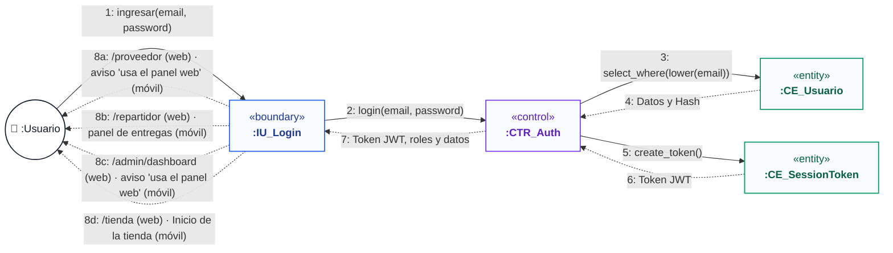

---

### CU02: Cerrar sesión activa

**Descripción**: Diagrama de comunicación para Cerrar sesión activa.

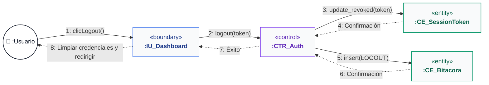

---

### CU03: Recuperar credenciales de acceso

**Descripción**: Diagrama de comunicación para Recuperar credenciales de acceso.

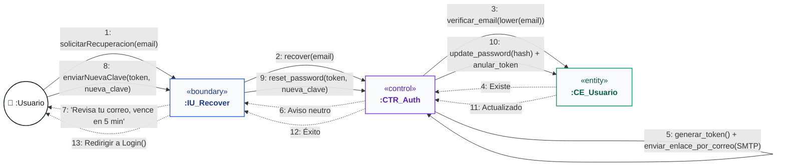

---

### CU04: Auto-registro de cliente

**Descripción**: Diagrama de comunicación para Auto-registro de cliente.

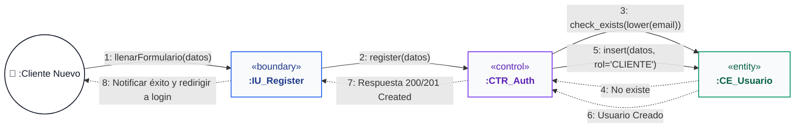

---

### CU05: Gestionar perfiles, roles y usuarios

**Descripción**: Diagrama de comunicación para Gestionar perfiles, roles y usuarios.

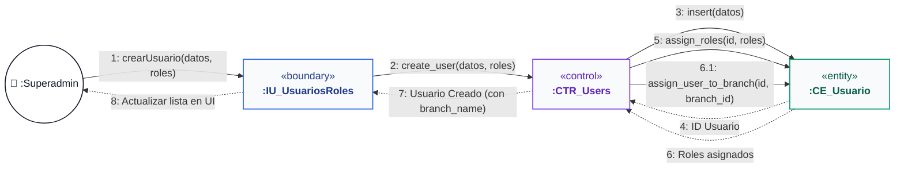

---

### CU06: Gestionar sucursales de la cadena

**Descripción**: Diagrama de comunicación para Gestionar sucursales de la cadena.

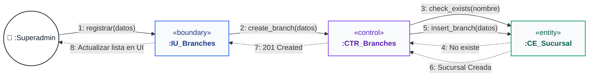

---

### CU07: Gestionar catálogo de prendas y variantes

**Descripción**: Diagrama de comunicación para Gestionar catálogo de prendas y variantes.

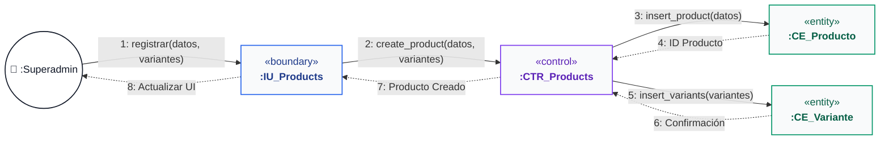

---

### CU08: Gestionar proveedores de mercadería

**Descripción**: Diagrama de comunicación para Gestionar proveedores de mercadería.

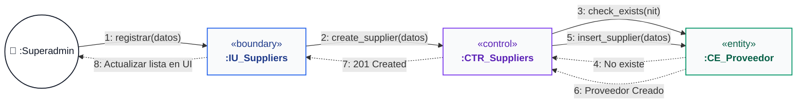

---

### CU09: Gestionar empleados de sucursal

**Descripción**: Diagrama de comunicación para Gestionar empleados de sucursal.

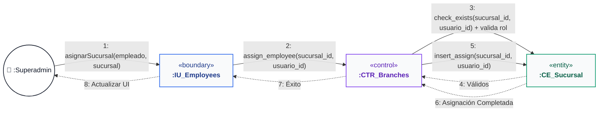

---

### CU10: Registrar compras e ingresos de mercadería

**Descripción**: Diagrama de comunicación para Registrar compras e ingresos de mercadería.

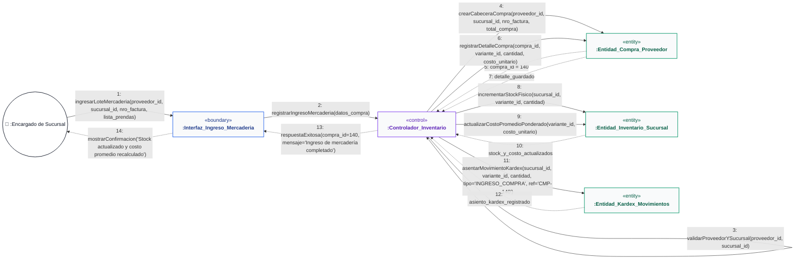

---

### CU11: Consultar catálogo de prendas

**Descripción**: Diagrama de comunicación para Consultar catálogo de prendas.

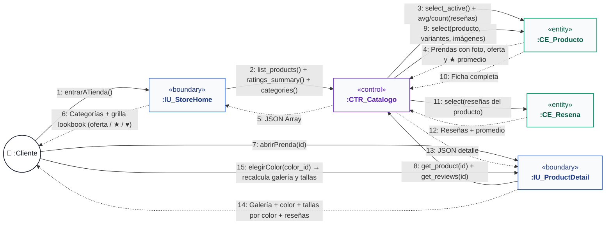

---

### CU12: Buscar y filtrar catálogo avanzado + disponibilidad por sucursal

**Descripción**: Diagrama de comunicación para Buscar y filtrar catálogo avanzado + disponibilidad por sucursal.

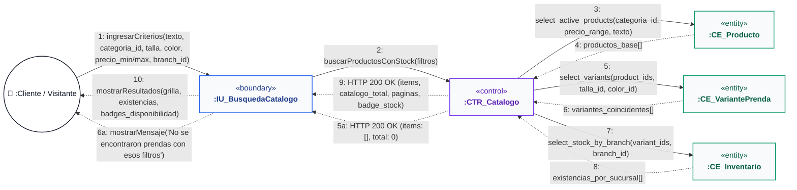

---

### CU13: Gestionar promociones: cupones y ofertas de temporada

**Descripción**: Diagrama de comunicación para Gestionar promociones: cupones y ofertas de temporada.

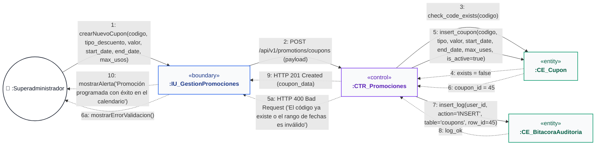

---

### CU14: Wishlist múltiple / compartible y moderación de reseñas

**Descripción**: Diagrama de comunicación para Wishlist múltiple / compartible y moderación de reseñas.

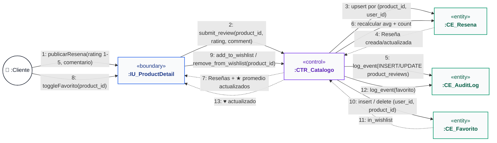

---

### CU15: Gestionar inventario general y transferencias entre sucursales

**Descripción**: Diagrama de comunicación para Gestionar inventario general y transferencias entre sucursales.

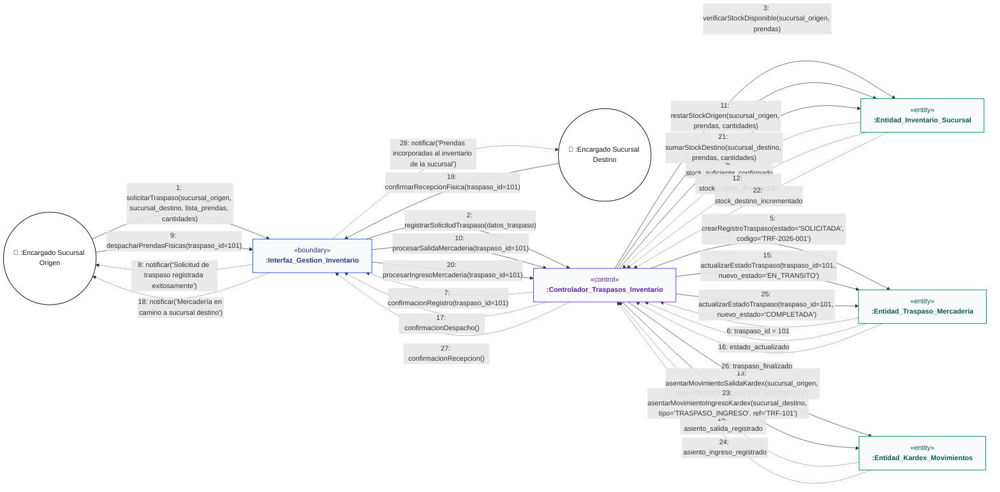

---

### CU16: Configurar y notificar alertas de stock (mínimo/máximo)

**Descripción**: Diagrama de comunicación para Configurar y notificar alertas de stock (mínimo/máximo).

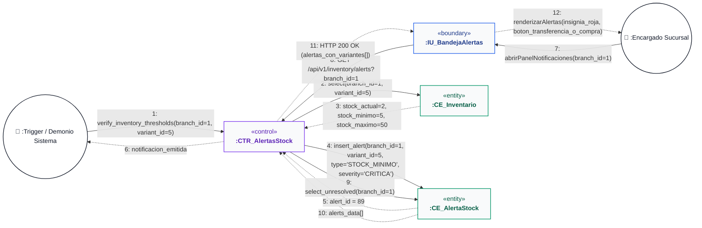

---

### CU17: Gestionar carrito de compra digital

**Descripción**: Diagrama de comunicación para Gestionar carrito de compra digital.

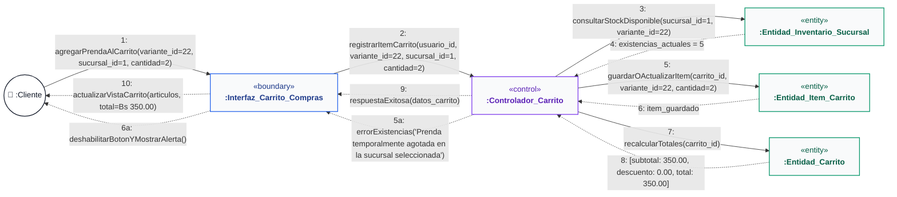

---

### CU18: Procesar venta omnicanal (E-commerce / App Móvil)

**Descripción**: Diagrama de comunicación para Procesar venta omnicanal (E-commerce / App Móvil).

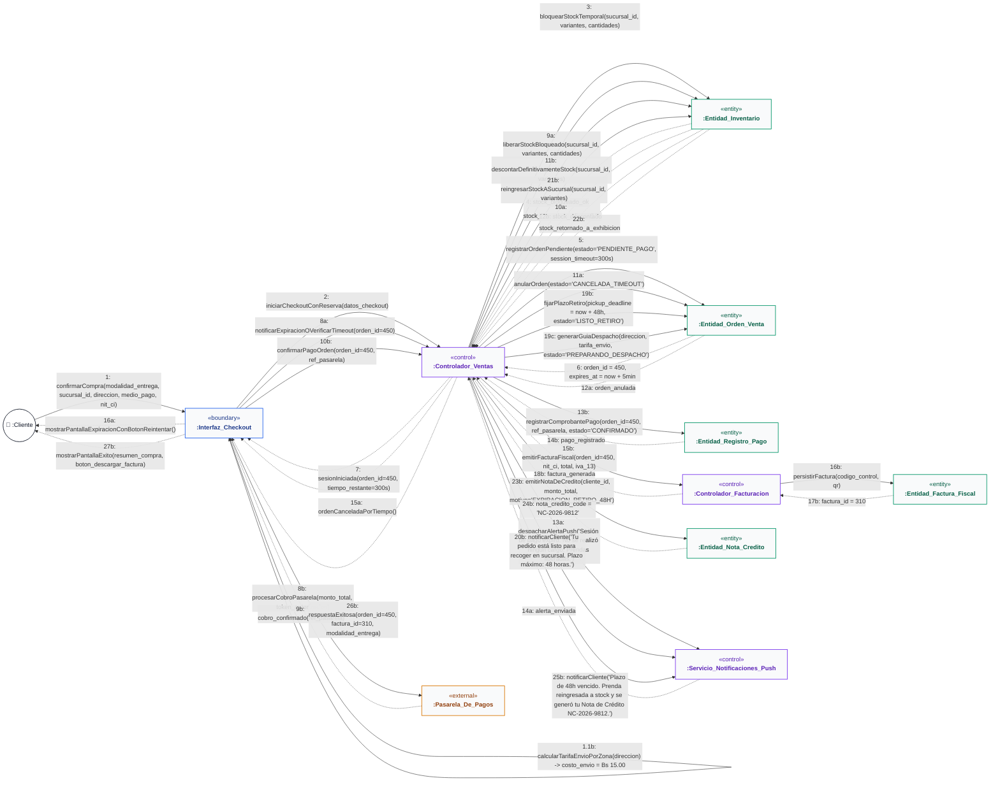

---

### CU19: Procesar venta presencial en caja

**Descripción**: Diagrama de comunicación para Procesar venta presencial en caja.

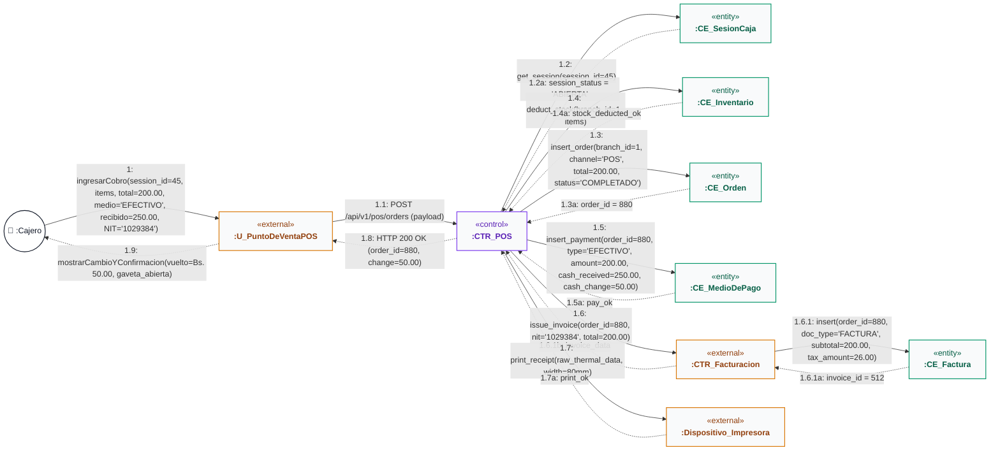

---

### CU20: Emitir factura y nota de entrega (IVA 13 %, código de control)

**Descripción**: Diagrama de comunicación para Emitir factura y nota de entrega (IVA 13 %, código de control).

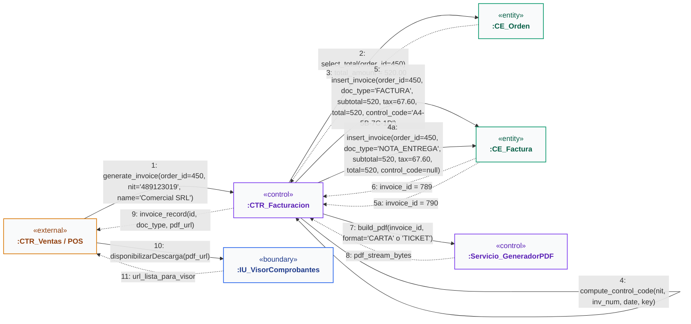

---

### CU21: Generar y convertir cotización comercial

**Descripción**: Diagrama de comunicación para Generar y convertir cotización comercial.

```mermaid
flowchart LR
    classDef actorStyle fill:#ffffff,stroke:#111827,stroke-width:1.5px,color:#111827;
    classDef boundaryStyle fill:#f9fafb,stroke:#2563eb,stroke-width:1.5px,color:#1e3a8a;
    classDef controlStyle fill:#f9fafb,stroke:#7c3aed,stroke-width:1.5px,color:#5b21b6;
    classDef entityStyle fill:#f9fafb,stroke:#059669,stroke-width:1.5px,color:#065f46;
    classDef externalStyle fill:#f9fafb,stroke:#d97706,stroke-width:1.5px,color:#92400e;

    C(("👤 :Cajero / Cliente")):::actorStyle
    IU["&laquo;boundary&raquo;<br/><b>:IU_GenerarCotizacion</b>"]:::boundaryStyle
    CTR["&laquo;control&raquo;<br/><b>:CTR_Cotizaciones</b>"]:::controlStyle
    CE_V["&laquo;entity&raquo;<br/><b>:CE_VariantePrenda</b>"]:::entityStyle
    CE_Q["&laquo;entity&raquo;<br/><b>:CE_Cotizacion</b>"]:::entityStyle
    CE_D["&laquo;entity&raquo;<br/><b>:CE_DetalleCotizacion</b>"]:::entityStyle
    PDF["&laquo;control&raquo;<br/><b>:Servicio_GeneradorPDF</b>"]:::controlStyle

    C -- "1: iniciarCotizacion(cliente_datos, vigencia_dias=15)" --> IU
    IU -- "2: POST /api/v1/sales/quotations (payload)" --> CTR
    CTR -- "3: get_variant_info(variant_id)" --> CE_V
    CE_V -. "4: precio_base, descuento_vigente" .-> CTR
    CTR -- "5: insert_quotation(cliente_datos, vigencia, status='VIGENTE')" --> CE_Q
    CE_Q -. "6: quotation_id = 72, code = 'COT-2026-00072'" .-> CTR
    CTR -- "7: insert_detail(quotation_id=72, variant_id, qty, unit_price)" --> CE_D
    CE_D -. "8: ok" .-> CTR
    CTR -- "9: build_quotation_pdf(quotation_id=72)" --> PDF
    PDF -. "10: pdf_bytes, download_url" .-> CTR
    CTR -. "11: HTTP 201 Created (code='COT-2026-00072', total=750.00, pdf_url)" .-> IU
    IU -. "12: mostrarCotizacionGenerada(code, pdf_url)" .-> C
```

---

### CU22: Gestionar devoluciones y cambios de prendas

**Descripción**: Diagrama de comunicación para Gestionar devoluciones y cambios de prendas.

```mermaid
flowchart LR
    classDef actorStyle fill:#ffffff,stroke:#111827,stroke-width:1.5px,color:#111827;
    classDef boundaryStyle fill:#f9fafb,stroke:#2563eb,stroke-width:1.5px,color:#1e3a8a;
    classDef controlStyle fill:#f9fafb,stroke:#7c3aed,stroke-width:1.5px,color:#5b21b6;
    classDef entityStyle fill:#f9fafb,stroke:#059669,stroke-width:1.5px,color:#065f46;
    classDef externalStyle fill:#f9fafb,stroke:#d97706,stroke-width:1.5px,color:#92400e;

    C(("👤 :Cajero_Encargado")):::actorStyle
    IU["&laquo;boundary&raquo;<br/><b>:IU_Gestion_Devoluciones</b>"]:::boundaryStyle
    CTR["&laquo;control&raquo;<br/><b>:CTR_Devoluciones_Y_Cambios</b>"]:::controlStyle
    CE_F["&laquo;entity&raquo;<br/><b>:Entidad_Factura</b>"]:::entityStyle
    CE_O["&laquo;entity&raquo;<br/><b>:Entidad_Orden</b>"]:::entityStyle
    CE_I["&laquo;entity&raquo;<br/><b>:Entidad_Inventario</b>"]:::entityStyle
    CE_OD["&laquo;entity&raquo;<br/><b>:Entidad_OrdenDevolucion</b>"]:::entityStyle
    CE_NC["&laquo;entity&raquo;<br/><b>:Entidad_NotaCredito</b>"]:::entityStyle
    CE_S["&laquo;entity&raquo;<br/><b>:Entidad_SesionCaja</b>"]:::entityStyle

    C -- "1: ingresarCodigoFactura(codigo_factura='FAC-10024')" --> IU
    IU -- "2: GET /api/v1/sales/invoices/by-code/FAC-10024" --> CTR
    CTR -- "3: buscarFacturaConItems(codigo_factura)" --> CE_F
    CE_F -. "4: {factura_id: 85, orden_id: 301, fecha: '2026-09-15', items: [{var_id: 14, nombre: 'Blusa Seda', precio: 220.00}]}" .-> CTR
    CTR -. "5a: HTTP 400 Bad Request ('Plazo vencido: Han pasado más de 14 días (2 semanas) desde la compra')" .-> IU
    IU -. "6a: mostrarInsigniaRojaBloqueo('Garantía Expirada - No procede devolución ni cambio')" .-> C
    CTR -. "5b: HTTP 200 OK (items_factura, garantia_valida=true, dias_restantes)" .-> IU
    IU -. "6b: mostrarPrendasCompradas(tabla_prendas, selector_accion)" .-> C
    C -- "7a: solicitarCambioTalla(var_id_origen=14, talla_nueva='M')" --> IU
    IU -- "8a: POST /api/v1/sales/returns (tipo='CAMBIO_TALLA', var_id=14, rep_id=18)" --> CTR
    CTR -- "9a: reingresarStock(var_id=14, qty=+1) y descontarStock(var_id=18, qty=-1)" --> CE_I
    CE_I -. "10a: inventario_actualizado_ok" .-> CTR
    CTR -- "11a: registrarComprobante(tipo='CAMBIO_TALLA', diferencia=0.00)" --> CE_OD
    CE_OD -. "12a: return_id = 91" .-> CTR
    CTR -. "13a: cambioExitoso(return_id=91, diferencia=0.00)" .-> IU
    IU -. "14a: emitirComprobanteCambioEntregaPrenda()" .-> C
    C -- "7b: solicitarCambioModelo(var_id_origen=14, modelo_nuevo_var_id=32)" --> IU
    IU -- "8b: POST /api/v1/sales/returns (tipo='CAMBIO_MODELO', var_id=14, rep_id=32)" --> CTR
    CTR -- "9b: intercambiarStock(var_devuelta=+1, var_nueva=-1)" --> CE_I
    CE_I -. "10b: stock_ajustado" .-> CTR
    CTR -- "11b: cobrarDiferenciaEnCaja(monto_diferencia = Bs 50.00)" --> CE_S
    CE_S -. "12b: cobro_asentado" .-> CTR
    CTR -- "13b: registrarCambio(diferencia_cobrada = Bs 50.00)" --> CE_OD
    CE_OD -. "14b: return_id = 92" .-> CTR
    CTR -. "15b: cambioConfirmado(monto_a_cobrar=50.00)" .-> IU
    IU -. "16b: cobrarDiferenciaYEntregarNuevaPrenda()" .-> C
    CTR -- "11c: emitirNotaCredito(cliente_id, saldo_a_favor = Bs 40.00, motivo='CAMBIO_MODELO_MENOR_VALOR')" --> CE_NC
    CE_NC -. "12c: codigo_nc = 'NC-2026-0045'" .-> CTR
    CTR -- "13c: registrarCambio(nota_credito_id=45, saldo_a_favor=40.00)" --> CE_OD
    CE_OD -. "14c: return_id = 93" .-> CTR
    CTR -. "15c: cambioConfirmadoConNotaCredito(codigo_nc='NC-2026-0045', saldo=40.00)" .-> IU
    IU -. "16c: imprimirNotaCreditoParaProximaCompraYEntregarPrenda()" .-> C
    C -- "7c: solicitarDevolucion(var_id=14, motivo='Falla técnica')" --> IU
    IU -- "8c: POST /api/v1/sales/returns (tipo='DEVOLUCION_DINERO', var_id=14)" --> CTR
    CTR -- "9c: reingresarStockAInventario(var_id=14, qty=+1)" --> CE_I
    CE_I -. "10c: stock_reingresado" .-> CTR
    CTR -- "11d: generarNotaCreditoOReembolso(cliente_id, monto=220.00)" --> CE_NC
    CE_NC -. "12d: comprobante_emitido" .-> CTR
    CTR -. "13d: devolucionProcesada()" .-> IU
    IU -. "14d: comprobanteFinalizado()" .-> C
```

---

### CU23: Gestionar arqueo de caja (apertura y cierre ciego)

**Descripción**: Diagrama de comunicación para Gestionar arqueo de caja (apertura y cierre ciego).

```mermaid
flowchart LR
    classDef actorStyle fill:#ffffff,stroke:#111827,stroke-width:1.5px,color:#111827;
    classDef boundaryStyle fill:#f9fafb,stroke:#2563eb,stroke-width:1.5px,color:#1e3a8a;
    classDef controlStyle fill:#f9fafb,stroke:#7c3aed,stroke-width:1.5px,color:#5b21b6;
    classDef entityStyle fill:#f9fafb,stroke:#059669,stroke-width:1.5px,color:#065f46;
    classDef externalStyle fill:#f9fafb,stroke:#d97706,stroke-width:1.5px,color:#92400e;

    C(("👤 :Cajero")):::actorStyle
    IU["&laquo;boundary&raquo;<br/><b>:IU_ArqueoCaja</b>"]:::boundaryStyle
    CTR["&laquo;control&raquo;<br/><b>:CTR_Arqueo</b>"]:::controlStyle
    CE_S["&laquo;entity&raquo;<br/><b>:CE_SesionCaja</b>"]:::entityStyle
    CE_P["&laquo;entity&raquo;<br/><b>:CE_MedioDePago</b>"]:::entityStyle
    CE_D["&laquo;entity&raquo;<br/><b>:CE_OrdenDevolucion</b>"]:::entityStyle

    C -- "1: abrirTurno(monto_inicial_efectivo=200.00)" --> IU
    IU -- "2: POST /api/v1/sales/shifts/open (user_id, branch_id=1, opening_amount=200.00)" --> CTR
    CTR -- "3: check_active_sessions(user_id)" --> CE_S
    CE_S -. "4: active_sessions = 0" .-> CTR
    CTR -- "5: insert(user_id, branch_id=1, opening_amount=200.00, status='ABIERTA')" --> CE_S
    CE_S -. "6: session_id = 45" .-> CTR
    CTR -. "7: HTTP 201 Created (session_id=45)" .-> IU
    IU -. "8: habilitarModuloPOS()" .-> C
    C -- "9: cerrarTurno(session_id=45, monto_declarado_cajero=1450.00)" --> IU
    IU -- "10: POST /api/v1/sales/shifts/45/close (declared_amount=1450.00)" --> CTR
    CTR -- "11: sum_cash_sales_by_session(session_id=45)" --> CE_P
    CE_P -. "12: ventas_efectivo = 1430.00" .-> CTR
    CTR -- "13: sum_cash_refunds_by_session(session_id=45)" --> CE_D
    CE_D -. "14: devoluciones_efectivo = 180.00" .-> CTR
    CTR -- "15: update(45, declared=1450.00, expected=1450.00, diff=0.00, status='CERRADA')" --> CE_S
    CE_S -. "16: session_closed_ok" .-> CTR
    CTR -. "17: HTTP 200 OK (reporte_arqueo)" .-> IU
    IU -. "18: imprimirArqueo(diferencia=0.00, status='CUADRADO')" .-> C
```

---

### CU24: Consultar historial de compras

**Descripción**: Diagrama de comunicación para Consultar historial de compras.

```mermaid
flowchart LR
    classDef actorStyle fill:#ffffff,stroke:#111827,stroke-width:1.5px,color:#111827;
    classDef boundaryStyle fill:#f9fafb,stroke:#2563eb,stroke-width:1.5px,color:#1e3a8a;
    classDef controlStyle fill:#f9fafb,stroke:#7c3aed,stroke-width:1.5px,color:#5b21b6;
    classDef entityStyle fill:#f9fafb,stroke:#059669,stroke-width:1.5px,color:#065f46;
    classDef externalStyle fill:#f9fafb,stroke:#d97706,stroke-width:1.5px,color:#92400e;

    C(("👤 :Cliente")):::actorStyle
    IU["&laquo;boundary&raquo;<br/><b>:IU_HistorialCompras</b>"]:::boundaryStyle
    CTR["&laquo;control&raquo;<br/><b>:CTR_Historial</b>"]:::controlStyle
    CE_O["&laquo;entity&raquo;<br/><b>:CE_Orden</b>"]:::entityStyle
    CE_IO["&laquo;entity&raquo;<br/><b>:CE_ItemOrden</b>"]:::entityStyle
    CE_P["&laquo;entity&raquo;<br/><b>:CE_MedioDePago</b>"]:::entityStyle
    CE_F["&laquo;entity&raquo;<br/><b>:CE_Factura</b>"]:::entityStyle

    C -- "1: presionarPestanaMisCompras()" --> IU
    IU -- "2: GET /api/v1/sales/orders/my-orders (token_jwt)" --> CTR
    CTR -- "3: select_orders_by_user(user_id, order_by_created_at_desc)" --> CE_O
    CE_O -. "4: orders_summary[]" .-> CTR
    CTR -. "5: HTTP 200 OK (orders_list)" .-> IU
    IU -. "6: renderizarTarjetasPedidos(num_orden, fecha, total_bs, canal)" .-> C
    C -- "7: verDetalleOrden(order_id=450)" --> IU
    IU -- "8: GET /api/v1/sales/orders/450" --> CTR
    CTR -- "9: select_items_with_product(order_id=450)" --> CE_IO
    CE_IO -. "10: items[(sku, product_name, color, size, price, qty)]" .-> CTR
    CTR -- "11: select_payment_details(order_id=450)" --> CE_P
    CE_P -. "12: payment_type: 'TARJETA', last4: '4512'" .-> CTR
    CTR -- "13: select_invoice(order_id=450)" --> CE_F
    CE_F -. "14: doc_type: 'FACTURA', total: 520.00, pdf_path: '/pdf/0450.pdf'" .-> CTR
    CTR -. "15: HTTP 200 OK (order_complete_profile)" .-> IU
    IU -. "16: mostrarModalDetalle(prendas, desglose_iva, descargar_factura)" .-> C
    C -- "17: presionarDescargarFactura()" --> IU
    IU -. "18: descargarArchivoPDF(Factura_ORD-450.pdf)" .-> C
```

---

### CU25: Convertir una reserva en venta confirmada

**Descripción**: Diagrama de comunicación para Convertir una reserva en venta confirmada.

```mermaid
flowchart LR
    classDef actorStyle fill:#ffffff,stroke:#111827,stroke-width:1.5px,color:#111827;
    classDef boundaryStyle fill:#f9fafb,stroke:#2563eb,stroke-width:1.5px,color:#1e3a8a;
    classDef controlStyle fill:#f9fafb,stroke:#7c3aed,stroke-width:1.5px,color:#5b21b6;
    classDef entityStyle fill:#f9fafb,stroke:#059669,stroke-width:1.5px,color:#065f46;
    classDef externalStyle fill:#f9fafb,stroke:#d97706,stroke-width:1.5px,color:#92400e;

    C(("👤 :Cajero")):::actorStyle
    IU["&laquo;boundary&raquo;<br/><b>:IU_POS_Reservas</b>"]:::boundaryStyle
    CTR["&laquo;control&raquo;<br/><b>:CTR_Reservas</b>"]:::controlStyle
    CE_TC["&laquo;entity&raquo;<br/><b>:CE_TurnoCaja</b>"]:::entityStyle
    CE_O["&laquo;entity&raquo;<br/><b>:CE_Orden</b>"]:::entityStyle
    CE_I["&laquo;entity&raquo;<br/><b>:CE_Inventario</b>"]:::entityStyle
    CE_R["&laquo;entity&raquo;<br/><b>:CE_Reserva</b>"]:::entityStyle

    C -- "1: seleccionarReserva(reservation_id)" --> IU
    IU -- "2: convert_to_pos(reservation_id, items, payment, NIT)" --> CTR
    CTR -- "3: validar_turno_abierto(cashier_id, branch_id)" --> CE_TC
    CE_TC -. "4: turno (status: ABIERTO)" .-> CTR
    CTR -- "5: get_reservation(reservation_id)" --> CE_R
    CE_R -. "6: reserva (items, deposit_amount)" .-> CTR
    CTR -- "7: reponer_no_comprados(variant_ids)" --> CE_I
    CE_I -. "8: stock_restaurado" .-> CTR
    CTR -- "9: insert_order(POS, items, turno)" --> CE_O
    CE_O -. "10: order_id" .-> CTR
    CTR -- "11: insert_payment(saldo, medio)" --> CE_O
    CTR -- "12: insert_invoice(IVA 13%, NIT)" --> CE_O
    CE_O -. "13: invoice (control_code)" .-> CTR
    CTR -- "14: update_status = COMPLETED" --> CE_R
    CE_R -. "15: ok" .-> CTR
    CTR -. "16: OrderResponse (order, invoice)" .-> IU
    IU -. "17: Mostrar comprobante y reserva completada" .-> C
```

---

### CU26: Agendar reserva de prendas para prueba física

**Descripción**: Diagrama de comunicación para Agendar reserva de prendas para prueba física.

```mermaid
flowchart LR
    classDef actorStyle fill:#ffffff,stroke:#111827,stroke-width:1.5px,color:#111827;
    classDef boundaryStyle fill:#f9fafb,stroke:#2563eb,stroke-width:1.5px,color:#1e3a8a;
    classDef controlStyle fill:#f9fafb,stroke:#7c3aed,stroke-width:1.5px,color:#5b21b6;
    classDef entityStyle fill:#f9fafb,stroke:#059669,stroke-width:1.5px,color:#065f46;
    classDef externalStyle fill:#f9fafb,stroke:#d97706,stroke-width:1.5px,color:#92400e;

    C(("👤 :Cliente")):::actorStyle
    IU["&laquo;boundary&raquo;<br/><b>:IU_ReservarProbador</b>"]:::boundaryStyle
    CTR["&laquo;control&raquo;<br/><b>:CTR_Reservas</b>"]:::controlStyle
    CTR_PP["&laquo;control&raquo;<br/><b>:CTR_PayPal</b>"]:::controlStyle
    API_PP["&laquo;external&raquo;<br/><b>:PayPal_API</b>"]:::externalStyle
    CE_I["&laquo;entity&raquo;<br/><b>:CE_Inventario</b>"]:::entityStyle
    CE_R["&laquo;entity&raquo;<br/><b>:CE_Reserva</b>"]:::entityStyle
    CE_L["&laquo;entity&raquo;<br/><b>:CE_LibroMayor</b>"]:::entityStyle

    C -- "1: elegirVariante(color, talla)" --> IU
    IU -- "2: get_branch_availability(product_id, variant_id)" --> CTR
    CTR -. "3: [(branch_id, stock)]" .-> IU
    C -- "4: elegirSucursal(fecha, hora, medioPago)" --> IU
    IU -- "5: create_order(app_amount_bs)" --> CTR_PP
    CTR_PP -- "6: POST /v2/checkout/orders" --> API_PP
    API_PP -. "7: order_id + approve_url" .-> CTR_PP
    CTR_PP -. "8: approve_url" .-> IU
    IU -- "9: capture_order(order_id)" --> CTR_PP
    CTR_PP -- "10: POST /v2/checkout/orders/{id}/capture" --> API_PP
    API_PP -. "11: COMPLETED + payer" .-> CTR_PP
    CTR_PP -. "12: VERIFIED" .-> IU
    IU -- "13: create_reservation(items, payment_ref)" --> CTR
    CTR -- "14: verify_completed_order(order_id)" --> CTR_PP
    CTR_PP -. "15: VERIFIED" .-> CTR
    CTR -- "16: descontar_stock(variant_ids, qty)" --> CE_I
    CE_I -. "17: stock_descontado" .-> CTR
    CTR -- "18: insert_movimiento(RESERVA)" --> CE_L
    CE_L -. "19: ok" .-> CTR
    CTR -- "20: insert_reservation(PENDING, expires_at)" --> CE_R
    CE_R -. "21: reservation_code RES-XXXXXX" .-> CTR
    CTR -. "22: {reservation_code, total, deposit}" .-> IU
    IU -. "23: Confirmación y código de reserva" .-> C
```

---

### CU27: Gestionar la bandeja de reservas entrantes (Kanban)

**Descripción**: Diagrama de comunicación para Gestionar la bandeja de reservas entrantes (Kanban).

```mermaid
flowchart LR
    classDef actorStyle fill:#ffffff,stroke:#111827,stroke-width:1.5px,color:#111827;
    classDef boundaryStyle fill:#f9fafb,stroke:#2563eb,stroke-width:1.5px,color:#1e3a8a;
    classDef controlStyle fill:#f9fafb,stroke:#7c3aed,stroke-width:1.5px,color:#5b21b6;
    classDef entityStyle fill:#f9fafb,stroke:#059669,stroke-width:1.5px,color:#065f46;
    classDef externalStyle fill:#f9fafb,stroke:#d97706,stroke-width:1.5px,color:#92400e;

    E(("👤 :Encargado")):::actorStyle
    IU["&laquo;boundary&raquo;<br/><b>:IU_KanbanReservas</b>"]:::boundaryStyle
    CTR["&laquo;control&raquo;<br/><b>:CTR_Reservas</b>"]:::controlStyle
    CE_R["&laquo;entity&raquo;<br/><b>:CE_Reserva</b>"]:::entityStyle
    CE_I["&laquo;entity&raquo;<br/><b>:CE_Inventario</b>"]:::entityStyle

    E -- "1: abrir_bandeja()" --> IU
    IU -- "2: get_reservations(branch_id)" --> CTR
    CTR -- "3: select WHERE branch = ?" --> CE_R
    CE_R -. "4: [reservations]" .-> CTR
    CTR -- "5: evaluarTolerancia(reservation)" --> CTR
    CTR -- "6: liberar_stock si CANCELLED / NO_SHOW" --> CE_I
    CE_I -. "7: ok" .-> CTR
    CTR -. "8: [reservas con estado actualizado]" .-> IU
    IU -. "9: Mostrar columnas Kanban (PENDING / PREPARING / READY / COMPLETED)" .-> E
    E -- "10: moverTarjeta(reservation_id, nuevo_estado)" --> IU
    IU -- "11: update_status(reservation_id, status)" --> CTR
    CTR -- "12: update reservation.status" --> CE_R
    CE_R -. "13: ok" .-> CTR
    CTR -- "14: liberar_stock(variant_ids)" --> CE_I
    CE_I -. "15: ok" .-> CTR
    CTR -. "16: OK" .-> IU
    IU -. "17: Tablero actualizado" .-> E
```

---

### CU28: Cancelar reserva de prendas y liberar stock

**Descripción**: Diagrama de comunicación para Cancelar reserva de prendas y liberar stock.

```mermaid
flowchart LR
    classDef actorStyle fill:#ffffff,stroke:#111827,stroke-width:1.5px,color:#111827;
    classDef boundaryStyle fill:#f9fafb,stroke:#2563eb,stroke-width:1.5px,color:#1e3a8a;
    classDef controlStyle fill:#f9fafb,stroke:#7c3aed,stroke-width:1.5px,color:#5b21b6;
    classDef entityStyle fill:#f9fafb,stroke:#059669,stroke-width:1.5px,color:#065f46;
    classDef externalStyle fill:#f9fafb,stroke:#d97706,stroke-width:1.5px,color:#92400e;

    C(("👤 :Cliente / Encargado")):::actorStyle
    IU["&laquo;boundary&raquo;<br/><b>:IU_Reservas</b>"]:::boundaryStyle
    CTR["&laquo;control&raquo;<br/><b>:CTR_Reservas</b>"]:::controlStyle
    CE_R["&laquo;entity&raquo;<br/><b>:CE_Reserva</b>"]:::entityStyle
    CE_I["&laquo;entity&raquo;<br/><b>:CE_Inventario</b>"]:::entityStyle
    CE_L["&laquo;entity&raquo;<br/><b>:CE_LibroMayor</b>"]:::entityStyle

    C -- "1: cancelarReserva(reserva_id=14, motivo)" --> IU
    IU -- "2: PUT /api/v1/reservations/14/cancel" --> CTR
    CTR -- "3: get_reservation_items(reserva_id=14)" --> CE_R
    CE_R -. "4: items = [{variante_id=5, qty=2}, {variante_id=8, qty=1}]" .-> CTR
    CTR -- "5: update_stock(branch_id=1, var_id, qty=+cant)" --> CE_I
    CE_I -. "6: OK" .-> CTR
    CTR -- "7: insert_entry(branch_id=1, var_id, qty=+cant, type='CANCELACION_RESERVA')" --> CE_L
    CE_L -. "8: OK" .-> CTR
    CTR -- "9: update_status(14, 'CANCELLED')" --> CE_R
    CE_R -. "10: OK" .-> CTR
    CTR -. "11: HTTP 200 OK (status='CANCELLED')" .-> IU
    IU -. "12: mostrarAviso('Reserva cancelada y stock liberado')" .-> C
```

---

### CU29: Gestionar envíos a domicilio y portal del repartidor

**Descripción**: Diagrama de comunicación para Gestionar envíos a domicilio y portal del repartidor.

```mermaid
flowchart LR
    classDef actorStyle fill:#ffffff,stroke:#111827,stroke-width:1.5px,color:#111827;
    classDef boundaryStyle fill:#f9fafb,stroke:#2563eb,stroke-width:1.5px,color:#1e3a8a;
    classDef controlStyle fill:#f9fafb,stroke:#7c3aed,stroke-width:1.5px,color:#5b21b6;
    classDef entityStyle fill:#f9fafb,stroke:#059669,stroke-width:1.5px,color:#065f46;
    classDef externalStyle fill:#f9fafb,stroke:#d97706,stroke-width:1.5px,color:#92400e;

    R(("👤 :Repartidor")):::actorStyle
    IU["&laquo;boundary&raquo;<br/><b>:IU_PanelRepartidor</b>"]:::boundaryStyle
    CTR["&laquo;control&raquo;<br/><b>:CTR_Repartidores</b>"]:::controlStyle
    CE_R["&laquo;entity&raquo;<br/><b>:CE_Repartidor</b>"]:::entityStyle
    CE_E["&laquo;entity&raquo;<br/><b>:CE_Envio</b>"]:::entityStyle
    CE_T["&laquo;entity&raquo;<br/><b>:CE_EventoTracking</b>"]:::entityStyle

    R -- "1: activar_disponibilidad()" --> IU
    IU -- "2: update_availability(repartidor_id, true)" --> CTR
    CTR -- "3: update is_available = true" --> CE_R
    CE_R -. "4: ok" .-> CTR
    CTR -. "5: ok" .-> IU
    R -- "6: tomar_pedido(shipment_id)" --> IU
    IU -- "7: claim_shipment(shipment_id, repartidor_id)" --> CTR
    CTR -- "8: update status = ASSIGNED, claimed_at" --> CE_E
    CE_E -. "9: ok" .-> CTR
    CTR -- "10: insert tracking_event(ASSIGNED)" --> CE_T
    CE_T -. "11: ok" .-> CTR
    CTR -. "12: ok" .-> IU
    R -- "13: avanzar_ruta(PICKED_UP / IN_TRANSIT / OUT_FOR_DELIVERY)" --> IU
    IU -- "14: update_route_status(shipment_id, status)" --> CTR
    CTR -- "15: update shipment.status" --> CE_E
    CE_E -. "16: ok" .-> CTR
    CTR -- "17: insert tracking_event(status)" --> CE_T
    CE_T -. "18: ok" .-> CTR
    CTR -. "19: ok" .-> IU
    R -- "20: entregar(foto, received_by_name)" --> IU
    IU -- "21: confirm_delivery(shipment_id, photo, name)" --> CTR
    CTR -- "22: update status = DELIVERED, foto, delivered_at" --> CE_E
    CE_E -. "23: ok" .-> CTR
    CTR -- "24: total_deliveries + 1" --> CE_R
    CE_R -. "25: ok" .-> CTR
    CTR -- "26: insert tracking_event(DELIVERED)" --> CE_T
    CE_T -. "27: ok" .-> CTR
    CTR -. "28: ok" .-> IU
    IU -. "29: Entrega confirmada con evidencia" .-> R
```

---

### CU30: Rastrear el estado de un envío en tiempo real

**Descripción**: Diagrama de comunicación para Rastrear el estado de un envío en tiempo real.

```mermaid
flowchart LR
    classDef actorStyle fill:#ffffff,stroke:#111827,stroke-width:1.5px,color:#111827;
    classDef boundaryStyle fill:#f9fafb,stroke:#2563eb,stroke-width:1.5px,color:#1e3a8a;
    classDef controlStyle fill:#f9fafb,stroke:#7c3aed,stroke-width:1.5px,color:#5b21b6;
    classDef entityStyle fill:#f9fafb,stroke:#059669,stroke-width:1.5px,color:#065f46;
    classDef externalStyle fill:#f9fafb,stroke:#d97706,stroke-width:1.5px,color:#92400e;

    C(("👤 :Cliente / Repartidor")):::actorStyle
    IU["&laquo;boundary&raquo;<br/><b>:IU_Rastreo</b>"]:::boundaryStyle
    CTR["&laquo;control&raquo;<br/><b>:CTR_Logistica</b>"]:::controlStyle
    CE_E["&laquo;entity&raquo;<br/><b>:CE_Envio</b>"]:::entityStyle
    CE_ET["&laquo;entity&raquo;<br/><b>:CE_EventosTracking</b>"]:::entityStyle

    C -- "1: buscarEnvio(tracking_number='TRK-A1B2C3D4')" --> IU
    IU -- "2: track_shipment(tracking_number)" --> CTR
    CTR -- "3: select WHERE tracking_number = 'TRK-A1B2C3D4'" --> CE_E
    CE_E -. "4: shipment (status='EN_CAMINO', address, repartidor_id)" .-> CTR
    CTR -- "5: select tracking_events WHERE shipment_id = id" --> CE_ET
    CE_ET -. "6: [(status, location, description, created_at)]" .-> CTR
    CTR -. "7: HTTP 200 OK (shipment_timeline[])" .-> IU
    IU -. "8: Mostrar estado actual, repartidor y línea de tiempo en mapa" .-> C
```

---

### CU31: Gestionar zonas de cobertura y tarifas de envío (anillos / km)

**Descripción**: Diagrama de comunicación para Gestionar zonas de cobertura y tarifas de envío (anillos / km).

```mermaid
flowchart LR
    classDef actorStyle fill:#ffffff,stroke:#111827,stroke-width:1.5px,color:#111827;
    classDef boundaryStyle fill:#f9fafb,stroke:#2563eb,stroke-width:1.5px,color:#1e3a8a;
    classDef controlStyle fill:#f9fafb,stroke:#7c3aed,stroke-width:1.5px,color:#5b21b6;
    classDef entityStyle fill:#f9fafb,stroke:#059669,stroke-width:1.5px,color:#065f46;
    classDef externalStyle fill:#f9fafb,stroke:#d97706,stroke-width:1.5px,color:#92400e;

    S(("👤 :Superadmin")):::actorStyle
    IU["&laquo;boundary&raquo;<br/><b>:IU_DeliveryZonas</b>"]:::boundaryStyle
    CTR["&laquo;control&raquo;<br/><b>:CTR_Logistica</b>"]:::controlStyle
    CE_DZ["&laquo;entity&raquo;<br/><b>:CE_DeliveryZone</b>"]:::entityStyle

    S -- "1: gestionar_zonas()" --> IU
    IU -- "2: GET /api/v1/logistics/zones" --> CTR
    CTR -- "3: select * FROM delivery_zones" --> CE_DZ
    CE_DZ -. "4: [zones]" .-> CTR
    CTR -. "5: HTTP 200 OK (zones con mapa Leaflet)" .-> IU
    IU -. "6: Mostrar mapa y anillos concéntricos" .-> S
    S -- "7: crear_zona(name, min_km, max_km, base_rate, estimated_hours)" --> IU
    IU -- "8: POST /api/v1/logistics/zones (data)" --> CTR
    CTR -- "9: insert delivery_zone" --> CE_DZ
    CE_DZ -. "10: zone_id = 4" .-> CTR
    CTR -. "11: HTTP 201 Created" .-> IU
    IU -. "12: Zona agregada al mapa" .-> S
    S -- "13: calcular_tarifa(distance_km=12.5)" --> IU
    IU -- "14: calculate_rate(distance_km=12.5)" --> CTR
    CTR -- "15: select WHERE min_km <= 12.5 AND max_km >= 12.5" --> CE_DZ
    CE_DZ -. "16: null" .-> CTR
    CTR -- "17: tarifa_base + (distancia - max_km) * 5.0" --> CTR
    CE_DZ -. "16a: zona (base_rate, estimated_hours)" .-> CTR
    CTR -. "18: (tarifa=Bs 25.00, horas=24)" .-> IU
    IU -. "19: Mostrar tarifa calculada en checkout" .-> S
```

---

### CU32: Probador (vestidor) virtual IA y recomendación de talla (RA / VTON)

**Descripción**: Diagrama de comunicación para Probador (vestidor) virtual IA y recomendación de talla (RA / VTON).

```mermaid
flowchart LR
    classDef actorStyle fill:#ffffff,stroke:#111827,stroke-width:1.5px,color:#111827;
    classDef boundaryStyle fill:#f9fafb,stroke:#2563eb,stroke-width:1.5px,color:#1e3a8a;
    classDef controlStyle fill:#f9fafb,stroke:#7c3aed,stroke-width:1.5px,color:#5b21b6;
    classDef entityStyle fill:#f9fafb,stroke:#059669,stroke-width:1.5px,color:#065f46;
    classDef externalStyle fill:#f9fafb,stroke:#d97706,stroke-width:1.5px,color:#92400e;

    C(("👤 :Cliente")):::actorStyle
    IU["&laquo;boundary&raquo;<br/><b>:IU_Vestidor</b>"]:::boundaryStyle
    CTR["&laquo;control&raquo;<br/><b>:CTR_Analitica</b>"]:::controlStyle
    VTON["&laquo;external&raquo;<br/><b>:VirtualTryonAI</b>"]:::externalStyle
    HF["&laquo;external&raquo;<br/><b>:FASHN_HF</b>"]:::externalStyle
    CE_P["&laquo;entity&raquo;<br/><b>:CE_Prenda</b>"]:::entityStyle

    C -- "1: elegir_prenda(product_id)" --> IU
    C -- "2: subir_foto(person_image)" --> IU
    IU -- "3: remove_background(photo)" --> CTR
    CTR -- "4: segmentar_persona(rembg u2net)" --> VTON
    VTON -. "5: imagen_sin_fondo" .-> CTR
    CTR -. "6: imagen_sin_fondo" .-> IU
    C -- "7: ingresar_medidas(estatura, peso, pecho, cintura)" --> IU
    IU -- "8: simulate_talla(medidas, product_id)" --> CTR
    CTR -- "9: get_product(product_id)" --> CE_P
    CE_P -. "10: producto (sizes, measurements)" .-> CTR
    CTR -. "11: {talla_recomendada, calce_por_zona}" .-> IU
    C -- "12: generate_vton(persona, prenda)" --> IU
    IU -- "13: generar_imagen(persona, prenda)" --> CTR
    CTR -- "14: ejecutar_pipeline(persona, prenda)" --> VTON
    VTON -- "15: FASHN.ai tryon" --> HF
    HF -. "16: imagen_fotorrealista" .-> VTON
    VTON -- "15a: pose + amoldado anatomico" --> VTON
    VTON -. "17: imagen_resultado + modelo_usado" .-> CTR
    CTR -. "18: {imagen_vestida, modelo}" .-> IU
    IU -. "19: Mostrar imagen probada en pantalla" .-> C
    C -- "20: agregar_al_carrito / reservar_en_tienda" --> IU
```

---

### CU33: Asistente IA (chatbot) de recomendaciones

**Descripción**: Diagrama de comunicación para Asistente IA (chatbot) de recomendaciones.

```mermaid
flowchart LR
    classDef actorStyle fill:#ffffff,stroke:#111827,stroke-width:1.5px,color:#111827;
    classDef boundaryStyle fill:#f9fafb,stroke:#2563eb,stroke-width:1.5px,color:#1e3a8a;
    classDef controlStyle fill:#f9fafb,stroke:#7c3aed,stroke-width:1.5px,color:#5b21b6;
    classDef entityStyle fill:#f9fafb,stroke:#059669,stroke-width:1.5px,color:#065f46;
    classDef externalStyle fill:#f9fafb,stroke:#d97706,stroke-width:1.5px,color:#92400e;

    C(("👤 :Cliente / Visitante")):::actorStyle
    IU["&laquo;boundary&raquo;<br/><b>:IU_Chatbot</b>"]:::boundaryStyle
    CTR["&laquo;control&raquo;<br/><b>:CTR_Analitica</b>"]:::controlStyle
    CE_C["&laquo;entity&raquo;<br/><b>:CE_Conversacion</b>"]:::entityStyle

    C -- "1: abrir_chatbot()" --> IU
    IU -. "2: Widget de chat abierto" .-> C
    C -- "3: enviar_mensaje('Busco un vestido elegante para fiesta en Equipetrol')" --> IU
    IU -- "4: POST /api/v1/analytics/chatbot/message (session_token, message)" --> CTR
    CTR -- "5: detectar_intencion(message) -> STYLE_RECOMMENDATION" --> CTR
    CTR -- "6: buscar prendas afines con stock activo en sucursal" --> CTR
    CTR -- "7: generar_respuesta(intencion, contexto, sugerencias)" --> CTR
    CTR -- "8: insert conversacion(USER + BOT)" --> CE_C
    CE_C -. "9: OK" .-> CTR
    CTR -. "10: HTTP 200 OK (respuesta, prendas_sugeridas[], acciones_rapidas[])" .-> IU
    IU -. "11: Mostrar respuesta de estilo + prendas interactivas con enlace a probador" .-> C
```

---

### CU34: Búsqueda de prendas por comandos de voz (NLP)

**Descripción**: Diagrama de comunicación para Búsqueda de prendas por comandos de voz (NLP).

```mermaid
flowchart LR
    classDef actorStyle fill:#ffffff,stroke:#111827,stroke-width:1.5px,color:#111827;
    classDef boundaryStyle fill:#f9fafb,stroke:#2563eb,stroke-width:1.5px,color:#1e3a8a;
    classDef controlStyle fill:#f9fafb,stroke:#7c3aed,stroke-width:1.5px,color:#5b21b6;
    classDef entityStyle fill:#f9fafb,stroke:#059669,stroke-width:1.5px,color:#065f46;
    classDef externalStyle fill:#f9fafb,stroke:#d97706,stroke-width:1.5px,color:#92400e;

    C(("👤 :Cliente")):::actorStyle
    IU["&laquo;boundary&raquo;<br/><b>:IU_Catalogo</b>"]:::boundaryStyle
    REC["&laquo;external&raquo;<br/><b>:Reconocedor_Voz</b>"]:::externalStyle
    CTR["&laquo;control&raquo;<br/><b>:CTR_NLP</b>"]:::controlStyle
    CE_P["&laquo;entity&raquo;<br/><b>:CE_Prenda</b>"]:::entityStyle

    C -- "1: tocar_microfono()" --> IU
    IU -- "2: listen(idioma es-*)" --> REC
    REC -. "3: transcripcion: 'vestido rojo hasta 200'" .-> IU
    IU -. "4: Mostrar texto transcrito" .-> C
    IU -- "5: voice_nlp(query_text)" --> CTR
    CTR -- "6: extraer_entidades(texto) -> {prenda, color, genero, precio_max}" --> CTR
    CTR -- "7: buscar(prenda, precio_max)" --> CE_P
    CE_P -. "8: [hasta 10 productos]" .-> CTR
    CTR -. "9: {productos[], entidades}" .-> IU
    IU -. "10: Grilla filtrada + chip 'Voz: ...'" .-> C
```

---

### CU35: Reportes gerenciales con exportación y lectura por voz

**Descripción**: Diagrama de comunicación para Reportes gerenciales con exportación y lectura por voz.

```mermaid
flowchart LR
    classDef actorStyle fill:#ffffff,stroke:#111827,stroke-width:1.5px,color:#111827;
    classDef boundaryStyle fill:#f9fafb,stroke:#2563eb,stroke-width:1.5px,color:#1e3a8a;
    classDef controlStyle fill:#f9fafb,stroke:#7c3aed,stroke-width:1.5px,color:#5b21b6;
    classDef entityStyle fill:#f9fafb,stroke:#059669,stroke-width:1.5px,color:#065f46;
    classDef externalStyle fill:#f9fafb,stroke:#d97706,stroke-width:1.5px,color:#92400e;

    S(("👤 :Superadmin")):::actorStyle
    IU["&laquo;boundary&raquo;<br/><b>:IU_Reportes</b>"]:::boundaryStyle
    CTR["&laquo;control&raquo;<br/><b>:CTR_Analitica</b>"]:::controlStyle
    CE_O["&laquo;entity&raquo;<br/><b>:CE_Orden</b>"]:::entityStyle
    CE_I["&laquo;entity&raquo;<br/><b>:CE_Inventario</b>"]:::entityStyle

    S -- "1: acceder_reportes(tipo_filtro, fecha_inicio, fecha_fin)" --> IU
    IU -- "2: GET /api/v1/analytics/reports/executive" --> CTR
    CTR -- "3: select ventas_agregadas(orders, order_items, payments)" --> CE_O
    CE_O -. "4: metricas_ventas[(ingresos, ticket_promedio, mas_vendidos)]" .-> CTR
    CTR -- "3a: select inventario_agregado(inventory, inventory_ledger)" --> CE_I
    CE_I -. "4a: metricas_inventario[(rotacion, valoracion_cpp, alertas)]" .-> CTR
    CTR -. "5: HTTP 200 OK (reporte_metrico)" .-> IU
    IU -. "6: Mostrar reporte y gráficas interactivas en dashboard" .-> S
    S -- "7: exportar_csv(reporte_id)" --> IU
    IU -- "8: GET /api/v1/analytics/reports/export-csv" --> CTR
    CTR -. "9: HTTP 200 OK (archivo CSV con cabeceras)" .-> IU
    IU -. "10: Descarga automática de archivo en navegador" .-> S
    S -- "11: leer_por_voz(reporte_id)" --> IU
    IU -- "12: POST /api/v1/analytics/reports/voice-summary" --> CTR
    CTR -. "13: audio_stream (TTS)" .-> IU
    IU -. "14: La síntesis de voz lee el resumen ejecutivo de ventas e inventario" .-> S
```

---

### CU36: Consultar bitácora de auditoría del sistema

**Descripción**: Diagrama de comunicación para Consultar bitácora de auditoría del sistema.

```mermaid
flowchart LR
    classDef actorStyle fill:#ffffff,stroke:#111827,stroke-width:1.5px,color:#111827;
    classDef boundaryStyle fill:#f9fafb,stroke:#2563eb,stroke-width:1.5px,color:#1e3a8a;
    classDef controlStyle fill:#f9fafb,stroke:#7c3aed,stroke-width:1.5px,color:#5b21b6;
    classDef entityStyle fill:#f9fafb,stroke:#059669,stroke-width:1.5px,color:#065f46;
    classDef externalStyle fill:#f9fafb,stroke:#d97706,stroke-width:1.5px,color:#92400e;

    A(("👤 :Superadmin")):::actorStyle
    IU["&laquo;boundary&raquo;<br/><b>:IU_Audit</b>"]:::boundaryStyle
    CTR["&laquo;control&raquo;<br/><b>:CTR_Users</b>"]:::controlStyle
    CE_A["&laquo;entity&raquo;<br/><b>:CE_AuditLog</b>"]:::entityStyle

    A -- "1: verLogs()" --> IU
    IU -- "2: get_audit_logs()" --> CTR
    CTR -- "3: select_all()" --> CE_A
    CE_A -. "4: Registros inmutables" .-> CTR
    CTR -. "5: JSON Array" .-> IU
    IU -. "6: Mostrar tabla cronológica" .-> A
```

---

### CU37: Consultar valoración de inventario (capital invertido por CPP)

**Descripción**: Diagrama de comunicación para Consultar valoración de inventario (capital invertido por CPP).

```mermaid
flowchart LR
    classDef actorStyle fill:#ffffff,stroke:#111827,stroke-width:1.5px,color:#111827;
    classDef boundaryStyle fill:#f9fafb,stroke:#2563eb,stroke-width:1.5px,color:#1e3a8a;
    classDef controlStyle fill:#f9fafb,stroke:#7c3aed,stroke-width:1.5px,color:#5b21b6;
    classDef entityStyle fill:#f9fafb,stroke:#059669,stroke-width:1.5px,color:#065f46;
    classDef externalStyle fill:#f9fafb,stroke:#d97706,stroke-width:1.5px,color:#92400e;

    A(("👤 :Admin / Encargado")):::actorStyle
    IU["&laquo;boundary&raquo;<br/><b>:IU_Valuation</b>"]:::boundaryStyle
    CTR["&laquo;control&raquo;<br/><b>:CTR_Inventory</b>"]:::controlStyle
    CE_I["&laquo;entity&raquo;<br/><b>:CE_Inventario</b>"]:::entityStyle
    CE_V["&laquo;entity&raquo;<br/><b>:CE_Variante</b>"]:::entityStyle

    A -- "1: consultarValoracion(sucursal?)" --> IU
    IU -- "2: get_valuation(branch?)" --> CTR
    CTR -- "3: select_inventory(branch?)" --> CE_I
    CE_I -. "4: [{stock_actual, avg_cost}]" .-> CTR
    CTR -- "5: join(sku, product_name)" --> CE_V
    CE_V -. "6: datos de prenda" .-> CTR
    CTR -. "7: {capital_invertido, items[]}" .-> IU
    IU -. "8: Mostrar capital invertido + detalle" .-> A
```

---

### CU38: Gestionar ajustes de inventario (mermas, daños, pérdidas)

**Descripción**: Diagrama de comunicación para Gestionar ajustes de inventario (mermas, daños, pérdidas).

```mermaid
flowchart LR
    classDef actorStyle fill:#ffffff,stroke:#111827,stroke-width:1.5px,color:#111827;
    classDef boundaryStyle fill:#f9fafb,stroke:#2563eb,stroke-width:1.5px,color:#1e3a8a;
    classDef controlStyle fill:#f9fafb,stroke:#7c3aed,stroke-width:1.5px,color:#5b21b6;
    classDef entityStyle fill:#f9fafb,stroke:#059669,stroke-width:1.5px,color:#065f46;
    classDef externalStyle fill:#f9fafb,stroke:#d97706,stroke-width:1.5px,color:#92400e;

    E(("👤 :Encargado / Superadmin")):::actorStyle
    IU["&laquo;boundary&raquo;<br/><b>:IU_Adjustments</b>"]:::boundaryStyle
    CTR["&laquo;control&raquo;<br/><b>:CTR_Inventory</b>"]:::controlStyle
    CE_S["&laquo;entity&raquo;<br/><b>:CE_Stock</b>"]:::entityStyle
    CE_L["&laquo;entity&raquo;<br/><b>:CE_LibroMayor</b>"]:::entityStyle
    BD["&laquo;entity&raquo;<br/><b>:CE_Bitacora</b>"]:::entityStyle

    E -- "1: registrarAjuste(sucursal, variante, cant, motivo, nota)" --> IU
    IU -- "2: create_adjustment(datos)" --> CTR
    CTR -- "3: verificar_stock(sucursal, variante)" --> CE_S
    CE_S -. "4: stock_actual, avg_cost vigente" .-> CTR
    CTR -- "5: stock_actual += cant" --> CE_S
    CTR -- "6: insert('AJUSTE', unit_cost = avg_cost, ref = AJU-{id})" --> CE_L
    CE_L -. "7: OK" .-> CTR
    CTR -- "8: insert(INSERT, inventory_ledger)" --> BD
    BD -. "9: OK" .-> CTR
    CTR -. "10: {reference_id, stock_resultante}" .-> IU
    IU -. "11: 'Ajuste registrado'" .-> E
```

---

### CU39: Consultar Dashboard analítico de ventas e inventario global

**Descripción**: Diagrama de comunicación para Consultar Dashboard analítico de ventas e inventario global.

```mermaid
flowchart LR
    classDef actorStyle fill:#ffffff,stroke:#111827,stroke-width:1.5px,color:#111827;
    classDef boundaryStyle fill:#f9fafb,stroke:#2563eb,stroke-width:1.5px,color:#1e3a8a;
    classDef controlStyle fill:#f9fafb,stroke:#7c3aed,stroke-width:1.5px,color:#5b21b6;
    classDef entityStyle fill:#f9fafb,stroke:#059669,stroke-width:1.5px,color:#065f46;
    classDef externalStyle fill:#f9fafb,stroke:#d97706,stroke-width:1.5px,color:#92400e;

    S(("👤 :Superadmin")):::actorStyle
    IU["&laquo;boundary&raquo;<br/><b>:IU_Dashboard</b>"]:::boundaryStyle
    CTR["&laquo;control&raquo;<br/><b>:CTR_Analitica</b>"]:::controlStyle
    CE_O["&laquo;entity&raquo;<br/><b>:CE_Orden</b>"]:::entityStyle
    CE_I["&laquo;entity&raquo;<br/><b>:CE_Inventario</b>"]:::entityStyle

    S -- "1: abrir_dashboard()" --> IU
    IU -- "2: GET /api/v1/analytics/dashboard/metrics" --> CTR
    CTR -- "3: select ventas ONLINE vs POS, ingresos_totales, ordenes_hoy" --> CE_O
    CE_O -. "4: [metricas_ventas]" .-> CTR
    CTR -- "5: select stock_global, alertas_criticas, prendas_agotadas" --> CE_I
    CE_I -. "6: [metricas_inventario]" .-> CTR
    CTR -- "7: calcular_kpis(ventas, rotacion, alertas)" --> CTR
    CTR -. "8: HTTP 200 OK (kpis, series_temporales, graficos_donut)" .-> IU
    IU -. "9: Mostrar dashboard integral con indicadores en tiempo real" .-> S
```

---

### CU40: Centro de notificaciones in-app y correos transaccionales

**Descripción**: Diagrama de comunicación para Centro de notificaciones in-app y correos transaccionales.

```mermaid
flowchart LR
    classDef actorStyle fill:#ffffff,stroke:#111827,stroke-width:1.5px,color:#111827;
    classDef boundaryStyle fill:#f9fafb,stroke:#2563eb,stroke-width:1.5px,color:#1e3a8a;
    classDef controlStyle fill:#f9fafb,stroke:#7c3aed,stroke-width:1.5px,color:#5b21b6;
    classDef entityStyle fill:#f9fafb,stroke:#059669,stroke-width:1.5px,color:#065f46;
    classDef externalStyle fill:#f9fafb,stroke:#d97706,stroke-width:1.5px,color:#92400e;

    U(("👤 :Usuario")):::actorStyle
    IU["&laquo;boundary&raquo;<br/><b>:IU_Notificaciones</b>"]:::boundaryStyle
    CTR["&laquo;control&raquo;<br/><b>:CTR_Notificaciones</b>"]:::controlStyle
    CE_N["&laquo;entity&raquo;<br/><b>:CE_NotificacionInApp</b>"]:::entityStyle
    SMTP["&laquo;control&raquo;<br/><b>:Servicio_SMTP</b>"]:::controlStyle
    CE_DP["&laquo;entity&raquo;<br/><b>:CE_DispositivoPush</b>"]:::entityStyle

    CTR -- "1: create_inapp_notification(user_id, title, message, type)" --> CE_N
    CE_N -. "2: notification_id = 120" .-> CTR
    CTR -- "3: email_dispatch(destinatario, asunto, plantilla_html)" --> SMTP
    SMTP -. "4: OK" .-> CTR
    CTR -- "5: push_dispatch(token_fcm, title, body)" --> CE_DP
    CE_DP -. "6: OK" .-> CTR
    U -- "7: presionarIconoCampana()" --> IU
    IU -- "8: GET /api/v1/notifications/my" --> CTR
    CTR -- "9: select WHERE user_id = ? ORDER BY created_at DESC" --> CE_N
    CE_N -. "10: [notificaciones[], unread_count=3]" .-> CTR
    CTR -. "11: HTTP 200 OK (notificaciones[], unread=3)" .-> IU
    IU -. "12: Mostrar lista desplegable con insignia de no leídas" .-> U
    U -- "13: marcarNotificacionLeida(notification_id=120)" --> IU
    IU -- "14: PUT /api/v1/notifications/120/read" --> CTR
    CTR -- "15: update is_read = true WHERE id = 120" --> CE_N
    CE_N -. "16: OK" .-> CTR
    CTR -. "17: HTTP 200 OK" .-> IU
    IU -. "18: Actualizar insignia y marcar leída" .-> U
```

---
