# DOCUMENTACIÓN TÉCNICA OFICIAL: 40 CASOS DE USO Y DIAGRAMAS DE SECUENCIA
### Proyecto Sistemas de Información II — 1° Parcial Grupo 29
**Plataforma FashionStore: Comercio Electrónico Omnicanal con Vestidor Virtual IA**

---

## 1. PRESENTACIÓN Y ALCANCE GENERAL

Este documento reúne la especificación formal exhaustiva de los **40 Casos de Uso (CU01 a CU40)** del sistema FashionStore, desarrollados bajo la metodología del **Proceso Unificado de Desarrollo de Software (PUDS)** y modelados en **UML 2.5**.
Cada caso de uso cuenta con su respectiva ficha técnica, su **Diagrama de Secuencia formal (Mermaid)** y su **desglose correlativo paso a paso en formato estricto `CUXX[PasoY: ...]`**, exactamente idéntico al código fuente implementado en el backend y frontend.

## 2. TABLA MAESTRA DE TRAZABILIDAD (40 CASOS DE USO)

| ID | Caso de Uso | Ciclo | Paquete Arquitectónico | Actor Principal | Archivo Backend Principal |
|:---|:---|:---:|:---|:---|:---|
| **CU01** | Iniciar sesión en la plataforma | Ciclo 1 | `paquete_seguridad_usuarios` | Usuario No Autenticado | [`routers.py`](file:///backend/app/packages/paquete_seguridad_usuarios/routers.py) |
| **CU02** | Cerrar sesión activa | Ciclo 1 | `paquete_seguridad_usuarios` | Usuario Autenticado | [`routers.py`](file:///backend/app/packages/paquete_seguridad_usuarios/routers.py) |
| **CU03** | Recuperar credenciales de acceso | Ciclo 1 | `paquete_seguridad_usuarios` | Usuario No Autenticado | [`routers.py`](file:///backend/app/packages/paquete_seguridad_usuarios/routers.py) |
| **CU04** | Auto-registro de cliente | Ciclo 1 | `paquete_seguridad_usuarios` | Usuario No Autenticado | [`routers.py`](file:///backend/app/packages/paquete_seguridad_usuarios/routers.py) |
| **CU05** | Gestionar perfiles, roles y usuarios | Ciclo 1 | `paquete_seguridad_usuarios` | Superadministrador Autenticado | [`routers.py`](file:///backend/app/packages/paquete_seguridad_usuarios/routers.py) |
| **CU06** | Gestionar sucursales de la cadena | Ciclo 1 | `paquete_catalogo_y_tiendas` | Superadministrador Autenticado | [`routers.py`](file:///backend/app/packages/paquete_catalogo_y_tiendas/branches/routers.py) |
| **CU07** | Gestionar catálogo de prendas y variantes | Ciclo 1 | `paquete_catalogo_y_tiendas` | Personal Administrativo Autenticado | [`routers.py`](file:///backend/app/packages/paquete_catalogo_y_tiendas/routers.py) |
| **CU08** | Gestionar proveedores de mercadería | Ciclo 1 | `paquete_inventario_y_proveedores` | Personal Administrativo Autenticado | [`routers.py`](file:///backend/app/packages/paquete_inventario_y_proveedores/suppliers/routers.py) |
| **CU09** | Gestionar empleados de sucursal | Ciclo 1 | `paquete_seguridad_usuarios` | Superadministrador Autenticado | [`routers.py`](file:///backend/app/packages/paquete_seguridad_usuarios/routers.py) |
| **CU10** | Registrar compras e ingresos de mercadería | Ciclo 1 | `paquete_inventario_y_proveedores` | Encargado de Sucursal Autenticado | [`routers.py`](file:///backend/app/packages/paquete_inventario_y_proveedores/merchandise/routers.py) |
| **CU11** | Consultar catálogo de prendas | Ciclo 1 | `paquete_catalogo_y_tiendas` | Cualquier Usuario (Público / Autenticado) | [`routers.py`](file:///backend/app/packages/paquete_catalogo_y_tiendas/routers.py) |
| **CU12** | Buscar y filtrar catálogo avanzado + disponibilidad por sucursal | Ciclo 2 | `paquete_catalogo_y_tiendas` | Cliente Autenticado o Visitante | [`routers.py`](file:///backend/app/packages/paquete_catalogo_y_tiendas/routers.py) |
| **CU13** | Gestionar promociones: cupones y ofertas de temporada | Ciclo 2 | `paquete_catalogo_y_tiendas` | Personal Administrativo Autenticado | [`routers.py`](file:///backend/app/packages/paquete_catalogo_y_tiendas/promotions/routers.py) |
| **CU14** | Wishlist múltiple / compartible y moderación de reseñas | Ciclo 2 | `paquete_catalogo_y_tiendas` | Cliente Autenticado | [`routers.py`](file:///backend/app/packages/paquete_catalogo_y_tiendas/reviews/routers.py) |
| **CU15** | Gestionar inventario general y transferencias entre sucursales | Ciclo 2 | `paquete_inventario_y_proveedores` | Encargado de Sucursal Autenticado | [`routers.py`](file:///backend/app/packages/paquete_inventario_y_proveedores/transfers/routers.py) |
| **CU16** | Configurar y notificar alertas de stock (mínimo/máximo) | Ciclo 2 | `paquete_inventario_y_proveedores` | Sistema Automático / Encargado | [`routers.py`](file:///backend/app/packages/paquete_inventario_y_proveedores/alerts/routers.py) |
| **CU17** | Gestionar carrito de compra digital | Ciclo 2 | `paquete_ventas_y_pagos` | Cliente Autenticado | [`routers.py`](file:///backend/app/packages/paquete_ventas_y_pagos/routers.py) |
| **CU18** | Procesar venta / checkout con herencia de medios de pago | Ciclo 2 | `paquete_ventas_y_pagos` | Cliente Autenticado | [`routers.py`](file:///backend/app/packages/paquete_ventas_y_pagos/routers.py) |
| **CU19** | Procesar venta presencial (directa) en caja (POS) | Ciclo 2 | `paquete_ventas_y_pagos` | Cajero Autenticado con Turno Abierto | [`routers.py`](file:///backend/app/packages/paquete_ventas_y_pagos/routers.py) |
| **CU20** | Emitir factura y nota de entrega (IVA 13 %, código de control) | Ciclo 2 | `paquete_ventas_y_pagos` | Sistema al concretar Venta (CU18 / CU19 / CU25) | [`routers.py`](file:///backend/app/packages/paquete_ventas_y_pagos/routers.py) |
| **CU21** | Generar y convertir cotización comercial | Ciclo 2 | `paquete_ventas_y_pagos` | Personal Administrativo o Cliente | [`routers.py`](file:///backend/app/packages/paquete_ventas_y_pagos/routers.py) |
| **CU22** | Gestionar devoluciones y cambios de prendas | Ciclo 2 | `paquete_ventas_y_pagos` | Cliente que presenta reclamo / Encargado | [`routers.py`](file:///backend/app/packages/paquete_ventas_y_pagos/routers.py) |
| **CU23** | Gestionar arqueo de caja (apertura y cierre ciego) | Ciclo 2 | `paquete_ventas_y_pagos` | Cajero Autenticado | [`routers.py`](file:///backend/app/packages/paquete_ventas_y_pagos/routers.py) |
| **CU24** | Consultar historial de compras | Ciclo 2 | `paquete_ventas_y_pagos` | Cliente Autenticado | [`routers.py`](file:///backend/app/packages/paquete_ventas_y_pagos/routers.py) |
| **CU25** | Convertir una reserva en venta confirmada | Ciclo 3 | `paquete_reservas_y_citas` | Personal de Tienda al presentarse el Cliente | [`routers.py`](file:///backend/app/packages/paquete_reservas_y_citas/routers.py) |
| **CU26** | Agendar reserva de prendas para prueba física | Ciclo 3 | `paquete_reservas_y_citas` | Cliente Autenticado | [`routers.py`](file:///backend/app/packages/paquete_reservas_y_citas/routers.py) |
| **CU27** | Gestionar la bandeja de reservas entrantes (Kanban) | Ciclo 3 | `paquete_reservas_y_citas` | Encargado de Sucursal Autenticado | [`routers.py`](file:///backend/app/packages/paquete_reservas_y_citas/routers.py) |
| **CU28** | Cancelar reserva de prendas y liberar stock | Ciclo 3 | `paquete_reservas_y_citas` | Cliente antes de la cita o Encargado por inasistencia | [`routers.py`](file:///backend/app/packages/paquete_reservas_y_citas/routers.py) |
| **CU29** | Gestionar envíos a domicilio y portal del repartidor | Ciclo 3 | `paquete_envios_y_logistica` | Repartidor Autenticado en App Móvil / Web | [`routers.py`](file:///backend/app/packages/paquete_envios_y_logistica/routers.py) |
| **CU30** | Rastrear el estado de un envío en tiempo real | Ciclo 3 | `paquete_envios_y_logistica` | Cliente Autenticado | [`routers.py`](file:///backend/app/packages/paquete_envios_y_logistica/routers.py) |
| **CU31** | Gestionar zonas de cobertura y tarifas de envío (anillos / km) | Ciclo 3 | `paquete_envios_y_logistica` | Superadministrador Autenticado | [`routers.py`](file:///backend/app/packages/paquete_envios_y_logistica/routers.py) |
| **CU32** | Probador (vestidor) virtual IA y recomendación de talla (RA / VTON) | Ciclo 3 | `paquete_inteligente_y_analitica` | Cliente en App Móvil o Web | [`routers.py`](file:///backend/app/packages/paquete_inteligente_y_analitica/virtual_tryon/routers.py) |
| **CU33** | Asistente IA (chatbot) de recomendaciones | Ciclo 3 | `paquete_inteligente_y_analitica` | Usuario en Tienda Web o App | [`routers.py`](file:///backend/app/packages/paquete_inteligente_y_analitica/recommendations/routers.py) |
| **CU34** | Búsqueda de prendas por comandos de voz (NLP) | Ciclo 3 | `paquete_inteligente_y_analitica` | Usuario con Micrófono Habilitado | [`routers.py`](file:///backend/app/packages/paquete_inteligente_y_analitica/voice/routers.py) |
| **CU35** | Reportes gerenciales con exportación y lectura por voz | Ciclo 3 | `paquete_inteligente_y_analitica` | Superadministrador Autenticado | [`routers.py`](file:///backend/app/packages/paquete_inteligente_y_analitica/reports/routers.py) |
| **CU36** | Consultar bitácora de auditoría del sistema | Ciclo 1 | `paquete_seguridad_usuarios` | Superadministrador Autenticado | [`routers.py`](file:///backend/app/packages/paquete_seguridad_usuarios/routers.py) |
| **CU37** | Consultar valoración de inventario (capital invertido por CPP) | Ciclo 1 | `paquete_inventario_y_proveedores` | Personal Administrativo Autenticado | [`routers.py`](file:///backend/app/packages/paquete_inventario_y_proveedores/valuation/routers.py) |
| **CU38** | Gestionar ajustes de inventario (mermas, daños, pérdidas) | Ciclo 1 | `paquete_inventario_y_proveedores` | Encargado de Sucursal Autenticado | [`routers.py`](file:///backend/app/packages/paquete_inventario_y_proveedores/adjustments/routers.py) |
| **CU39** | Consultar Dashboard analítico de ventas e inventario global | Ciclo 3 | `paquete_inteligente_y_analitica` | Superadministrador Autenticado | [`routers.py`](file:///backend/app/packages/paquete_inteligente_y_analitica/analytics/routers.py) |
| **CU40** | Centro de notificaciones in-app y correos transaccionales | Ciclo 3 | `paquete_notificaciones` | Eventos del Sistema (Venta, Reserva, Stock, Despacho) | [`routers.py`](file:///backend/app/packages/paquete_notificaciones/routers.py) |

---

## 3. ESPECIFICACIÓN DETALLADA Y DIAGRAMAS DE SECUENCIA (CU01 A CU40)

### CU01: Iniciar sesión en la plataforma

- **Ciclo de Desarrollo:** Ciclo 1
- **Paquete de Arquitectura:** `paquete_seguridad_usuarios`
- **Actores involucrados:** Cliente, Superadmin, Encargado, Cajero, Repartidor, Proveedor
- **Actor Iniciador:** Usuario No Autenticado
- **Propósito:** Restringir y asegurar el acceso a la plataforma (Web y Móvil), autenticando la identidad del usuario mediante credenciales seguras y generando un token de sesión JWT con expiración de 60 minutos.
- **Precondición:** El usuario debe estar registrado previamente y con estado activo (is_active = true).
- **Postcondición:** El usuario queda autenticado y con token de sesión activo. El acceso queda registrado en la bitácora de auditoría.
- **Excepciones / Flujos Alternos:** E1: Credenciales inválidas (usuario inexistente o contraseña incorrecta). E2: Cuenta desactivada.

#### Trazabilidad en Código Fuente:
- **Backend Router:** [`backend/app/packages/paquete_seguridad_usuarios/routers.py`](file:///backend/app/packages/paquete_seguridad_usuarios/routers.py)
- **Backend Servicio:** [`backend/app/packages/paquete_seguridad_usuarios/services.py`](file:///backend/app/packages/paquete_seguridad_usuarios/services.py)
- **Frontend Web Component:** [`frontend-web/src/app/packages/paquete_seguridad_usuarios/login/login.component.ts`](file:///frontend-web/src/app/packages/paquete_seguridad_usuarios/login/login.component.ts)
- **Mobile Flutter View:** [`mobile/lib/src/packages/paquete_seguridad_usuarios/login_view.dart`](file:///mobile/lib/src/packages/paquete_seguridad_usuarios/login_view.dart)

#### Diagrama de Secuencia (Mermaid):
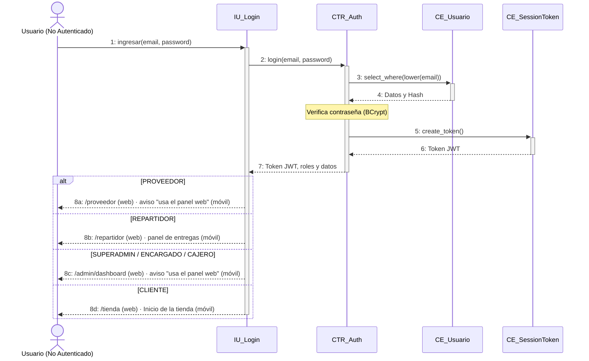

#### Desglose Paso a Paso (Nomenclatura Correlativa Formal):
- **`CU01[Paso 1: El usuario abre la interfaz de inicio de sesión en la aplicación móvil o web e ingresa su correo y contraseña.]`**
- **`CU01[Paso 2: La interfaz (IU_Login) envía la solicitud de acceso con las credenciales al controlador de autenticación (POST /api/v1/auth/login).]`**
- **`CU01[Paso 3: El controlador consulta en la base de datos la entidad Usuario (CE_User) buscando por correo en minúsculas.]`**
- **`CU01[Paso 4: El sistema valida la contraseña comparando el hash BCrypt con la clave ingresada.]`**
- **`CU01[Paso 5: Al comprobar la autenticidad, el sistema crea un token JWT con vigencia de 60 minutos y registra la sesión activa (CE_SessionToken).]`**
- **`CU01[Paso 6: Se registra la traza de seguridad en la bitácora de auditoría (CE_Bitacora) indicando ID de usuario, IP y fecha/hora.]`**
- **`CU01[Paso 7: La interfaz recibe el token, datos del perfil y roles, y redirige al usuario según su rol (Admin, Cajero, Encargado, Repartidor o Tienda Cliente).]`**

---

### CU02: Cerrar sesión activa

- **Ciclo de Desarrollo:** Ciclo 1
- **Paquete de Arquitectura:** `paquete_seguridad_usuarios`
- **Actores involucrados:** Usuario Autenticado
- **Actor Iniciador:** Usuario Autenticado
- **Propósito:** Revocar de forma segura la sesión activa del usuario, invalidando su token JWT en el servidor y limpiando los datos de sesión en el cliente.
- **Precondición:** El usuario tiene una sesión activa y un token JWT válido.
- **Postcondición:** El token queda marcado como revocado (is_revoked = true) y el almacenamiento local del cliente queda limpio.
- **Excepciones / Flujos Alternos:** E1: Token ya revocado o expirado.

#### Trazabilidad en Código Fuente:
- **Backend Router:** [`backend/app/packages/paquete_seguridad_usuarios/routers.py`](file:///backend/app/packages/paquete_seguridad_usuarios/routers.py)
- **Backend Servicio:** [`backend/app/packages/paquete_seguridad_usuarios/services.py`](file:///backend/app/packages/paquete_seguridad_usuarios/services.py)
- **Frontend Web Component:** [`frontend-web/src/app/shared/services/auth.service.ts`](file:///frontend-web/src/app/shared/services/auth.service.ts)
- **Mobile Flutter View:** [`mobile/lib/src/packages/paquete_seguridad_usuarios/auth_service.dart`](file:///mobile/lib/src/packages/paquete_seguridad_usuarios/auth_service.dart)

#### Diagrama de Secuencia (Mermaid):
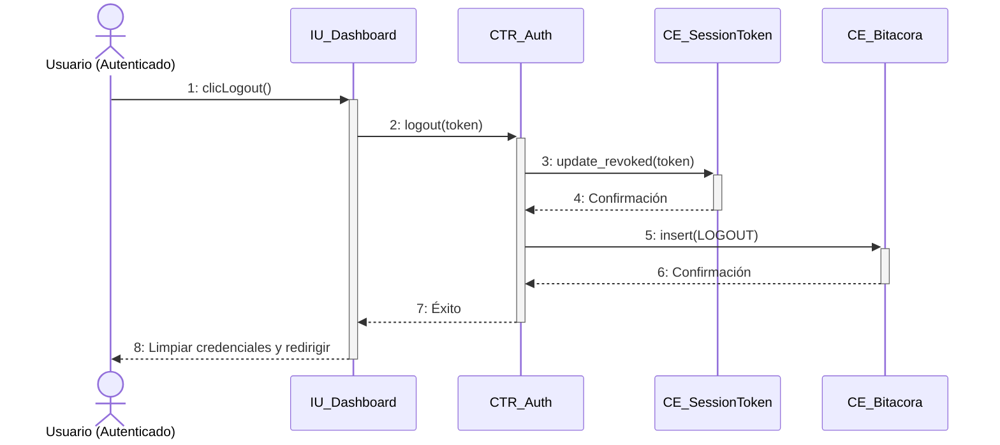

#### Desglose Paso a Paso (Nomenclatura Correlativa Formal):
- **`CU02[Paso 1: El usuario presiona la opción 'Cerrar sesión' desde la barra de navegación o perfil.]`**
- **`CU02[Paso 2: La interfaz envía la solicitud de revocación con el token JWT actual (POST /api/v1/auth/logout).]`**
- **`CU02[Paso 3: El controlador localiza el token de sesión en la base de datos (CE_SessionToken) y actualiza su estado a revocado (is_revoked = true).]`**
- **`CU02[Paso 4: El sistema inserta el evento de cierre de sesión en la bitácora de auditoría (CE_Bitacora).]`**
- **`CU02[Paso 5: El backend responde con confirmación de cierre exitoso (status 200).]`**
- **`CU02[Paso 6: La aplicación cliente elimina el token del almacenamiento local (localStorage / SecureStorage) y redirige a la vista de login.]`**

---

### CU03: Recuperar credenciales de acceso

- **Ciclo de Desarrollo:** Ciclo 1
- **Paquete de Arquitectura:** `paquete_seguridad_usuarios`
- **Actores involucrados:** Usuario que olvidó su contraseña
- **Actor Iniciador:** Usuario No Autenticado
- **Propósito:** Permitir a un usuario restablecer su contraseña mediante el envío de un enlace con token temporal de 5 minutos a su correo electrónico verificado.
- **Precondición:** El usuario debe tener una cuenta registrada con un correo válido en el sistema.
- **Postcondición:** La contraseña del usuario es actualizada con un nuevo hash seguro BCrypt y se revocan las sesiones previas.
- **Excepciones / Flujos Alternos:** E1: Correo electrónico no registrado. E2: Token de restablecimiento expirado o alterado.

#### Trazabilidad en Código Fuente:
- **Backend Router:** [`backend/app/packages/paquete_seguridad_usuarios/routers.py`](file:///backend/app/packages/paquete_seguridad_usuarios/routers.py)
- **Backend Servicio:** [`backend/app/packages/paquete_seguridad_usuarios/services.py`](file:///backend/app/packages/paquete_seguridad_usuarios/services.py)
- **Frontend Web Component:** [`frontend-web/src/app/packages/paquete_seguridad_usuarios/password-recovery/password-recovery.component.ts`](file:///frontend-web/src/app/packages/paquete_seguridad_usuarios/password-recovery/password-recovery.component.ts)
- **Mobile Flutter View:** [`mobile/lib/src/packages/paquete_seguridad_usuarios/login_view.dart`](file:///mobile/lib/src/packages/paquete_seguridad_usuarios/login_view.dart)

#### Diagrama de Secuencia (Mermaid):
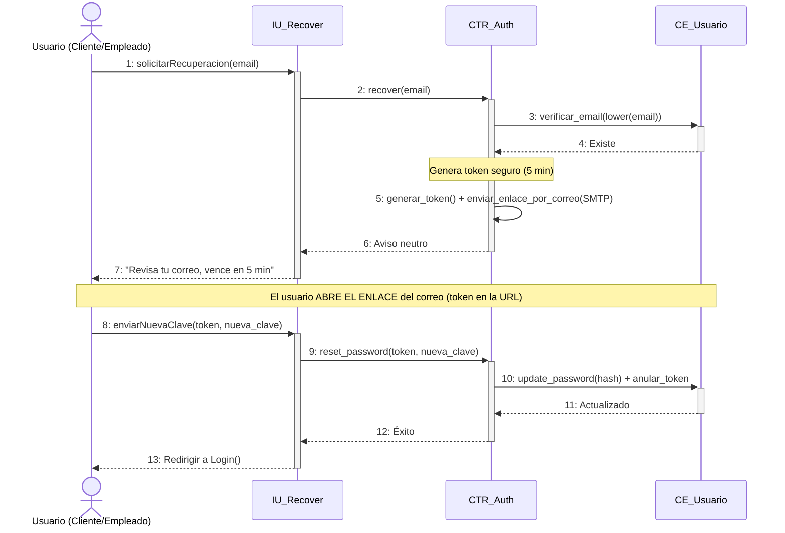

#### Desglose Paso a Paso (Nomenclatura Correlativa Formal):
- **`CU03[Paso 1: El usuario accede a '¿Olvidaste tu contraseña?' e ingresa su correo electrónico registrado.]`**
- **`CU03[Paso 2: La interfaz solicita la generación del enlace de recuperación (POST /api/v1/auth/recover).]`**
- **`CU03[Paso 3: El controlador busca el usuario en la base de datos (CE_User); si existe, genera un token criptográfico firmado de 5 minutos.]`**
- **`CU03[Paso 4: El servicio de mensajería (SMTP_Gmail) despacha el correo electrónico con el enlace seguro de restablecimiento.]`**
- **`CU03[Paso 5: El usuario hace clic en el enlace del correo y abre el formulario para ingresar y confirmar su nueva contraseña.]`**
- **`CU03[Paso 6: La interfaz envía el token y la nueva clave al servidor (POST /api/v1/auth/reset-password).]`**
- **`CU03[Paso 7: El controlador valida la vigencia del token, hashea la nueva clave con BCrypt, actualiza el registro en CE_User y registra la auditoría.]`**

---

### CU04: Auto-registro de cliente

- **Ciclo de Desarrollo:** Ciclo 1
- **Paquete de Arquitectura:** `paquete_seguridad_usuarios`
- **Actores involucrados:** Visitante / Comprador nuevo
- **Actor Iniciador:** Usuario No Autenticado
- **Propósito:** Permitir a nuevos clientes crear una cuenta personal en FashionStore con rol CLIENTE, habilitándolos para comprar, reservar prendas y usar el vestidor.
- **Precondición:** El correo ingresado no debe estar registrado previamente en la plataforma.
- **Postcondición:** Se crea un nuevo registro de usuario activo con rol CLIENTE y se emite su token de sesión de bienvenida.
- **Excepciones / Flujos Alternos:** E1: El correo ya se encuentra registrado. E2: Contraseña no cumple los requisitos mínimos de seguridad.

#### Trazabilidad en Código Fuente:
- **Backend Router:** [`backend/app/packages/paquete_seguridad_usuarios/routers.py`](file:///backend/app/packages/paquete_seguridad_usuarios/routers.py)
- **Backend Servicio:** [`backend/app/packages/paquete_seguridad_usuarios/services.py`](file:///backend/app/packages/paquete_seguridad_usuarios/services.py)
- **Frontend Web Component:** [`frontend-web/src/app/packages/paquete_seguridad_usuarios/register-modal/register-modal.component.ts`](file:///frontend-web/src/app/packages/paquete_seguridad_usuarios/register-modal/register-modal.component.ts)
- **Mobile Flutter View:** [`mobile/lib/src/packages/paquete_seguridad_usuarios/login_view.dart`](file:///mobile/lib/src/packages/paquete_seguridad_usuarios/login_view.dart)

#### Diagrama de Secuencia (Mermaid):
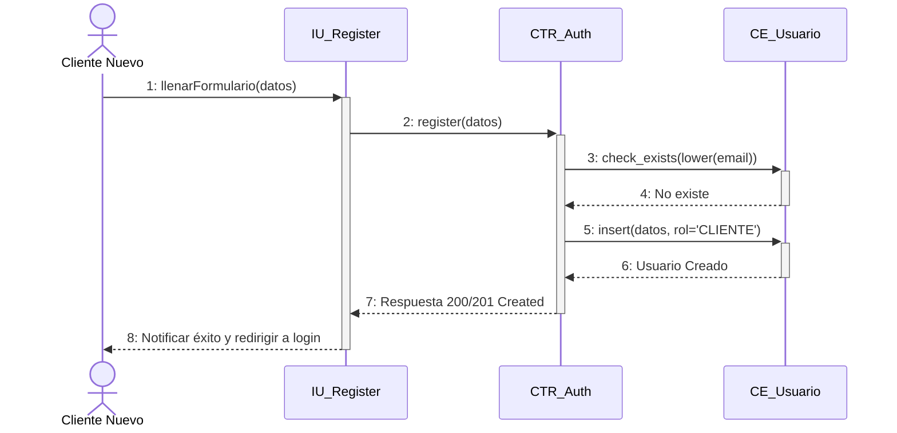

#### Desglose Paso a Paso (Nomenclatura Correlativa Formal):
- **`CU04[Paso 1: El visitante presiona 'Crear cuenta' en la web o app móvil y completa el formulario con sus datos (nombres, correo, teléfono y contraseña).]`**
- **`CU04[Paso 2: La interfaz envía la solicitud de creación de cuenta (POST /api/v1/auth/register).]`**
- **`CU04[Paso 3: El controlador normaliza el correo a minúsculas y verifica que no exista en la base de datos (CE_User).]`**
- **`CU04[Paso 4: El sistema asigna automáticamente el rol 'CLIENTE', genera el hash BCrypt de la contraseña y persiste el nuevo usuario activo.]`**
- **`CU04[Paso 5: El sistema genera un token de sesión JWT inmediato para iniciar la sesión del nuevo cliente sin fricción.]`**
- **`CU04[Paso 6: Se registra el evento de auto-registro en la bitácora de auditoría (CE_Bitacora).]`**
- **`CU04[Paso 7: La interfaz almacena las credenciales recibidas y le da la bienvenida al cliente en la tienda digital.]`**

---

### CU05: Gestionar perfiles, roles y usuarios

- **Ciclo de Desarrollo:** Ciclo 1
- **Paquete de Arquitectura:** `paquete_seguridad_usuarios`
- **Actores involucrados:** Superadministrador
- **Actor Iniciador:** Superadministrador Autenticado
- **Propósito:** Administrar el ciclo de vida de usuarios del sistema (creación, edición, activación, desactivación y asignación de roles).
- **Precondición:** El usuario debe tener rol Superadministrador y sesión válida.
- **Postcondición:** Los datos, roles o estado del usuario son actualizados en la base de datos.
- **Excepciones / Flujos Alternos:** E1: Intento de desactivar al último Superadministrador del sistema. E2: Correo duplicado.

#### Trazabilidad en Código Fuente:
- **Backend Router:** [`backend/app/packages/paquete_seguridad_usuarios/routers.py`](file:///backend/app/packages/paquete_seguridad_usuarios/routers.py)
- **Backend Servicio:** [`backend/app/packages/paquete_seguridad_usuarios/services.py`](file:///backend/app/packages/paquete_seguridad_usuarios/services.py)
- **Frontend Web Component:** [`frontend-web/src/app/packages/paquete_seguridad_usuarios/user-management/user-management.component.ts`](file:///frontend-web/src/app/packages/paquete_seguridad_usuarios/user-management/user-management.component.ts)

#### Diagrama de Secuencia (Mermaid):
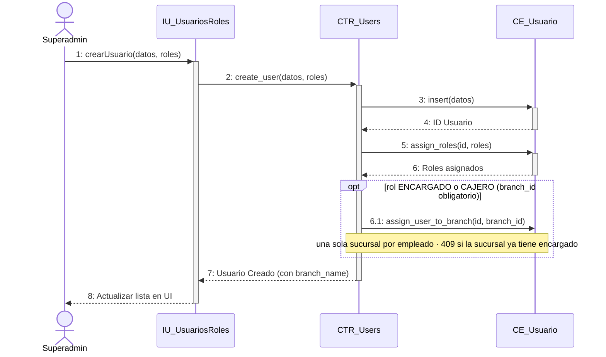

#### Desglose Paso a Paso (Nomenclatura Correlativa Formal):
- **`CU05[Paso 1: El Superadministrador entra al módulo 'Usuarios y Roles' en el panel de administración.]`**
- **`CU05[Paso 2: La interfaz consulta la lista de usuarios paginada con sus roles (GET /api/v1/users).]`**
- **`CU05[Paso 3: El Superadmin selecciona un usuario para editar o presiona 'Nuevo Usuario' y completa el formulario.]`**
- **`CU05[Paso 4: La interfaz envía la solicitud al backend (POST /api/v1/users o PUT /api/v1/users/{id}).]`**
- **`CU05[Paso 5: El controlador valida que no se dupliquen correos y actualiza las asignaciones en la tabla asociativa usuario_roles.]`**
- **`CU05[Paso 6: Se persiste la información en CE_User y se asienta el cambio en la bitácora de auditoría (CE_Bitacora).]`**
- **`CU05[Paso 7: La interfaz actualiza la tabla de usuarios y muestra el mensaje de confirmación de éxito.]`**

---

### CU06: Gestionar sucursales de la cadena

- **Ciclo de Desarrollo:** Ciclo 1
- **Paquete de Arquitectura:** `paquete_catalogo_y_tiendas`
- **Actores involucrados:** Superadministrador
- **Actor Iniciador:** Superadministrador Autenticado
- **Propósito:** Administrar las tiendas físicas de la cadena FashionStore (nombre, dirección, ciudad, teléfono y estado activo).
- **Precondición:** Usuario autenticado con rol Superadministrador.
- **Postcondición:** La sucursal queda registrada o actualizada en la base de datos y disponible para asignación de inventario y citas.
- **Excepciones / Flujos Alternos:** E1: Nombre de sucursal duplicado en la misma ciudad.

#### Trazabilidad en Código Fuente:
- **Backend Router:** [`backend/app/packages/paquete_catalogo_y_tiendas/branches/routers.py`](file:///backend/app/packages/paquete_catalogo_y_tiendas/branches/routers.py)
- **Backend Servicio:** [`backend/app/packages/paquete_catalogo_y_tiendas/branches/services.py`](file:///backend/app/packages/paquete_catalogo_y_tiendas/branches/services.py)
- **Frontend Web Component:** [`frontend-web/src/app/packages/paquete_catalogo_y_tiendas/branches/branch-management.component.ts`](file:///frontend-web/src/app/packages/paquete_catalogo_y_tiendas/branches/branch-management.component.ts)

#### Diagrama de Secuencia (Mermaid):
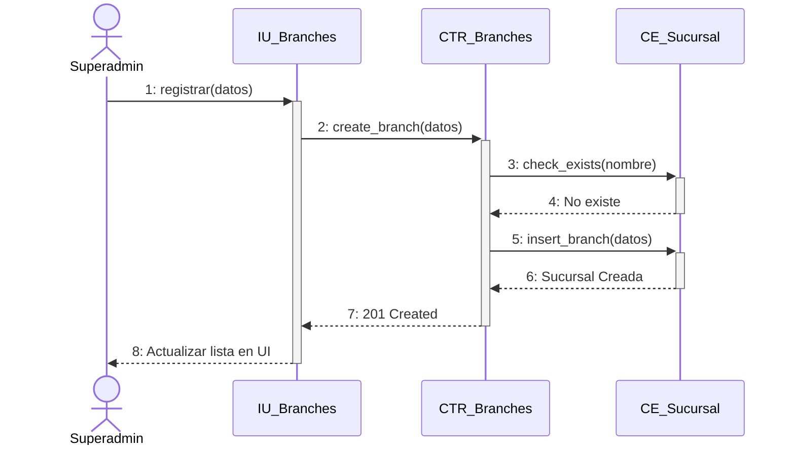

#### Desglose Paso a Paso (Nomenclatura Correlativa Formal):
- **`CU06[Paso 1: El Superadmin ingresa al apartado de 'Sucursales' del panel administrativo.]`**
- **`CU06[Paso 2: La interfaz solicita la lista de sucursales activas (GET /api/v1/branches).]`**
- **`CU06[Paso 3: El Superadmin completa o edita los datos de la tienda física (nombre, dirección, ciudad, horario, teléfono).]`**
- **`CU06[Paso 4: La interfaz envía la petición de guardado al servidor (POST /api/v1/branches o PUT /api/v1/branches/{id}).]`**
- **`CU06[Paso 5: El controlador valida los datos y registra la sucursal en la tabla branches (CE_Branch).]`**
- **`CU06[Paso 6: Se registra la acción en la bitácora de auditoría con los datos de la sucursal modificada.]`**
- **`CU06[Paso 7: La interfaz refresca la lista de sucursales y notifica la operación completada.]`**

---

### CU07: Gestionar catálogo de prendas y variantes

- **Ciclo de Desarrollo:** Ciclo 1
- **Paquete de Arquitectura:** `paquete_catalogo_y_tiendas`
- **Actores involucrados:** Superadministrador, Encargado
- **Actor Iniciador:** Personal Administrativo Autenticado
- **Propósito:** Crear, actualizar y catalogar prendas con su jerarquía de variantes (tallas, colores, códigos SKU, precios y galería de fotos).
- **Precondición:** Existencia de categorías, tallas y colores base en el sistema.
- **Postcondición:** La prenda y sus variantes quedan registradas en el catálogo y listas para recepción de inventario.
- **Excepciones / Flujos Alternos:** E1: Código SKU duplicado. E2: Imagen excede tamaño permitido.

#### Trazabilidad en Código Fuente:
- **Backend Router:** [`backend/app/packages/paquete_catalogo_y_tiendas/routers.py`](file:///backend/app/packages/paquete_catalogo_y_tiendas/routers.py)
- **Backend Servicio:** [`backend/app/packages/paquete_catalogo_y_tiendas/services.py`](file:///backend/app/packages/paquete_catalogo_y_tiendas/services.py)
- **Frontend Web Component:** [`frontend-web/src/app/packages/paquete_catalogo_y_tiendas/products/product-management.component.ts`](file:///frontend-web/src/app/packages/paquete_catalogo_y_tiendas/products/product-management.component.ts)

#### Diagrama de Secuencia (Mermaid):
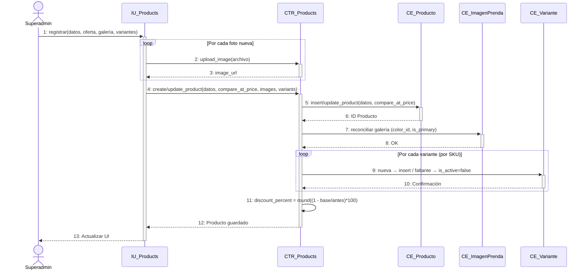

#### Desglose Paso a Paso (Nomenclatura Correlativa Formal):
- **`CU07[Paso 1: El encargado entra a 'Catálogo de Prendas' y presiona 'Nueva Prenda' o selecciona una existente.]`**
- **`CU07[Paso 2: La interfaz carga las categorías, colores y tallas disponibles para el formulario.]`**
- **`CU07[Paso 3: El usuario carga los datos de la prenda, define las variantes (talla + color), genera los códigos SKU y sube las fotos.]`**
- **`CU07[Paso 4: La interfaz envía la prenda completa con sus variantes y fotos al backend (POST /api/v1/products).]`**
- **`CU07[Paso 5: El controlador valida la unicidad de los SKUs, guarda la entidad Prenda (CE_Product) y sus variantes (CE_ProductVariant).]`**
- **`CU07[Paso 6: Se asocian las imágenes en la tabla product_images y se registra la traza en la bitácora de auditoría.]`**
- **`CU07[Paso 7: La interfaz confirma la creación de la prenda y la muestra inmediatamente en la tabla del catálogo.]`**

---

### CU08: Gestionar proveedores de mercadería

- **Ciclo de Desarrollo:** Ciclo 1
- **Paquete de Arquitectura:** `paquete_inventario_y_proveedores`
- **Actores involucrados:** Superadministrador, Encargado
- **Actor Iniciador:** Personal Administrativo Autenticado
- **Propósito:** Administrar el directorio de empresas proveedoras y fabricantes que abastecen de mercadería a las sucursales.
- **Precondición:** Sesión iniciada con privilegios administrativos.
- **Postcondición:** El proveedor queda registrado con sus datos de contacto y NIT en el sistema.
- **Excepciones / Flujos Alternos:** E1: NIT o razón social duplicada.

#### Trazabilidad en Código Fuente:
- **Backend Router:** [`backend/app/packages/paquete_inventario_y_proveedores/suppliers/routers.py`](file:///backend/app/packages/paquete_inventario_y_proveedores/suppliers/routers.py)
- **Backend Servicio:** [`backend/app/packages/paquete_inventario_y_proveedores/suppliers/services.py`](file:///backend/app/packages/paquete_inventario_y_proveedores/suppliers/services.py)
- **Frontend Web Component:** [`frontend-web/src/app/packages/paquete_inventario_y_proveedores/suppliers/supplier-management.component.ts`](file:///frontend-web/src/app/packages/paquete_inventario_y_proveedores/suppliers/supplier-management.component.ts)

#### Diagrama de Secuencia (Mermaid):
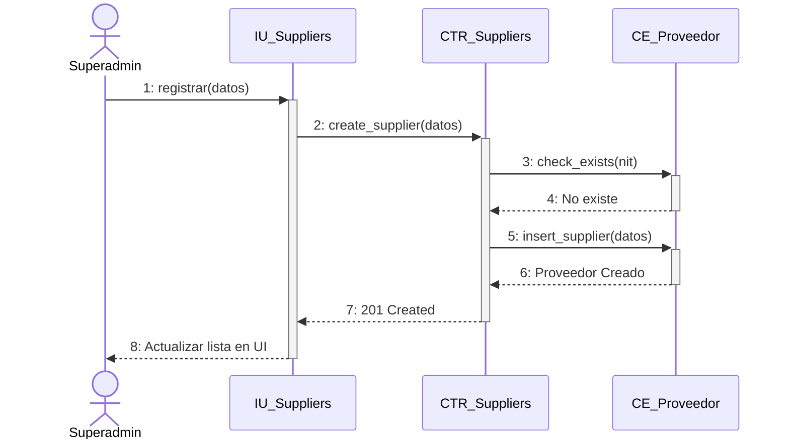

#### Desglose Paso a Paso (Nomenclatura Correlativa Formal):
- **`CU08[Paso 1: El usuario accede a 'Proveedores' dentro del módulo de inventario.]`**
- **`CU08[Paso 2: La interfaz lista los proveedores activos (GET /api/v1/suppliers).]`**
- **`CU08[Paso 3: El usuario presiona 'Registrar Proveedor' y llena los campos (razón social, NIT, teléfono, correo, dirección).]`**
- **`CU08[Paso 4: La interfaz despacha la solicitud de alta al servidor (POST /api/v1/suppliers).]`**
- **`CU08[Paso 5: El controlador valida que el NIT no exista y guarda el registro en la tabla suppliers (CE_Supplier).]`**
- **`CU08[Paso 6: Se registra la auditoría de la operación.]`**
- **`CU08[Paso 7: La interfaz actualiza la lista de proveedores mostrando el nuevo contacto disponible para órdenes de compra.]`**

---

### CU09: Gestionar empleados de sucursal

- **Ciclo de Desarrollo:** Ciclo 1
- **Paquete de Arquitectura:** `paquete_seguridad_usuarios`
- **Actores involucrados:** Superadministrador
- **Actor Iniciador:** Superadministrador Autenticado
- **Propósito:** Registrar al personal operativo (Cajeros, Encargados de tienda) asociando su cuenta de usuario a una sucursal específica de trabajo.
- **Precondición:** Existencia previa de la sucursal de destino y del rol operativo a asignar.
- **Postcondición:** El empleado queda creado con usuario del sistema, rol correspondiente y vinculado a su sucursal sede.
- **Excepciones / Flujos Alternos:** E1: Sucursal inactiva o inexistente. E2: Correo del empleado ya en uso.

#### Trazabilidad en Código Fuente:
- **Backend Router:** [`backend/app/packages/paquete_seguridad_usuarios/routers.py`](file:///backend/app/packages/paquete_seguridad_usuarios/routers.py)
- **Backend Servicio:** [`backend/app/packages/paquete_seguridad_usuarios/services.py`](file:///backend/app/packages/paquete_seguridad_usuarios/services.py)
- **Frontend Web Component:** [`frontend-web/src/app/packages/paquete_seguridad_usuarios/employees/employee-management.component.ts`](file:///frontend-web/src/app/packages/paquete_seguridad_usuarios/employees/employee-management.component.ts)

#### Diagrama de Secuencia (Mermaid):
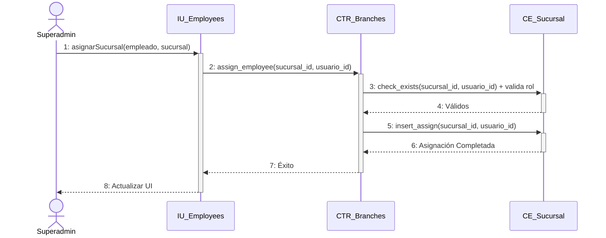

#### Desglose Paso a Paso (Nomenclatura Correlativa Formal):
- **`CU09[Paso 1: El Superadmin entra a 'Personal y Empleados' en el menú de administración.]`**
- **`CU09[Paso 2: La interfaz consulta los empleados actuales y sus sucursales asignadas (GET /api/v1/employees).]`**
- **`CU09[Paso 3: El Superadmin presiona 'Contratar/Asignar Empleado', selecciona la sucursal, rol (Cajero/Encargado) y completa los datos personales.]`**
- **`CU09[Paso 4: La interfaz envía la solicitud combinada de usuario y asignación física (POST /api/v1/employees).]`**
- **`CU09[Paso 5: El controlador crea la cuenta en CE_User, asigna el rol y vincula la clave foránea branch_id en la tabla de empleados.]`**
- **`CU09[Paso 6: Se registra el evento de contratación/asignación en la bitácora de auditoría.]`**
- **`CU09[Paso 7: La interfaz actualiza la nómina de la sucursal y notifica el registro exitoso.]`**

---

### CU10: Registrar compras e ingresos de mercadería

- **Ciclo de Desarrollo:** Ciclo 1
- **Paquete de Arquitectura:** `paquete_inventario_y_proveedores`
- **Actores involucrados:** Encargado de Sucursal
- **Actor Iniciador:** Encargado de Sucursal Autenticado
- **Propósito:** Dar ingreso formal a lotes de prendas recibidos de proveedores, actualizando existencias físicas y recalculando el Costo Promedio Ponderado (CPP).
- **Precondición:** Prendas/variantes catalogadas y proveedor activo seleccionado.
- **Postcondición:** Incremento de existencias en el inventario de la sucursal, registro en el kardex (inventory_ledger) y recálculo del costo promedio de la prenda.
- **Excepciones / Flujos Alternos:** E1: Cantidad o costo unitario menor o igual a cero.

#### Trazabilidad en Código Fuente:
- **Backend Router:** [`backend/app/packages/paquete_inventario_y_proveedores/merchandise/routers.py`](file:///backend/app/packages/paquete_inventario_y_proveedores/merchandise/routers.py)
- **Backend Servicio:** [`backend/app/packages/paquete_inventario_y_proveedores/merchandise/services.py`](file:///backend/app/packages/paquete_inventario_y_proveedores/merchandise/services.py)
- **Frontend Web Component:** [`frontend-web/src/app/packages/paquete_inventario_y_proveedores/merchandise/merchandise-intake.component.ts`](file:///frontend-web/src/app/packages/paquete_inventario_y_proveedores/merchandise/merchandise-intake.component.ts)

#### Diagrama de Secuencia (Mermaid):
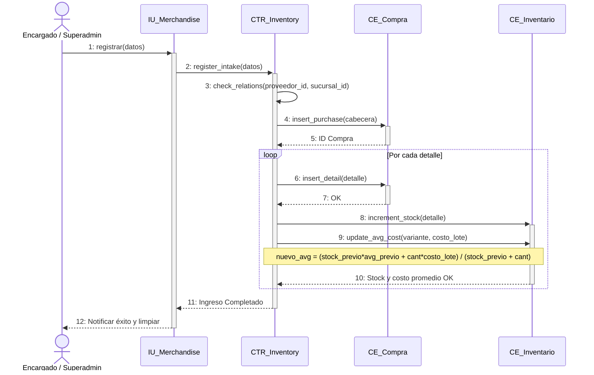

#### Desglose Paso a Paso (Nomenclatura Correlativa Formal):
- **`CU10[Paso 1: El encargado de sucursal abre el formulario de 'Ingreso de Mercadería'.]`**
- **`CU10[Paso 2: Selecciona el proveedor, el número de factura/remisión de compra y agrega las prendas por su SKU con cantidad y costo de adquisición.]`**
- **`CU10[Paso 3: La interfaz envía el lote de ingreso al servidor (POST /api/v1/inventory/merchandise-intakes).]`**
- **`CU10[Paso 4: El controlador inicia una transacción atómica e incrementa el stock_actual en la tabla inventory para la sucursal receptora.]`**
- **`CU10[Paso 5: El sistema recalcula el Costo Promedio Ponderado: CPP_nuevo = (Stock_ant * Costo_ant + Cant_ingreso * Costo_ingreso) / Stock_total.]`**
- **`CU10[Paso 6: Se inserta un movimiento tipo 'INGRESO_COMPRA' en el libro de movimientos (inventory_ledger) y se guarda el comprobante.]`**
- **`CU10[Paso 7: Se confirma la transacción con COMMIT, retornando el código de ingreso y el stock consolidado.]`**

---

### CU11: Consultar catálogo de prendas

- **Ciclo de Desarrollo:** Ciclo 1
- **Paquete de Arquitectura:** `paquete_catalogo_y_tiendas`
- **Actores involucrados:** Cliente, Visitante, Personal
- **Actor Iniciador:** Cualquier Usuario (Público / Autenticado)
- **Propósito:** Permitir a los clientes y visitantes navegar la vitrina digital de prendas con imágenes, precios base, descuentos y categorías.
- **Precondición:** Existen prendas activas registradas en la base de datos.
- **Postcondición:** La interfaz presenta la galería interactiva con tarjetas de prendas, variantes de color y badges de oferta.
- **Excepciones / Flujos Alternos:** Ninguna. Si no hay productos se muestra un estado vacío amigable.

#### Trazabilidad en Código Fuente:
- **Backend Router:** [`backend/app/packages/paquete_catalogo_y_tiendas/routers.py`](file:///backend/app/packages/paquete_catalogo_y_tiendas/routers.py)
- **Backend Servicio:** [`backend/app/packages/paquete_catalogo_y_tiendas/services.py`](file:///backend/app/packages/paquete_catalogo_y_tiendas/services.py)
- **Frontend Web Component:** [`frontend-web/src/app/packages/paquete_catalogo_y_tiendas/store/store-catalog.component.ts`](file:///frontend-web/src/app/packages/paquete_catalogo_y_tiendas/store/store-catalog.component.ts)
- **Mobile Flutter View:** [`mobile/lib/src/packages/paquete_catalogo_y_tiendas/catalogo_view.dart`](file:///mobile/lib/src/packages/paquete_catalogo_y_tiendas/catalogo_view.dart)

#### Diagrama de Secuencia (Mermaid):
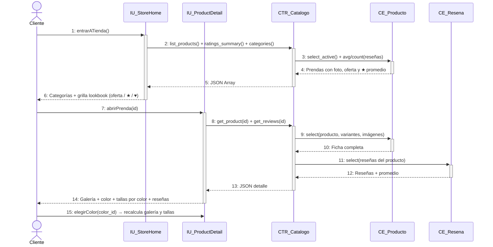

#### Desglose Paso a Paso (Nomenclatura Correlativa Formal):
- **`CU11[Paso 1: El usuario entra a la Tienda Web o abre la pestaña Catálogo en la aplicación móvil.]`**
- **`CU11[Paso 2: La aplicación solicita el listado de prendas activas con sus imágenes y variantes (GET /api/v1/catalog/products).]`**
- **`CU11[Paso 3: El controlador consulta CE_Product filtrando únicamente registros con is_active = true e incluye sus relaciones de imágenes y variantes.]`**
- **`CU11[Paso 4: El sistema procesa la respuesta agregando precios con descuento si la prenda cuenta con compare_at_price.]`**
- **`CU11[Paso 5: El backend devuelve la lista serializada en JSON.]`**
- **`CU11[Paso 6: La interfaz renderiza las tarjetas de producto con soporte para cambio dinámico de imagen al seleccionar un color.]`**
- **`CU11[Paso 7: El usuario puede interactuar con las tarjetas para ver el detalle, probarse la prenda o añadirla a favoritos.]`**

---

### CU12: Buscar y filtrar catálogo avanzado + disponibilidad por sucursal

- **Ciclo de Desarrollo:** Ciclo 2
- **Paquete de Arquitectura:** `paquete_catalogo_y_tiendas`
- **Actores involucrados:** Cliente, Comprador
- **Actor Iniciador:** Cliente Autenticado o Visitante
- **Propósito:** Buscar prendas por coincidencia de texto, filtrar por rango de precio, talla, color, categoría y consultar en qué sucursales físicas hay stock real.
- **Precondición:** Catálogo activo con stock asignado en sucursales.
- **Postcondición:** El cliente visualiza las opciones exactas y la lista de sucursales cercanas donde puede recoger o probarse la prenda.
- **Excepciones / Flujos Alternos:** E1: Filtros sin coincidencias (se muestran prendas sugeridas).

#### Trazabilidad en Código Fuente:
- **Backend Router:** [`backend/app/packages/paquete_catalogo_y_tiendas/routers.py`](file:///backend/app/packages/paquete_catalogo_y_tiendas/routers.py)
- **Backend Servicio:** [`backend/app/packages/paquete_catalogo_y_tiendas/services.py`](file:///backend/app/packages/paquete_catalogo_y_tiendas/services.py)
- **Frontend Web Component:** [`frontend-web/src/app/packages/paquete_catalogo_y_tiendas/store/store-home.component.ts`](file:///frontend-web/src/app/packages/paquete_catalogo_y_tiendas/store/store-home.component.ts)
- **Mobile Flutter View:** [`mobile/lib/src/packages/paquete_catalogo_y_tiendas/catalogo_view.dart`](file:///mobile/lib/src/packages/paquete_catalogo_y_tiendas/catalogo_view.dart)

#### Diagrama de Secuencia (Mermaid):
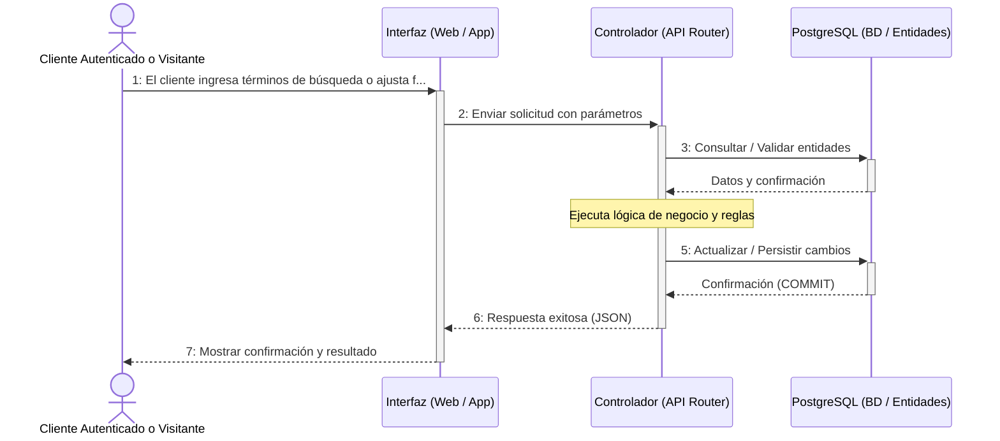

#### Desglose Paso a Paso (Nomenclatura Correlativa Formal):
- **`CU12[Paso 1: El cliente ingresa términos de búsqueda o ajusta filtros (categoría, talla, color, precio mín/máx).]`**
- **`CU12[Paso 2: La interfaz envía la consulta con los parámetros de filtro al backend (GET /api/v1/catalog/products/search).]`**
- **`CU12[Paso 3: El controlador ejecuta la consulta dinámica con cláusulas LIKE e índices en PostgreSQL.]`**
- **`CU12[Paso 4: Al hacer clic en una prenda, la interfaz solicita la disponibilidad por sucursales (GET /api/v1/catalog/products/{id}/branch-availability).]`**
- **`CU12[Paso 5: El backend suma el stock físico por sucursal cruzando la tabla inventory con branches.]`**
- **`CU12[Paso 6: Se devuelven las tiendas con existencias disponibles en tiempo real.]`**
- **`CU12[Paso 7: La interfaz muestra las tiendas con badges verde (Disponible) o rojo (Agotado), facilitando la reserva o compra.]`**

---

### CU13: Gestionar promociones: cupones y ofertas de temporada

- **Ciclo de Desarrollo:** Ciclo 2
- **Paquete de Arquitectura:** `paquete_catalogo_y_tiendas`
- **Actores involucrados:** Superadministrador, Encargado
- **Actor Iniciador:** Personal Administrativo Autenticado
- **Propósito:** Crear y controlar cupones de descuento (porcentaje o monto fijo) con vigencia, límite de usos y condiciones de compra.
- **Precondición:** Usuario con privilegios de gestión de precios y marketing.
- **Postcondición:** El cupón o campaña queda activo y puede ser validado en el checkout digital o caja POS.
- **Excepciones / Flujos Alternos:** E1: Código de cupón duplicado. E2: Fecha de vencimiento anterior a la fecha actual.

#### Trazabilidad en Código Fuente:
- **Backend Router:** [`backend/app/packages/paquete_catalogo_y_tiendas/promotions/routers.py`](file:///backend/app/packages/paquete_catalogo_y_tiendas/promotions/routers.py)
- **Backend Servicio:** [`backend/app/packages/paquete_catalogo_y_tiendas/promotions/services.py`](file:///backend/app/packages/paquete_catalogo_y_tiendas/promotions/services.py)
- **Frontend Web Component:** [`frontend-web/src/app/packages/paquete_catalogo_y_tiendas/promotions/promotion-management.component.ts`](file:///frontend-web/src/app/packages/paquete_catalogo_y_tiendas/promotions/promotion-management.component.ts)

#### Diagrama de Secuencia (Mermaid):


#### Desglose Paso a Paso (Nomenclatura Correlativa Formal):
- **`CU13[Paso 1: El encargado accede a la sección 'Promociones y Cupones' del panel de administración.]`**
- **`CU13[Paso 2: Presiona 'Crear Cupón' y especifica código (ej: BIENVENIDA10), tipo (porcentaje/monto), valor, fecha límite y uso máximo.]`**
- **`CU13[Paso 3: La interfaz envía la solicitud de alta (POST /api/v1/promotions/coupons).]`**
- **`CU13[Paso 4: El controlador valida que el código no exista y guarda el cupón en la tabla coupons (CE_Coupon).]`**
- **`CU13[Paso 5: Se registra la auditoría de la creación del incentivo comercial.]`**
- **`CU13[Paso 6: Al comprar, el cliente ingresa el cupón y el endpoint POST /api/v1/promotions/validate-coupon calcula el descuento aplicable.]`**
- **`CU13[Paso 7: La interfaz muestra el subtotal, el descuento aplicado y el nuevo total a cancelar.]`**

---

### CU14: Wishlist múltiple / compartible y moderación de reseñas

- **Ciclo de Desarrollo:** Ciclo 2
- **Paquete de Arquitectura:** `paquete_catalogo_y_tiendas`
- **Actores involucrados:** Cliente, Encargado
- **Actor Iniciador:** Cliente Autenticado
- **Propósito:** Permitir a los clientes guardar prendas favoritas en su lista de deseos y calificar prendas adquiridas mediante reseñas con estrellas (1 a 5) y comentarios.
- **Precondición:** Cliente autenticado con sesión activa.
- **Postcondición:** Prenda agregada a wishlist o reseña registrada para moderación/publicación.
- **Excepciones / Flujos Alternos:** E1: Calificación fuera del rango 1-5.

#### Trazabilidad en Código Fuente:
- **Backend Router:** [`backend/app/packages/paquete_catalogo_y_tiendas/reviews/routers.py`](file:///backend/app/packages/paquete_catalogo_y_tiendas/reviews/routers.py)
- **Backend Servicio:** [`backend/app/packages/paquete_catalogo_y_tiendas/reviews/services.py`](file:///backend/app/packages/paquete_catalogo_y_tiendas/reviews/services.py)
- **Frontend Web Component:** [`frontend-web/src/app/packages/paquete_catalogo_y_tiendas/product-detail/product-detail.component.ts`](file:///frontend-web/src/app/packages/paquete_catalogo_y_tiendas/product-detail/product-detail.component.ts)
- **Mobile Flutter View:** [`mobile/lib/src/packages/paquete_catalogo_y_tiendas/product_detail_view.dart`](file:///mobile/lib/src/packages/paquete_catalogo_y_tiendas/product_detail_view.dart)

#### Diagrama de Secuencia (Mermaid):
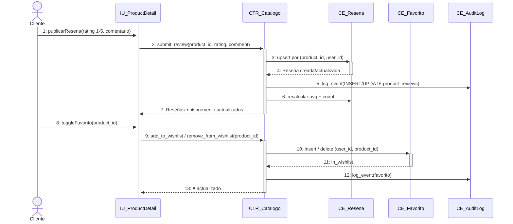

#### Desglose Paso a Paso (Nomenclatura Correlativa Formal):
- **`CU14[Paso 1: El cliente hace clic en el icono de corazón en una prenda para agregarla a su lista de favoritos.]`**
- **`CU14[Paso 2: La interfaz envía la petición de guardado (POST /api/v1/catalog/wishlist/{product_id}).]`**
- **`CU14[Paso 3: El backend registra la relación en la tabla wishlist_items asociada al user_id.]`**
- **`CU14[Paso 4: Para reseñas, el cliente accede al detalle de la prenda, selecciona la puntuación en estrellas (1-5) y escribe su opinión.]`**
- **`CU14[Paso 5: La interfaz envía la reseña al servidor (POST /api/v1/catalog/products/{id}/reviews).]`**
- **`CU14[Paso 6: El controlador valida el formato, guarda la reseña en product_reviews y actualiza el promedio de valoración de la prenda.]`**
- **`CU14[Paso 7: La interfaz actualiza la sección de opiniones mostrando la nueva reseña verificada.]`**

---

### CU15: Gestionar inventario general y transferencias entre sucursales

- **Ciclo de Desarrollo:** Ciclo 2
- **Paquete de Arquitectura:** `paquete_inventario_y_proveedores`
- **Actores involucrados:** Encargado de Sucursal, Superadministrador
- **Actor Iniciador:** Encargado de Sucursal Autenticado
- **Propósito:** Transferir lotes de prendas entre sucursales de la cadena para equilibrar existencias, mediante un flujo de solicitud, despacho y confirmación de recepción.
- **Precondición:** Existencia de stock suficiente en la sucursal de origen.
- **Postcondición:** Descuento en origen, incremento en destino y asientos auditados en el kardex.
- **Excepciones / Flujos Alternos:** E1: Stock insuficiente en la sucursal de origen. E2: Transferencia entre la misma sucursal.

#### Trazabilidad en Código Fuente:
- **Backend Router:** [`backend/app/packages/paquete_inventario_y_proveedores/transfers/routers.py`](file:///backend/app/packages/paquete_inventario_y_proveedores/transfers/routers.py)
- **Backend Servicio:** [`backend/app/packages/paquete_inventario_y_proveedores/transfers/services.py`](file:///backend/app/packages/paquete_inventario_y_proveedores/transfers/services.py)
- **Frontend Web Component:** [`frontend-web/src/app/packages/paquete_inventario_y_proveedores/transfers/transfer-management.component.ts`](file:///frontend-web/src/app/packages/paquete_inventario_y_proveedores/transfers/transfer-management.component.ts)

#### Diagrama de Secuencia (Mermaid):
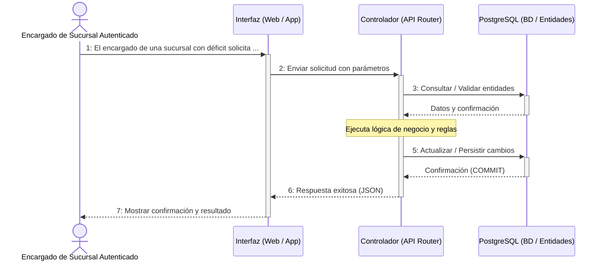

#### Desglose Paso a Paso (Nomenclatura Correlativa Formal):
- **`CU15[Paso 1: El encargado de una sucursal con déficit solicita mercadería seleccionando la sucursal origen y los SKU requeridos.]`**
- **`CU15[Paso 2: La interfaz envía la orden de transferencia en estado 'EN_TRANSITO' (POST /api/v1/inventory/transfers).]`**
- **`CU15[Paso 3: El backend valida el stock en la sucursal origen y descuenta de inmediato las existencias físicas para evitar sobreventas.]`**
- **`CU15[Paso 4: Se asienta la salida en inventory_ledger indicando movimiento 'TRANSFERENCIA_SALIDA'.]`**
- **`CU15[Paso 5: Al llegar el lote a la sucursal destino, el encargado receptor pulsa 'Confirmar Recepción' (PUT /api/v1/inventory/transfers/{id}/receive).]`**
- **`CU15[Paso 6: El controlador incrementa el stock en la sucursal destino, asienta 'TRANSFERENCIA_ENTRADA' en el kardex y cambia el estado a 'COMPLETADA'.]`**
- **`CU15[Paso 7: Ambas sucursales quedan con sus inventarios sincronizados y el registro auditado.]`**

---

### CU16: Configurar y notificar alertas de stock (mínimo/máximo)

- **Ciclo de Desarrollo:** Ciclo 2
- **Paquete de Arquitectura:** `paquete_inventario_y_proveedores`
- **Actores involucrados:** Encargado de Sucursal, Superadministrador
- **Actor Iniciador:** Sistema Automático / Encargado
- **Propósito:** Monitorear permanentemente el nivel de inventario de cada prenda y disparar alertas inmediatas cuando las existencias caigan por debajo del umbral mínimo de seguridad.
- **Precondición:** Umbrales de stock mínimo definidos por variante o categoría.
- **Postcondición:** Generación de alerta visual en el dashboard y notificación in-app para reposición preventiva.
- **Excepciones / Flujos Alternos:** Ninguna. Es una consulta y monitoreo de umbrales.

#### Trazabilidad en Código Fuente:
- **Backend Router:** [`backend/app/packages/paquete_inventario_y_proveedores/alerts/routers.py`](file:///backend/app/packages/paquete_inventario_y_proveedores/alerts/routers.py)
- **Backend Servicio:** [`backend/app/packages/paquete_inventario_y_proveedores/alerts/services.py`](file:///backend/app/packages/paquete_inventario_y_proveedores/alerts/services.py)
- **Frontend Web Component:** [`frontend-web/src/app/packages/paquete_inventario_y_proveedores/alerts/stock-alerts.component.ts`](file:///frontend-web/src/app/packages/paquete_inventario_y_proveedores/alerts/stock-alerts.component.ts)

#### Diagrama de Secuencia (Mermaid):
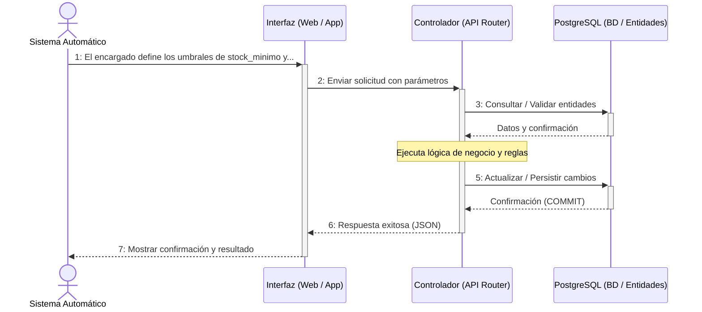

#### Desglose Paso a Paso (Nomenclatura Correlativa Formal):
- **`CU16[Paso 1: El encargado define los umbrales de stock_minimo y stock_maximo para cada prenda en su sucursal.]`**
- **`CU16[Paso 2: El sistema evalúa tras cada venta, transferencia o ajuste si stock_actual <= stock_minimo.]`**
- **`CU16[Paso 3: Al cumplirse la condición, el backend crea un registro en stock_alerts con nivel 'CRÍTICO' o 'BAJO'.]`**
- **`CU16[Paso 4: El servicio de notificaciones emite una alerta in-app visible en el panel del encargado.]`**
- **`CU16[Paso 5: El encargado consulta la bandeja de alertas (GET /api/v1/inventory/alerts/critical).]`**
- **`CU16[Paso 6: La interfaz muestra las prendas que requieren compra urgente con botones de acción directa para generar pedido a proveedor.]`**
- **`CU16[Paso 7: El encargado marca la alerta como atendida al gestionar la orden de reposición.]`**

---

### CU17: Gestionar carrito de compra digital

- **Ciclo de Desarrollo:** Ciclo 2
- **Paquete de Arquitectura:** `paquete_ventas_y_pagos`
- **Actores involucrados:** Cliente
- **Actor Iniciador:** Cliente Autenticado
- **Propósito:** Permitir al comprador agregar prendas al carrito, modificar cantidades con validación de stock físico en tiempo real y preservar los ítems entre sesiones.
- **Precondición:** Cliente autenticado y prendas con stock disponible mayor a cero.
- **Postcondición:** El carrito persiste en la base de datos con los subtotales calculados.
- **Excepciones / Flujos Alternos:** E1: La prenda no cuenta con existencias en ninguna sucursal (stock = 0). E2: Cantidad solicitada supera el stock físico global.

#### Trazabilidad en Código Fuente:
- **Backend Router:** [`backend/app/packages/paquete_ventas_y_pagos/routers.py`](file:///backend/app/packages/paquete_ventas_y_pagos/routers.py)
- **Backend Servicio:** [`backend/app/packages/paquete_ventas_y_pagos/services.py`](file:///backend/app/packages/paquete_ventas_y_pagos/services.py)
- **Frontend Web Component:** [`frontend-web/src/app/packages/paquete_ventas_y_pagos/cart/cart-modal.component.ts`](file:///frontend-web/src/app/packages/paquete_ventas_y_pagos/cart/cart-modal.component.ts)
- **Mobile Flutter View:** [`mobile/lib/src/packages/paquete_ventas_y_pagos/cart_view.dart`](file:///mobile/lib/src/packages/paquete_ventas_y_pagos/cart_view.dart)

#### Diagrama de Secuencia (Mermaid):
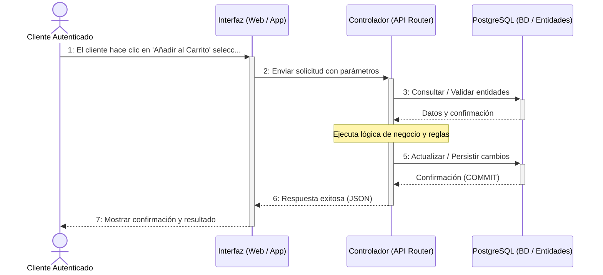

#### Desglose Paso a Paso (Nomenclatura Correlativa Formal):
- **`CU17[Paso 1: El cliente hace clic en 'Añadir al Carrito' seleccionando la talla y color deseado.]`**
- **`CU17[Paso 2: La interfaz envía la variante y cantidad solicitada (POST /api/v1/sales/cart/items).]`**
- **`CU17[Paso 3: El controlador valida que la suma de existencias físicas en todas las sucursales sea suficiente (stock_total > 0).]`**
- **`CU17[Paso 4: El sistema busca o crea el carrito activo del cliente (CE_Cart) e inserta o actualiza el CartItem.]`**
- **`CU17[Paso 5: El backend calcula el subtotal de cada ítem y el total consolidado del carrito.]`**
- **`CU17[Paso 6: Se retorna el objeto CartResponse actualizado en tiempo real.]`**
- **`CU17[Paso 7: La interfaz abre el modal lateral del carrito reflejando los productos, subtotales y el botón para proceder al checkout.]`**

---

### CU18: Procesar venta / checkout con herencia de medios de pago

- **Ciclo de Desarrollo:** Ciclo 2
- **Paquete de Arquitectura:** `paquete_ventas_y_pagos`
- **Actores involucrados:** Cliente
- **Actor Iniciador:** Cliente Autenticado
- **Propósito:** Concretar la compra digital procesando el pago en línea mediante pasarelas (PayPal REST v2 / Tarjeta / QR), descontando stock, emitiendo factura y generando la orden.
- **Precondición:** Carrito con al menos 1 producto y stock confirmado en la sucursal de despacho.
- **Postcondición:** Orden creada con estado PAGADA, descuento en inventario, comprobante de pago persistido y carrito vaciado.
- **Excepciones / Flujos Alternos:** E1: Pago rechazado por la pasarela. E2: Stock agotado durante el checkout.

#### Trazabilidad en Código Fuente:
- **Backend Router:** [`backend/app/packages/paquete_ventas_y_pagos/routers.py`](file:///backend/app/packages/paquete_ventas_y_pagos/routers.py)
- **Backend Servicio:** [`backend/app/packages/paquete_ventas_y_pagos/paypal_service.py`](file:///backend/app/packages/paquete_ventas_y_pagos/paypal_service.py)
- **Frontend Web Component:** [`frontend-web/src/app/packages/paquete_ventas_y_pagos/cart/cart-modal.component.ts`](file:///frontend-web/src/app/packages/paquete_ventas_y_pagos/cart/cart-modal.component.ts)
- **Mobile Flutter View:** [`mobile/lib/src/packages/paquete_ventas_y_pagos/cart_view.dart`](file:///mobile/lib/src/packages/paquete_ventas_y_pagos/cart_view.dart)

#### Diagrama de Secuencia (Mermaid):
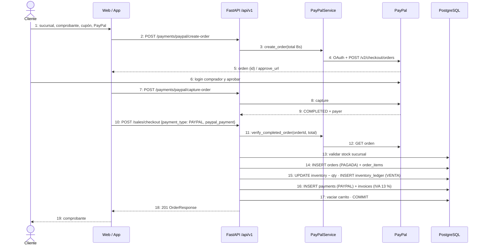

#### Desglose Paso a Paso (Nomenclatura Correlativa Formal):
- **`CU18[Paso 1: El cliente selecciona la sucursal de retiro o entrega a domicilio, aplica un cupón y elige el medio de pago (PayPal / Tarjeta / QR).]`**
- **`CU18[Paso 2: Para PayPal, el frontend solicita la orden de pago (POST /api/v1/payments/paypal/create-order) con conversión BOB a USD.]`**
- **`CU18[Paso 3: El backend crea la orden en PayPal y devuelve el ID y enlace de aprobación.]`**
- **`CU18[Paso 4: El cliente aprueba el pago en la pasarela y el frontend solicita la captura de los fondos (POST /api/v1/payments/paypal/capture-order).]`**
- **`CU18[Paso 5: El cliente confirma la orden final (POST /api/v1/sales/checkout) enviando la referencia de pago aprobada.]`**
- **`CU18[Paso 6: El backend inicia una transacción ACID: descuenta el stock en la sucursal, crea la Orden en estado PAGADA, registra el pago con herencia polimórfica (PaymentPayPal) y genera la Factura oficial con IVA 13 %.]`**
- **`CU18[Paso 7: Se vacía el carrito, se confirma la transacción con COMMIT y se retorna el comprobante digital al cliente.]`**

---

### CU19: Procesar venta presencial (directa) en caja (POS)

- **Ciclo de Desarrollo:** Ciclo 2
- **Paquete de Arquitectura:** `paquete_ventas_y_pagos`
- **Actores involucrados:** Cajero
- **Actor Iniciador:** Cajero Autenticado con Turno Abierto
- **Propósito:** Registrar ventas en el mostrador de la tienda física mediante escaneo de código de barras / SKU, cobro en efectivo, tarjeta o QR y emisión de ticket/factura en el acto.
- **Precondición:** Cajero con turno de caja abierto en estado ABIERTO para la sucursal actual.
- **Postcondición:** Venta registrada, stock descontado de la sucursal local, dinero sumado al turno de caja y factura emitida.
- **Excepciones / Flujos Alternos:** E1: Cajero no tiene turno abierto. E2: Stock insuficiente en la sucursal local.

#### Trazabilidad en Código Fuente:
- **Backend Router:** [`backend/app/packages/paquete_ventas_y_pagos/routers.py`](file:///backend/app/packages/paquete_ventas_y_pagos/routers.py)
- **Backend Servicio:** [`backend/app/packages/paquete_ventas_y_pagos/services.py`](file:///backend/app/packages/paquete_ventas_y_pagos/services.py)
- **Frontend Web Component:** [`frontend-web/src/app/packages/paquete_ventas_y_pagos/pos/pos-terminal.component.ts`](file:///frontend-web/src/app/packages/paquete_ventas_y_pagos/pos/pos-terminal.component.ts)

#### Diagrama de Secuencia (Mermaid):
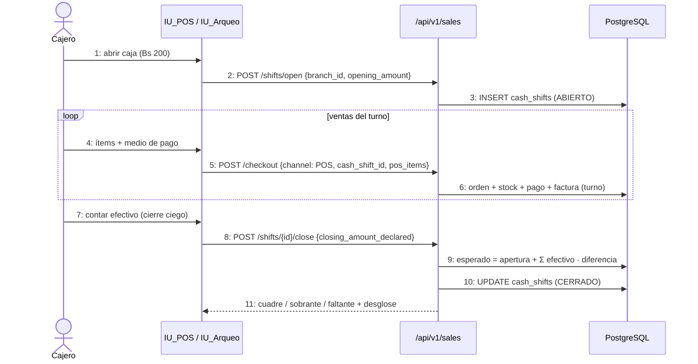

#### Desglose Paso a Paso (Nomenclatura Correlativa Formal):
- **`CU19[Paso 1: El cajero abre el terminal de Punto de Venta (POS) y escanea o busca las prendas que el cliente presenta en caja.]`**
- **`CU19[Paso 2: La interfaz lista los ítems, calcula subtotales y permite ingresar NIT/CI y Razón Social del cliente.]`**
- **`CU19[Paso 3: El cajero selecciona el medio de cobro (Efectivo con cálculo de cambio, Tarjeta o QR) y presiona 'Cobrar y Facturar'.]`**
- **`CU19[Paso 4: La interfaz envía la venta POS (POST /api/v1/sales/pos) adjuntando el cash_shift_id del turno activo.]`**
- **`CU19[Paso 5: El controlador valida que el turno esté ABIERTO, descuenta el stock físico de la sucursal e inserta el movimiento VENTA en el kardex.]`**
- **`CU19[Paso 6: Se registra la orden como COMPLETADA y se emite la factura con código de control y QR tributario.]`**
- **`CU19[Paso 7: El sistema imprime el comprobante de venta e incrementa el saldo esperado de la caja del cajero.]`**

---

### CU20: Emitir factura y nota de entrega (IVA 13 %, código de control)

- **Ciclo de Desarrollo:** Ciclo 2
- **Paquete de Arquitectura:** `paquete_ventas_y_pagos`
- **Actores involucrados:** Cajero, Sistema Automático
- **Actor Iniciador:** Sistema al concretar Venta (CU18 / CU19 / CU25)
- **Propósito:** Generar el documento tributario oficial con desglose del 13 % de IVA, código de control computarizado y formato imprimible en PDF o ticket térmico.
- **Precondición:** Orden de venta pagada exitosamente.
- **Postcondición:** Factura generada con número correlativo, código de control y estado EMITIDA.
- **Excepciones / Flujos Alternos:** E1: Factura ya emitida para la orden actual.

#### Trazabilidad en Código Fuente:
- **Backend Router:** [`backend/app/packages/paquete_ventas_y_pagos/routers.py`](file:///backend/app/packages/paquete_ventas_y_pagos/routers.py)
- **Backend Servicio:** [`backend/app/packages/paquete_ventas_y_pagos/services.py`](file:///backend/app/packages/paquete_ventas_y_pagos/services.py)
- **Frontend Web Component:** [`frontend-web/src/app/packages/paquete_ventas_y_pagos/invoices/invoice-viewer.component.ts`](file:///frontend-web/src/app/packages/paquete_ventas_y_pagos/invoices/invoice-viewer.component.ts)

#### Diagrama de Secuencia (Mermaid):


#### Desglose Paso a Paso (Nomenclatura Correlativa Formal):
- **`CU20[Paso 1: Tras registrarse el pago de una orden, el sistema invoca automáticamente la generación del comprobante.]`**
- **`CU20[Paso 2: El controlador consulta los datos de la orden, cliente, sucursal emisora y monto total.]`**
- **`CU20[Paso 3: Se genera el número de factura correlativo correspondiente a la dosificación de la sucursal.]`**
- **`CU20[Paso 4: Se calcula el débito fiscal IVA (13 % del monto total de la venta).]`**
- **`CU20[Paso 5: Se genera el código de control y la cadena QR para validación fiscal.]`**
- **`CU20[Paso 6: Se guarda el registro en la tabla invoices asociada a la orden.]`**
- **`CU20[Paso 7: La interfaz ofrece la descarga del PDF oficial y la vista para impresión en formato ticket de 80mm.]`**

---

### CU21: Generar y convertir cotización comercial

- **Ciclo de Desarrollo:** Ciclo 2
- **Paquete de Arquitectura:** `paquete_ventas_y_pagos`
- **Actores involucrados:** Encargado de Sucursal, Cliente
- **Actor Iniciador:** Personal Administrativo o Cliente
- **Propósito:** Crear presupuestos formales de prendas con validez de hasta 15 días, sin bloquear stock físico, con opción de conversión directa a venta en 1 clic.
- **Precondición:** Prendas activas en el catálogo.
- **Postcondición:** Cotización creada con código COT-XXXXXX y estado VIGENTE.
- **Excepciones / Flujos Alternos:** E1: Conversión de cotización expirada.

#### Trazabilidad en Código Fuente:
- **Backend Router:** [`backend/app/packages/paquete_ventas_y_pagos/routers.py`](file:///backend/app/packages/paquete_ventas_y_pagos/routers.py)
- **Backend Servicio:** [`backend/app/packages/paquete_ventas_y_pagos/services.py`](file:///backend/app/packages/paquete_ventas_y_pagos/services.py)
- **Frontend Web Component:** [`frontend-web/src/app/packages/paquete_ventas_y_pagos/quotations/quotation-modal.component.ts`](file:///frontend-web/src/app/packages/paquete_ventas_y_pagos/quotations/quotation-modal.component.ts)

#### Diagrama de Secuencia (Mermaid):
```mermaid
sequenceDiagram
    actor E as Encargado
    participant UI as IU_Cotizaciones
    participant API as /api/v1/sales
    participant DB as PostgreSQL

    E->>UI: 1: [Cobrar / Facturar] cotización
    UI->>API: 2: POST /quotations/{id}/convert
    API->>DB: 3: VIGENTE y valid_until ≥ hoy
    API->>DB: 4: validar stock
    API->>DB: 5: orden + stock + pago + factura
    API->>DB: 6: quotations.status = CONVERTIDA
    API-->>UI: 7: comprobante
```

#### Desglose Paso a Paso (Nomenclatura Correlativa Formal):
- **`CU21[Paso 1: El usuario selecciona una lista de prendas y presiona 'Generar Cotización'.]`**
- **`CU21[Paso 2: La interfaz envía la solicitud con fecha límite de validez (POST /api/v1/sales/quotations).]`**
- **`CU21[Paso 3: El backend crea el registro en la tabla quotations en estado 'VIGENTE' sin comprometer existencias físicas.]`**
- **`CU21[Paso 4: El cliente o encargado puede descargar el documento proforma en formato PDF.]`**
- **`CU21[Paso 5: Cuando el cliente decide comprar, el encargado pulsa 'Convertir a Venta' (POST /api/v1/sales/quotations/{id}/convert).]`**
- **`CU21[Paso 6: El controlador verifica la vigencia y stock disponible, crea la orden formal y cambia el estado de la cotización a 'CONVERTIDA'.]`**
- **`CU21[Paso 7: Se procede al cobro y facturación de la venta generada.]`**

---

### CU22: Gestionar devoluciones y cambios de prendas

- **Ciclo de Desarrollo:** Ciclo 2
- **Paquete de Arquitectura:** `paquete_ventas_y_pagos`
- **Actores involucrados:** Encargado de Sucursal
- **Actor Iniciador:** Cliente que presenta reclamo / Encargado
- **Propósito:** Procesar cambios de talla/color o devoluciones por falla de fábrica dentro del plazo máximo de 30 días posteriores a la compra, reponiendo o dando de baja la prenda según su estado.
- **Precondición:** Existencia de factura previa con menos de 30 días de antigüedad y prenda en condiciones aptas.
- **Postcondición:** Registro de la devolución (order_returns), ajuste de existencias en inventory_ledger y entrega de prenda de reemplazo o saldo a favor.
- **Excepciones / Flujos Alternos:** E1: Plazo de garantía de 30 días vencido. E2: Prenda no corresponde a la orden indicada.

#### Trazabilidad en Código Fuente:
- **Backend Router:** [`backend/app/packages/paquete_ventas_y_pagos/routers.py`](file:///backend/app/packages/paquete_ventas_y_pagos/routers.py)
- **Backend Servicio:** [`backend/app/packages/paquete_ventas_y_pagos/services.py`](file:///backend/app/packages/paquete_ventas_y_pagos/services.py)
- **Frontend Web Component:** [`frontend-web/src/app/packages/paquete_ventas_y_pagos/returns/returns-management.component.ts`](file:///frontend-web/src/app/packages/paquete_ventas_y_pagos/returns/returns-management.component.ts)

#### Diagrama de Secuencia (Mermaid):
```mermaid
sequenceDiagram
    actor E as Encargado
    participant UI as IU_Devoluciones
    participant API as /api/v1/sales
    participant DB as PostgreSQL

    E->>UI: 1: buscar orden
    UI->>API: 2: GET /orders/{id}
    UI-->>E: 3: días transcurridos + prendas compradas
    E->>UI: 4: prendas, tipo, motivo
    UI->>API: 5: POST /returns
    API->>DB: 6: validar plazo y pertenencia
    API->>DB: 7: INSERT order_returns (APROBADA) + items
    API->>DB: 8: stock + devuelto (− cambio) · ledger
    API-->>UI: 9: DEV-AAAA-XXXXXX
```

#### Desglose Paso a Paso (Nomenclatura Correlativa Formal):
- **`CU22[Paso 1: El cliente se presenta con la prenda y el comprobante de compra.]`**
- **`CU22[Paso 2: El encargado busca la orden en el sistema (GET /api/v1/sales/orders/{id}) y verifica que no hayan transcurrido más de 30 días.]`**
- **`CU22[Paso 3: El encargado selecciona la prenda devuelta, el motivo (cambio de talla o defecto) y la prenda de reemplazo solicitada.]`**
- **`CU22[Paso 4: La interfaz envía la solicitud de devolución (POST /api/v1/sales/returns).]`**
- **`CU22[Paso 5: El backend procesa la transacción: si la prenda devuelta está en buen estado, se reintegra al stock; si está defectuosa, se envía a merma.]`**
- **`CU22[Paso 6: Se descuenta del inventario la prenda entregada a cambio y se asienta el movimiento en el kardex.]`**
- **`CU22[Paso 7: Se emite la nota de cambio/devolución con código DEV-XXXXXX y se actualiza el estado de la orden.]`**

---

### CU23: Gestionar arqueo de caja (apertura y cierre ciego)

- **Ciclo de Desarrollo:** Ciclo 2
- **Paquete de Arquitectura:** `paquete_ventas_y_pagos`
- **Actores involucrados:** Cajero, Encargado
- **Actor Iniciador:** Cajero Autenticado
- **Propósito:** Controlar los flujos de dinero físico en cada turno mediante apertura con fondo de cambio y cierre ciego, calculando automáticamente faltantes o sobrantes.
- **Precondición:** El cajero no debe tener otro turno abierto en simultáneo en la misma sucursal.
- **Postcondición:** Turno de caja cerrado con reporte detallado de ventas en efectivo, tarjeta, QR y diferencias cuadradas.
- **Excepciones / Flujos Alternos:** E1: Intento de operar sin haber abierto turno de caja.

#### Trazabilidad en Código Fuente:
- **Backend Router:** [`backend/app/packages/paquete_ventas_y_pagos/routers.py`](file:///backend/app/packages/paquete_ventas_y_pagos/routers.py)
- **Backend Servicio:** [`backend/app/packages/paquete_ventas_y_pagos/services.py`](file:///backend/app/packages/paquete_ventas_y_pagos/services.py)
- **Frontend Web Component:** [`frontend-web/src/app/packages/paquete_ventas_y_pagos/cash-shifts/cash-shift.component.ts`](file:///frontend-web/src/app/packages/paquete_ventas_y_pagos/cash-shifts/cash-shift.component.ts)

#### Diagrama de Secuencia (Mermaid):
```mermaid
sequenceDiagram
    actor U as Cajero Autenticado
    participant IU as Interfaz (Web / App)
    participant CTR as Controlador (API Router)
    participant DB as PostgreSQL (BD / Entidades)
    U->>+IU: 1: Al iniciar su jornada, el cajero abre caja ingresa...
    IU->>+CTR: 2: Enviar solicitud con parámetros
    CTR->>+DB: 3: Consultar / Validar entidades
    DB-->>-CTR: Datos y confirmación
    Note over CTR: Ejecuta lógica de negocio y reglas
    CTR->>+DB: 5: Actualizar / Persistir cambios
    DB-->>-CTR: Confirmación (COMMIT)
    CTR-->>-IU: 6: Respuesta exitosa (JSON)
    IU-->>-U: 7: Mostrar confirmación y resultado
```

#### Desglose Paso a Paso (Nomenclatura Correlativa Formal):
- **`CU23[Paso 1: Al iniciar su jornada, el cajero abre caja ingresando el monto inicial de cambio en efectivo (POST /api/v1/sales/shifts/open).]`**
- **`CU23[Paso 2: El backend crea el turno con estado 'ABIERTO' en la tabla cash_shifts asociado al usuario y sucursal.]`**
- **`CU23[Paso 3: Durante el día, todas las ventas POS cobran asociadas al turno activo acumulando el total cobrado.]`**
- **`CU23[Paso 4: Al finalizar el día, el cajero realiza el cierre ciego: cuenta el dinero físico de la gaveta e introduce el monto sin ver el esperado del sistema.]`**
- **`CU23[Paso 5: La interfaz envía la declaración de cierre (POST /api/v1/sales/shifts/{id}/close).]`**
- **`CU23[Paso 6: El backend calcula: esperado = apertura + ventas_efectivo; calcula diferencia = declarado - esperado.]`**
- **`CU23[Paso 7: El turno cambia a 'CERRADO', se asienta la auditoría y se emite el acta de arqueo de caja con el cuadre final.]`**

---

### CU24: Consultar historial de compras

- **Ciclo de Desarrollo:** Ciclo 2
- **Paquete de Arquitectura:** `paquete_ventas_y_pagos`
- **Actores involucrados:** Cliente
- **Actor Iniciador:** Cliente Autenticado
- **Propósito:** Permitir al comprador revisar todas sus órdenes de compra pasadas, estados de entrega, facturas digitales y detalle de prendas adquiridas.
- **Precondición:** Cliente autenticado con sesión activa.
- **Postcondición:** La interfaz despliega la lista cronológica de pedidos con accesos directos a comprobantes y seguimiento.
- **Excepciones / Flujos Alternos:** Ninguna. Si no tiene compras se muestra una invitación a la tienda.

#### Trazabilidad en Código Fuente:
- **Backend Router:** [`backend/app/packages/paquete_ventas_y_pagos/routers.py`](file:///backend/app/packages/paquete_ventas_y_pagos/routers.py)
- **Backend Servicio:** [`backend/app/packages/paquete_ventas_y_pagos/services.py`](file:///backend/app/packages/paquete_ventas_y_pagos/services.py)
- **Frontend Web Component:** [`frontend-web/src/app/packages/paquete_ventas_y_pagos/orders/order-history.component.ts`](file:///frontend-web/src/app/packages/paquete_ventas_y_pagos/orders/order-history.component.ts)
- **Mobile Flutter View:** [`mobile/lib/src/packages/paquete_ventas_y_pagos/order_history_view.dart`](file:///mobile/lib/src/packages/paquete_ventas_y_pagos/order_history_view.dart)

#### Diagrama de Secuencia (Mermaid):
```mermaid
sequenceDiagram
    actor U as Cliente Autenticado
    participant IU as Interfaz (Web / App)
    participant CTR as Controlador (API Router)
    participant DB as PostgreSQL (BD / Entidades)
    U->>+IU: 1: El cliente entra a 'Mis Pedidos' desde su perfil e...
    IU->>+CTR: 2: Enviar solicitud con parámetros
    CTR->>+DB: 3: Consultar / Validar entidades
    DB-->>-CTR: Datos y confirmación
    Note over CTR: Ejecuta lógica de negocio y reglas
    CTR->>+DB: 5: Actualizar / Persistir cambios
    DB-->>-CTR: Confirmación (COMMIT)
    CTR-->>-IU: 6: Respuesta exitosa (JSON)
    IU-->>-U: 7: Mostrar confirmación y resultado
```

#### Desglose Paso a Paso (Nomenclatura Correlativa Formal):
- **`CU24[Paso 1: El cliente entra a 'Mis Pedidos' desde su perfil en la web o app móvil.]`**
- **`CU24[Paso 2: La aplicación solicita el historial de compras del usuario autenticado (GET /api/v1/sales/orders/my).]`**
- **`CU24[Paso 3: El backend consulta CE_Order filtrando por el user_id del token y carga sus items y comprobantes.]`**
- **`CU24[Paso 4: El sistema retorna la lista de pedidos ordenada por fecha descendente.]`**
- **`CU24[Paso 5: La interfaz renderiza cada pedido con su número de orden, fecha, monto total, estado (PAGADA, EN_CAMINO, ENTREGADA) y sucursal.]`**
- **`CU24[Paso 6: El cliente puede presionar sobre un pedido para ver el desglose o descargar su factura tributaria en PDF.]`**
- **`CU24[Paso 7: El cliente puede activar el rastreo en vivo si el pedido cuenta con despacho a domicilio.]`**

---

### CU25: Convertir una reserva en venta confirmada

- **Ciclo de Desarrollo:** Ciclo 3
- **Paquete de Arquitectura:** `paquete_reservas_y_citas`
- **Actores involucrados:** Cajero, Encargado
- **Actor Iniciador:** Personal de Tienda al presentarse el Cliente
- **Propósito:** Atender la cita del cliente en tienda física tras probarse las prendas reservadas, descontando la seña abonada previamente (50%) y cobrando el saldo restante en caja.
- **Precondición:** Reserva en estado PENDING, PREPARING o READY con seña pagada.
- **Postcondición:** Las prendas probadas y aceptadas se facturan como venta, las no adquiridas se liberan al inventario y la reserva queda COMPLETADA.
- **Excepciones / Flujos Alternos:** E1: Reserva cancelada o vencida por inasistencia (no-show).

#### Trazabilidad en Código Fuente:
- **Backend Router:** [`backend/app/packages/paquete_reservas_y_citas/routers.py`](file:///backend/app/packages/paquete_reservas_y_citas/routers.py)
- **Backend Servicio:** [`backend/app/packages/paquete_reservas_y_citas/services.py`](file:///backend/app/packages/paquete_reservas_y_citas/services.py)
- **Frontend Web Component:** [`frontend-web/src/app/packages/paquete_reservas_y_citas/reservation-desk/reservation-desk.component.ts`](file:///frontend-web/src/app/packages/paquete_reservas_y_citas/reservation-desk/reservation-desk.component.ts)

#### Diagrama de Secuencia (Mermaid):
```mermaid
sequenceDiagram
    actor Cj as Cajero
    participant POS as IU_POS (pestaña Reservas)
    participant API as /reservations/{id}/convert-to-pos
    participant DB as PostgreSQL

    Cj->>POS: 1: elegir reserva y prendas que compra
    POS->>API: 2: convert-to-pos(cash_shift_id, medio, monto, NIT, selected_item_ids)
    API->>DB: 3: validar turno ABIERTO del cajero en esa sucursal
    API->>DB: 4: reponer al stock las prendas no compradas
    API->>DB: 5: INSERT orders (POS) + payments (saldo) + invoices (IVA 13 %)
    API->>DB: 6: reservation.status = COMPLETED, completed_sale_id
    API-->>POS: 7: reserva completada + factura
```

#### Desglose Paso a Paso (Nomenclatura Correlativa Formal):
- **`CU25[Paso 1: El cliente acude a la sucursal a su cita de probador y el cajero busca su código de reserva (ej: RES-00123).]`**
- **`CU25[Paso 2: La interfaz muestra las prendas apartadas y permite marcar cuáles decide llevarse el cliente.]`**
- **`CU25[Paso 3: El sistema reconoce automáticamente el anticipo del 50% ya pagado como seña y calcula el saldo a pagar en caja.]`**
- **`CU25[Paso 4: El cajero cobra el saldo en efectivo, tarjeta o QR y presiona 'Concretar Venta' (POST /api/v1/reservations/{id}/convert-to-sale).]`**
- **`CU25[Paso 5: El backend ejecuta la transacción: genera la venta final POS, emite la factura por el total aplicando la seña como pago inicial.]`**
- **`CU25[Paso 6: Las prendas que el cliente no quiso comprar son devueltas inmediatamente al inventario disponible de la sucursal.]`**
- **`CU25[Paso 7: La reserva se marca como 'COMPLETED' y se entrega la bolsa de compra y factura al cliente.]`**

---

### CU26: Agendar reserva de prendas para prueba física

- **Ciclo de Desarrollo:** Ciclo 3
- **Paquete de Arquitectura:** `paquete_reservas_y_citas`
- **Actores involucrados:** Cliente
- **Actor Iniciador:** Cliente Autenticado
- **Propósito:** Apartar hasta 5 prendas del catálogo digital para probárselas en una sucursal física en fecha y hora fija, abonando una seña del 50% para retención de stock.
- **Precondición:** Cliente autenticado, prendas con disponibilidad en la sucursal elegida y horario hábil.
- **Postcondición:** Reserva creada con código RES-XXXXXX, stock bloqueado por 48 horas y comprobante de seña generado.
- **Excepciones / Flujos Alternos:** E1: Superar el límite de 5 prendas. E2: Pago de seña no autorizado.

#### Trazabilidad en Código Fuente:
- **Backend Router:** [`backend/app/packages/paquete_reservas_y_citas/routers.py`](file:///backend/app/packages/paquete_reservas_y_citas/routers.py)
- **Backend Servicio:** [`backend/app/packages/paquete_reservas_y_citas/services.py`](file:///backend/app/packages/paquete_reservas_y_citas/services.py)
- **Frontend Web Component:** [`frontend-web/src/app/packages/paquete_reservas_y_citas/customer-reservations/customer-reservations.component.ts`](file:///frontend-web/src/app/packages/paquete_reservas_y_citas/customer-reservations/customer-reservations.component.ts)
- **Mobile Flutter View:** [`mobile/lib/src/packages/paquete_reservas_y_citas/reserve_fitting_view.dart`](file:///mobile/lib/src/packages/paquete_reservas_y_citas/reserve_fitting_view.dart)

#### Diagrama de Secuencia (Mermaid):
```mermaid
sequenceDiagram
    actor C as Cliente
    participant IU as IU_ReservarProbador
    participant API as /api/v1 (FastAPI)
    participant PPS as PayPalService
    participant PP as PayPal REST v2
    participant DB as PostgreSQL

    C->>IU: 1: elegir color + talla
    IU->>API: 2: GET /catalog/products/{id}/branch-availability
    API-->>IU: 3: stock por sucursal
    C->>IU: 4: sucursal, fecha, hora, PayPal
    IU->>API: 5: POST /payments/paypal/create-order (seña Bs)
    API->>PPS: 6: create_order (Bs → USD, T.C. 6,96)
    PPS->>PP: 7: POST /v2/checkout/orders
    PP-->>IU: 8: approve_url
    C->>PP: 9: inicia sesión y aprueba (ventana PayPal)
    PP-->>IU: 10: redirección a .../checkout/success
    IU->>API: 11: POST /payments/paypal/capture-order
    API->>PP: 12: POST /v2/checkout/orders/{id}/capture
    PP-->>API: 13: COMPLETED
    IU->>API: 14: POST /reservations (payment_reference = PAYPAL:{orderId})
    API->>PPS: 15: verify_completed_order(orderId, seña)
    PPS->>PP: 16: GET /v2/checkout/orders/{id}
    PP-->>PPS: 17: COMPLETED, monto ≥ seña
    API->>DB: 18: stock -= qty · ledger RESERVA · INSERT reservations (PENDING)
    API-->>IU: 19: RES-XXXXXX
    IU-->>C: 20: confirmación y "Mis reservas"
```

#### Desglose Paso a Paso (Nomenclatura Correlativa Formal):
- **`CU26[Paso 1: El cliente agrega hasta 5 prendas a su bolsa de probador, selecciona la sucursal, fecha y hora de la cita.]`**
- **`CU26[Paso 2: El sistema calcula el 50% de seña sobre el valor total de las prendas.]`**
- **`CU26[Paso 3: El cliente paga la seña en línea mediante PayPal o tarjeta.]`**
- **`CU26[Paso 4: La interfaz envía la solicitud de confirmación de reserva (POST /api/v1/reservations).]`**
- **`CU26[Paso 5: El controlador bloquea las unidades de las prendas seleccionadas en la sucursal (stock_bloqueado_reserva).]`**
- **`CU26[Paso 6: Se guarda la reserva en estado 'PENDING' asociada a la cita de probador y al comprobante de la seña pagada.]`**
- **`CU26[Paso 7: El cliente recibe su comprobante digital con el código de reserva y las instrucciones para presentarse en tienda.]`**

---

### CU27: Gestionar la bandeja de reservas entrantes (Kanban)

- **Ciclo de Desarrollo:** Ciclo 3
- **Paquete de Arquitectura:** `paquete_reservas_y_citas`
- **Actores involucrados:** Encargado de Sucursal
- **Actor Iniciador:** Encargado de Sucursal Autenticado
- **Propósito:** Monitorear y gestionar las citas del día mediante un tablero visual Kanban (Pendiente, En Preparación, Lista en Probador, Finalizada), aplicando tolerancia de 15 min.
- **Precondición:** Encargado con sesión activa en su sucursal asignada.
- **Postcondición:** Las prendas son apartadas físicamente en el perchero del probador y el estado de la reserva se actualiza.
- **Excepciones / Flujos Alternos:** E1: Cliente no asiste tras superar los 30 minutos de tolerancia (No-Show).

#### Trazabilidad en Código Fuente:
- **Backend Router:** [`backend/app/packages/paquete_reservas_y_citas/routers.py`](file:///backend/app/packages/paquete_reservas_y_citas/routers.py)
- **Backend Servicio:** [`backend/app/packages/paquete_reservas_y_citas/services.py`](file:///backend/app/packages/paquete_reservas_y_citas/services.py)
- **Frontend Web Component:** [`frontend-web/src/app/packages/paquete_reservas_y_citas/admin-reservations/admin-reservations.component.ts`](file:///frontend-web/src/app/packages/paquete_reservas_y_citas/admin-reservations/admin-reservations.component.ts)

#### Diagrama de Secuencia (Mermaid):
```mermaid
sequenceDiagram
    actor E as Encargado
    participant IU as IU_KanbanReservas
    participant API as /reservations
    participant DB as PostgreSQL

    E->>IU: 1: abrir bandeja
    IU->>API: 2: GET /reservations (solo su sucursal)
    API->>DB: 3: leer reservas
    Note over API,DB: por cada reserva PENDING/PREPARING/READY:<br/>+15 min de la cita → LATE · +30 min → NO_SHOW y stock repuesto
    API-->>IU: 4: reservas con estado actualizado
    E->>IU: 5: mover tarjeta a PREPARING / READY
    IU->>API: 6: PATCH /reservations/{id}/status
    API->>DB: 7: UPDATE status (libera stock si CANCELLED/EXPIRED/NO_SHOW)
```

#### Desglose Paso a Paso (Nomenclatura Correlativa Formal):
- **`CU27[Paso 1: El encargado abre la bandeja de reservas de su tienda (GET /api/v1/reservations/branch).]`**
- **`CU27[Paso 2: El tablero Kanban organiza las citas según su hora programada.]`**
- **`CU27[Paso 3: El empleado toma la tarjeta de una reserva y la mueve a 'EN PREPARACIÓN' mientras busca las prendas en la tienda.]`**
- **`CU27[Paso 4: Una vez colocadas en el perchero del vestidor, mueve la tarjeta a 'LISTA EN PROBADOR' (PATCH /api/v1/reservations/{id}/status).]`**
- **`CU27[Paso 5: El sistema envía una notificación al cliente avisando que su probador exclusivo está listo.]`**
- **`CU27[Paso 6: Si el cliente se retrasa más de 15 minutos, el sistema tiñe la tarjeta en amarillo con badge 'DEMORADO'.]`**
- **`CU27[Paso 7: Si supera 30 minutos de retraso, se ofrece marcar 'No-Show' para liberar las prendas al público.]`**

---

### CU28: Cancelar reserva de prendas y liberar stock

- **Ciclo de Desarrollo:** Ciclo 3
- **Paquete de Arquitectura:** `paquete_reservas_y_citas`
- **Actores involucrados:** Cliente, Encargado
- **Actor Iniciador:** Cliente antes de la cita o Encargado por inasistencia
- **Propósito:** Anular una cita de probador no concretada, liberando inmediatamente las prendas retenidas para que vuelvan a estar disponibles para venta.
- **Precondición:** Reserva en estado PENDING, PREPARING o LATE.
- **Postcondición:** Estado actualizado a CANCELLED o NO_SHOW y existencias desbloqueadas en el inventario.
- **Excepciones / Flujos Alternos:** E1: Intento de cancelar una reserva ya completada o facturada.

#### Trazabilidad en Código Fuente:
- **Backend Router:** [`backend/app/packages/paquete_reservas_y_citas/routers.py`](file:///backend/app/packages/paquete_reservas_y_citas/routers.py)
- **Backend Servicio:** [`backend/app/packages/paquete_reservas_y_citas/services.py`](file:///backend/app/packages/paquete_reservas_y_citas/services.py)
- **Frontend Web Component:** [`frontend-web/src/app/packages/paquete_reservas_y_citas/customer-reservations/customer-reservations.component.ts`](file:///frontend-web/src/app/packages/paquete_reservas_y_citas/customer-reservations/customer-reservations.component.ts)
- **Mobile Flutter View:** [`mobile/lib/src/packages/paquete_reservas_y_citas/reserve_fitting_view.dart`](file:///mobile/lib/src/packages/paquete_reservas_y_citas/reserve_fitting_view.dart)

#### Diagrama de Secuencia (Mermaid):
```mermaid
sequenceDiagram
    actor U as Cliente antes de la cita o Encargado por inasistencia
    participant IU as Interfaz (Web / App)
    participant CTR as Controlador (API Router)
    participant DB as PostgreSQL (BD / Entidades)
    U->>+IU: 1: El cliente o el encargado pulsa la opción 'Cancela...
    IU->>+CTR: 2: Enviar solicitud con parámetros
    CTR->>+DB: 3: Consultar / Validar entidades
    DB-->>-CTR: Datos y confirmación
    Note over CTR: Ejecuta lógica de negocio y reglas
    CTR->>+DB: 5: Actualizar / Persistir cambios
    DB-->>-CTR: Confirmación (COMMIT)
    CTR-->>-IU: 6: Respuesta exitosa (JSON)
    IU-->>-U: 7: Mostrar confirmación y resultado
```

#### Desglose Paso a Paso (Nomenclatura Correlativa Formal):
- **`CU28[Paso 1: El cliente o el encargado pulsa la opción 'Cancelar Reserva' indicando el motivo.]`**
- **`CU28[Paso 2: La interfaz envía la solicitud de cancelación (POST /api/v1/reservations/{id}/cancel).]`**
- **`CU28[Paso 3: El backend verifica que la reserva no esté ya concluida ni convertida en venta.]`**
- **`CU28[Paso 4: El controlador revierte el bloqueo de stock en la tabla inventory para cada SKU involucrado.]`**
- **`CU28[Paso 5: Se asienta la liberación de inventario en el kardex de la sucursal.]`**
- **`CU28[Paso 6: El estado de la reserva se actualiza a 'CANCELLED'.]`**
- **`CU28[Paso 7: Se notifica al cliente la cancelación y las prendas vuelven a estar visibles en la tienda.]`**

---

### CU29: Gestionar envíos a domicilio y portal del repartidor

- **Ciclo de Desarrollo:** Ciclo 3
- **Paquete de Arquitectura:** `paquete_envios_y_logistica`
- **Actores involucrados:** Repartidor, Encargado
- **Actor Iniciador:** Repartidor Autenticado en App Móvil / Web
- **Propósito:** Permitir a los repartidores consultar pedidos listos para despacho, tomar rutas, actualizar el estado del trayecto y registrar la entrega con fotografía de respaldo.
- **Precondición:** Pedido pagado con modalidad DELIVERY y repartidor con estado DISPONIBLE.
- **Postcondición:** Envío actualizado a ENTREGADO con foto de evidencia, hora exacta y receptor asentado.
- **Excepciones / Flujos Alternos:** E1: Entrega fallida por dirección errónea o cliente ausente.

#### Trazabilidad en Código Fuente:
- **Backend Router:** [`backend/app/packages/paquete_envios_y_logistica/routers.py`](file:///backend/app/packages/paquete_envios_y_logistica/routers.py)
- **Backend Servicio:** [`backend/app/packages/paquete_envios_y_logistica/services.py`](file:///backend/app/packages/paquete_envios_y_logistica/services.py)
- **Frontend Web Component:** [`frontend-web/src/app/packages/paquete_envios_y_logistica/delivery-dashboard/delivery-dashboard.component.ts`](file:///frontend-web/src/app/packages/paquete_envios_y_logistica/delivery-dashboard/delivery-dashboard.component.ts)
- **Mobile Flutter View:** [`mobile/lib/src/packages/paquete_envios_y_logistica/delivery_dashboard_view.dart`](file:///mobile/lib/src/packages/paquete_envios_y_logistica/delivery_dashboard_view.dart)

#### Diagrama de Secuencia (Mermaid):
```mermaid
sequenceDiagram
    actor R as Repartidor
    participant APP as DeliveryDashboardView
    participant API as /logistics
    participant DB as PostgreSQL

    R->>APP: 1: login → panel de entregas (enrutado por rol)
    APP->>API: 2: GET delivery-persons/my · shipments/available · my-active · my-history
    R->>APP: 3: interruptor "Disponible"
    APP->>API: 4: PATCH delivery-persons/availability?is_available=true
    R->>APP: 5: Tomar pedido
    APP->>API: 6: POST shipments/{id}/claim
    API->>DB: 7: ASSIGNED, claimed_at, evento
    loop ruta
        R->>APP: 8: Recoger / En camino / Llegué
        APP->>API: 9: PATCH shipments/{id}/route-status
    end
    R->>APP: 10: Entregar (cámara) + quién recibió
    APP->>API: 11: POST shipments/{id}/confirm-delivery {photo_data_url, received_by_name}
    API->>DB: 12: DELIVERED, delivered_at, foto, total_deliveries+1
    APP->>API: 13: GET shipments/my-history (tiempos y evidencia)
```

#### Desglose Paso a Paso (Nomenclatura Correlativa Formal):
- **`CU29[Paso 1: El repartidor inicia sesión en la app móvil y activa el interruptor 'Disponible para Entregas'.]`**
- **`CU29[Paso 2: La app consulta los paquetes asignados o disponibles para despacho (GET /api/v1/logistics/shipments/available).]`**
- **`CU29[Paso 3: El repartidor reclama un envío (POST /api/v1/logistics/shipments/{id}/claim) y el estado pasa a 'ASIGNADO'.]`**
- **`CU29[Paso 4: Al salir de la tienda, actualiza el estado a 'EN_CAMINO' habilitando el rastreo para el cliente.]`**
- **`CU29[Paso 5: Al llegar a destino, pulsa 'Entregar', toma una fotografía del paquete recibido con la cámara y anota el nombre de quien recibe.]`**
- **`CU29[Paso 6: La app envía la confirmación con la foto y firma (POST /api/v1/logistics/shipments/{id}/confirm-delivery).]`**
- **`CU29[Paso 7: El backend marca el envío y la orden como 'DELIVERED', registra la evidencia y notifica al cliente.]`**

---

### CU30: Rastrear el estado de un envío en tiempo real

- **Ciclo de Desarrollo:** Ciclo 3
- **Paquete de Arquitectura:** `paquete_envios_y_logistica`
- **Actores involucrados:** Cliente
- **Actor Iniciador:** Cliente Autenticado
- **Propósito:** Brindar trazabilidad transparente del ciclo de vida del pedido (Preparando, Asignado, En Camino, Entregado) con mapa y tiempos estimados.
- **Precondición:** Pedido generado con despacho a domicilio.
- **Postcondición:** Línea de tiempo detallada con hitos de entrega y comprobante fotográfico.
- **Excepciones / Flujos Alternos:** Ninguna. Visualización de estado en tiempo real.

#### Trazabilidad en Código Fuente:
- **Backend Router:** [`backend/app/packages/paquete_envios_y_logistica/routers.py`](file:///backend/app/packages/paquete_envios_y_logistica/routers.py)
- **Backend Servicio:** [`backend/app/packages/paquete_envios_y_logistica/services.py`](file:///backend/app/packages/paquete_envios_y_logistica/services.py)
- **Frontend Web Component:** [`frontend-web/src/app/packages/paquete_envios_y_logistica/tracking/tracking-view.component.ts`](file:///frontend-web/src/app/packages/paquete_envios_y_logistica/tracking/tracking-view.component.ts)
- **Mobile Flutter View:** [`mobile/lib/src/packages/paquete_envios_y_logistica/tracking_view.dart`](file:///mobile/lib/src/packages/paquete_envios_y_logistica/tracking_view.dart)

#### Diagrama de Secuencia (Mermaid):
```mermaid
sequenceDiagram
    actor U as Cliente Autenticado
    participant IU as Interfaz (Web / App)
    participant CTR as Controlador (API Router)
    participant DB as PostgreSQL (BD / Entidades)
    U->>+IU: 1: El cliente abre el detalle de su pedido y presiona...
    IU->>+CTR: 2: Enviar solicitud con parámetros
    CTR->>+DB: 3: Consultar / Validar entidades
    DB-->>-CTR: Datos y confirmación
    Note over CTR: Ejecuta lógica de negocio y reglas
    CTR->>+DB: 5: Actualizar / Persistir cambios
    DB-->>-CTR: Confirmación (COMMIT)
    CTR-->>-IU: 6: Respuesta exitosa (JSON)
    IU-->>-U: 7: Mostrar confirmación y resultado
```

#### Desglose Paso a Paso (Nomenclatura Correlativa Formal):
- **`CU30[Paso 1: El cliente abre el detalle de su pedido y presiona 'Rastrear Envío'.]`**
- **`CU30[Paso 2: La app solicita el estado y la línea de tiempo del despacho (GET /api/v1/logistics/shipments/{id}/tracking).]`**
- **`CU30[Paso 3: El backend consulta la tabla shipments y sus eventos históricos en shipment_tracking_events.]`**
- **`CU30[Paso 4: El sistema retorna el estado actual, datos del repartidor asignado y coordenadas de la sucursal de origen.]`**
- **`CU30[Paso 5: La interfaz dibuja la línea de tiempo interactiva (Preparando -> Despachado -> En camino -> Entregado).]`**
- **`CU30[Paso 6: Si el pedido ya fue entregado, la interfaz muestra la fotografía de evidencia de entrega registrada por el repartidor.]`**
- **`CU30[Paso 7: El cliente puede contactar al repartidor o confirmar su satisfacción.]`**

---

### CU31: Gestionar zonas de cobertura y tarifas de envío (anillos / km)

- **Ciclo de Desarrollo:** Ciclo 3
- **Paquete de Arquitectura:** `paquete_envios_y_logistica`
- **Actores involucrados:** Superadministrador
- **Actor Iniciador:** Superadministrador Autenticado
- **Propósito:** Configurar las zonas geográficas de cobertura de delivery (1° al 8° anillo o radio por kilómetros), costos de envío y tiempo estimado de entrega.
- **Precondición:** Usuario con privilegios de Superadministrador.
- **Postcondición:** Zonas y costos actualizados para cálculo automático en el checkout digital.
- **Excepciones / Flujos Alternos:** E1: Rango de distancia o costo negativo.

#### Trazabilidad en Código Fuente:
- **Backend Router:** [`backend/app/packages/paquete_envios_y_logistica/routers.py`](file:///backend/app/packages/paquete_envios_y_logistica/routers.py)
- **Backend Servicio:** [`backend/app/packages/paquete_envios_y_logistica/services.py`](file:///backend/app/packages/paquete_envios_y_logistica/services.py)
- **Frontend Web Component:** [`frontend-web/src/app/packages/paquete_envios_y_logistica/zones/zone-management.component.ts`](file:///frontend-web/src/app/packages/paquete_envios_y_logistica/zones/zone-management.component.ts)

#### Diagrama de Secuencia (Mermaid):
```mermaid
sequenceDiagram
    actor U as Superadministrador Autenticado
    participant IU as Interfaz (Web / App)
    participant CTR as Controlador (API Router)
    participant DB as PostgreSQL (BD / Entidades)
    U->>+IU: 1: El Superadmin entra al módulo de 'Zonas de Envío y...
    IU->>+CTR: 2: Enviar solicitud con parámetros
    CTR->>+DB: 3: Consultar / Validar entidades
    DB-->>-CTR: Datos y confirmación
    Note over CTR: Ejecuta lógica de negocio y reglas
    CTR->>+DB: 5: Actualizar / Persistir cambios
    DB-->>-CTR: Confirmación (COMMIT)
    CTR-->>-IU: 6: Respuesta exitosa (JSON)
    IU-->>-U: 7: Mostrar confirmación y resultado
```

#### Desglose Paso a Paso (Nomenclatura Correlativa Formal):
- **`CU31[Paso 1: El Superadmin entra al módulo de 'Zonas de Envío y Tarifas'.]`**
- **`CU31[Paso 2: La interfaz solicita la lista de zonas configuradas (GET /api/v1/logistics/zones).]`**
- **`CU31[Paso 3: El Superadmin define una zona (ej: 'Zona Central - 1° al 4° Anillo', costo: 15 Bs, tiempo: 45 min).]`**
- **`CU31[Paso 4: La interfaz envía la configuración al servidor (POST /api/v1/logistics/zones).]`**
- **`CU31[Paso 5: El controlador valida los parámetros y persiste el registro en la tabla delivery_zones.]`**
- **`CU31[Paso 6: Al hacer un pedido digital, el cliente elige su zona y el sistema suma automáticamente la tarifa correspondiente al total.]`**
- **`CU31[Paso 7: Se registra la actualización en la bitácora de auditoría.]`**

---

### CU32: Probador (vestidor) virtual IA y recomendación de talla (RA / VTON)

- **Ciclo de Desarrollo:** Ciclo 3
- **Paquete de Arquitectura:** `paquete_inteligente_y_analitica`
- **Actores involucrados:** Cliente
- **Actor Iniciador:** Cliente en App Móvil o Web
- **Propósito:** Permitir al usuario probarse virtualmente prendas del catálogo sobre su propia fotografía o en cámara en vivo, ajustando la prenda al cuerpo mediante modelos de Inteligencia Artificial (IDM-VTON / MediaPipe) y sugiriendo la talla ideal según medidas.
- **Precondición:** Prenda con imagen de alta definición y fotografía del usuario o cámara frontal activa.
- **Postcondición:** Visualización fotorrealista de la prenda colocada sobre el cuerpo y opción de añadir la talla recomendada al carrito o reservarla.
- **Excepciones / Flujos Alternos:** E1: Fotografía no contiene una persona detectable. E2: Servicio de inferencia no responde (fallback a motor local).

#### Trazabilidad en Código Fuente:
- **Backend Router:** [`backend/app/packages/paquete_inteligente_y_analitica/virtual_tryon/routers.py`](file:///backend/app/packages/paquete_inteligente_y_analitica/virtual_tryon/routers.py)
- **Backend Servicio:** [`backend/app/packages/paquete_inteligente_y_analitica/virtual_tryon/services.py`](file:///backend/app/packages/paquete_inteligente_y_analitica/virtual_tryon/services.py)
- **Frontend Web Component:** [`frontend-web/src/app/packages/paquete_inteligente_y_analitica/virtual-tryon/virtual-tryon.component.ts`](file:///frontend-web/src/app/packages/paquete_inteligente_y_analitica/virtual-tryon/virtual-tryon.component.ts)
- **Mobile Flutter View:** [`mobile/lib/src/packages/paquete_inteligente_y_analitica/virtual_tryon_view.dart`](file:///mobile/lib/src/packages/paquete_inteligente_y_analitica/virtual_tryon_view.dart)

#### Diagrama de Secuencia (Mermaid):
```mermaid
sequenceDiagram
    autonumber
    actor C as Cliente
    participant UI as IU_Vestidor Web/Movil
    participant ENG as LiveGarmentEngine
    participant API as FastAPI /analytics/tryon
    participant SVC as VirtualTryonAIService
    participant EXT as FASHN.ai / HuggingFace
    participant DB as PostgreSQL
    participant SALES as Carrito / Reservas

    C->>UI: Abrir vestidor desde catalogo o menu
    UI->>API: POST /sessions {channel}
    API->>DB: INSERT virtual_tryon_sessions
    DB-->>API: session_token
    API-->>UI: token de sesion

    C->>UI: Seleccionar prenda y variante
    UI->>API: GET /garment-rig/{product_id}
    API->>SVC: build_garment_rig(product_image)
    SVC-->>API: rig geometrico + silueta recortada
    API-->>UI: rig para render local

    alt Espejo RA en vivo
        C->>UI: Autorizar camara
        UI->>ENG: iniciar pose landmarker + filtro One Euro
        loop cada frame
            ENG->>ENG: detectar landmarks, escalar prenda y ocluir brazos
            ENG-->>UI: canvas con prenda ajustada
        end
    else Captura fotorrealista
        C->>UI: Subir foto y solicitar generar look
        UI->>API: POST /generate-vton {session_token, photo, garment}
        API->>SVC: generate_tryon()
        alt FASHN_API_KEY disponible
            SVC->>EXT: tryon cloud
        else HUGGINGFACE_API_TOKEN disponible
            SVC->>EXT: IDM-VTON
        else fallback local
            SVC->>SVC: rembg + MediaPipe + amoldado anatomico
        end
        SVC-->>API: imagen resultado + confidence + model
        API->>DB: INSERT virtual_tryon_captures
        API-->>UI: resultado fotorrealista
    end

    C->>UI: Ingresar medidas corporales
    UI->>API: POST /simulate {height, weight, chest, waist, hips}
    API->>SVC: calcular talla y fit
    SVC-->>API: recommended_size + fit_feedback
    API->>DB: INSERT virtual_tryon_items
    API-->>UI: talla recomendada y feedback

    alt Comprar ahora
        UI->>SALES: agregar al carrito con talla recomendada (CU17)
    else Reservar prueba fisica
        UI->>SALES: crear reserva con prenda/talla sugerida (CU26)
    end
```

#### Desglose Paso a Paso (Nomenclatura Correlativa Formal):
- **`CU32[Paso 1: El cliente abre el probador virtual desde la ficha de una prenda o el menú principal.]`**
- **`CU32[Paso 2: Sube una foto de cuerpo entero o activa la cámara y opcionalmente introduce sus medidas (estatura, pecho, cintura).]`**
- **`CU32[Paso 3: La interfaz envía la imagen y la prenda al servicio de IA (POST /api/v1/analytics/tryon/simulate).]`**
- **`CU32[Paso 4: El motor de segmentación (rembg / MediaPipe Pose) extrae la silueta y puntos anatómicos del cuerpo.]`**
- **`CU32[Paso 5: El algoritmo de recomendación de talla calcula la talla óptima (S, M, L, XL) según las proporciones del cliente.]`**
- **`CU32[Paso 6: El modelo de transferencia de ropa (IDM-VTON o motor de deformación geométrica) amolda la prenda respetando pliegues y postura.]`**
- **`CU32[Paso 7: La interfaz despliega el resultado fotorrealista con la talla recomendada y botones de 'Añadir al Carrito' o 'Reservar para Probar en Tienda'.]`**

---

### CU33: Asistente IA (chatbot) de recomendaciones

- **Ciclo de Desarrollo:** Ciclo 3
- **Paquete de Arquitectura:** `paquete_inteligente_y_analitica`
- **Actores involucrados:** Cliente, Visitante
- **Actor Iniciador:** Usuario en Tienda Web o App
- **Propósito:** Ofrecer un asesor de moda virtual inteligente 24/7 que responde preguntas en lenguaje natural, recomienda combinaciones de ropa, estilos y encuentra productos según ocasión.
- **Precondición:** Catálogo activo disponible para consulta semántica.
- **Postcondición:** Respuestas contextuales con tarjetas interactivas de prendas recomendadas listas para comprar o probarse.
- **Excepciones / Flujos Alternos:** E1: Consulta fuera del ámbito de moda o tienda.

#### Trazabilidad en Código Fuente:
- **Backend Router:** [`backend/app/packages/paquete_inteligente_y_analitica/recommendations/routers.py`](file:///backend/app/packages/paquete_inteligente_y_analitica/recommendations/routers.py)
- **Backend Servicio:** [`backend/app/packages/paquete_inteligente_y_analitica/recommendations/services.py`](file:///backend/app/packages/paquete_inteligente_y_analitica/recommendations/services.py)
- **Frontend Web Component:** [`frontend-web/src/app/packages/paquete_inteligente_y_analitica/chatbot-widget/chatbot-widget.component.ts`](file:///frontend-web/src/app/packages/paquete_inteligente_y_analitica/chatbot-widget/chatbot-widget.component.ts)
- **Mobile Flutter View:** [`mobile/lib/src/packages/paquete_inteligente_y_analitica/chatbot_view.dart`](file:///mobile/lib/src/packages/paquete_inteligente_y_analitica/chatbot_view.dart)

#### Diagrama de Secuencia (Mermaid):
```mermaid
sequenceDiagram
    actor U as Usuario en Tienda Web o App
    participant IU as Interfaz (Web / App)
    participant CTR as Controlador (API Router)
    participant DB as PostgreSQL (BD / Entidades)
    U->>+IU: 1: El usuario abre el widget de chat 'FashionBot' en ...
    IU->>+CTR: 2: Enviar solicitud con parámetros
    CTR->>+DB: 3: Consultar / Validar entidades
    DB-->>-CTR: Datos y confirmación
    Note over CTR: Ejecuta lógica de negocio y reglas
    CTR->>+DB: 5: Actualizar / Persistir cambios
    DB-->>-CTR: Confirmación (COMMIT)
    CTR-->>-IU: 6: Respuesta exitosa (JSON)
    IU-->>-U: 7: Mostrar confirmación y resultado
```

#### Desglose Paso a Paso (Nomenclatura Correlativa Formal):
- **`CU33[Paso 1: El usuario abre el widget de chat 'FashionBot' en la esquina inferior de la pantalla.]`**
- **`CU33[Paso 2: Escribe o dicta una consulta (ej: 'Busco un vestido elegante para una cena formal en la noche').]`**
- **`CU33[Paso 3: La interfaz envía el mensaje al endpoint del chatbot (POST /api/v1/analytics/ai/chat).]`**
- **`CU33[Paso 4: El controlador procesa la intención del usuario y consulta la base de datos de productos filtrando por tags de ocasión y temporada.]`**
- **`CU33[Paso 5: El modelo de lenguaje ensambla una respuesta empática y sugerencias de conjuntos armoniosos.]`**
- **`CU33[Paso 6: El backend devuelve el texto junto con la lista estructurada de prendas recomendadas.]`**
- **`CU33[Paso 7: El widget muestra el mensaje del asistente y un carrusel con las prendas que el usuario puede abrir directamente.]`**

---

### CU34: Búsqueda de prendas por comandos de voz (NLP)

- **Ciclo de Desarrollo:** Ciclo 3
- **Paquete de Arquitectura:** `paquete_inteligente_y_analitica`
- **Actores involucrados:** Cliente
- **Actor Iniciador:** Usuario con Micrófono Habilitado
- **Propósito:** Permitir a los usuarios buscar prendas dictando comandos de voz en lenguaje natural, extrayendo automáticamente categorías, colores, tallas y atributos.
- **Precondición:** Permiso de micrófono concedido en el navegador o teléfono móvil.
- **Postcondición:** Filtros aplicados automáticamente y catálogo actualizado con las coincidencias habladas.
- **Excepciones / Flujos Alternos:** E1: Micrófono no disponible o audio inaudible.

#### Trazabilidad en Código Fuente:
- **Backend Router:** [`backend/app/packages/paquete_inteligente_y_analitica/voice/routers.py`](file:///backend/app/packages/paquete_inteligente_y_analitica/voice/routers.py)
- **Backend Servicio:** [`backend/app/packages/paquete_inteligente_y_analitica/voice/services.py`](file:///backend/app/packages/paquete_inteligente_y_analitica/voice/services.py)
- **Frontend Web Component:** [`frontend-web/src/app/packages/paquete_inteligente_y_analitica/voice-search/voice-search.component.ts`](file:///frontend-web/src/app/packages/paquete_inteligente_y_analitica/voice-search/voice-search.component.ts)
- **Mobile Flutter View:** [`mobile/lib/src/packages/paquete_inteligente_y_analitica/voice_search_view.dart`](file:///mobile/lib/src/packages/paquete_inteligente_y_analitica/voice_search_view.dart)

#### Diagrama de Secuencia (Mermaid):
```mermaid
sequenceDiagram
    actor C as Cliente
    participant CAT as CatalogoView
    participant STT as speech_to_text
    participant API as /analytics/search/voice-nlp

    C->>CAT: 1: toca el micrófono (o el de Inicio)
    CAT->>STT: 2: listen(idioma es-*)
    STT-->>CAT: 3: "vestido rojo hasta 200"
    CAT->>API: 4: {query_text}
    API-->>CAT: 5: entidades + productos
    CAT-->>C: 6: grilla filtrada + chip "Voz: …"
```

#### Desglose Paso a Paso (Nomenclatura Correlativa Formal):
- **`CU34[Paso 1: El cliente presiona el botón de micrófono en la barra de búsqueda.]`**
- **`CU34[Paso 2: El cliente pronuncia la prenda deseada (ej: 'Muéstrame camisas de lino blancas para hombre').]`**
- **`CU34[Paso 3: El motor de reconocimiento de voz (Web Speech API / SpeechToText) transcribe el audio a texto.]`**
- **`CU34[Paso 4: La interfaz envía la frase al servicio de procesamiento de lenguaje natural (POST /api/v1/analytics/voice/parse).]`**
- **`CU34[Paso 5: El algoritmo de NLP extrae las entidades clave: categoría='camisa', color='blanco', material='lino', género='hombre'.]`**
- **`CU34[Paso 6: El sistema aplica los filtros al catálogo y consulta las prendas que satisfacen todas las características.]`**
- **`CU34[Paso 7: La interfaz muestra los resultados encontrados y reproduce un mensaje de confirmación auditivo.]`**

---

### CU35: Reportes gerenciales con exportación y lectura por voz

- **Ciclo de Desarrollo:** Ciclo 3
- **Paquete de Arquitectura:** `paquete_inteligente_y_analitica`
- **Actores involucrados:** Superadministrador, Encargado
- **Actor Iniciador:** Superadministrador Autenticado
- **Propósito:** Generar informes estratégicos del negocio (kardex valorado, prendas más vendidas, ingresos por sucursal, rendimiento de cajeros) con exportación a PDF/CSV y resumen por voz (Text-To-Speech).
- **Precondición:** Existencia de transacciones de ventas e inventario registradas.
- **Postcondición:** Reporte generado en pantalla con tablas estadísticas, gráficos, archivo exportable y locución auditiva.
- **Excepciones / Flujos Alternos:** E1: Rango de fechas inválido.

#### Trazabilidad en Código Fuente:
- **Backend Router:** [`backend/app/packages/paquete_inteligente_y_analitica/reports/routers.py`](file:///backend/app/packages/paquete_inteligente_y_analitica/reports/routers.py)
- **Backend Servicio:** [`backend/app/packages/paquete_inteligente_y_analitica/reports/services.py`](file:///backend/app/packages/paquete_inteligente_y_analitica/reports/services.py)
- **Frontend Web Component:** [`frontend-web/src/app/packages/paquete_inteligente_y_analitica/reports/reports-management.component.ts`](file:///frontend-web/src/app/packages/paquete_inteligente_y_analitica/reports/reports-management.component.ts)

#### Diagrama de Secuencia (Mermaid):
```mermaid
sequenceDiagram
    actor U as Superadministrador Autenticado
    participant IU as Interfaz (Web / App)
    participant CTR as Controlador (API Router)
    participant DB as PostgreSQL (BD / Entidades)
    U->>+IU: 1: El directivo entra a 'Reportes Gerenciales' y sele...
    IU->>+CTR: 2: Enviar solicitud con parámetros
    CTR->>+DB: 3: Consultar / Validar entidades
    DB-->>-CTR: Datos y confirmación
    Note over CTR: Ejecuta lógica de negocio y reglas
    CTR->>+DB: 5: Actualizar / Persistir cambios
    DB-->>-CTR: Confirmación (COMMIT)
    CTR-->>-IU: 6: Respuesta exitosa (JSON)
    IU-->>-U: 7: Mostrar confirmación y resultado
```

#### Desglose Paso a Paso (Nomenclatura Correlativa Formal):
- **`CU35[Paso 1: El directivo entra a 'Reportes Gerenciales' y selecciona el tipo de reporte (Ventas por Sucursal, Top Prendas, Arqueos, Kardex).]`**
- **`CU35[Paso 2: Define el rango de fechas y presiona 'Generar Reporte' (GET /api/v1/analytics/reports).]`**
- **`CU35[Paso 3: El controlador ejecuta consultas de agregación SQL (SUM, COUNT, AVG) agrupadas por sucursal y fecha.]`**
- **`CU35[Paso 4: El backend retorna los datos tabulares, métricas de rendimiento y el texto síntesis ejecutivo.]`**
- **`CU35[Paso 5: La interfaz dibuja gráficos analíticos y tablas con formato de moneda nacional (Bs.).]`**
- **`CU35[Paso 6: El directivo puede exportar el informe a PDF formal o planilla Excel CSV.]`**
- **`CU35[Paso 7: El directivo puede presionar 'Escuchar Resumen' para que la síntesis de voz (TTS) le relate los puntos destacados del informe.]`**

---

### CU36: Consultar bitácora de auditoría del sistema

- **Ciclo de Desarrollo:** Ciclo 1
- **Paquete de Arquitectura:** `paquete_seguridad_usuarios`
- **Actores involucrados:** Superadministrador
- **Actor Iniciador:** Superadministrador Autenticado
- **Propósito:** Supervisar la trazabilidad total de acciones críticas ejecutadas en el sistema (inicios de sesión, cambios de precio, ajustes de stock, anulaciones) con sello de tiempo e IP.
- **Precondición:** Usuario con rol Superadministrador y sesión activa.
- **Postcondición:** Visualización cronológica no alterable de los registros de auditoría.
- **Excepciones / Flujos Alternos:** Ninguna. La bitácora es de solo lectura.

#### Trazabilidad en Código Fuente:
- **Backend Router:** [`backend/app/packages/paquete_seguridad_usuarios/routers.py`](file:///backend/app/packages/paquete_seguridad_usuarios/routers.py)
- **Backend Servicio:** [`backend/app/packages/paquete_seguridad_usuarios/services.py`](file:///backend/app/packages/paquete_seguridad_usuarios/services.py)
- **Frontend Web Component:** [`frontend-web/src/app/packages/paquete_seguridad_usuarios/audit-logs/audit-logs.component.ts`](file:///frontend-web/src/app/packages/paquete_seguridad_usuarios/audit-logs/audit-logs.component.ts)

#### Diagrama de Secuencia (Mermaid):
```mermaid
sequenceDiagram
    actor A as Superadmin
    participant IU as IU_Audit
    participant CTR as CTR_Users
    participant CE_A as CE_AuditLog

    A->>+IU: 1: verLogs()
    IU->>+CTR: 2: get_audit_logs()
    CTR->>+CE_A: 3: select_all()
    CE_A-->>-CTR: 4: Registros inmutables
    CTR-->>-IU: 5: JSON Array
    IU-->>-A: 6: Mostrar tabla cronológica
```

#### Desglose Paso a Paso (Nomenclatura Correlativa Formal):
- **`CU36[Paso 1: El Superadmin accede al módulo de 'Seguridad y Auditoría' en el panel de control.]`**
- **`CU36[Paso 2: La interfaz solicita la lista de eventos con filtros por usuario, fecha y tipo de acción (GET /api/v1/audit-logs).]`**
- **`CU36[Paso 3: El backend consulta la tabla audit_logs aplicando ordenamiento por timestamp descendente.]`**
- **`CU36[Paso 4: El sistema retorna los eventos incluyendo ID de usuario, acción realizada, tabla afectada, dirección IP y fecha/hora.]`**
- **`CU36[Paso 5: La interfaz presenta la tabla de auditoría con badges de colores según la severidad (INFO, WARNING, CRITICAL).]`**
- **`CU36[Paso 6: El Superadmin puede expandir un registro para ver el payload antes y después de la modificación en formato JSON.]`**
- **`CU36[Paso 7: El Superadmin puede exportar la bitácora para revisiones de seguridad externa.]`**

---

### CU37: Consultar valoración de inventario (capital invertido por CPP)

- **Ciclo de Desarrollo:** Ciclo 1
- **Paquete de Arquitectura:** `paquete_inventario_y_proveedores`
- **Actores involucrados:** Superadministrador, Encargado
- **Actor Iniciador:** Personal Administrativo Autenticado
- **Propósito:** Calcular con exactitud contable el capital total invertido en mercadería existente en cada sucursal y a nivel global, multiplicando cada existencia por su Costo Promedio Ponderado.
- **Precondición:** Existencia de productos en inventario con compras registradas.
- **Postcondición:** Cálculo financiero consolidado del valor monetario total del inventario de la empresa.
- **Excepciones / Flujos Alternos:** Ninguna. Consulta analítica de saldos valorados.

#### Trazabilidad en Código Fuente:
- **Backend Router:** [`backend/app/packages/paquete_inventario_y_proveedores/valuation/routers.py`](file:///backend/app/packages/paquete_inventario_y_proveedores/valuation/routers.py)
- **Backend Servicio:** [`backend/app/packages/paquete_inventario_y_proveedores/valuation/services.py`](file:///backend/app/packages/paquete_inventario_y_proveedores/valuation/services.py)
- **Frontend Web Component:** [`frontend-web/src/app/packages/paquete_inventario_y_proveedores/valuation/inventory-valuation.component.ts`](file:///frontend-web/src/app/packages/paquete_inventario_y_proveedores/valuation/inventory-valuation.component.ts)

#### Diagrama de Secuencia (Mermaid):
```mermaid
sequenceDiagram
    actor A as Admin / Encargado
    participant IU as IU_Valuation
    participant CTR as CTR_Inventory
    participant CE_I as CE_Inventario
    participant CE_V as CE_Variante

    A->>+IU: 1: consultarValoracion(sucursal?)
    IU->>+CTR: 2: get_valuation(branch?)
    CTR->>+CE_I: 3: select_inventory(branch?)
    CE_I-->>-CTR: 4: [{stock_actual, avg_cost}]
    CTR->>+CE_V: 5: join(sku, product_name)
    CE_V-->>-CTR: 6: datos de prenda
    Note over CTR: valor = stock_actual * avg_cost<br/>capital_invertido = Σ valor
    CTR-->>-IU: 7: {capital_invertido, items[]}
    IU-->>-A: 8: Mostrar capital invertido + detalle
```

#### Desglose Paso a Paso (Nomenclatura Correlativa Formal):
- **`CU37[Paso 1: El encargado o administrador ingresa a 'Valoración de Inventario'.]`**
- **`CU37[Paso 2: La interfaz solicita el cálculo consolidado o por sucursal (GET /api/v1/inventory/valuation).]`**
- **`CU37[Paso 3: El backend recorre cada variante en inventory cruzando con su costo promedio ponderado en products.]`**
- **`CU37[Paso 4: El sistema realiza la sumatoria: Valor_Prenda = stock_actual * costo_promedio; Valor_Total = Σ(Valor_Prenda).]`**
- **`CU37[Paso 5: Se calcula además el valor estimado de venta a precio de vitrina y el margen de ganancia proyectado.]`**
- **`CU37[Paso 6: El backend devuelve las métricas financieras desglosadas por categoría y sucursal.]`**
- **`CU37[Paso 7: La interfaz muestra las tarjetas resumen de capital invertido en Bolivianos (Bs.) y gráficos de distribución.]`**

---

### CU38: Gestionar ajustes de inventario (mermas, daños, pérdidas)

- **Ciclo de Desarrollo:** Ciclo 1
- **Paquete de Arquitectura:** `paquete_inventario_y_proveedores`
- **Actores involucrados:** Encargado de Sucursal, Superadministrador
- **Actor Iniciador:** Encargado de Sucursal Autenticado
- **Propósito:** Registrar bajas justificadas de stock físico por deterioro de prendas en probador, fallas de fábrica, robo o sobrantes tras conteo físico.
- **Precondición:** Existencia de stock en la sucursal seleccionada.
- **Postcondición:** Ajuste de existencias físicas y registro justificado del motivo en el kardex de la tienda.
- **Excepciones / Flujos Alternos:** E1: Intento de dar de baja más unidades de las existentes en la sucursal.

#### Trazabilidad en Código Fuente:
- **Backend Router:** [`backend/app/packages/paquete_inventario_y_proveedores/adjustments/routers.py`](file:///backend/app/packages/paquete_inventario_y_proveedores/adjustments/routers.py)
- **Backend Servicio:** [`backend/app/packages/paquete_inventario_y_proveedores/adjustments/services.py`](file:///backend/app/packages/paquete_inventario_y_proveedores/adjustments/services.py)
- **Frontend Web Component:** [`frontend-web/src/app/packages/paquete_inventario_y_proveedores/adjustments/inventory-adjustment.component.ts`](file:///frontend-web/src/app/packages/paquete_inventario_y_proveedores/adjustments/inventory-adjustment.component.ts)

#### Diagrama de Secuencia (Mermaid):
```mermaid
sequenceDiagram
    actor E as Encargado / Superadmin
    participant IU as IU_Adjustments
    participant CTR as CTR_Inventory
    participant CE_S as CE_Stock
    participant CE_L as CE_LibroMayor
    participant BD as CE_Bitacora

    E->>+IU: 1: registrarAjuste(sucursal, variante, cant, motivo, nota)
    IU->>+CTR: 2: create_adjustment(datos)
    CTR->>+CE_S: 3: verificar_stock(sucursal, variante)
    CE_S-->>-CTR: 4: stock_actual, avg_cost vigente
    Note over CTR: si cant < 0 y stock_actual + cant < 0 -> HTTP 400
    CTR->>CE_S: 5: stock_actual += cant
    CTR->>+CE_L: 6: insert('AJUSTE', unit_cost = avg_cost, ref = AJU-{id})
    CE_L-->>-CTR: 7: OK
    CTR->>+BD: 8: insert(INSERT, inventory_ledger)
    BD-->>-CTR: 9: OK
    CTR-->>-IU: 10: {reference_id, stock_resultante}
    IU-->>-E: 11: "Ajuste registrado"
```

#### Desglose Paso a Paso (Nomenclatura Correlativa Formal):
- **`CU38[Paso 1: El encargado detecta una prenda dañada en probador o un descuadre en conteo físico y abre 'Ajuste de Inventario'.]`**
- **`CU38[Paso 2: Selecciona la prenda por su SKU, la cantidad a ajustar, el tipo (MERMA / DAÑO / PÉRDIDA / RECONTEO) y redacta la justificación.]`**
- **`CU38[Paso 3: La interfaz envía la solicitud de ajuste (POST /api/v1/inventory/adjustments).]`**
- **`CU38[Paso 4: El controlador valida que la sucursal tenga suficientes existencias para cubrir la baja.]`**
- **`CU38[Paso 5: Se descuenta el stock en la tabla inventory de la sucursal.]`**
- **`CU38[Paso 6: Se asienta el movimiento en inventory_ledger con tipo 'AJUSTE_MERMA' y la observación ingresada.]`**
- **`CU38[Paso 7: Se registra en la bitácora de auditoría y la interfaz actualiza el stock físico de la prenda.]`**

---

### CU39: Consultar Dashboard analítico de ventas e inventario global

- **Ciclo de Desarrollo:** Ciclo 3
- **Paquete de Arquitectura:** `paquete_inteligente_y_analitica`
- **Actores involucrados:** Superadministrador, Encargado
- **Actor Iniciador:** Superadministrador Autenticado
- **Propósito:** Visualizar en un panel de control ejecutivo los indicadores clave de desempeño (KPIs) en tiempo real: ventas del día, reservas activas, prendas críticas de stock y pedidos en ruta.
- **Precondición:** Usuario autenticado con rol administrativo.
- **Postcondición:** Panel interactivo con tarjetas de métricas, gráficos temporales y alertas operativas.
- **Excepciones / Flujos Alternos:** Ninguna. Consulta analítica en tiempo real.

#### Trazabilidad en Código Fuente:
- **Backend Router:** [`backend/app/packages/paquete_inteligente_y_analitica/analytics/routers.py`](file:///backend/app/packages/paquete_inteligente_y_analitica/analytics/routers.py)
- **Backend Servicio:** [`backend/app/packages/paquete_inteligente_y_analitica/analytics/services.py`](file:///backend/app/packages/paquete_inteligente_y_analitica/analytics/services.py)
- **Frontend Web Component:** [`frontend-web/src/app/packages/paquete_inteligente_y_analitica/analytics/analytics-dashboard.component.ts`](file:///frontend-web/src/app/packages/paquete_inteligente_y_analitica/analytics/analytics-dashboard.component.ts)

#### Diagrama de Secuencia (Mermaid):
```mermaid
sequenceDiagram
    actor U as Superadministrador Autenticado
    participant IU as Interfaz (Web / App)
    participant CTR as Controlador (API Router)
    participant DB as PostgreSQL (BD / Entidades)
    U->>+IU: 1: El Superadmin inicia sesión e ingresa al Dashboard...
    IU->>+CTR: 2: Enviar solicitud con parámetros
    CTR->>+DB: 3: Consultar / Validar entidades
    DB-->>-CTR: Datos y confirmación
    Note over CTR: Ejecuta lógica de negocio y reglas
    CTR->>+DB: 5: Actualizar / Persistir cambios
    DB-->>-CTR: Confirmación (COMMIT)
    CTR-->>-IU: 6: Respuesta exitosa (JSON)
    IU-->>-U: 7: Mostrar confirmación y resultado
```

#### Desglose Paso a Paso (Nomenclatura Correlativa Formal):
- **`CU39[Paso 1: El Superadmin inicia sesión e ingresa al Dashboard principal del sistema.]`**
- **`CU39[Paso 2: La interfaz realiza la consulta de métricas agregadas (GET /api/v1/analytics/dashboard).]`**
- **`CU39[Paso 3: El backend ejecuta consultas optimizadas agrupando ventas del día por canal (Web vs POS), pedidos pendientes y citas de probador.]`**
- **`CU39[Paso 4: Se consulta el estado de existencias identificando prendas con stock menor al umbral mínimo.]`**
- **`CU39[Paso 5: El sistema consolida el volumen de ventas en Bolivianos (Bs.) y el ratio de conversión de reservas.]`**
- **`CU39[Paso 6: El backend responde con el payload estructurado de KPIs.]`**
- **`CU39[Paso 7: La interfaz dibuja tarjetas de resumen, gráficos de barras de ventas por sucursal y accesos rápidos a alertas.]`**

---

### CU40: Centro de notificaciones in-app y correos transaccionales

- **Ciclo de Desarrollo:** Ciclo 3
- **Paquete de Arquitectura:** `paquete_notificaciones`
- **Actores involucrados:** Cliente, Personal, Sistema Automático
- **Actor Iniciador:** Eventos del Sistema (Venta, Reserva, Stock, Despacho)
- **Propósito:** Informar en tiempo real a clientes y empleados sobre cambios de estado relevantes mediante notificaciones dentro de la app (campana) y correos electrónicos automáticos.
- **Precondición:** Dispositivo del usuario conectado o correo verificado.
- **Postcondición:** Notificación creada en base de datos (in_app_notifications) y correo despachado por SMTP.
- **Excepciones / Flujos Alternos:** E1: Falla temporal de servidor SMTP (se encola el reintento).

#### Trazabilidad en Código Fuente:
- **Backend Router:** [`backend/app/packages/paquete_notificaciones/routers.py`](file:///backend/app/packages/paquete_notificaciones/routers.py)
- **Backend Servicio:** [`backend/app/packages/paquete_notificaciones/services.py`](file:///backend/app/packages/paquete_notificaciones/services.py)
- **Frontend Web Component:** [`frontend-web/src/app/packages/paquete_notificaciones/notifications/notifications.component.ts`](file:///frontend-web/src/app/packages/paquete_notificaciones/notifications/notifications.component.ts)
- **Mobile Flutter View:** [`mobile/lib/src/packages/paquete_notificaciones/notifications_view.dart`](file:///mobile/lib/src/packages/paquete_notificaciones/notifications_view.dart)

#### Diagrama de Secuencia (Mermaid):
```mermaid
sequenceDiagram
    actor U as Eventos del Sistema (Venta, Reserva, Stock, Despacho)
    participant IU as Interfaz (Web / App)
    participant CTR as Controlador (API Router)
    participant DB as PostgreSQL (BD / Entidades)
    U->>+IU: 1: Ocurre un evento comercial en la plataforma (ej: c...
    IU->>+CTR: 2: Enviar solicitud con parámetros
    CTR->>+DB: 3: Consultar / Validar entidades
    DB-->>-CTR: Datos y confirmación
    Note over CTR: Ejecuta lógica de negocio y reglas
    CTR->>+DB: 5: Actualizar / Persistir cambios
    DB-->>-CTR: Confirmación (COMMIT)
    CTR-->>-IU: 6: Respuesta exitosa (JSON)
    IU-->>-U: 7: Mostrar confirmación y resultado
```

#### Desglose Paso a Paso (Nomenclatura Correlativa Formal):
- **`CU40[Paso 1: Ocurre un evento comercial en la plataforma (ej: compra completada, probador listo, pedido en camino o stock crítico).]`**
- **`CU40[Paso 2: El servicio correspondiente invoca al despachador de notificaciones (create_notification).]`**
- **`CU40[Paso 3: El backend guarda el mensaje en la tabla in_app_notifications con user_id, título, mensaje, tipo y leído=false.]`**
- **`CU40[Paso 4: Si la notificación es transaccional, el servicio SMTP envía en paralelo el correo electrónico al cliente.]`**
- **`CU40[Paso 5: El cliente ve el indicador numérico en la campana de notificaciones de la barra de navegación.]`**
- **`CU40[Paso 6: Al hacer clic en la campana, la interfaz consulta las notificaciones no leídas (GET /api/v1/notifications).]`**
- **`CU40[Paso 7: El usuario lee la notificación y el sistema la marca como leída (PATCH /api/v1/notifications/{id}/read).]`**

---
