# DOCUMENTACIÓN TÉCNICA OFICIAL: 40 CASOS DE USO Y DIAGRAMAS DE SECUENCIA
### Proyecto Sistemas de Información II — 1° Parcial Grupo 29
**Plataforma FashionStore: Comercio Electrónico Omnicanal con Vestidor Virtual IA**

---

## 1. PRESENTACIÓN Y ALCANCE GENERAL

Este documento reúne la especificación formal exhaustiva de los **40 Casos de Uso (CU01 a CU40)** del sistema FashionStore, desarrollados bajo la metodología del **Proceso Unificado de Desarrollo de Software (PUDS)** y modelados en **UML 2.5**.
Cada caso de uso cuenta con su respectiva ficha técnica, su **Diagrama de Secuencia formal (Mermaid)** y su **desglose correlativo paso a paso en formato estricto `CUXX[PasoY: ...]`**, exactamente idéntico al código fuente implementado en el backend y frontend.

## 2. TABLA MAESTRA DE TRAZABILIDAD (40 CASOS DE USO)

| ID | Caso de Uso | Ciclo | Paquete Arquitectónico | Actor Principal | Archivo Backend Principal |
|:---|:---|:---:|:---|:---|:---|
| **CU01** | Iniciar sesión en la plataforma | Ciclo 1 | `paquete_seguridad_usuarios` | Usuario No Autenticado | [`routers.py`](file:///backend/app/packages/paquete_seguridad_usuarios/routers.py) |
| **CU02** | Cerrar sesión activa | Ciclo 1 | `paquete_seguridad_usuarios` | Usuario Autenticado | [`routers.py`](file:///backend/app/packages/paquete_seguridad_usuarios/routers.py) |
| **CU03** | Recuperar credenciales de acceso | Ciclo 1 | `paquete_seguridad_usuarios` | Usuario No Autenticado | [`routers.py`](file:///backend/app/packages/paquete_seguridad_usuarios/routers.py) |
| **CU04** | Auto-registro de cliente | Ciclo 1 | `paquete_seguridad_usuarios` | Usuario No Autenticado | [`routers.py`](file:///backend/app/packages/paquete_seguridad_usuarios/routers.py) |
| **CU05** | Gestionar perfiles, roles y usuarios | Ciclo 1 | `paquete_seguridad_usuarios` | Superadministrador Autenticado | [`routers.py`](file:///backend/app/packages/paquete_seguridad_usuarios/routers.py) |
| **CU06** | Gestionar sucursales de la cadena | Ciclo 1 | `paquete_catalogo_y_tiendas` | Superadministrador Autenticado | [`routers.py`](file:///backend/app/packages/paquete_catalogo_y_tiendas/branches/routers.py) |
| **CU07** | Gestionar catálogo de prendas y variantes | Ciclo 1 | `paquete_catalogo_y_tiendas` | Personal Administrativo Autenticado | [`routers.py`](file:///backend/app/packages/paquete_catalogo_y_tiendas/routers.py) |
| **CU08** | Gestionar proveedores de mercadería | Ciclo 1 | `paquete_inventario_y_proveedores` | Personal Administrativo Autenticado | [`routers.py`](file:///backend/app/packages/paquete_inventario_y_proveedores/suppliers/routers.py) |
| **CU09** | Gestionar empleados de sucursal | Ciclo 1 | `paquete_seguridad_usuarios` | Superadministrador Autenticado | [`routers.py`](file:///backend/app/packages/paquete_seguridad_usuarios/routers.py) |
| **CU10** | Registrar compras e ingresos de mercadería | Ciclo 1 | `paquete_inventario_y_proveedores` | Encargado de Sucursal Autenticado | [`routers.py`](file:///backend/app/packages/paquete_inventario_y_proveedores/merchandise/routers.py) |
| **CU11** | Consultar catálogo de prendas | Ciclo 1 | `paquete_catalogo_y_tiendas` | Cualquier Usuario (Público / Autenticado) | [`routers.py`](file:///backend/app/packages/paquete_catalogo_y_tiendas/routers.py) |
| **CU12** | Buscar y filtrar catálogo avanzado + disponibilidad por sucursal | Ciclo 2 | `paquete_catalogo_y_tiendas` | Cliente Autenticado o Visitante | [`routers.py`](file:///backend/app/packages/paquete_catalogo_y_tiendas/routers.py) |
| **CU13** | Gestionar promociones: cupones y ofertas de temporada | Ciclo 2 | `paquete_catalogo_y_tiendas` | Personal Administrativo Autenticado | [`routers.py`](file:///backend/app/packages/paquete_catalogo_y_tiendas/promotions/routers.py) |
| **CU14** | Wishlist múltiple / compartible y moderación de reseñas | Ciclo 2 | `paquete_catalogo_y_tiendas` | Cliente Autenticado | [`routers.py`](file:///backend/app/packages/paquete_catalogo_y_tiendas/routers.py) |
| **CU15** | Gestionar inventario general y transferencias entre sucursales | Ciclo 2 | `paquete_inventario_y_proveedores` | Encargado de Sucursal Autenticado | [`routers.py`](file:///backend/app/packages/paquete_inventario_y_proveedores/transfers/routers.py) |
| **CU16** | Configurar y notificar alertas de stock (mínimo/máximo) | Ciclo 2 | `paquete_inventario_y_proveedores` | Sistema Automático / Encargado | [`routers.py`](file:///backend/app/packages/paquete_inventario_y_proveedores/alerts/routers.py) |
| **CU17** | Gestionar carrito de compra digital | Ciclo 2 | `paquete_ventas_y_pagos` | Cliente Autenticado | [`routers.py`](file:///backend/app/packages/paquete_ventas_y_pagos/routers.py) |
| **CU18** | Procesar venta digital / checkout con entrega (Tienda vs. Delivery) y pasarela de pago | Ciclo 2 | `paquete_ventas_y_pagos` | Cliente Autenticado | [`routers.py`](file:///backend/app/packages/paquete_ventas_y_pagos/routers.py) |
| **CU19** | Procesar venta presencial (directa) en caja (POS) | Ciclo 2 | `paquete_ventas_y_pagos` | Cajero Autenticado con Turno Abierto | [`routers.py`](file:///backend/app/packages/paquete_ventas_y_pagos/routers.py) |
| **CU20** | Emitir factura y nota de entrega (IVA 13 %, código de control) | Ciclo 2 | `paquete_ventas_y_pagos` | Sistema al concretar Venta (CU18 / CU19 / CU25) | [`routers.py`](file:///backend/app/packages/paquete_ventas_y_pagos/routers.py) |
| **CU21** | Generar y convertir cotización comercial | Ciclo 2 | `paquete_ventas_y_pagos` | Personal Administrativo o Cliente | [`routers.py`](file:///backend/app/packages/paquete_ventas_y_pagos/routers.py) |
| **CU22** | Gestionar devoluciones y cambios de prendas | Ciclo 2 | `paquete_ventas_y_pagos` | Cliente que presenta reclamo / Encargado | [`routers.py`](file:///backend/app/packages/paquete_ventas_y_pagos/routers.py) |
| **CU23** | Gestionar arqueo de caja (apertura y cierre ciego) | Ciclo 2 | `paquete_ventas_y_pagos` | Cajero Autenticado | [`routers.py`](file:///backend/app/packages/paquete_ventas_y_pagos/routers.py) |
| **CU24** | Consultar historial de compras | Ciclo 2 | `paquete_ventas_y_pagos` | Cliente Autenticado | [`routers.py`](file:///backend/app/packages/paquete_ventas_y_pagos/routers.py) |
| **CU25** | Convertir una reserva en venta confirmada | Ciclo 3 | `paquete_reservas_y_citas` | Personal de Tienda al presentarse el Cliente | [`routers.py`](file:///backend/app/packages/paquete_reservas_y_citas/routers.py) |
| **CU26** | Agendar reserva de prendas para prueba física | Ciclo 3 | `paquete_reservas_y_citas` | Cliente Autenticado | [`routers.py`](file:///backend/app/packages/paquete_reservas_y_citas/routers.py) |
| **CU27** | Gestionar la bandeja de reservas entrantes (Kanban) | Ciclo 3 | `paquete_reservas_y_citas` | Encargado de Sucursal Autenticado | [`routers.py`](file:///backend/app/packages/paquete_reservas_y_citas/routers.py) |
| **CU28** | Cancelar reserva de prendas y liberar stock | Ciclo 3 | `paquete_reservas_y_citas` | Cliente antes de la cita o Encargado por inasistencia | [`routers.py`](file:///backend/app/packages/paquete_reservas_y_citas/routers.py) |
| **CU29** | Gestionar envíos a domicilio y portal del repartidor | Ciclo 3 | `paquete_envios_y_logistica` | Repartidor Autenticado en App Móvil / Web | [`routers.py`](file:///backend/app/packages/paquete_envios_y_logistica/routers.py) |
| **CU30** | Rastrear el estado de un envío en tiempo real | Ciclo 3 | `paquete_envios_y_logistica` | Cliente Autenticado | [`routers.py`](file:///backend/app/packages/paquete_envios_y_logistica/routers.py) |
| **CU31** | Gestionar zonas de cobertura y tarifas de envío (anillos / km) | Ciclo 3 | `paquete_envios_y_logistica` | Superadministrador Autenticado | [`routers.py`](file:///backend/app/packages/paquete_envios_y_logistica/routers.py) |
| **CU32** | Probador (vestidor) virtual IA y recomendación de talla (RA / VTON) | Ciclo 3 | `paquete_inteligente_y_analitica` | Cliente en App Móvil o Web | [`routers.py`](file:///backend/app/packages/paquete_inteligente_y_analitica/virtual_tryon/routers.py) |
| **CU33** | Asistente IA (chatbot) de recomendaciones | Ciclo 3 | `paquete_inteligente_y_analitica` | Usuario en Tienda Web o App | [`routers.py`](file:///backend/app/packages/paquete_inteligente_y_analitica/recommendations/routers.py) |
| **CU34** | Búsqueda de prendas por comandos de voz (NLP) | Ciclo 3 | `paquete_inteligente_y_analitica` | Usuario con Micrófono Habilitado | [`routers.py`](file:///backend/app/packages/paquete_inteligente_y_analitica/voice/routers.py) |
| **CU35** | Reportes gerenciales con exportación y lectura por voz | Ciclo 3 | `paquete_inteligente_y_analitica` | Superadministrador Autenticado | [`routers.py`](file:///backend/app/packages/paquete_inteligente_y_analitica/reports/routers.py) |
| **CU36** | Consultar bitácora de auditoría del sistema | Ciclo 1 | `paquete_seguridad_usuarios` | Superadministrador Autenticado | [`routers.py`](file:///backend/app/packages/paquete_seguridad_usuarios/routers.py) |
| **CU37** | Consultar valoración de inventario (capital invertido por CPP) | Ciclo 1 | `paquete_inventario_y_proveedores` | Personal Administrativo Autenticado | [`routers.py`](file:///backend/app/packages/paquete_inventario_y_proveedores/valuation/routers.py) |
| **CU38** | Gestionar ajustes de inventario (mermas, daños, pérdidas) | Ciclo 1 | `paquete_inventario_y_proveedores` | Encargado de Sucursal Autenticado | [`routers.py`](file:///backend/app/packages/paquete_inventario_y_proveedores/adjustments/routers.py) |
| **CU39** | Consultar Dashboard analítico de ventas e inventario global | Ciclo 3 | `paquete_inteligente_y_analitica` | Superadministrador Autenticado | [`routers.py`](file:///backend/app/packages/paquete_inteligente_y_analitica/analytics/routers.py) |
| **CU40** | Centro de notificaciones in-app y correos transaccionales | Ciclo 3 | `paquete_notificaciones` | Eventos del Sistema (Venta, Reserva, Stock, Despacho) | [`routers.py`](file:///backend/app/packages/paquete_notificaciones/routers.py) |

---

## 3. ESPECIFICACIÓN DETALLADA Y DIAGRAMAS DE SECUENCIA (CU01 A CU40)

### CU01: Iniciar sesión en la plataforma

- **Ciclo de Desarrollo:** Ciclo 1
- **Paquete de Arquitectura:** `paquete_seguridad_usuarios`
- **Actores involucrados:** Cliente, Superadmin, Encargado, Cajero, Repartidor, Proveedor
- **Actor Iniciador:** Usuario No Autenticado
- **Propósito:** Restringir y asegurar el acceso a la plataforma (Web y Móvil), autenticando la identidad del usuario mediante credenciales seguras y generando un token de sesión JWT con expiración de 60 minutos.
- **Precondición:** El usuario debe estar registrado previamente y con estado activo (is_active = true).
- **Postcondición:** El usuario queda autenticado y con token de sesión activo. El acceso queda registrado en la bitácora de auditoría.
- **Excepciones / Flujos Alternos:** E1: Credenciales inválidas (usuario inexistente o contraseña incorrecta). E2: Cuenta desactivada.

#### Trazabilidad en Código Fuente:
- **Backend Router:** [`backend/app/packages/paquete_seguridad_usuarios/routers.py`](file:///backend/app/packages/paquete_seguridad_usuarios/routers.py)
- **Backend Servicio:** [`backend/app/packages/paquete_seguridad_usuarios/services.py`](file:///backend/app/packages/paquete_seguridad_usuarios/services.py)
- **Frontend Web Component:** [`frontend-web/src/app/packages/paquete_seguridad_usuarios/login/login.component.ts`](file:///frontend-web/src/app/packages/paquete_seguridad_usuarios/login/login.component.ts)
- **Mobile Flutter View:** [`mobile/lib/src/packages/paquete_seguridad_usuarios/login_view.dart`](file:///mobile/lib/src/packages/paquete_seguridad_usuarios/login_view.dart)

#### Diagrama de Secuencia (Mermaid):
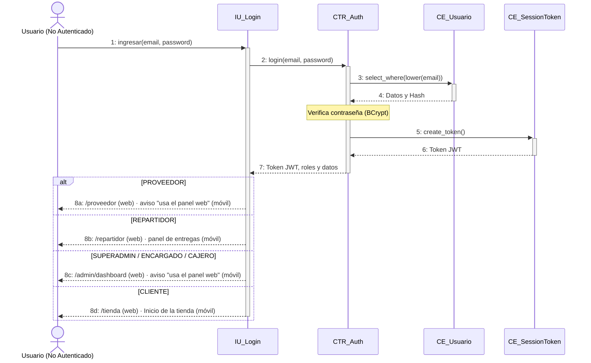

#### Desglose Paso a Paso (Nomenclatura Correlativa Formal):
- **`CU01[Paso 1: El usuario abre la interfaz de inicio de sesión en la aplicación móvil o web e ingresa su correo y contraseña.]`**
- **`CU01[Paso 2: La interfaz (IU_Login) envía la solicitud de acceso con las credenciales al controlador de autenticación (POST /api/v1/auth/login).]`**
- **`CU01[Paso 3: El controlador consulta en la base de datos la entidad Usuario (CE_User) buscando por correo en minúsculas.]`**
- **`CU01[Paso 4: El sistema valida la contraseña comparando el hash BCrypt con la clave ingresada.]`**
- **`CU01[Paso 5: Al comprobar la autenticidad, el sistema crea un token JWT con vigencia de 60 minutos y registra la sesión activa (CE_SessionToken).]`**
- **`CU01[Paso 6: Se registra la traza de seguridad en la bitácora de auditoría (CE_Bitacora) indicando ID de usuario, IP y fecha/hora.]`**
- **`CU01[Paso 7: La interfaz recibe el token, datos del perfil y roles, y redirige al usuario según su rol (Admin, Cajero, Encargado, Repartidor o Tienda Cliente).]`**

---

### CU02: Cerrar sesión activa

- **Ciclo de Desarrollo:** Ciclo 1
- **Paquete de Arquitectura:** `paquete_seguridad_usuarios`
- **Actores involucrados:** Usuario Autenticado
- **Actor Iniciador:** Usuario Autenticado
- **Propósito:** Revocar de forma segura la sesión activa del usuario, invalidando su token JWT en el servidor y limpiando los datos de sesión en el cliente.
- **Precondición:** El usuario tiene una sesión activa y un token JWT válido.
- **Postcondición:** El token queda marcado como revocado (is_revoked = true) y el almacenamiento local del cliente queda limpio.
- **Excepciones / Flujos Alternos:** E1: Token ya revocado o expirado.

#### Trazabilidad en Código Fuente:
- **Backend Router:** [`backend/app/packages/paquete_seguridad_usuarios/routers.py`](file:///backend/app/packages/paquete_seguridad_usuarios/routers.py)
- **Backend Servicio:** [`backend/app/packages/paquete_seguridad_usuarios/services.py`](file:///backend/app/packages/paquete_seguridad_usuarios/services.py)
- **Frontend Web Component:** [`frontend-web/src/app/shared/services/auth.service.ts`](file:///frontend-web/src/app/shared/services/auth.service.ts)
- **Mobile Flutter View:** [`mobile/lib/src/packages/paquete_seguridad_usuarios/auth_service.dart`](file:///mobile/lib/src/packages/paquete_seguridad_usuarios/auth_service.dart)

#### Diagrama de Secuencia (Mermaid):
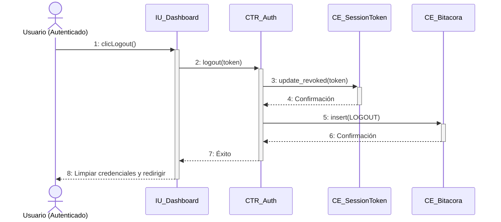

#### Desglose Paso a Paso (Nomenclatura Correlativa Formal):
- **`CU02[Paso 1: El usuario presiona la opción 'Cerrar sesión' desde la barra de navegación o perfil.]`**
- **`CU02[Paso 2: La interfaz envía la solicitud de revocación con el token JWT actual (POST /api/v1/auth/logout).]`**
- **`CU02[Paso 3: El controlador localiza el token de sesión en la base de datos (CE_SessionToken) y actualiza su estado a revocado (is_revoked = true).]`**
- **`CU02[Paso 4: El sistema inserta el evento de cierre de sesión en la bitácora de auditoría (CE_Bitacora).]`**
- **`CU02[Paso 5: El backend responde con confirmación de cierre exitoso (status 200).]`**
- **`CU02[Paso 6: La aplicación cliente elimina el token del almacenamiento local (localStorage / SecureStorage) y redirige a la vista de login.]`**

---

### CU03: Recuperar credenciales de acceso

- **Ciclo de Desarrollo:** Ciclo 1
- **Paquete de Arquitectura:** `paquete_seguridad_usuarios`
- **Actores involucrados:** Usuario que olvidó su contraseña
- **Actor Iniciador:** Usuario No Autenticado
- **Propósito:** Permitir a un usuario restablecer su contraseña mediante el envío de un enlace con token temporal de 5 minutos a su correo electrónico verificado.
- **Precondición:** El usuario debe tener una cuenta registrada con un correo válido en el sistema.
- **Postcondición:** La contraseña del usuario es actualizada con un nuevo hash seguro BCrypt y se revocan las sesiones previas.
- **Excepciones / Flujos Alternos:** E1: Correo electrónico no registrado. E2: Token de restablecimiento expirado o alterado.

#### Trazabilidad en Código Fuente:
- **Backend Router:** [`backend/app/packages/paquete_seguridad_usuarios/routers.py`](file:///backend/app/packages/paquete_seguridad_usuarios/routers.py)
- **Backend Servicio:** [`backend/app/packages/paquete_seguridad_usuarios/services.py`](file:///backend/app/packages/paquete_seguridad_usuarios/services.py)
- **Frontend Web Component:** [`frontend-web/src/app/packages/paquete_seguridad_usuarios/password-recovery/password-recovery.component.ts`](file:///frontend-web/src/app/packages/paquete_seguridad_usuarios/password-recovery/password-recovery.component.ts)
- **Mobile Flutter View:** [`mobile/lib/src/packages/paquete_seguridad_usuarios/login_view.dart`](file:///mobile/lib/src/packages/paquete_seguridad_usuarios/login_view.dart)

#### Diagrama de Secuencia (Mermaid):
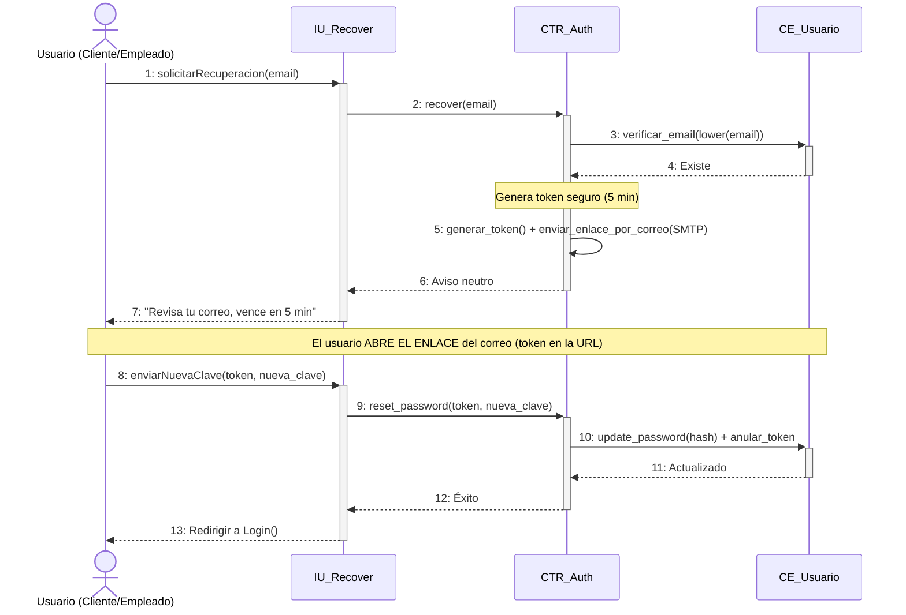

#### Desglose Paso a Paso (Nomenclatura Correlativa Formal):
- **`CU03[Paso 1: El usuario accede a '¿Olvidaste tu contraseña?' e ingresa su correo electrónico registrado.]`**
- **`CU03[Paso 2: La interfaz solicita la generación del enlace de recuperación (POST /api/v1/auth/recover).]`**
- **`CU03[Paso 3: El controlador busca el usuario en la base de datos (CE_User); si existe, genera un token criptográfico firmado de 5 minutos.]`**
- **`CU03[Paso 4: El servicio de mensajería (SMTP_Gmail) despacha el correo electrónico con el enlace seguro de restablecimiento.]`**
- **`CU03[Paso 5: El usuario hace clic en el enlace del correo y abre el formulario para ingresar y confirmar su nueva contraseña.]`**
- **`CU03[Paso 6: La interfaz envía el token y la nueva clave al servidor (POST /api/v1/auth/reset-password).]`**
- **`CU03[Paso 7: El controlador valida la vigencia del token, hashea la nueva clave con BCrypt, actualiza el registro en CE_User y registra la auditoría.]`**

---

### CU04: Auto-registro de cliente

- **Ciclo de Desarrollo:** Ciclo 1
- **Paquete de Arquitectura:** `paquete_seguridad_usuarios`
- **Actores involucrados:** Visitante / Comprador nuevo
- **Actor Iniciador:** Usuario No Autenticado
- **Propósito:** Permitir a nuevos clientes crear una cuenta personal en FashionStore con rol CLIENTE, habilitándolos para comprar, reservar prendas y usar el vestidor.
- **Precondición:** El correo ingresado no debe estar registrado previamente en la plataforma.
- **Postcondición:** Se crea un nuevo registro de usuario activo con rol CLIENTE y se emite su token de sesión de bienvenida.
- **Excepciones / Flujos Alternos:** E1: El correo ya se encuentra registrado. E2: Contraseña no cumple los requisitos mínimos de seguridad.

#### Trazabilidad en Código Fuente:
- **Backend Router:** [`backend/app/packages/paquete_seguridad_usuarios/routers.py`](file:///backend/app/packages/paquete_seguridad_usuarios/routers.py)
- **Backend Servicio:** [`backend/app/packages/paquete_seguridad_usuarios/services.py`](file:///backend/app/packages/paquete_seguridad_usuarios/services.py)
- **Frontend Web Component:** [`frontend-web/src/app/packages/paquete_seguridad_usuarios/register-modal/register-modal.component.ts`](file:///frontend-web/src/app/packages/paquete_seguridad_usuarios/register-modal/register-modal.component.ts)
- **Mobile Flutter View:** [`mobile/lib/src/packages/paquete_seguridad_usuarios/login_view.dart`](file:///mobile/lib/src/packages/paquete_seguridad_usuarios/login_view.dart)

#### Diagrama de Secuencia (Mermaid):
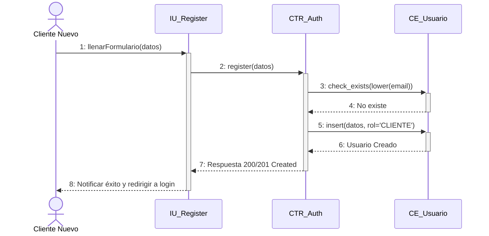

#### Desglose Paso a Paso (Nomenclatura Correlativa Formal):
- **`CU04[Paso 1: El visitante presiona 'Crear cuenta' en la web o app móvil y completa el formulario con sus datos (nombres, correo, teléfono y contraseña).]`**
- **`CU04[Paso 2: La interfaz envía la solicitud de creación de cuenta (POST /api/v1/auth/register).]`**
- **`CU04[Paso 3: El controlador normaliza el correo a minúsculas y verifica que no exista en la base de datos (CE_User).]`**
- **`CU04[Paso 4: El sistema asigna automáticamente el rol 'CLIENTE', genera el hash BCrypt de la contraseña y persiste el nuevo usuario activo.]`**
- **`CU04[Paso 5: El sistema genera un token de sesión JWT inmediato para iniciar la sesión del nuevo cliente sin fricción.]`**
- **`CU04[Paso 6: Se registra el evento de auto-registro en la bitácora de auditoría (CE_Bitacora).]`**
- **`CU04[Paso 7: La interfaz almacena las credenciales recibidas y le da la bienvenida al cliente en la tienda digital.]`**

---

### CU05: Gestionar perfiles, roles y usuarios

- **Ciclo de Desarrollo:** Ciclo 1
- **Paquete de Arquitectura:** `paquete_seguridad_usuarios`
- **Actores involucrados:** Superadministrador
- **Actor Iniciador:** Superadministrador Autenticado
- **Propósito:** Administrar el ciclo de vida de usuarios del sistema (creación, edición, activación, desactivación y asignación de roles).
- **Precondición:** El usuario debe tener rol Superadministrador y sesión válida.
- **Postcondición:** Los datos, roles o estado del usuario son actualizados en la base de datos.
- **Excepciones / Flujos Alternos:** E1: Intento de desactivar al último Superadministrador del sistema. E2: Correo duplicado.

#### Trazabilidad en Código Fuente:
- **Backend Router:** [`backend/app/packages/paquete_seguridad_usuarios/routers.py`](file:///backend/app/packages/paquete_seguridad_usuarios/routers.py)
- **Backend Servicio:** [`backend/app/packages/paquete_seguridad_usuarios/services.py`](file:///backend/app/packages/paquete_seguridad_usuarios/services.py)
- **Frontend Web Component:** [`frontend-web/src/app/packages/paquete_seguridad_usuarios/user-management/user-management.component.ts`](file:///frontend-web/src/app/packages/paquete_seguridad_usuarios/user-management/user-management.component.ts)

#### Diagrama de Secuencia (Mermaid):
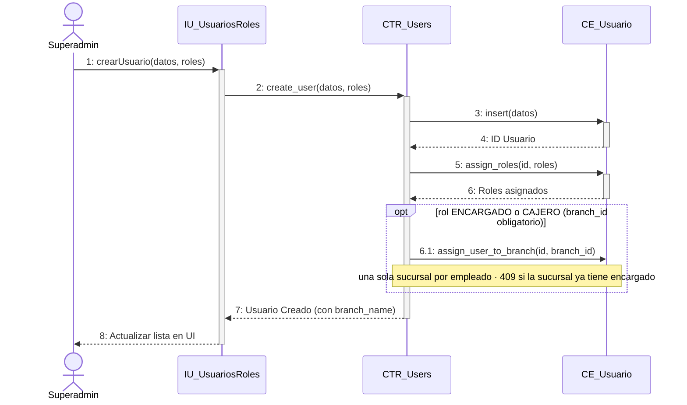

#### Desglose Paso a Paso (Nomenclatura Correlativa Formal):
- **`CU05[Paso 1: El Superadministrador entra al módulo 'Usuarios y Roles' en el panel de administración.]`**
- **`CU05[Paso 2: La interfaz consulta la lista de usuarios paginada con sus roles (GET /api/v1/users).]`**
- **`CU05[Paso 3: El Superadmin selecciona un usuario para editar o presiona 'Nuevo Usuario' y completa el formulario.]`**
- **`CU05[Paso 4: La interfaz envía la solicitud al backend (POST /api/v1/users o PUT /api/v1/users/{id}).]`**
- **`CU05[Paso 5: El controlador valida que no se dupliquen correos y actualiza las asignaciones en la tabla asociativa usuario_roles.]`**
- **`CU05[Paso 6: Se persiste la información en CE_User y se asienta el cambio en la bitácora de auditoría (CE_Bitacora).]`**
- **`CU05[Paso 7: La interfaz actualiza la tabla de usuarios y muestra el mensaje de confirmación de éxito.]`**

---

### CU06: Gestionar sucursales de la cadena

- **Ciclo de Desarrollo:** Ciclo 1
- **Paquete de Arquitectura:** `paquete_catalogo_y_tiendas`
- **Actores involucrados:** Superadministrador
- **Actor Iniciador:** Superadministrador Autenticado
- **Propósito:** Administrar las tiendas físicas de la cadena FashionStore (nombre, dirección, ciudad, teléfono y estado activo).
- **Precondición:** Usuario autenticado con rol Superadministrador.
- **Postcondición:** La sucursal queda registrada o actualizada en la base de datos y disponible para asignación de inventario y citas.
- **Excepciones / Flujos Alternos:** E1: Nombre de sucursal duplicado en la misma ciudad.

#### Trazabilidad en Código Fuente:
- **Backend Router:** [`backend/app/packages/paquete_catalogo_y_tiendas/branches/routers.py`](file:///backend/app/packages/paquete_catalogo_y_tiendas/branches/routers.py)
- **Backend Servicio:** [`backend/app/packages/paquete_catalogo_y_tiendas/branches/services.py`](file:///backend/app/packages/paquete_catalogo_y_tiendas/branches/services.py)
- **Frontend Web Component:** [`frontend-web/src/app/packages/paquete_catalogo_y_tiendas/branches/branch-management.component.ts`](file:///frontend-web/src/app/packages/paquete_catalogo_y_tiendas/branches/branch-management.component.ts)

#### Diagrama de Secuencia (Mermaid):
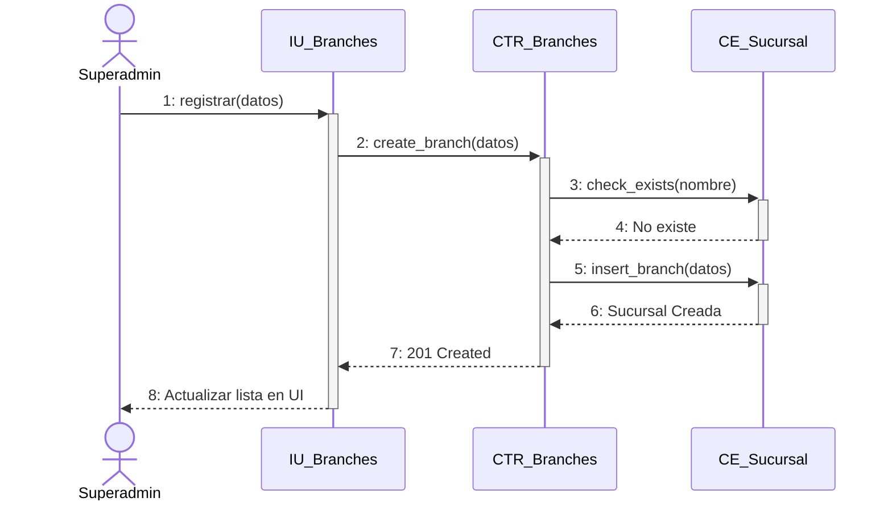

#### Desglose Paso a Paso (Nomenclatura Correlativa Formal):
- **`CU06[Paso 1: El Superadmin ingresa al apartado de 'Sucursales' del panel administrativo.]`**
- **`CU06[Paso 2: La interfaz solicita la lista de sucursales activas (GET /api/v1/branches).]`**
- **`CU06[Paso 3: El Superadmin completa o edita los datos de la tienda física (nombre, dirección, ciudad, horario, teléfono).]`**
- **`CU06[Paso 4: La interfaz envía la petición de guardado al servidor (POST /api/v1/branches o PUT /api/v1/branches/{id}).]`**
- **`CU06[Paso 5: El controlador valida los datos y registra la sucursal en la tabla branches (CE_Branch).]`**
- **`CU06[Paso 6: Se registra la acción en la bitácora de auditoría con los datos de la sucursal modificada.]`**
- **`CU06[Paso 7: La interfaz refresca la lista de sucursales y notifica la operación completada.]`**

---

### CU07: Gestionar catálogo de prendas y variantes

- **Ciclo de Desarrollo:** Ciclo 1
- **Paquete de Arquitectura:** `paquete_catalogo_y_tiendas`
- **Actores involucrados:** Superadministrador, Encargado
- **Actor Iniciador:** Personal Administrativo Autenticado
- **Propósito:** Crear, actualizar y catalogar prendas con su jerarquía de variantes (tallas, colores, códigos SKU, precios y galería de fotos).
- **Precondición:** Existencia de categorías, tallas y colores base en el sistema.
- **Postcondición:** La prenda y sus variantes quedan registradas en el catálogo y listas para recepción de inventario.
- **Excepciones / Flujos Alternos:** E1: Código SKU duplicado. E2: Imagen excede tamaño permitido.

#### Trazabilidad en Código Fuente:
- **Backend Router:** [`backend/app/packages/paquete_catalogo_y_tiendas/routers.py`](file:///c:/Users/MARILYN/Documents/Carpeta%20Esther/Semestre%202-2026/SI%202/primer_parcial.1.0/backend/app/packages/paquete_catalogo_y_tiendas/routers.py) (`create_product`)
- **Backend Modelos BCE:** [`backend/app/packages/paquete_catalogo_y_tiendas/models.py`](file:///c:/Users/MARILYN/Documents/Carpeta%20Esther/Semestre%202-2026/SI%202/primer_parcial.1.0/backend/app/packages/paquete_catalogo_y_tiendas/models.py) (`CE_Producto`, `CE_Variante`)
- **Frontend Web Component:** [`frontend-web/src/app/packages/paquete_catalogo_y_tiendas/products/products.component.ts`](file:///c:/Users/MARILYN/Documents/Carpeta%20Esther/Semestre%202-2026/SI%202/primer_parcial.1.0/frontend-web/src/app/packages/paquete_catalogo_y_tiendas/products/products.component.ts) (`IU_Products`)

#### Diagrama de Secuencia Oficial (Mermaid - 8 Pasos Canónicos):
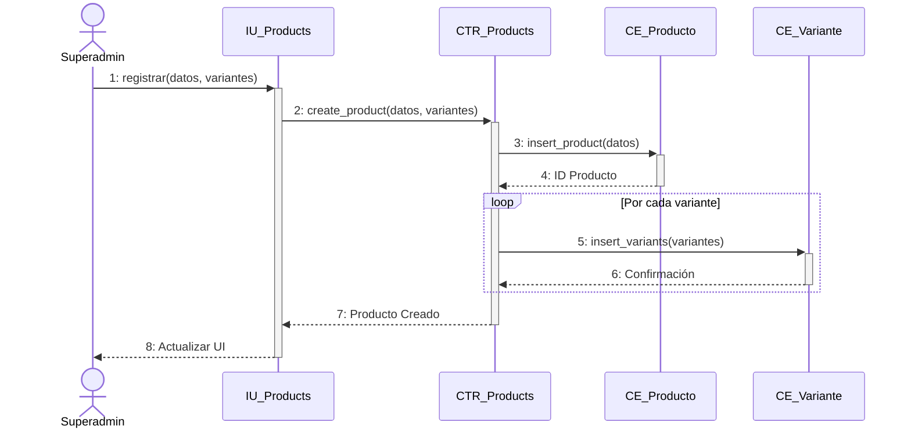

#### Desglose Paso a Paso (Nomenclatura Correlativa Formal):
- **`CU07[Paso 1: El encargado entra a 'Catálogo de Prendas' y presiona 'Nueva Prenda' o selecciona una existente.]`**
- **`CU07[Paso 2: La interfaz carga las categorías, colores y tallas disponibles para el formulario.]`**
- **`CU07[Paso 3: El usuario carga los datos de la prenda, define las variantes (talla + color), genera los códigos SKU y sube las fotos.]`**
- **`CU07[Paso 4: La interfaz envía la prenda completa con sus variantes y fotos al backend (POST /api/v1/products).]`**
- **`CU07[Paso 5: El controlador valida la unicidad de los SKUs, guarda la entidad Prenda (CE_Product) y sus variantes (CE_ProductVariant).]`**
- **`CU07[Paso 6: Se asocian las imágenes en la tabla product_images y se registra la traza en la bitácora de auditoría.]`**
- **`CU07[Paso 7: La interfaz confirma la creación de la prenda y la muestra inmediatamente en la tabla del catálogo.]`**

---

### CU08: Gestionar proveedores de mercadería

- **Ciclo de Desarrollo:** Ciclo 1
- **Paquete de Arquitectura:** `paquete_inventario_y_proveedores`
- **Actores involucrados:** Superadministrador, Encargado
- **Actor Iniciador:** Personal Administrativo Autenticado
- **Propósito:** Administrar el directorio de empresas proveedoras y fabricantes que abastecen de mercadería a las sucursales.
- **Precondición:** Sesión iniciada con privilegios administrativos.
- **Postcondición:** El proveedor queda registrado con sus datos de contacto y NIT en el sistema.
- **Excepciones / Flujos Alternos:** E1: NIT o razón social duplicada.

#### Trazabilidad en Código Fuente:
- **Backend Router:** [`backend/app/packages/paquete_inventario_y_proveedores/suppliers/routers.py`](file:///backend/app/packages/paquete_inventario_y_proveedores/suppliers/routers.py)
- **Backend Servicio:** [`backend/app/packages/paquete_inventario_y_proveedores/suppliers/services.py`](file:///backend/app/packages/paquete_inventario_y_proveedores/suppliers/services.py)
- **Frontend Web Component:** [`frontend-web/src/app/packages/paquete_inventario_y_proveedores/suppliers/supplier-management.component.ts`](file:///frontend-web/src/app/packages/paquete_inventario_y_proveedores/suppliers/supplier-management.component.ts)

#### Diagrama de Secuencia (Mermaid):
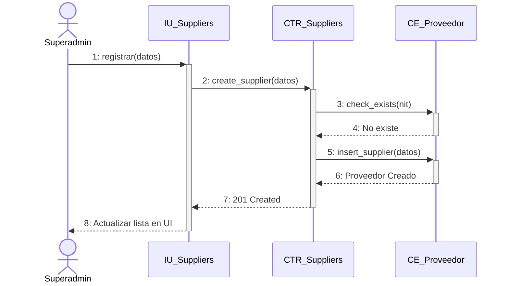

#### Desglose Paso a Paso (Nomenclatura Correlativa Formal):
- **`CU08[Paso 1: El usuario accede a 'Proveedores' dentro del módulo de inventario.]`**
- **`CU08[Paso 2: La interfaz lista los proveedores activos (GET /api/v1/suppliers).]`**
- **`CU08[Paso 3: El usuario presiona 'Registrar Proveedor' y llena los campos (razón social, NIT, teléfono, correo, dirección).]`**
- **`CU08[Paso 4: La interfaz despacha la solicitud de alta al servidor (POST /api/v1/suppliers).]`**
- **`CU08[Paso 5: El controlador valida que el NIT no exista y guarda el registro en la tabla suppliers (CE_Supplier).]`**
- **`CU08[Paso 6: Se registra la auditoría de la operación.]`**
- **`CU08[Paso 7: La interfaz actualiza la lista de proveedores mostrando el nuevo contacto disponible para órdenes de compra.]`**

---

### CU09: Gestionar empleados de sucursal

- **Ciclo de Desarrollo:** Ciclo 1
- **Paquete de Arquitectura:** `paquete_seguridad_usuarios`
- **Actores involucrados:** Superadministrador
- **Actor Iniciador:** Superadministrador Autenticado
- **Propósito:** Registrar al personal operativo (Cajeros, Encargados de tienda) asociando su cuenta de usuario a una sucursal específica de trabajo.
- **Precondición:** Existencia previa de la sucursal de destino y del rol operativo a asignar.
- **Postcondición:** El empleado queda creado con usuario del sistema, rol correspondiente y vinculado a su sucursal sede.
- **Excepciones / Flujos Alternos:** E1: Sucursal inactiva o inexistente. E2: Correo del empleado ya en uso.

#### Trazabilidad en Código Fuente:
- **Backend Router:** [`backend/app/packages/paquete_seguridad_usuarios/routers.py`](file:///backend/app/packages/paquete_seguridad_usuarios/routers.py)
- **Backend Servicio:** [`backend/app/packages/paquete_seguridad_usuarios/services.py`](file:///backend/app/packages/paquete_seguridad_usuarios/services.py)
- **Frontend Web Component:** [`frontend-web/src/app/packages/paquete_seguridad_usuarios/employees/employee-management.component.ts`](file:///frontend-web/src/app/packages/paquete_seguridad_usuarios/employees/employee-management.component.ts)

#### Diagrama de Secuencia (Mermaid):
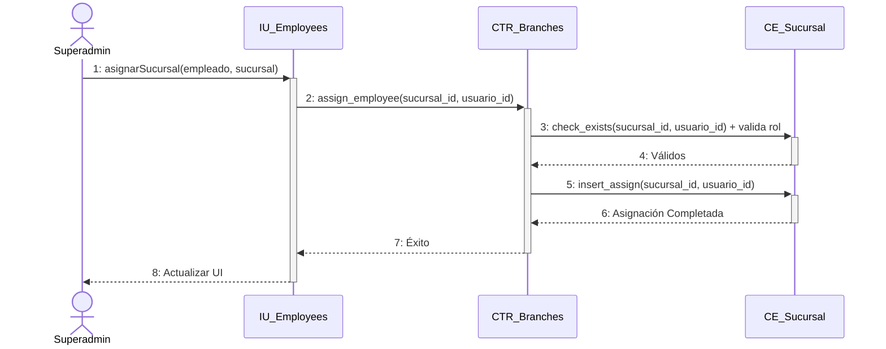

#### Desglose Paso a Paso (Nomenclatura Correlativa Formal):
- **`CU09[Paso 1: El Superadmin entra a 'Personal y Empleados' en el menú de administración.]`**
- **`CU09[Paso 2: La interfaz consulta los empleados actuales y sus sucursales asignadas (GET /api/v1/employees).]`**
- **`CU09[Paso 3: El Superadmin presiona 'Contratar/Asignar Empleado', selecciona la sucursal, rol (Cajero/Encargado) y completa los datos personales.]`**
- **`CU09[Paso 4: La interfaz envía la solicitud combinada de usuario y asignación física (POST /api/v1/employees).]`**
- **`CU09[Paso 5: El controlador crea la cuenta en CE_User, asigna el rol y vincula la clave foránea branch_id en la tabla de empleados.]`**
- **`CU09[Paso 6: Se registra el evento de contratación/asignación en la bitácora de auditoría.]`**
- **`CU09[Paso 7: La interfaz actualiza la nómina de la sucursal y notifica el registro exitoso.]`**

---

### CU10: Registrar compras e ingresos de mercadería

- **Ciclo de Desarrollo:** Ciclo 1
- **Paquete de Arquitectura:** `paquete_inventario_y_proveedores`
- **Actores involucrados:** Encargado de Sucursal, Superadministrador
- **Actor Iniciador:** Encargado de Sucursal Autenticado
- **Propósito:** Registrar compras formales de lotes de prendas a proveedores autorizados, dando ingreso a las existencias físicas en el almacén de la sucursal y recalculando automáticamente el Costo Promedio Ponderado (CPP) según normativa contable.
- **Precondición:** Prendas y variantes debidamente catalogadas en el sistema y proveedor activo registrado en el padrón de proveedores.
- **Postcondición:** Incremento del stock físico en el inventario de la sucursal, registro contable inmutable del movimiento en el Kardex (Libro Mayor de inventario) con saldo valorizado y actualización del costo promedio ponderado.
- **Excepciones / Flujos Alternos:** E1: Proveedor no existe o está inactivo (`ProveedorInactivoException`). E2: Cantidad o costo unitario menor o igual a cero (`ValoresMonetariosInvalidosException`).

#### Trazabilidad en Código Fuente:
- **Backend Router:** [`backend/app/packages/paquete_inventario_y_proveedores/merchandise/routers.py`](file:///backend/app/packages/paquete_inventario_y_proveedores/merchandise/routers.py)
- **Backend Servicio:** [`backend/app/packages/paquete_inventario_y_proveedores/merchandise/services.py`](file:///backend/app/packages/paquete_inventario_y_proveedores/merchandise/services.py)
- **Frontend Web Component:** [`frontend-web/src/app/packages/paquete_inventario_y_proveedores/merchandise/merchandise-intake.component.ts`](file:///frontend-web/src/app/packages/paquete_inventario_y_proveedores/merchandise/merchandise-intake.component.ts)

#### Diagrama de Secuencia (Mermaid):
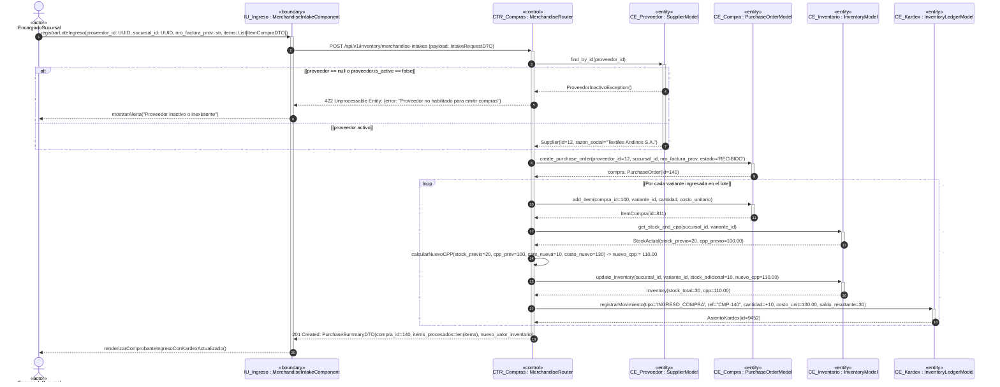

#### Desglose Paso a Paso (Nomenclatura Correlativa Formal):
- **`CU10[Paso 1: El Encargado de Sucursal ingresa a la interfaz de recepción de mercadería y completa los datos del proveedor, número de factura y lista de prendas con cantidades y costos unitarios de adquisición.]`**
- **`CU10[Paso 2: La interfaz despacha la solicitud HTTP POST /api/v1/inventory/merchandise-intakes con el DTO validado al controlador CTR_Compras.]`**
- **`CU10[Paso 3: El controlador consulta en CE_Proveedor el estado y habilitación del proveedor; si está inactivo se aborta con error 422 Unprocessable Entity.]`**
- **`CU10[Paso 4: Confirmado el proveedor, se persiste la cabecera de la orden de compra en CE_Compra con estado 'RECIBIDO'.]`**
- **`CU10[Paso 5: [loop: Por cada variante] Se insertan las líneas de detalle de compra con cantidad y costo de adquisición.]`**
- **`CU10[Paso 6: Se consulta el stock actual y costo promedio vigente en CE_Inventario para la variante y sucursal.]`**
- **`CU10[Paso 7: El controlador ejecuta el recálculo financiero de Costo Promedio Ponderado (CPP) aplicando la fórmula contable oficial.]`**
- **`CU10[Paso 8: Se actualizan las existencias físicas incrementadas y el nuevo CPP unitario en CE_Inventario.]`**
- **`CU10[Paso 9: Se genera el asiento contable oficial en CE_Kardex con tipo 'INGRESO_COMPRA', costo unitario y saldo resultante valorizado.]`**
- **`CU10[Paso 10: La interfaz recibe la confirmación con el código de compra y despliega el comprobante con existencias y CPP actualizado.]`**

---

### CU11: Consultar catálogo de prendas

- **Ciclo de Desarrollo:** Ciclo 1
- **Paquete de Arquitectura:** `paquete_catalogo_y_tiendas`
- **Actores involucrados:** Cliente, Visitante, Personal
- **Actor Iniciador:** Cualquier Usuario (Público / Autenticado)
- **Propósito:** Permitir a los clientes y visitantes navegar la vitrina digital de prendas con imágenes, precios base, descuentos y categorías.
- **Precondición:** Existen prendas activas registradas en la base de datos.
- **Postcondición:** La interfaz presenta la galería interactiva con tarjetas de prendas, variantes de color y badges de oferta.
- **Excepciones / Flujos Alternos:** Ninguna. Si no hay productos se muestra un estado vacío amigable.

#### Trazabilidad en Código Fuente:
- **Backend Router:** [`backend/app/packages/paquete_catalogo_y_tiendas/routers.py`](file:///backend/app/packages/paquete_catalogo_y_tiendas/routers.py)
- **Backend Servicio:** [`backend/app/packages/paquete_catalogo_y_tiendas/services.py`](file:///backend/app/packages/paquete_catalogo_y_tiendas/services.py)
- **Frontend Web Component:** [`frontend-web/src/app/packages/paquete_catalogo_y_tiendas/store/store-catalog.component.ts`](file:///frontend-web/src/app/packages/paquete_catalogo_y_tiendas/store/store-catalog.component.ts)
- **Mobile Flutter View:** [`mobile/lib/src/packages/paquete_catalogo_y_tiendas/catalogo_view.dart`](file:///mobile/lib/src/packages/paquete_catalogo_y_tiendas/catalogo_view.dart)

#### Diagrama de Secuencia (Mermaid):
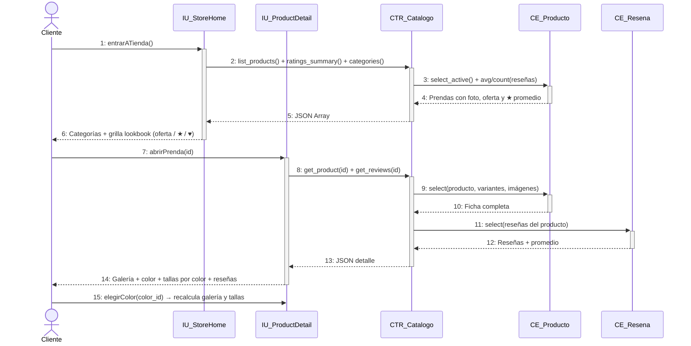

#### Desglose Paso a Paso (Nomenclatura Correlativa Formal):
- **`CU11[Paso 1: El usuario entra a la Tienda Web o abre la pestaña Catálogo en la aplicación móvil.]`**
- **`CU11[Paso 2: La aplicación solicita el listado de prendas activas con sus imágenes y variantes (GET /api/v1/catalog/products).]`**
- **`CU11[Paso 3: El controlador consulta CE_Product filtrando únicamente registros con is_active = true e incluye sus relaciones de imágenes y variantes.]`**
- **`CU11[Paso 4: El sistema procesa la respuesta agregando precios con descuento si la prenda cuenta con compare_at_price.]`**
- **`CU11[Paso 5: El backend devuelve la lista serializada en JSON.]`**
- **`CU11[Paso 6: La interfaz renderiza las tarjetas de producto con soporte para cambio dinámico de imagen al seleccionar un color.]`**
- **`CU11[Paso 7: El usuario puede interactuar con las tarjetas para ver el detalle, probarse la prenda o añadirla a favoritos.]`**

---

### CU12: Buscar y filtrar catálogo avanzado + disponibilidad por sucursal

- **Ciclo de Desarrollo:** Ciclo 2
- **Paquete de Arquitectura:** `paquete_catalogo_y_tiendas`
- **Actores involucrados:** Cliente, Comprador
- **Actor Iniciador:** Cliente Autenticado o Visitante
- **Propósito:** Buscar prendas por coincidencia de texto, filtrar por rango de precio, talla, color, categoría y consultar en qué sucursales físicas hay stock real.
- **Precondición:** Catálogo activo con stock asignado en sucursales.
- **Postcondición:** El cliente visualiza las opciones exactas y la lista de sucursales cercanas donde puede recoger o probarse la prenda.
- **Excepciones / Flujos Alternos:** E1: Filtros sin coincidencias (se muestran prendas sugeridas).

#### Trazabilidad en Código Fuente:
- **Backend Router:** [`backend/app/packages/paquete_catalogo_y_tiendas/routers.py`](file:///backend/app/packages/paquete_catalogo_y_tiendas/routers.py)
- **Backend Servicio:** [`backend/app/packages/paquete_catalogo_y_tiendas/services.py`](file:///backend/app/packages/paquete_catalogo_y_tiendas/services.py)
- **Frontend Web Component:** [`frontend-web/src/app/packages/paquete_catalogo_y_tiendas/store/store-home.component.ts`](file:///frontend-web/src/app/packages/paquete_catalogo_y_tiendas/store/store-home.component.ts)
- **Mobile Flutter View:** [`mobile/lib/src/packages/paquete_catalogo_y_tiendas/catalogo_view.dart`](file:///mobile/lib/src/packages/paquete_catalogo_y_tiendas/catalogo_view.dart)

#### Diagrama de Secuencia (Mermaid):
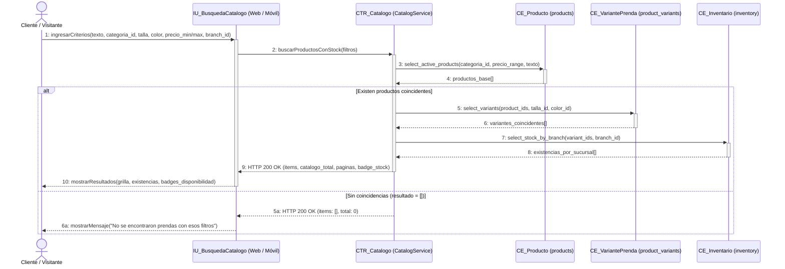

#### Desglose Paso a Paso (Nomenclatura Correlativa Formal):
- **`CU12[Paso 1: El cliente o visitante ingresa criterios de búsqueda facetada (categoría, rango de precio, color, talla o texto libre) y opcionalmente selecciona una sucursal física en la web o app móvil.]`**
- **`CU12[Paso 1.1: La interfaz despacha la solicitud de búsqueda al servicio del catálogo (GET /api/v1/catalog/products/search).]`**
- **`CU12[Paso 1.2: El controlador consulta los productos activos que cumplen los filtros base en la tabla products (CE_Producto).]`**
- **`CU12[Paso 1.3: [alt: Existen productos] El controlador recupera las variantes disponibles de talla y color en product_variants (CE_VariantePrenda).]`**
- **`CU12[Paso 1.4: El controlador realiza el cruce con la tabla inventory (CE_Inventario) para calcular el stock físico disponible en la sucursal seleccionada.]`**
- **`CU12[Paso 1.5: La API responde con HTTP 200 OK conteniendo la grilla paginada de prendas con sus insignias de stock en tiempo real.]`**
- **`CU12[Paso 1.6: [alt: Sin coincidencias] Si no existen productos, la API devuelve array vacío y la interfaz sugiere relajar los filtros.]`**

---
### CU13: Gestionar promociones: cupones y ofertas de temporada

- **Ciclo de Desarrollo:** Ciclo 2
- **Paquete de Arquitectura:** `paquete_catalogo_y_tiendas`
- **Actores involucrados:** Superadministrador, Encargado
- **Actor Iniciador:** Personal Administrativo Autenticado
- **Propósito:** Crear y controlar cupones de descuento (porcentaje o monto fijo) con vigencia, límite de usos y condiciones de compra.
- **Precondición:** Usuario con privilegios de gestión de precios y marketing.
- **Postcondición:** El cupón o campaña queda activo y puede ser validado en el checkout digital o caja POS.
- **Excepciones / Flujos Alternos:** E1: Código de cupón duplicado. E2: Fecha de vencimiento anterior a la fecha actual.

#### Trazabilidad en Código Fuente:
- **Backend Router:** [`backend/app/packages/paquete_catalogo_y_tiendas/promotions/routers.py`](file:///backend/app/packages/paquete_catalogo_y_tiendas/promotions/routers.py)
- **Backend Servicio:** [`backend/app/packages/paquete_catalogo_y_tiendas/promotions/services.py`](file:///backend/app/packages/paquete_catalogo_y_tiendas/promotions/services.py)
- **Frontend Web Component:** [`frontend-web/src/app/packages/paquete_catalogo_y_tiendas/promotions/promotion-management.component.ts`](file:///frontend-web/src/app/packages/paquete_catalogo_y_tiendas/promotions/promotion-management.component.ts)

#### Diagrama de Secuencia (Mermaid):
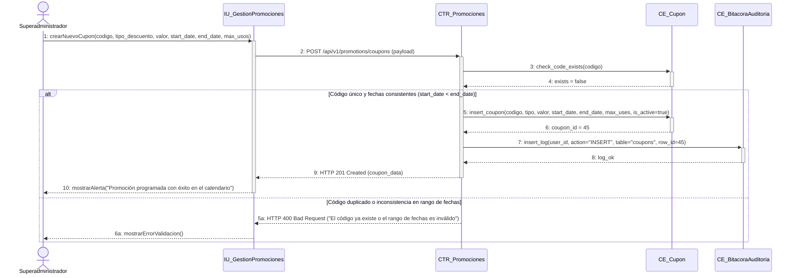

#### Desglose Paso a Paso (Nomenclatura Correlativa Formal):
- **`CU13[Paso 1: El administrador completa el formulario en el panel web definiendo código alfanumérico, tipo de descuento (porcentaje o monto fijo), vigencia y límite de usos.]`**
- **`CU13[Paso 1.1: La interfaz envía la solicitud de creación de cupón (POST /api/v1/promotions/coupons).]`**
- **`CU13[Paso 1.2: El controlador valida que el código no exista previamente en la tabla coupons (CE_Cupon).]`**
- **`CU13[Paso 1.3: [alt: Fechas válidas y código único] Se persiste el cupón activo en la base de datos con su cuota de canjes.]`**
- **`CU13[Paso 1.4: Se asienta el registro de auditoría en audit_logs (CE_BitacoraAuditoria) y la API retorna HTTP 201 Created.]`**
- **`CU13[Paso 1.5: [alt: Error de validación] Si el código ya existe o las fechas son inconsistentes, se responde HTTP 400 Bad Request.]`**

---
### CU14: Wishlist múltiple / compartible y moderación de reseñas

- **Ciclo de Desarrollo:** Ciclo 2
- **Paquete de Arquitectura:** `paquete_catalogo_y_tiendas`
- **Actores involucrados:** Cliente, Encargado
- **Actor Iniciador:** Cliente Autenticado
- **Propósito:** Permitir a los clientes guardar prendas favoritas en su lista de deseos y calificar prendas adquiridas mediante reseñas con estrellas (1 a 5) y comentarios.
- **Precondición:** Cliente autenticado con sesión activa.
- **Postcondición:** Prenda agregada a wishlist o reseña registrada para moderación/publicación.
- **Excepciones / Flujos Alternos:** E1: Calificación fuera del rango 1-5.

#### Trazabilidad en Código Fuente:
- **Backend Router:** [`backend/app/packages/paquete_catalogo_y_tiendas/routers.py`](file:///backend/app/packages/paquete_catalogo_y_tiendas/routers.py)
- **Frontend Web Component:** [`frontend-web/src/app/packages/paquete_catalogo_y_tiendas/product-detail/product-detail.component.ts`](file:///frontend-web/src/app/packages/paquete_catalogo_y_tiendas/product-detail/product-detail.component.ts)
- **Mobile Flutter View:** [`mobile/lib/src/packages/paquete_catalogo_y_tiendas/product_detail_view.dart`](file:///mobile/lib/src/packages/paquete_catalogo_y_tiendas/product_detail_view.dart)

#### Diagrama de Secuencia (Mermaid):
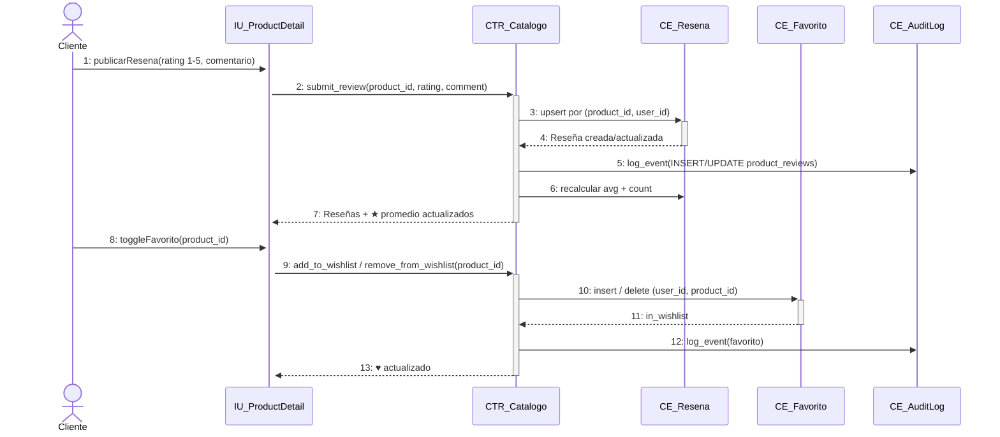

#### Desglose Paso a Paso (Nomenclatura Correlativa Formal):
- **`CU14[Paso 1: El cliente accede al detalle de la prenda (IU_ProductDetail), selecciona la puntuación en estrellas (1 a 5) y escribe su opinión.]`**
- **`CU14[Paso 2: La interfaz envía la reseña al controlador (POST /api/v1/catalog/products/{id}/reviews -> submit_review).]`**
- **`CU14[Paso 3: El controlador valida la existencia de la prenda y realiza upsert en product_reviews (CE_Resena) por (product_id, user_id).]`**
- **`CU14[Paso 4: La base de datos persiste y retorna el registro de la reseña creada o actualizada.]`**
- **`CU14[Paso 5: El controlador registra la acción en la bitácora inmutable de auditoría (CE_AuditLog).]`**
- **`CU14[Paso 6: El sistema recalcula la calificación promedio y el conteo de reseñas asociadas al producto.]`**
- **`CU14[Paso 7: El controlador responde HTTP 200 con ReviewResponse y la interfaz actualiza las estrellas y comentarios visibles.]`**
- **`CU14[Paso 8: Para favoritos, el cliente hace clic en el icono de corazón en la ficha de la prenda (IU_ProductDetail).]`**
- **`CU14[Paso 9: La interfaz envía la solicitud de guardado o remoción (POST /api/v1/catalog/wishlist/{product_id} o DELETE).]`**
- **`CU14[Paso 10: El controlador verifica la prenda y persiste o elimina el registro en la tabla wishlist_items (CE_Favorito).]`**
- **`CU14[Paso 11: La entidad de base de datos confirma el estado actualizado de la prenda en la lista de deseos.]`**
- **`CU14[Paso 12: El controlador asienta el evento de auditoría en audit_logs (INSERT/DELETE en wishlist_items).]`**
- **`CU14[Paso 13: La API retorna WishlistToggleResponse y la interfaz actualiza el estado visual del corazón de favoritos.]`**

---

### CU15: Gestionar inventario general y transferencias entre sucursales

- **Ciclo de Desarrollo:** Ciclo 2
- **Paquete de Arquitectura:** `paquete_inventario_y_proveedores`
- **Actores involucrados:** Encargado de Sucursal Origen, Encargado de Sucursal Destino, Superadministrador
- **Actor Iniciador:** Encargado de Sucursal Autenticado
- **Propósito:** Transferir lotes de prendas y mercadería física entre sucursales de la cadena para equilibrar existencias, garantizando trazabilidad en 3 fases: solicitud, despacho con salida de almacén y recepción física con acreditación en destino y registro en el Kardex.
- **Precondición:** Existencia de stock disponible suficiente en la sucursal de origen para las prendas solicitadas.
- **Postcondición:** Descuento de existencias en el origen, incremento en el destino, actualización del estado a 'COMPLETADA' y asientos auditados en el Kardex.
- **Excepciones / Flujos Alternos:** E1: Stock insuficiente en la sucursal de origen. E2: Intento de transferencia entre la misma sucursal (origen igual a destino).

#### Trazabilidad en Código Fuente:
- **Backend Router:** [`backend/app/packages/paquete_inventario_y_proveedores/transfers/routers.py`](file:///backend/app/packages/paquete_inventario_y_proveedores/transfers/routers.py)
- **Backend Servicio:** [`backend/app/packages/paquete_inventario_y_proveedores/transfers/services.py`](file:///backend/app/packages/paquete_inventario_y_proveedores/transfers/services.py)
- **Frontend Web Component:** [`frontend-web/src/app/packages/paquete_inventario_y_proveedores/transfers/transfer-management.component.ts`](file:///frontend-web/src/app/packages/paquete_inventario_y_proveedores/transfers/transfer-management.component.ts)

#### Diagrama de Secuencia (Mermaid):
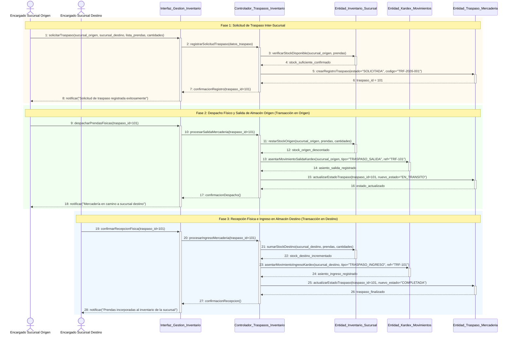

#### Desglose Paso a Paso (Nomenclatura Correlativa Formal):
- **`CU15[Paso 1: [Fase Solicitud] El Encargado de la Sucursal de Origen crea una solicitud de traspaso indicando la sucursal de origen, la de destino y la lista de prendas con sus cantidades requeridas.]`**
- **`CU15[Paso 1.1: La interfaz envía la solicitud al controlador (POST /api/v1/merchandise/transfers).]`**
- **`CU15[Paso 1.2: El controlador verifica la disponibilidad física de stock en la sucursal de origen (CE_Inventario_Sucursal).]`**
- **`CU15[Paso 1.3: Se crea el registro del traspaso con estado inicial 'SOLICITADA' y código correlativo TRF-AAAA-XXXXXX en CE_Traspaso_Mercaderia.]`**
- **`CU15[Paso 2: [Fase Despacho] El Encargado de Origen embala las prendas y presiona 'Despachar Mercadería'.]`**
- **`CU15[Paso 2.1: El controlador actualiza el estado del traspaso a 'EN_TRANSITO' (PUT /api/v1/merchandise/transfers/{id}/status).]`**
- **`CU15[Paso 2.2: Se descuentan las existencias físicas del almacén de origen en CE_Inventario_Sucursal.]`**
- **`CU15[Paso 2.3: Se registra el asiento contable de salida 'TRANSFERENCIA_SALIDA' en el Kardex (CE_Kardex_Movimientos).]`**
- **`CU15[Paso 3: [Fase Recepción] El Encargado de Destino recibe el paquete físico, verifica las prendas y pulsa 'Confirmar Recepción'.]`**
- **`CU15[Paso 3.1: La interfaz despacha la confirmación de recepción (PUT /api/v1/merchandise/transfers/{id}/receive).]`**
- **`CU15[Paso 3.2: Se incrementa el stock físico de las variantes en la sucursal de destino en CE_Inventario_Sucursal.]`**
- **`CU15[Paso 3.3: Se asienta el ingreso 'TRANSFERENCIA_INGRESO' en CE_Kardex_Movimientos y el traspaso pasa a estado definitivo 'COMPLETADA'.]`**

---
### CU16: Configurar y notificar alertas de stock (mínimo/máximo)

- **Ciclo de Desarrollo:** Ciclo 2
- **Paquete de Arquitectura:** paquete_inventario_y_proveedores
- **Actores involucrados:** Encargado de Sucursal, Superadministrador
- **Actor Iniciador:** Encargado de Sucursal / Superadministrador
- **Propósito:** Monitorear permanentemente el nivel de existencias físicas para alertar sobre quiebres de stock o sobrestock, y permitir la configuración de umbrales operativos por sucursal y variante.
- **Precondición:** Existencia de registros de inventario en la sucursal seleccionada.
- **Postcondición:** Alertas calculadas y desplegadas en la bandeja, y umbrales actualizados con registro de auditoría.
- **Excepciones / Flujos Alternos:** E1: El stock mínimo configurado es mayor o igual al stock máximo (HTTP 400). E2: Registro de inventario no encontrado (HTTP 404).

#### Trazabilidad en Código Fuente:
- **Backend Router:** [ackend/app/packages/paquete_inventario_y_proveedores/merchandise/routers.py](file:///backend/app/packages/paquete_inventario_y_proveedores/merchandise/routers.py)
- **Backend Modelos:** [ackend/app/packages/paquete_inventario_y_proveedores/merchandise/models.py](file:///backend/app/packages/paquete_inventario_y_proveedores/merchandise/models.py)
- **Frontend Web Component:** [rontend-web/src/app/packages/paquete_inventario_y_proveedores/alerts/stock-alerts.component.ts](file:///frontend-web/src/app/packages/paquete_inventario_y_proveedores/alerts/stock-alerts.component.ts)


#### Diagrama de Secuencia (Mermaid):
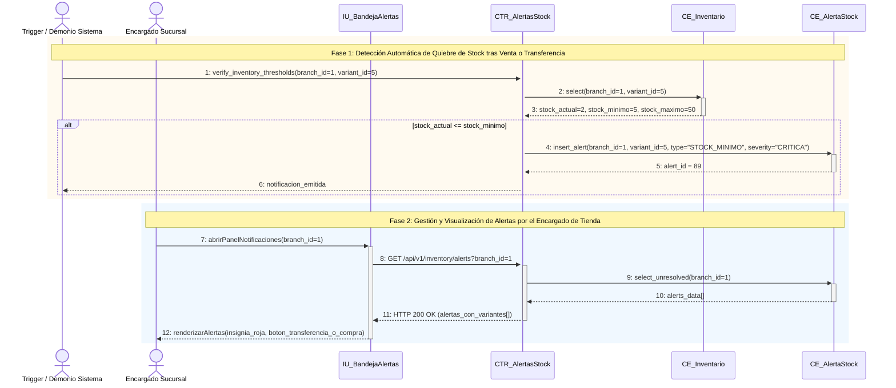

#### Desglose Paso a Paso (Nomenclatura Correlativa Formal):
- **`CU16[Paso 1: El demonio del sistema o evento de inventario invoca verify_inventory_thresholds(branch_id, variant_id) tras una salida o venta.]`**
- **`CU16[Paso 1.1: El controlador consulta los niveles actuales en CE_Inventario (select branch_id, variant_id).]`**
- **`CU16[Paso 1.2: [alt: stock_actual <= stock_minimo] Se genera un registro en CE_AlertaStock con severidad 'CRITICA' y tipo 'STOCK_MINIMO', emitiendo notificación.]`**
- **`CU16[Paso 2: El Encargado de Sucursal abre el panel de notificaciones en la interfaz (IU_BandejaAlertas).]`**
- **`CU16[Paso 2.1: La interfaz solicita las alertas activas no resueltas mediante GET /api/v1/inventory/alerts?branch_id=1.]`**
- **`CU16[Paso 2.2: El controlador consulta en CE_AlertaStock las alertas pendientes de atención y retorna HTTP 200 OK.]`**
- **`CU16[Paso 2.3: La interfaz renderiza las alertas con insignias de urgencia y enlaces de acción rápida a transferencias o compras.]`**

---
### CU17: Gestionar carrito de compra digital

- **Ciclo de Desarrollo:** Ciclo 2
- **Paquete de Arquitectura:** `paquete_ventas_y_pagos`
- **Actores involucrados:** Cliente
- **Actor Iniciador:** Cliente Autenticado
- **Propósito:** Permitir al comprador agregar prendas al carrito desde el catálogo o probador virtual, ajustar cantidades con validación de stock físico en tiempo real y preservar los artículos entre sesiones.
- **Precondición:** Cliente con sesión activa y prendas con existencias mayores a cero en la sucursal seleccionada.
- **Postcondición:** El carrito y sus artículos persisten en la base de datos con subtotales, descuentos e impuestos calculados.
- **Excepciones / Flujos Alternos:** E1: La prenda está temporalmente agotada en la sucursal elegida (stock = 0). E2: La cantidad solicitada supera las existencias físicas disponibles.

#### Trazabilidad en Código Fuente:
- **Backend Router:** [`backend/app/packages/paquete_ventas_y_pagos/routers.py`](file:///backend/app/packages/paquete_ventas_y_pagos/routers.py)
- **Backend Servicio:** [`backend/app/packages/paquete_ventas_y_pagos/services.py`](file:///backend/app/packages/paquete_ventas_y_pagos/services.py)
- **Frontend Web Component:** [`frontend-web/src/app/packages/paquete_ventas_y_pagos/cart/cart-modal.component.ts`](file:///frontend-web/src/app/packages/paquete_ventas_y_pagos/cart/cart-modal.component.ts)
- **Mobile Flutter View:** [`mobile/lib/src/packages/paquete_ventas_y_pagos/cart_view.dart`](file:///mobile/lib/src/packages/paquete_ventas_y_pagos/cart_view.dart)

#### Diagrama de Secuencia (Mermaid):
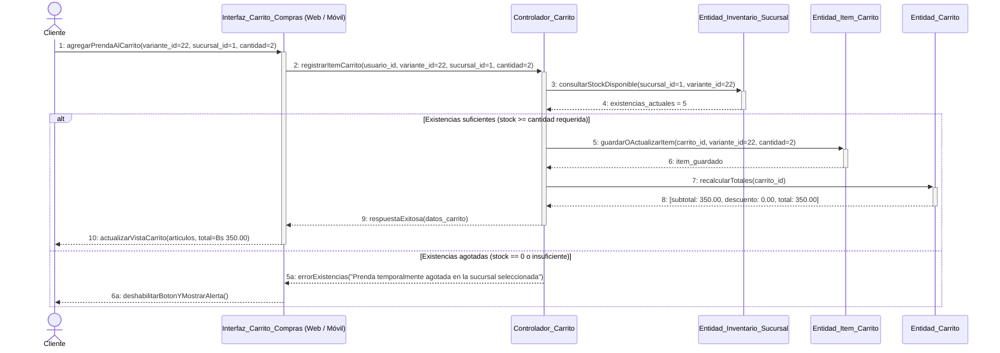

#### Desglose Paso a Paso (Nomenclatura Correlativa Formal):
- **`CU17[Paso 1: El cliente pulsa 'Añadir al Carrito' eligiendo talla, color y cantidad desde la ficha de prenda o el vestidor virtual.]`**
- **`CU17[Paso 1.1: La aplicación web o móvil envía la petición al controlador (POST /api/v1/sales/cart/items).]`**
- **`CU17[Paso 1.2: El controlador consulta las existencias físicas disponibles en la sucursal seleccionada en CE_Inventario_Sucursal.]`**
- **`CU17[Paso 1.3: [alt: Stock Suficiente] Se inserta o actualiza el registro en CE_Item_Carrito vinculándolo al carrito del usuario.]`**
- **`CU17[Paso 1.4: El controlador recalcula subtotales, cupones aplicables e impuestos en CE_Carrito y responde con estado 200 OK.]`**
- **`CU17[Paso 1.5: La interfaz actualiza el panel del carrito y el contador de prendas en la barra de navegación.]`**
- **`CU17[Paso 1.6: [alt: Stock Insuficiente/Agotado] Si no hay existencias suficientes, el sistema responde error 400 y bloquea la adición.]`**

---
### CU18: Procesar venta omnicanal (E-commerce / App Móvil)

- **Ciclo de Desarrollo:** Ciclo 2
- **Paquete de Arquitectura:** `paquete_ventas_y_pagos`
- **Actores involucrados:** Cliente Registrado, Pasarela de Pagos (PayPal / Stripe / Red Enlace / QR)
- **Actor Iniciador:** Cliente autenticado
- **Propósito:** Concretar la compra omnicanal permitiendo al comprador seleccionar obligatoriamente la modalidad de entrega (Retiro en Sucursal con plazo perentorio de custodia de 48 horas vs. Envío a Domicilio por Delivery) y el medio de pago mediante pasarela (PayPal, Tarjeta de Débito/Crédito, QR interoperable o Efectivo). Incorpora control estricto de timeout de pasarela de 5 minutos (300 segundos): si la pasarela no confirma en 5 minutos, la sesión de pago expira, la reserva se anula de inmediato regresando la prenda a disponible, y se despacha notificación push urgente al comprador informándole que no se realizó ningún cargo. Para retiro en sucursal, si transcurren las 48 horas sin ser recogida, la prenda retorna automáticamente al inventario de venta y se emite una Nota de Crédito al cliente para evitar pedidos acumulados.
- **Precondición:** Carrito de compras con al menos una prenda y existencias confirmadas en la sucursal designada.
- **Postcondición:** Orden creada con estado 'PAGADA' (o cancelada si expiró el timeout de 5 minutos), descuento de existencias en inventario, comprobante de pago emitido por la pasarela, factura tributaria generada con código de control/QR, carrito vaciado y guía de envío o entrega en tienda asignada con fecha límite de retiro (48h).
- **Excepciones / Flujos Alternos:** E1: Timeout de 5 minutos alcanzado en pasarela (anulación automática de reserva y aviso push sin cobro). E2: Pago rechazado o fondos insuficientes en la pasarela. E3: Quiebre de stock concurrente durante el proceso de pago (`StockInsuficienteException`). E4: Vencimiento del plazo de custodia de 48 horas para retiro en sucursal (reingreso a stock y generación de Nota de Crédito).

#### Trazabilidad en Código Fuente:
- **Backend Router:** [`backend/app/packages/paquete_ventas_y_pagos/routers.py`](file:///backend/app/packages/paquete_ventas_y_pagos/routers.py)
- **Backend Servicio:** [`backend/app/packages/paquete_ventas_y_pagos/paypal_service.py`](file:///backend/app/packages/paquete_ventas_y_pagos/paypal_service.py)
- **Frontend Web Component:** [`frontend-web/src/app/packages/paquete_ventas_y_pagos/cart/cart-modal.component.ts`](file:///frontend-web/src/app/packages/paquete_ventas_y_pagos/cart/cart-modal.component.ts)
- **Mobile Flutter View:** [`mobile/lib/src/packages/paquete_ventas_y_pagos/cart_view.dart`](file:///mobile/lib/src/packages/paquete_ventas_y_pagos/cart_view.dart)

#### Diagrama de Secuencia (Mermaid):
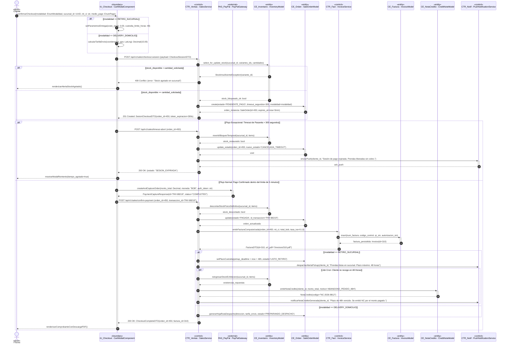

#### Desglose Paso a Paso (Nomenclatura Correlativa Formal):
- **`CU18[Paso 1: El cliente accede al Checkout desde el carrito de compras y define los datos de su pedido: modalidad de entrega obligatoria (Retiro en Tienda Física con 48h de custodia vs. Envío por Delivery), sucursal, datos de facturación NIT/CI y medio de pago.]`**
- **`CU18[Paso 1.1: [alt: Modalidad Retiro en Tienda] Si selecciona retiro en sucursal física, el costo de envío es Bs. 0.00 y se fija un plazo improrrogable de 48 horas para recoger las prendas. [alt: Modalidad Delivery] Si solicita delivery, se ingresa la dirección y se calcula la tarifa según coordenadas GPS y zona geográfica.]`**
- **`CU18[Paso 2: La interfaz envía la solicitud HTTP POST /api/v1/sales/checkout-session con el DTO validado al controlador CTR_Ventas.]`**
- **`CU18[Paso 3: El controlador bloquea temporalmente las existencias en CE_Inventario mediante SELECT FOR UPDATE y fija un temporizador estricto de 5 minutos (300 segundos) para la sesión de pago.]`**
- **`CU18[Paso 4: [alt: Expiración por Timeout de 5 Minutos] Si el cliente no completa el pago en la pasarela dentro de los 300 segundos, la orden pasa a 'CANCELADA_TIMEOUT', el stock bloqueado se libera de inmediato devolviendo la disponibilidad de la prenda a la tienda, y el sistema despacha una notificación push urgente informando que el tiempo expiró y no se le cobró nada.]`**
- **`CU18[Paso 5: [alt: Pago Exitoso en Tiempo Límite] La Pasarela de Pagos (PayPal) procesa el cobro satisfactoriamente y devuelve la confirmación con el identificador de captura antes de los 5 minutos.]`**
- **`CU18[Paso 6: Se descuenta definitivamente el stock físico en CE_Inventario, registrando el asiento de salida en el Kardex/LibroMayor.]`**
- **`CU18[Paso 7: Se registra la orden en estado 'PAGADA' y se asocian las referencias de transacción bancaria.]`**
- **`CU18[Paso 8: Se invoca al controlador fiscal CTR_Facturacion emitiendo la Factura Oficial computarizada con IVA 13%, código de control y QR tributario en CE_Factura_Fiscal.]`**
- **`CU18[Paso 9: [alt: Si es Retiro en Tienda] Se programa la orden en estado 'LISTO_RETIRO' con fecha límite de 48 horas. Si transcurren las 48 horas sin ser retirada, el stock retorna a exhibición en la sucursal y el sistema emite automáticamente una Nota de Crédito en CE_NotaCredito para su próxima compra sin acumular bultos en tienda.]`**
- **`CU18[Paso 10: [alt: Si es Delivery] Se genera la hoja de ruta de despacho y rastreo en CE_Envio asignando repartidor.]`**

---

### CU19: Procesar venta presencial en caja

- **Ciclo de Desarrollo:** Ciclo 2
- **Paquete de Arquitectura:** `paquete_ventas_y_pagos`
- **Actores involucrados:** Cajero
- **Actor Iniciador:** Cajero Autenticado frente a Mostrador con Turno Abierto
- **Propósito:** Registrar ventas directas en el terminal de Punto de Venta (POS) de la tienda física mediante cobro en efectivo con cálculo de vuelto en tiempo real, validación de turno de caja abierto, descuento inmediato de inventario físico, registro en kardex, emisión automática de factura fiscal con IVA 13% y disparo de hardware físico (impresión térmica ESC/POS para ticket de 80mm con apertura de gaveta de dinero).
- **Precondición:** Cajero con turno de caja activo en estado `ABIERTA` (`session_status = 'ABIERTA'`) asignado a la sucursal actual.
- **Postcondición:** Orden de venta creada en estado `COMPLETADO`, stock físico descontado con kardex `VENTA`, pago en efectivo registrado con vuelto exacto, factura computarizada oficial emitida e impresión térmica ejecutada con apertura de gaveta.
- **Excepciones / Flujos Alternos:**
  - `E1: Turno no abierto o expirado`: Se aborta con HTTP 403 (`TurnoInvalidoException`).
  - `E2: Stock insuficiente`: Se aborta con HTTP 409 antes de comprometer la transacción.
  - `E3: Efectivo recibido menor al total`: Se aborta con HTTP 400 exigiendo cubrir el importe completo.

#### Trazabilidad en Código Fuente y Arquitectura BCE:
- **Actor:** `Cajero`
- **Boundary (IU):** `IU_POS` ([`frontend-web/src/app/packages/paquete_ventas_y_pagos/pos/pos.component.ts`](file:///frontend-web/src/app/packages/paquete_ventas_y_pagos/pos/pos.component.ts))
- **Controlador:** `CTR_POS` ([`backend/app/packages/paquete_ventas_y_pagos/routers.py`](file:///backend/app/packages/paquete_ventas_y_pagos/routers.py) - `POST /api/v1/pos/orders`)
- **Entidad 1:** `CE_SesionCaja` ([`backend/app/packages/paquete_ventas_y_pagos/models.py`](file:///backend/app/packages/paquete_ventas_y_pagos/models.py) - `CashShift`)
- **Entidad 2:** `CE_Inventario` ([`backend/app/packages/paquete_inventario_y_proveedores/merchandise/models.py`](file:///backend/app/packages/paquete_inventario_y_proveedores/merchandise/models.py) - `Inventory`, `InventoryLedger`)
- **Entidad 3:** `CE_Orden` ([`backend/app/packages/paquete_ventas_y_pagos/models.py`](file:///backend/app/packages/paquete_ventas_y_pagos/models.py) - `Order`, `OrderItem`)
- **Entidad 4:** `CE_Pago` ([`backend/app/packages/paquete_ventas_y_pagos/models.py`](file:///backend/app/packages/paquete_ventas_y_pagos/models.py) - `Payment`)
- **Controlador Auxiliar:** `CTR_Facturacion` ([`backend/app/packages/paquete_ventas_y_pagos/routers.py`](file:///backend/app/packages/paquete_ventas_y_pagos/routers.py) - Emisión computarizada IVA 13%)
- **Entidad 5:** `CE_Factura` ([`backend/app/packages/paquete_ventas_y_pagos/models.py`](file:///backend/app/packages/paquete_ventas_y_pagos/models.py) - `Invoice`)
- **Dispositivo Externo:** `EXT_Impresora` (Controlador ESC/POS para impresora térmica de 80mm y solenoide de gaveta)

#### Diagrama de Secuencia (Mermaid):
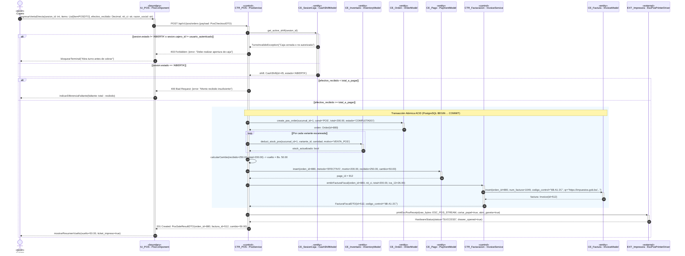

#### Desglose Paso a Paso (Nomenclatura Correlativa Formal):
- **`CU19[Paso 1: El cajero ingresa al terminal de punto de venta los ítems escaneados, el total a pagar (Bs. 200.00), el efectivo recibido (Bs. 250.00) y los datos fiscales (NIT/CI).]`**
- **`CU19[Paso 2: La interfaz envía la solicitud HTTP POST /api/v1/pos/orders con el DTO validado al controlador CTR_POS adjuntando el session_id de la caja activa.]`**
- **`CU19[Paso 3: El controlador consulta CE_SesionCaja verificando que el turno se encuentre con session_status = 'ABIERTA'; si no lo está, rechaza la operación con error 403 Forbidden.]`**
- **`CU19[Paso 4: [Transacción ACID] Se crea el registro de la venta en CE_Orden con canal='POS' y estado='COMPLETADO'.]`**
- **`CU19[Paso 5: [loop: Por cada variante] Se descuenta el stock físico en CE_Inventario y se registra el egreso en el Kardex.]`**
- **`CU19[Paso 6: Se calcula el vuelto exacto (Bs. 50.00) y se persiste el pago en efectivo en CE_Pago vinculando recibido y cambio.]`**
- **`CU19[Paso 7: Se delega a CTR_Facturacion la emisión de la factura computarizada oficial con IVA 13% y código de control en CE_Factura.]`**
- **`CU19[Paso 8: Se despacha la trama binaria ESC/POS a EXT_Impresora para imprimir el ticket de 80mm y enviar el pulso de apertura de la gaveta de dinero.]`**
- **`CU19[Paso 9: La interfaz recibe la confirmación exitosa y despliega el monto de vuelto que el cajero debe entregar al cliente.]`**

---

### CU20: Emitir factura y nota de entrega (IVA 13 %, código de control)

- **Ciclo de Desarrollo:** Ciclo 2
- **Paquete de Arquitectura:** `paquete_ventas_y_pagos`
- **Actores involucrados:** Cajero, Sistema Automático
- **Actor Iniciador:** Sistema al concretar Venta (CU18 / CU19 / CU25)
- **Propósito:** Generar el documento tributario oficial con desglose del 13 % de IVA, código de control computarizado y formato imprimible en PDF o ticket térmico.
- **Precondición:** Orden de venta pagada exitosamente.
- **Postcondición:** Factura generada con número correlativo, código de control y estado EMITIDA.
- **Excepciones / Flujos Alternos:** E1: Factura ya emitida para la orden actual.

#### Trazabilidad en Código Fuente:
- **Backend Router:** [`backend/app/packages/paquete_ventas_y_pagos/routers.py`](file:///backend/app/packages/paquete_ventas_y_pagos/routers.py)
- **Backend Servicio:** [`backend/app/packages/paquete_ventas_y_pagos/services.py`](file:///backend/app/packages/paquete_ventas_y_pagos/services.py)
- **Frontend Web Component:** [`frontend-web/src/app/packages/paquete_ventas_y_pagos/invoices/invoice-viewer.component.ts`](file:///frontend-web/src/app/packages/paquete_ventas_y_pagos/invoices/invoice-viewer.component.ts)

#### Diagrama de Secuencia (Mermaid):
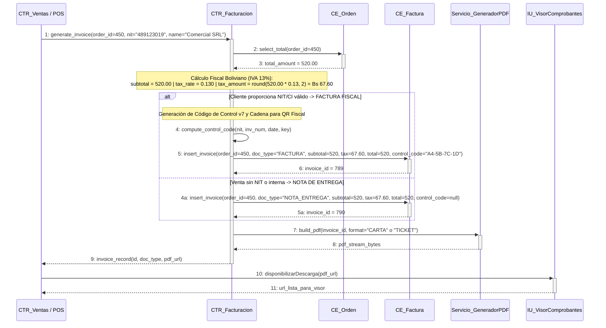

#### Desglose Paso a Paso (Nomenclatura Correlativa Formal):
- **`CU20[Paso 1: Al confirmarse cualquier venta (checkout digital, POS en caja o cotización convertida), el motor de ventas invoca la emisión de comprobante.]`**
- **`CU20[Paso 1.1: El controlador fiscal consulta el total de la orden en orders (CE_Orden) y calcula el IVA 13% (tax_amount = round(total * 0.13, 2)).]`**
- **`CU20[Paso 1.2: [alt: Con NIT/CI] Se ejecuta el algoritmo de Código de Control v7 en base al NIT, número de autorización y fecha.]`**
- **`CU20[Paso 1.3: Se persiste el comprobante fiscal en la tabla invoices (CE_Factura) con doc_type = 'FACTURA'.]`**
- **`CU20[Paso 1.4: [alt: Sin NIT / Nota de Entrega] Se guarda el documento sin código de control con doc_type = 'NOTA_ENTREGA'.]`**
- **`CU20[Paso 1.5: Se renderiza el comprobante en formato PDF imprimible (tamaño carta o rollo térmico POS) y se pone a disposición del cliente y cajero.]`**

---
### CU21: Generar y convertir cotización comercial

- **Ciclo de Desarrollo:** Ciclo 2
- **Paquete de Arquitectura:** `paquete_ventas_y_pagos`
- **Actores involucrados:** Encargado de Sucursal, Cliente
- **Actor Iniciador:** Personal Administrativo o Cliente
- **Propósito:** Crear presupuestos formales de prendas con validez de hasta 15 días, sin bloquear stock físico, con opción de conversión directa a venta en 1 clic.
- **Precondición:** Prendas activas en el catálogo.
- **Postcondición:** Cotización creada con código COT-XXXXXX y estado VIGENTE.
- **Excepciones / Flujos Alternos:** E1: Conversión de cotización expirada.

#### Trazabilidad en Código Fuente:
- **Backend Router:** [`backend/app/packages/paquete_ventas_y_pagos/routers.py`](file:///backend/app/packages/paquete_ventas_y_pagos/routers.py)
- **Backend Servicio:** [`backend/app/packages/paquete_ventas_y_pagos/services.py`](file:///backend/app/packages/paquete_ventas_y_pagos/services.py)
- **Frontend Web Component:** [`frontend-web/src/app/packages/paquete_ventas_y_pagos/quotations/quotation-modal.component.ts`](file:///frontend-web/src/app/packages/paquete_ventas_y_pagos/quotations/quotation-modal.component.ts)


#### Diagrama de Secuencia (Mermaid):
```mermaid
sequenceDiagram
    actor C as Cajero / Cliente
    participant IU as IU_GenerarCotizacion
    participant CTR as CTR_Cotizaciones
    participant CE_V as CE_VariantePrenda
    participant CE_Q as CE_Cotizacion
    participant CE_D as CE_DetalleCotizacion
    participant PDF as Servicio_GeneradorPDF

    C->>+IU: 1: iniciarCotizacion(cliente_datos, vigencia_dias=15)
    IU->>+CTR: 2: POST /api/v1/sales/quotations (payload)
    loop Por cada prenda cotizada
        CTR->>+CE_V: 3: get_variant_info(variant_id)
        CE_V-->>-CTR: 4: precio_base, descuento_vigente
    end
    CTR->>+CE_Q: 5: insert_quotation(cliente_datos, vigencia, status='VIGENTE')
    CE_Q-->>-CTR: 6: quotation_id = 72, code = "COT-2026-00072"
    loop Por cada ítem
        CTR->>+CE_D: 7: insert_detail(quotation_id=72, variant_id, qty, unit_price)
        CE_D-->>-CTR: 8: ok
    end
    CTR->>+PDF: 9: build_quotation_pdf(quotation_id=72)
    PDF-->>-CTR: 10: pdf_bytes, download_url
    CTR-->>-IU: 11: HTTP 201 Created (code="COT-2026-00072", total=750.00, pdf_url)
    IU-->>-C: 12: mostrarCotizacionGenerada(code, pdf_url)
```

#### Desglose Paso a Paso (Nomenclatura Correlativa Formal):
- **`CU21[Paso 1: El cajero o cliente ingresa datos del cliente y prendas a presupuestar con vigencia de hasta 15 días.]`**
- **`CU21[Paso 1.1: La interfaz envía la solicitud de cotización (POST /api/v1/sales/quotations).]`**
- **`CU21[Paso 1.2: [loop: Por cada ítem] El controlador consulta en CE_VariantePrenda el precio unitario y promociones aplicables.]`**
- **`CU21[Paso 1.3: Se crea la cabecera en CE_Cotizacion en estado 'VIGENTE' asignando código correlativo (COT-AAAA-XXXXXX).]`**
- **`CU21[Paso 1.4: [loop: Por cada ítem] Se insertan las líneas en CE_DetalleCotizacion sin reservar ni bloquear stock físico.]`**
- **`CU21[Paso 1.5: Se genera el documento formal en PDF mediante el servicio de reportería Servicio_GeneradorPDF.]`**
- **`CU21[Paso 1.6: Se retorna HTTP 201 Created y se disponibiliza el PDF para descarga o conversión futura a venta (CU19).]`**

---

### CU22: Gestionar devoluciones y cambios de prendas

- **Ciclo de Desarrollo:** Ciclo 2
- **Paquete de Arquitectura:** paquete_ventas_y_pagos
- **Actores involucrados:** Encargado de Sucursal / Cajero
- **Actor Iniciador:** Cliente que presenta factura / Encargado de Sucursal
- **Propósito:** Procesar devoluciones definitivas o cambios de prendas (por talla o por modelo) ingresando el código de la factura oficial, validando estrictamente que no hayan transcurrido más de 14 días (2 semanas) desde la compra. En cambios por talla se mantiene el mismo costo; en cambios por modelo, si la nueva prenda es de mayor precio se cobra la diferencia, y si es de menor precio se emite automáticamente una Nota de Crédito para su próxima compra (cero devolución en efectivo).
- **Precondición:** Existencia de factura de compra emitida con un plazo máximo de 14 días (2 semanas) de antigüedad y prendas en óptimas condiciones comerciales.
- **Postcondición:** Registro de la devolución o cambio (order_returns), actualización de stock en inventario y libro mayor, emisión de Nota de Crédito por saldo a favor o cobro de diferencia tributaria, y entrega de comprobante oficial.
- **Excepciones / Flujos Alternos:** E1: Plazo de garantía de 14 días (2 semanas) vencido (bloqueo automático del trámite). E2: Código de factura inexistente o prenda no registrada en la venta. E3: Quiebre de stock en sucursal para la talla o modelo de reemplazo seleccionado.

#### Trazabilidad en Código Fuente:
- **Backend Router:** [ackend/app/packages/paquete_ventas_y_pagos/routers.py](file:///backend/app/packages/paquete_ventas_y_pagos/routers.py)
- **Backend Servicio:** [ackend/app/packages/paquete_ventas_y_pagos/services.py](file:///backend/app/packages/paquete_ventas_y_pagos/services.py)
- **Frontend Web Component:** [rontend-web/src/app/packages/paquete_ventas_y_pagos/returns/returns-management.component.ts](file:///frontend-web/src/app/packages/paquete_ventas_y_pagos/returns/returns-management.component.ts)

#### Diagrama de Secuencia (Mermaid):
`mermaid
sequenceDiagram
    actor C as Cajero_Encargado
    participant IU as IU_Gestion_Devoluciones
    participant CTR as CTR_Devoluciones_Y_Cambios
    participant CE_F as Entidad_Factura
    participant CE_O as Entidad_Orden
    participant CE_I as Entidad_Inventario
    participant CE_OD as Entidad_OrdenDevolucion
    participant CE_NC as Entidad_NotaCredito
    participant CE_S as Entidad_SesionCaja

    C->>+IU: 1: ingresarCodigoFactura(codigo_factura='FAC-10024')
    IU->>+CTR: 2: GET /api/v1/sales/invoices/by-code/FAC-10024
    CTR->>+CE_F: 3: buscarFacturaConItems(codigo_factura)
    CE_F-->>-CTR: 4: {factura_id: 85, orden_id: 301, fecha: '2026-09-15', items: [{var_id: 14, nombre: 'Blusa Seda', precio: 220.00}]}
    
    Note over CTR: Validación Plazo Estricto: delta_dias = HOY - fecha_compra
    alt delta_dias > 14 dias (2 Semanas Vencidas)
        CTR-->>IU: 5a: HTTP 400 Bad Request ('Plazo vencido: Han pasado más de 14 días (2 semanas) desde la compra')
        IU-->>C: 6a: mostrarInsigniaRojaBloqueo('Garantía Expirada - No procede devolución ni cambio')
    else delta_dias <= 14 dias (Garantía Vigente 2 Semanas)
        CTR-->>-IU: 5b: HTTP 200 OK (items_factura, garantia_valida=true, dias_restantes)
        IU-->>C: 6b: mostrarPrendasCompradas(tabla_prendas, selector_accion)
        
        alt Acción Seleccionada: CAMBIO POR TALLA (Mismo Modelo / Mismo SKU)
            C->>+IU: 7a: solicitarCambioTalla(var_id_origen=14, talla_nueva='M')
            IU->>+CTR: 8a: POST /api/v1/sales/returns (tipo='CAMBIO_TALLA', var_id=14, rep_id=18)
            CTR->>+CE_I: 9a: reingresarStock(var_id=14, qty=+1) y descontarStock(var_id=18, qty=-1)
            CE_I-->>-CTR: 10a: inventario_actualizado_ok
            CTR->>+CE_OD: 11a: registrarComprobante(tipo='CAMBIO_TALLA', diferencia=0.00)
            CE_OD-->>-CTR: 12a: return_id = 91
            CTR-->>-IU: 13a: cambioExitoso(return_id=91, diferencia=0.00)
            IU-->>-C: 14a: emitirComprobanteCambioEntregaPrenda()

        else Acción Seleccionada: CAMBIO POR MODELO (Diferente Prenda / Diferente Precio)
            C->>+IU: 7b: solicitarCambioModelo(var_id_origen=14, modelo_nuevo_var_id=32)
            IU->>+CTR: 8b: POST /api/v1/sales/returns (tipo='CAMBIO_MODELO', var_id=14, rep_id=32)
            CTR->>+CE_I: 9b: intercambiarStock(var_devuelta=+1, var_nueva=-1)
            CE_I-->>-CTR: 10b: stock_ajustado
            
            alt [Subflujo Precio Nuevo > Precio Antiguo (Prenda más cara)]
                Note over CTR,CE_S: Cobro de la diferencia al cliente
                CTR->>+CE_S: 11b: cobrarDiferenciaEnCaja(monto_diferencia = Bs 50.00)
                CE_S-->>-CTR: 12b: cobro_asentado
                CTR->>+CE_OD: 13b: registrarCambio(diferencia_cobrada = Bs 50.00)
                CE_OD-->>-CTR: 14b: return_id = 92
                CTR-->>IU: 15b: cambioConfirmado(monto_a_cobrar=50.00)
                IU-->>C: 16b: cobrarDiferenciaYEntregarNuevaPrenda()
            else [Subflujo Precio Nuevo < Precio Antiguo (Prenda más barata)]
                Note over CTR,CE_NC: Emisión obligatoria de Nota de Crédito (Cero devolución en efectivo)
                CTR->>+CE_NC: 11c: emitirNotaCredito(cliente_id, saldo_a_favor = Bs 40.00, motivo='CAMBIO_MODELO_MENOR_VALOR')
                CE_NC-->>-CTR: 12c: codigo_nc = 'NC-2026-0045'
                CTR->>+CE_OD: 13c: registrarCambio(nota_credito_id=45, saldo_a_favor=40.00)
                CE_OD-->>-CTR: 14c: return_id = 93
                CTR-->>-IU: 15c: cambioConfirmadoConNotaCredito(codigo_nc='NC-2026-0045', saldo=40.00)
                IU-->>-C: 16c: imprimirNotaCreditoParaProximaCompraYEntregarPrenda()
            end

        else Acción Seleccionada: DEVOLUCIÓN DEFINITIVA
            C->>+IU: 7c: solicitarDevolucion(var_id=14, motivo='Falla técnica')
            IU->>+CTR: 8c: POST /api/v1/sales/returns (tipo='DEVOLUCION_DINERO', var_id=14)
            CTR->>+CE_I: 9c: reingresarStockAInventario(var_id=14, qty=+1)
            CE_I-->>-CTR: 10c: stock_reingresado
            CTR->>+CE_NC: 11d: generarNotaCreditoOReembolso(cliente_id, monto=220.00)
            CE_NC-->>-CTR: 12d: comprobante_emitido
            CTR-->>-IU: 13d: devolucionProcesada()
            IU-->>-C: 14d: comprobanteFinalizado()
        end
    end
`

#### Desglose Paso a Paso (Nomenclatura Correlativa Formal):
- **CU22[Paso 1: El cajero o encargado de sucursal ingresa el código o número correlativo de la Factura de compra oficial (ej. 'FAC-10024' o código de control) en la interfaz de gestión de devoluciones.]**
- **CU22[Paso 1.1: La interfaz despacha la consulta de la factura al controlador (GET /api/v1/sales/invoices/by-code/{invoice_code}).]**
- **CU22[Paso 1.2: El controlador recupera los datos de la venta y calcula los días transcurridos desde la fecha de compra: delta_dias = HOY - fecha_compra.]**
- **CU22[Paso 1.3: [alt: Plazo Vencido] Si delta_dias > 14 días (2 semanas), el controlador bloquea de forma taxativa la operación respondiendo HTTP 400 Bad Request, impidiendo cualquier cambio o devolución por superación del plazo de garantía reglamentario.]**
- **CU22[Paso 1.4: [alt: Garantía Vigente] Si delta_dias <= 14 días, la interfaz despliega las prendas detalladas en la factura y habilita las opciones: Cambio por Talla, Cambio por Modelo o Devolución Definitiva.]**
- **CU22[Paso 2: [alt: Cambio por Talla] El cajero selecciona la prenda comprada y la nueva talla deseada (mismo SKU/modelo). El sistema verifica disponibilidad en la sucursal, reingresa la talla anterior, descuenta la nueva y emite el comprobante de cambio con diferencia Bs. 0.00.]**
- **CU22[Paso 3: [alt: Cambio por Modelo - Prenda más costosa] Si el cliente escoge un modelo distinto de mayor precio, el sistema calcula la diferencia (precio_nuevo - precio_antiguo) y solicita su cobro inmediato en caja o pasarela antes de despachar la prenda.]**
- **CU22[Paso 4: [alt: Cambio por Modelo - Prenda más económica] Si el nuevo modelo es de menor precio, no se realiza devolución en dinero en efectivo; el sistema genera automáticamente una Nota de Crédito oficial (CE_NotaCredito) por el saldo a favor para que el cliente lo use en su siguiente compra.]**
- **CU22[Paso 5: [alt: Devolución Definitiva] Se aprueba el reingreso al inventario de la sucursal, se asienta el movimiento en el Kardex y se emite la Nota de Crédito o comprobante de reembolso correspondiente.]**

### CU23: Gestionar arqueo de caja (apertura y cierre ciego)

- **Ciclo de Desarrollo:** Ciclo 2
- **Paquete de Arquitectura:** `paquete_ventas_y_pagos`
- **Actores involucrados:** Cajero, Encargado
- **Actor Iniciador:** Cajero Autenticado
- **Propósito:** Controlar los flujos de dinero físico en cada turno mediante apertura con fondo de cambio y cierre ciego, calculando automáticamente faltantes o sobrantes.
- **Precondición:** El cajero no debe tener otro turno abierto en simultáneo en la misma sucursal.
- **Postcondición:** Turno de caja cerrado con reporte detallado de ventas en efectivo, tarjeta, QR y diferencias cuadradas.
- **Excepciones / Flujos Alternos:** E1: Intento de operar sin haber abierto turno de caja.

#### Trazabilidad en Código Fuente:
- **Backend Router:** [`backend/app/packages/paquete_ventas_y_pagos/routers.py`](file:///backend/app/packages/paquete_ventas_y_pagos/routers.py)
- **Backend Servicio:** [`backend/app/packages/paquete_ventas_y_pagos/services.py`](file:///backend/app/packages/paquete_ventas_y_pagos/services.py)
- **Frontend Web Component:** [`frontend-web/src/app/packages/paquete_ventas_y_pagos/cash-shifts/cash-shift.component.ts`](file:///frontend-web/src/app/packages/paquete_ventas_y_pagos/cash-shifts/cash-shift.component.ts)

#### Diagrama de Secuencia (Mermaid):
```mermaid
sequenceDiagram
    actor C as Cajero
    participant IU as IU_ArqueoCaja
    participant CTR as CTR_Arqueo
    participant CE_S as CE_SesionCaja
    participant CE_P as CE_MedioDePago
    participant CE_D as CE_OrdenDevolucion

    rect rgb(255, 250, 240)
    Note over C,CE_D: Fase 1: Apertura de Turno de Caja al Iniciar la Jornada
    C->>+IU: 1: abrirTurno(monto_inicial_efectivo=200.00)
    IU->>+CTR: 2: POST /api/v1/sales/shifts/open (user_id, branch_id=1, opening_amount=200.00)
    CTR->>+CE_S: 3: check_active_sessions(user_id)
    CE_S-->>-CTR: 4: active_sessions = 0
    CTR->>+CE_S: 5: insert(user_id, branch_id=1, opening_amount=200.00, status='ABIERTA')
    CE_S-->>-CTR: 6: session_id = 45
    CTR-->>-IU: 7: HTTP 201 Created (session_id=45)
    IU-->>-C: 8: habilitarModuloPOS()
    end

    Note over C,CE_D: Operación Normal del Turno: Cobros en Mostrador (CU19) y Devoluciones (CU22)

    rect rgb(240, 248, 255)
    Note over C,CE_D: Fase 2: Cierre de Turno y Arqueo Ciego de Gaveta
    C->>+IU: 9: cerrarTurno(session_id=45, monto_declarado_cajero=1450.00)
    IU->>+CTR: 10: POST /api/v1/sales/shifts/45/close (declared_amount=1450.00)
    CTR->>+CE_P: 11: sum_cash_sales_by_session(session_id=45)
    CE_P-->>-CTR: 12: ventas_efectivo = 1430.00
    CTR->>+CE_D: 13: sum_cash_refunds_by_session(session_id=45)
    CE_D-->>-CTR: 14: devoluciones_efectivo = 180.00
    Note over CTR: Cálculo Teórico Esperado:<br/>Esperado = 200.00 (Apertura) + 1430.00 (Ventas) - 180.00 (Devoluciones) = Bs. 1450.00<br/>Diferencia = Declarado (1450.00) - Esperado (1450.00) = Bs. 0.00 (Cuadre Conforme)
    CTR->>+CE_S: 15: update(45, declared=1450.00, expected=1450.00, diff=0.00, status='CERRADA')
    CE_S-->>-CTR: 16: session_closed_ok
    CTR-->>-IU: 17: HTTP 200 OK (reporte_arqueo)
    IU-->>-C: 18: imprimirArqueo(diferencia=0.00, status='CUADRADO')
    end
```

#### Desglose Paso a Paso (Nomenclatura Correlativa Formal):
- **`CU23[Paso 1: [Apertura de Caja] El cajero ingresa el fondo de caja inicial en efectivo (ej. Bs. 200.00) al comenzar su turno.]`**
- **`CU23[Paso 1.1: La interfaz envía la apertura (POST /api/v1/sales/shifts/open).]`**
- **`CU23[Paso 1.2: El controlador valida que el usuario no tenga ya un turno abierto en ninguna sucursal.]`**
- **`CU23[Paso 1.3: Se inserta el registro en cash_shifts (CE_SesionCaja) con status = 'ABIERTA' y se habilita el módulo de venta POS.]`**
- **`CU23[Paso 2: [Cierre Ciego] Al concluir la jornada, el cajero cuenta los billetes en gaveta e introduce su monto contado sin ver el sistema.]`**
- **`CU23[Paso 2.1: La interfaz solicita el cierre (POST /api/v1/sales/shifts/{id}/close con declared_amount).]`**
- **`CU23[Paso 2.2: El controlador suma automáticamente las ventas en efectivo del turno en payments (CE_MedioDePago).]`**
- **`CU23[Paso 2.3: El controlador resta las devoluciones en efectivo del turno registradas en order_returns (CE_OrdenDevolucion).]`**
- **`CU23[Paso 2.4: Se calcula el esperado (Apertura + Ventas - Devoluciones) y la diferencia matemática (Declarado - Esperado), guardando el turno como 'CERRADA' e imprimiendo el arqueo.]`**

---
### CU24: Consultar historial de compras

- **Ciclo de Desarrollo:** Ciclo 2
- **Paquete de Arquitectura:** `paquete_ventas_y_pagos`
- **Actores involucrados:** Cliente
- **Actor Iniciador:** Cliente Autenticado
- **Propósito:** Permitir al comprador revisar todas sus órdenes de compra pasadas, estados de entrega, facturas digitales y detalle de prendas adquiridas.
- **Precondición:** Cliente autenticado con sesión activa.
- **Postcondición:** La interfaz despliega la lista cronológica de pedidos con accesos directos a comprobantes y seguimiento.
- **Excepciones / Flujos Alternos:** Ninguna. Si no tiene compras se muestra una invitación a la tienda.

#### Trazabilidad en Código Fuente:
- **Backend Router:** [`backend/app/packages/paquete_ventas_y_pagos/routers.py`](file:///backend/app/packages/paquete_ventas_y_pagos/routers.py)
- **Backend Servicio:** [`backend/app/packages/paquete_ventas_y_pagos/services.py`](file:///backend/app/packages/paquete_ventas_y_pagos/services.py)
- **Frontend Web Component:** [`frontend-web/src/app/packages/paquete_ventas_y_pagos/orders/order-history.component.ts`](file:///frontend-web/src/app/packages/paquete_ventas_y_pagos/orders/order-history.component.ts)
- **Mobile Flutter View:** [`mobile/lib/src/packages/paquete_ventas_y_pagos/order_history_view.dart`](file:///mobile/lib/src/packages/paquete_ventas_y_pagos/order_history_view.dart)

#### Diagrama de Secuencia (Mermaid):
```mermaid
sequenceDiagram
    actor C as Cliente
    participant IU as IU_HistorialCompras (Web / Móvil)
    participant CTR as CTR_Historial
    participant CE_O as CE_Orden
    participant CE_IO as CE_ItemOrden
    participant CE_P as CE_MedioDePago
    participant CE_F as CE_Factura (invoices)

    C->>+IU: 1: presionarPestanaMisCompras()
    IU->>+CTR: 2: GET /api/v1/sales/orders/my-orders (token_jwt)
    CTR->>+CE_O: 3: select_orders_by_user(user_id, order_by_created_at_desc)
    CE_O-->>-CTR: 4: orders_summary[]
    CTR-->>-IU: 5: HTTP 200 OK (orders_list)
    IU-->>-C: 6: renderizarTarjetasPedidos(num_orden, fecha, total_bs, canal)

    C->>+IU: 7: verDetalleOrden(order_id=450)
    IU->>+CTR: 8: GET /api/v1/sales/orders/450
    rect rgb(250, 250, 250)
    Note over CTR,CE_F: Carga en Cascada del Detalle de Orden
    CTR->>+CE_IO: 9: select_items_with_product(order_id=450)
    CE_IO-->>-CTR: 10: items[(sku, product_name, color, size, price, qty)]
    CTR->>+CE_P: 11: select_payment_details(order_id=450)
    CE_P-->>-CTR: 12: payment_type: "TARJETA", last4: "4512"
    CTR->>+CE_F: 13: select_invoice(order_id=450)
    CE_F-->>-CTR: 14: doc_type: "FACTURA", total: 520.00, pdf_path: "/pdf/0450.pdf"
    end
    CTR-->>-IU: 15: HTTP 200 OK (order_complete_profile)
    IU-->>-C: 16: mostrarModalDetalle(prendas, desglose_iva, descargar_factura)

    C->>+IU: 17: presionarDescargarFactura()
    IU-->>-C: 18: descargarArchivoPDF(Factura_ORD-450.pdf)
```

#### Desglose Paso a Paso (Nomenclatura Correlativa Formal):
- **`CU24[Paso 1: El cliente autenticado hace clic en 'Mis compras' en la web (/tienda/pedidos) o en la app móvil.]`**
- **`CU24[Paso 1.1: La interfaz consulta la lista de pedidos del usuario (GET /api/v1/sales/orders/my-orders).]`**
- **`CU24[Paso 1.2: El controlador recupera las órdenes ordenadas por fecha en orders (CE_Orden) y las despliega en tarjetas con número y estado.]`**
- **`CU24[Paso 2: El cliente selecciona un pedido para ver el detalle pormenorizado.]`**
- **`CU24[Paso 2.1: La interfaz solicita el detalle completo (GET /api/v1/sales/orders/{id}).]`**
- **`CU24[Paso 2.2: El backend realiza la carga en cascada: ítems adquiridos con fotos y variantes (CE_ItemOrden), comprobante fiscal emitido (CE_Factura) y medios de pago aplicados (CE_MedioDePago).]`**
- **`CU24[Paso 3: El cliente puede pulsar 'Descargar Factura' para abrir o imprimir el archivo PDF oficial generado.]`**

---
### CU25: Convertir una reserva en venta confirmada

- **Ciclo de Desarrollo:** Ciclo 3
- **Paquete de Arquitectura:** `paquete_reservas_y_citas`
- **Actores involucrados:** Cajero, Encargado
- **Actor Iniciador:** Personal de Tienda al presentarse el Cliente
- **Propósito:** Atender la cita del cliente en tienda física tras probarse las prendas reservadas, descontando la seña abonada previamente (50%) y cobrando el saldo restante en caja.
- **Precondición:** Reserva en estado PENDING, PREPARING o READY con seña pagada.
- **Postcondición:** Las prendas probadas y aceptadas se facturan como venta, las no adquiridas se liberan al inventario y la reserva queda COMPLETADA.
- **Excepciones / Flujos Alternos:** E1: Reserva cancelada o vencida por inasistencia (no-show).

#### Trazabilidad en Código Fuente:
- **Backend Router:** [`backend/app/packages/paquete_reservas_y_citas/routers.py`](file:///backend/app/packages/paquete_reservas_y_citas/routers.py)
- **Backend Servicio:** [`backend/app/packages/paquete_reservas_y_citas/services.py`](file:///backend/app/packages/paquete_reservas_y_citas/services.py)
- **Frontend Web Component:** [`frontend-web/src/app/packages/paquete_reservas_y_citas/reservation-desk/reservation-desk.component.ts`](file:///frontend-web/src/app/packages/paquete_reservas_y_citas/reservation-desk/reservation-desk.component.ts)


#### Diagrama de Secuencia (Mermaid):
```mermaid
sequenceDiagram
    actor C as Cajero
    participant IU as IU_POS_Reservas
    participant CTR as CTR_Reservas
    participant CE_TC as CE_TurnoCaja
    participant CE_O as CE_Orden
    participant CE_I as CE_Inventario
    participant CE_R as CE_Reserva

    C->>+IU: 1: seleccionarReserva(reservation_id)
    IU->>+CTR: 2: convert_to_pos(reservation_id, items, payment, NIT)
    CTR->>+CE_TC: 3: validar_turno_abierto(cashier_id, branch_id)
    CE_TC-->>-CTR: 4: turno (status: ABIERTO)
    opt E1: Caja no abierta o de otro cajero/sucursal
        Note over CTR: HTTP 400 / 403 Sesión Inválida
    end
    CTR->>+CE_R: 5: get_reservation(reservation_id)
    CE_R-->>-CTR: 6: reserva (items, deposit_amount)
    opt E2: Stock insuficiente o prendas rechazadas
        CTR->>+CE_I: 7: reponer_no_comprados(variant_ids)
        CE_I-->>-CTR: 8: stock_restaurado
    end
    CTR->>+CE_O: 9: insert_order(POS, items, turno)
    CE_O-->>-CTR: 10: order_id
    CTR->>+CE_O: 11: insert_payment(saldo, medio)
    CTR->>+CE_O: 12: insert_invoice(IVA 13%, NIT)
    CE_O-->>-CTR: 13: invoice (control_code)
    CTR->>+CE_R: 14: update_status = COMPLETED
    CE_R-->>-CTR: 15: ok
    CTR-->>-IU: 16: OrderResponse (order, invoice)
    IU-->>-C: 17: Mostrar comprobante y reserva completada
```

#### Desglose Paso a Paso (Nomenclatura Correlativa Formal):
- **`CU25[Paso 1: El cajero busca la reserva activa por código (RES-XXXXXX) o cliente al presentarse físicamente en tienda.]`**
- **`CU25[Paso 1.1: La interfaz invoca la conversión a venta POS (POST /api/v1/reservations/{id}/convert).]`**
- **`CU25[Paso 1.2: El controlador valida que el cajero tenga una sesión de caja abierta y activa (CE_TurnoCaja).]`**
- **`CU25[Paso 1.3: Se recuperan las prendas reservadas y el anticipo monetario cobrado previamente (CE_Reserva).]`**
- **`CU25[Paso 1.4: [opt: Prendas no compradas] Las prendas que el cliente probó pero no decidió adquirir reingresan a CE_Inventario.]`**
- **`CU25[Paso 1.5: Se crea la orden formal de venta en CE_Orden descontando el anticipo del total final.]`**
- **`CU25[Paso 1.6: Se asienta el cobro del saldo restante y se emite la factura o nota fiscal boliviana.]`**
- **`CU25[Paso 1.7: La reserva pasa irreversiblemente a estado 'COMPLETADA' (CE_Reserva) y se imprime el ticket de compra.]`**

---

### CU26: Agendar reserva de prendas para prueba física

- **Ciclo de Desarrollo:** Ciclo 3
- **Paquete de Arquitectura:** `paquete_reservas_y_citas`
- **Actores involucrados:** Cliente
- **Actor Iniciador:** Cliente Autenticado
- **Propósito:** Apartar hasta 5 prendas del catálogo digital para probárselas en una sucursal física en fecha y hora fija, abonando una seña del 50% para retención de stock, garantizando disponibilidad y emitiendo un voucher con código QR.
- **Precondición:** Cliente autenticado, prendas con disponibilidad en la sucursal elegida y horario hábil.
- **Postcondición:** Reserva creada con código RES-XXXXXX, stock bloqueado por 48 horas y comprobante de seña generado con token QR.
- **Excepciones / Flujos Alternos:** E1: Superar el límite de 5 prendas (`LimitePrendasExcedidoException`). E2: Pago de seña no autorizado en pasarela (`PaymentFailedException`).

#### Trazabilidad en Código Fuente:
- **Backend Router:** [`backend/app/packages/paquete_reservas_y_citas/routers.py`](file:///backend/app/packages/paquete_reservas_y_citas/routers.py)
- **Backend Servicio:** [`backend/app/packages/paquete_reservas_y_citas/services.py`](file:///backend/app/packages/paquete_reservas_y_citas/services.py)
- **Frontend Web Component:** [`frontend-web/src/app/packages/paquete_reservas_y_citas/customer-reservations/customer-reservations.component.ts`](file:///frontend-web/src/app/packages/paquete_reservas_y_citas/customer-reservations/customer-reservations.component.ts)
- **Mobile Flutter View:** [`mobile/lib/src/packages/paquete_reservas_y_citas/reserve_fitting_view.dart`](file:///mobile/lib/src/packages/paquete_reservas_y_citas/reserve_fitting_view.dart)

#### Diagrama de Secuencia (Mermaid):
```mermaid
sequenceDiagram
    autonumber
    actor C as «actor»<br/>:Cliente
    participant IU as «boundary»<br/>IU_Reserva : ReserveFittingComponent
    participant CTR as «control»<br/>CTR_Res : ReservationsRouter
    participant PAS as «external»<br/>PAS_PayPal : PayPalGatewayService
    participant CE_I as «entity»<br/>CE_Inventario : InventoryModel
    participant CE_R as «entity»<br/>CE_Reserva : CustomerReservationModel
    participant CE_K as «entity»<br/>CE_Kardex : InventoryLedgerModel
    participant NOTIF as «control»<br/>CTR_Notif : PushBrokerService

    C->>+IU: solicitarReservaProbador(sucursal_id: UUID, fecha_cita: DateTime, items: List[ItemReservaDTO])
    
    %% Regla de Negocio: Límite de 5 prendas
    alt [len(items) > 5]
        IU-->>C: mostrarError("El límite máximo por cita es de 5 prendas")
    else [len(items) <= 5]
        IU->>+CTR: POST /api/v1/reservations/quote-deposit (items)
        CTR->>CTR: calcularTotalYDeposito(items) -> total = Bs 400.00, seña_50_pct = Bs 200.00
        CTR-->>-IU: 200 OK: CotizacionSeniaDTO(total=400.00, senia=200.00)
    end

    %% Cobro de la Seña del 50%
    C->>+IU: confirmarPagoSenia(metodo="PAYPAL", auth_data)
    IU->>+PAS: createAndCaptureOrder(amount=200.00, currency="BOB")
    alt [Pago de seña rechazado / Fondos insuficientes]
        PAS-->>IU: PaymentFailedException()
        IU-->>C: mostrarAlertaPago("Transacción no autorizada. Intenta con otro medio.")
    else [Pago de seña exitoso]
        PAS-->>-IU: CaptureResponse(status="COMPLETED", tx_id="TX-RES-918")
        
        %% Creación de la Reserva
        IU->>+CTR: POST /api/v1/reservations/confirm (sucursal_id, fecha_cita, items, tx_id="TX-RES-918", seña=200.00)
        
        loop [Por cada prenda a apartar]
            CTR->>+CE_I: transferirADisponibilidadReserva(sucursal_id, variante_id, cant=1)
            CE_I-->>-CTR: stock_apartado: bool
            CTR->>+CE_K: registrarMovimiento(tipo='BLOQUEO_RESERVA_PROBADOR', cant=-1)
            CE_K-->>-CTR: asiento_id
        end

        CTR->>+CE_R: create_reservation(cliente_id, sucursal_id, fecha_cita, seña_pagada=200.00, expires_at=fecha_cita+48h, estado='RESERVADA')
        CE_R-->>-CTR: reserva: CustomerReservation(codigo="RES-2026-4412", qr_token="eyJhbGciOi...")

        CTR->>+NOTIF: despacharConfirmacionCita(cliente_id, "Tu cita y vestidor están reservados. Código: RES-2026-4412")
        NOTIF-->>-CTR: push_ok

        CTR-->>-IU: 201 Created: ReservationResultDTO(codigo="RES-2026-4412", qr_url="/qr/res-4412.png", saldo_restante=200.00)
        IU-->>-C: mostrarTicketDigitalConQR(codigo="RES-2026-4412", validez="48 horas")
    end
```

#### Desglose Paso a Paso (Nomenclatura Correlativa Formal):
- **`CU26[Paso 1: El cliente selecciona hasta un máximo de 5 prendas del catálogo digital, indicando la sucursal y la fecha/hora para la prueba física.]`**
- **`CU26[Paso 2: La interfaz valida que no se supere el límite de 5 prendas y solicita la cotización de la seña (50%) a CTR_Reservas.]`**
- **`CU26[Paso 3: El cliente confirma el pago del anticipo de garantía a través de la pasarela PAS_PayPal.]`**
- **`CU26[Paso 4: Confirmado el pago de la seña, la interfaz despacha la solicitud HTTP POST /api/v1/reservations/confirm al controlador.]`**
- **`CU26[Paso 5: [loop: Por cada prenda] El controlador transfiere la unidad de stock disponible a stock apartado en CE_Inventario y asienta el bloqueo en CE_Kardex.]`**
- **`CU26[Paso 6: Se persiste la reserva en CE_Reserva con estado 'RESERVADA', código correlativo único (RES-2026-XXXX) y vigencia de 48 horas.]`**
- **`CU26[Paso 7: El servicio de notificaciones despacha una alerta push/correo con la confirmación de la cita y el resumen de la seña.]`**
- **`CU26[Paso 8: La interfaz despliega el voucher digital interactivo con el código QR para presentación física en el probador.]`**

---

### CU27: Gestionar la bandeja de reservas entrantes (Kanban)

- **Ciclo de Desarrollo:** Ciclo 3
- **Paquete de Arquitectura:** `paquete_reservas_y_citas`
- **Actores involucrados:** Encargado de Sucursal
- **Actor Iniciador:** Encargado de Sucursal Autenticado
- **Propósito:** Monitorear y gestionar las citas del día mediante un tablero visual Kanban (Pendiente, En Preparación, Lista en Probador, Finalizada), aplicando tolerancia de 15 min.
- **Precondición:** Encargado con sesión activa en su sucursal asignada.
- **Postcondición:** Las prendas son apartadas físicamente en el perchero del probador y el estado de la reserva se actualiza.
- **Excepciones / Flujos Alternos:** E1: Cliente no asiste tras superar los 30 minutos de tolerancia (No-Show).

#### Trazabilidad en Código Fuente:
- **Backend Router:** [`backend/app/packages/paquete_reservas_y_citas/routers.py`](file:///backend/app/packages/paquete_reservas_y_citas/routers.py)
- **Backend Servicio:** [`backend/app/packages/paquete_reservas_y_citas/services.py`](file:///backend/app/packages/paquete_reservas_y_citas/services.py)
- **Frontend Web Component:** [`frontend-web/src/app/packages/paquete_reservas_y_citas/admin-reservations/admin-reservations.component.ts`](file:///frontend-web/src/app/packages/paquete_reservas_y_citas/admin-reservations/admin-reservations.component.ts)


#### Diagrama de Secuencia (Mermaid):
```mermaid
sequenceDiagram
    actor E as Encargado
    participant IU as IU_KanbanReservas
    participant CTR as CTR_Reservas
    participant CE_R as CE_Reserva
    participant CE_I as CE_Inventario

    E->>+IU: 1: abrir_bandeja()
    IU->>+CTR: 2: get_reservations(branch_id)
    CTR->>+CE_R: 3: select WHERE branch = ?
    CE_R-->>-CTR: 4: [reservations]
    opt E2: +30 min de la cita sin presentarse -> NO_SHOW y liberar stock
        CTR->>CTR: 5: evaluarTolerancia(reservation)
        CTR->>+CE_I: 6: liberar_stock si CANCELLED / NO_SHOW
        CE_I-->>-CTR: 7: ok
    end
    CTR-->>-IU: 8: [reservas con estado actualizado]
    IU-->>E: 9: Mostrar columnas Kanban (PENDING / PREPARING / READY / COMPLETED)
    E->>+IU: 10: moverTarjeta(reservation_id, nuevo_estado)
    IU->>+CTR: 11: update_status(reservation_id, status)
    CTR->>+CE_R: 12: update reservation.status
    CE_R-->>-CTR: 13: ok
    opt E3: Estado es CANCELLED o NO_SHOW
        CTR->>+CE_I: 14: liberar_stock(variant_ids)
        CE_I-->>-CTR: 15: ok
    end
    CTR-->>-IU: 16: OK
    IU-->>-E: 17: Tablero actualizado
```

#### Desglose Paso a Paso (Nomenclatura Correlativa Formal):
- **`CU27[Paso 1: El encargado de tienda abre el tablero Kanban de reservas de su sucursal.]`**
- **`CU27[Paso 1.1: La interfaz consulta las reservas asignadas a la sucursal (GET /api/v1/reservations?branch_id=X).]`**
- **`CU27[Paso 1.2: El controlador evalúa automáticamente la regla de tolerancia: si pasaron más de 30 min se marca NO_SHOW y se libera stock.]`**
- **`CU27[Paso 1.3: Se visualizan las reservas en columnas: PENDIENTE, EN PREPARACIÓN, LISTO EN PROBADOR y ATENDIDO.]`**
- **`CU27[Paso 2: El encargado mueve la tarjeta de estado (ej: de PENDING a PREPARING o READY).]`**
- **`CU27[Paso 2.1: La interfaz actualiza el estado en el backend (PUT /api/v1/reservations/{id}/status).]`**
- **`CU27[Paso 2.2: Si el estado cambia a CANCELLED o NO_SHOW, el sistema restituye automáticamente el stock a CE_Inventario.]`**
- **`CU27[Paso 3: El tablero Kanban refleja el nuevo estado en tiempo real.]`**

---

### CU28: Cancelar reserva de prendas y liberar stock

- **Ciclo de Desarrollo:** Ciclo 3
- **Paquete de Arquitectura:** `paquete_reservas_y_citas`
- **Actores involucrados:** Cliente, Encargado
- **Actor Iniciador:** Cliente antes de la cita o Encargado por inasistencia
- **Propósito:** Anular una cita de probador no concretada, liberando inmediatamente las prendas retenidas para que vuelvan a estar disponibles para venta.
- **Precondición:** Reserva en estado PENDING, PREPARING o LATE.
- **Postcondición:** Estado actualizado a CANCELLED o NO_SHOW y existencias desbloqueadas en el inventario.
- **Excepciones / Flujos Alternos:** E1: Intento de cancelar una reserva ya completada o facturada.

#### Trazabilidad en Código Fuente:
- **Backend Router:** [`backend/app/packages/paquete_reservas_y_citas/routers.py`](file:///backend/app/packages/paquete_reservas_y_citas/routers.py)
- **Backend Servicio:** [`backend/app/packages/paquete_reservas_y_citas/services.py`](file:///backend/app/packages/paquete_reservas_y_citas/services.py)
- **Frontend Web Component:** [`frontend-web/src/app/packages/paquete_reservas_y_citas/customer-reservations/customer-reservations.component.ts`](file:///frontend-web/src/app/packages/paquete_reservas_y_citas/customer-reservations/customer-reservations.component.ts)
- **Mobile Flutter View:** [`mobile/lib/src/packages/paquete_reservas_y_citas/reserve_fitting_view.dart`](file:///mobile/lib/src/packages/paquete_reservas_y_citas/reserve_fitting_view.dart)

#### Diagrama de Secuencia (Mermaid):
```mermaid
sequenceDiagram
    actor C as Cliente / Encargado
    participant IU as IU_Reservas
    participant CTR as CTR_Reservas
    participant CE_R as CE_Reserva
    participant CE_I as CE_Inventario
    participant CE_L as CE_LibroMayor

    Note over C,CE_L: Precondición: Reserva en estado PENDING, PREPARING o READY
    C->>+IU: 1: cancelarReserva(reserva_id=14, motivo)
    IU->>+CTR: 2: PUT /api/v1/reservations/14/cancel
    CTR->>+CE_R: 3: get_reservation_items(reserva_id=14)
    CE_R-->>-CTR: 4: items = [{variante_id=5, qty=2}, {variante_id=8, qty=1}]
    loop Para cada prenda de la reserva
        CTR->>+CE_I: 5: update_stock(branch_id=1, var_id, qty=+cant)
        CE_I-->>-CTR: 6: OK
        CTR->>+CE_L: 7: insert_entry(branch_id=1, var_id, qty=+cant, type='CANCELACION_RESERVA')
        CE_L-->>-CTR: 8: OK
    end
    CTR->>+CE_R: 9: update_status(14, 'CANCELLED')
    CE_R-->>-CTR: 10: OK
    CTR-->>-IU: 11: HTTP 200 OK (status='CANCELLED')
    IU-->>-C: 12: mostrarAviso("Reserva cancelada y stock liberado")
```

#### Desglose Paso a Paso (Nomenclatura Correlativa Formal):
- **`CU28[Paso 1: El cliente antes de la cita o el encargado por inasistencia (tolerancia 30 min) presiona 'Cancelar Reserva'.]`**
- **`CU28[Paso 1.1: La interfaz envía la solicitud de cancelación (PUT /api/v1/reservations/{id}/cancel).]`**
- **`CU28[Paso 1.2: El controlador recupera las prendas y cantidades apartadas en reservation_items (CE_Reserva).]`**
- **`CU28[Paso 1.3: [loop: Por cada prenda] Se reintegra el stock físico sumando la cantidad en la tabla inventory (CE_Inventario).]`**
- **`CU28[Paso 1.4: Se asienta el asiento de reversión en inventory_ledger (CE_LibroMayor) con movement_type = 'CANCELACION_RESERVA'.]`**
- **`CU28[Paso 1.5: El estado de la reserva se actualiza a 'CANCELLED' o 'NO_SHOW' y se notifica al usuario.]`**

---
### CU29: Gestionar envíos a domicilio y portal del repartidor

- **Ciclo de Desarrollo:** Ciclo 3
- **Paquete de Arquitectura:** `paquete_envios_y_logistica`
- **Actores involucrados:** Repartidor, Encargado
- **Actor Iniciador:** Repartidor Autenticado en App Móvil / Web
- **Propósito:** Permitir a los repartidores consultar pedidos listos para despacho, tomar rutas, actualizar el estado del trayecto y registrar la entrega con fotografía de respaldo.
- **Precondición:** Pedido pagado con modalidad DELIVERY y repartidor con estado DISPONIBLE.
- **Postcondición:** Envío actualizado a ENTREGADO con foto de evidencia, hora exacta y receptor asentado.
- **Excepciones / Flujos Alternos:** E1: Entrega fallida por dirección errónea o cliente ausente.

#### Trazabilidad en Código Fuente:
- **Backend Router:** [`backend/app/packages/paquete_envios_y_logistica/routers.py`](file:///backend/app/packages/paquete_envios_y_logistica/routers.py)
- **Backend Servicio:** [`backend/app/packages/paquete_envios_y_logistica/services.py`](file:///backend/app/packages/paquete_envios_y_logistica/services.py)
- **Frontend Web Component:** [`frontend-web/src/app/packages/paquete_envios_y_logistica/delivery-dashboard/delivery-dashboard.component.ts`](file:///frontend-web/src/app/packages/paquete_envios_y_logistica/delivery-dashboard/delivery-dashboard.component.ts)
- **Mobile Flutter View:** [`mobile/lib/src/packages/paquete_envios_y_logistica/delivery_dashboard_view.dart`](file:///mobile/lib/src/packages/paquete_envios_y_logistica/delivery_dashboard_view.dart)


#### Diagrama de Secuencia (Mermaid):
```mermaid
sequenceDiagram
    actor R as Repartidor
    participant IU as IU_PanelRepartidor
    participant CTR as CTR_Repartidores
    participant CE_R as CE_Repartidor
    participant CE_E as CE_Envio
    participant CE_T as CE_EventoTracking

    R->>+IU: 1: activar_disponibilidad()
    IU->>+CTR: 2: update_availability(repartidor_id, true)
    CTR->>+CE_R: 3: update is_available = true
    CE_R-->>-CTR: 4: ok
    CTR-->>-IU: 5: ok
    R->>+IU: 6: tomar_pedido(shipment_id)
    IU->>+CTR: 7: claim_shipment(shipment_id, repartidor_id)
    opt Repartidor pausado o sin turno
        Note over CTR: HTTP 403 No autorizado
    end
    CTR->>+CE_E: 8: update status = ASSIGNED, claimed_at
    CE_E-->>-CTR: 9: ok
    CTR->>+CE_T: 10: insert tracking_event(ASSIGNED)
    CE_T-->>-CTR: 11: ok
    CTR-->>-IU: 12: ok
    R->>+IU: 13: avanzar_ruta(PICKED_UP / IN_TRANSIT / OUT_FOR_DELIVERY)
    IU->>+CTR: 14: update_route_status(shipment_id, status)
    CTR->>+CE_E: 15: update shipment.status
    CE_E-->>-CTR: 16: ok
    CTR->>+CE_T: 17: insert tracking_event(status)
    CE_T-->>-CTR: 18: ok
    CTR-->>-IU: 19: ok
    R->>+IU: 20: entregar(foto, received_by_name)
    IU->>+CTR: 21: confirm_delivery(shipment_id, photo, name)
    CTR->>+CE_E: 22: update status = DELIVERED, foto, delivered_at
    CE_E-->>-CTR: 23: ok
    CTR->>+CE_R: 24: total_deliveries + 1
    CE_R-->>-CTR: 25: ok
    CTR->>+CE_T: 26: insert tracking_event(DELIVERED)
    CE_T-->>-CTR: 27: ok
    CTR-->>-IU: 28: ok
    IU-->>-R: 29: Entrega confirmada con evidencia
    Note over R,CE_T: La entrega solo puede marcarse DELIVERED con foto obligatoria
```

#### Desglose Paso a Paso (Nomenclatura Correlativa Formal):
- **`CU29[Paso 1: El repartidor activa su turno y disponibilidad geográfica en la aplicación móvil.]`**
- **`CU29[Paso 1.1: El controlador actualiza is_available = true en la entidad CE_Repartidor.]`**
- **`CU29[Paso 2: El repartidor toma un envío pendiente de la bandeja de despachos (claim_shipment).]`**
- **`CU29[Paso 2.1: El envío pasa a estado 'ASSIGNED' y se registra el hito en CE_EventoTracking.]`**
- **`CU29[Paso 3: Durante el recorrido, el repartidor actualiza los estados operativos (PICKED_UP, IN_TRANSIT, OUT_FOR_DELIVERY).]`**
- **`CU29[Paso 4: Al arribar a destino, el repartidor captura obligatoriamente la fotografía de entrega y firma/nombre del receptor.]`**
- **`CU29[Paso 4.1: El envío se sella como 'DELIVERED', se incrementa el contador de entregas del repartidor y se registra el evento final.]`**

---

### CU30: Rastrear el estado de un envío en tiempo real

- **Ciclo de Desarrollo:** Ciclo 3
- **Paquete de Arquitectura:** `paquete_envios_y_logistica`
- **Actores involucrados:** Cliente
- **Actor Iniciador:** Cliente Autenticado
- **Propósito:** Brindar trazabilidad transparente del ciclo de vida del pedido (Preparando, Asignado, En Camino, Entregado) con mapa y tiempos estimados.
- **Precondición:** Pedido generado con despacho a domicilio.
- **Postcondición:** Línea de tiempo detallada con hitos de entrega y comprobante fotográfico.
- **Excepciones / Flujos Alternos:** Ninguna. Visualización de estado en tiempo real.

#### Trazabilidad en Código Fuente:
- **Backend Router:** [`backend/app/packages/paquete_envios_y_logistica/routers.py`](file:///backend/app/packages/paquete_envios_y_logistica/routers.py)
- **Backend Servicio:** [`backend/app/packages/paquete_envios_y_logistica/services.py`](file:///backend/app/packages/paquete_envios_y_logistica/services.py)
- **Frontend Web Component:** [`frontend-web/src/app/packages/paquete_envios_y_logistica/tracking/tracking-view.component.ts`](file:///frontend-web/src/app/packages/paquete_envios_y_logistica/tracking/tracking-view.component.ts)
- **Mobile Flutter View:** [`mobile/lib/src/packages/paquete_envios_y_logistica/tracking_view.dart`](file:///mobile/lib/src/packages/paquete_envios_y_logistica/tracking_view.dart)

#### Diagrama de Secuencia (Mermaid):
```mermaid
sequenceDiagram
    actor C as Cliente / Repartidor
    participant IU as IU_Rastreo
    participant CTR as CTR_Logistica
    participant CE_E as CE_Envio
    participant CE_ET as CE_EventosTracking

    C->>+IU: 1: buscarEnvio(tracking_number="TRK-A1B2C3D4")
    IU->>+CTR: 2: track_shipment(tracking_number)
    CTR->>+CE_E: 3: select WHERE tracking_number = "TRK-A1B2C3D4"
    CE_E-->>-CTR: 4: shipment (status='EN_CAMINO', address, repartidor_id)
    CTR->>+CE_ET: 5: select tracking_events WHERE shipment_id = id
    CE_ET-->>-CTR: 6: [(status, location, description, created_at)]
    CTR-->>-IU: 7: HTTP 200 OK (shipment_timeline[])
    IU-->>-C: 8: Mostrar estado actual, repartidor y línea de tiempo en mapa
```

#### Desglose Paso a Paso (Nomenclatura Correlativa Formal):
- **`CU30[Paso 1: El cliente o repartidor ingresa el código de seguimiento (ej. TRK-A1B2C3D4) en la sección de envíos.]`**
- **`CU30[Paso 1.1: La interfaz realiza la consulta (GET /api/v1/logistics/shipments/track/{tracking_number}).]`**
- **`CU30[Paso 1.2: El controlador consulta los datos generales del despacho en shipments (CE_Envio).]`**
- **`CU30[Paso 1.3: El controlador recupera los hitos cronológicos auditados en tracking_events (CE_EventosTracking).]`**
- **`CU30[Paso 1.4: La interfaz renderiza la barra de progreso (Preparando -> En camino -> Entregado) con coordenadas y hora estimada.]`**

---
### CU31: Gestionar zonas de cobertura y tarifas de envío (anillos / km)

- **Ciclo de Desarrollo:** Ciclo 3
- **Paquete de Arquitectura:** `paquete_envios_y_logistica`
- **Actores involucrados:** Superadministrador
- **Actor Iniciador:** Superadministrador Autenticado
- **Propósito:** Configurar las zonas geográficas de cobertura de delivery (1° al 8° anillo o radio por kilómetros), costos de envío y tiempo estimado de entrega.
- **Precondición:** Usuario con privilegios de Superadministrador.
- **Postcondición:** Zonas y costos actualizados para cálculo automático en el checkout digital.
- **Excepciones / Flujos Alternos:** E1: Rango de distancia o costo negativo.

#### Trazabilidad en Código Fuente:
- **Backend Router:** [`backend/app/packages/paquete_envios_y_logistica/routers.py`](file:///backend/app/packages/paquete_envios_y_logistica/routers.py)
- **Backend Servicio:** [`backend/app/packages/paquete_envios_y_logistica/services.py`](file:///backend/app/packages/paquete_envios_y_logistica/services.py)
- **Frontend Web Component:** [`frontend-web/src/app/packages/paquete_envios_y_logistica/zones/zone-management.component.ts`](file:///frontend-web/src/app/packages/paquete_envios_y_logistica/zones/zone-management.component.ts)

#### Diagrama de Secuencia (Mermaid):
```mermaid
sequenceDiagram
    actor S as Superadmin
    participant IU as IU_DeliveryZonas
    participant CTR as CTR_Logistica
    participant CE_DZ as CE_DeliveryZone

    S->>+IU: 1: gestionar_zonas()
    IU->>+CTR: 2: GET /api/v1/logistics/zones
    CTR->>+CE_DZ: 3: select * FROM delivery_zones
    CE_DZ-->>-CTR: 4: [zones]
    CTR-->>-IU: 5: HTTP 200 OK (zones con mapa Leaflet)
    IU-->>-S: 6: Mostrar mapa y anillos concéntricos

    S->>+IU: 7: crear_zona(name, min_km, max_km, base_rate, estimated_hours)
    IU->>+CTR: 8: POST /api/v1/logistics/zones (data)
    CTR->>+CE_DZ: 9: insert delivery_zone
    CE_DZ-->>-CTR: 10: zone_id = 4
    CTR-->>-IU: 11: HTTP 201 Created
    IU-->>-S: 12: Zona agregada al mapa

    opt Calcular tarifa según distancia
    S->>+IU: 13: calcular_tarifa(distance_km=12.5)
    IU->>+CTR: 14: calculate_rate(distance_km=12.5)
    CTR->>+CE_DZ: 15: select WHERE min_km <= 12.5 AND max_km >= 12.5
    alt Distancia supera zona más lejana -> tarifa base + recargo/km
        CE_DZ-->>CTR: 16: null
        CTR->>CTR: 17: tarifa_base + (distancia - max_km) * 5.0
    else Dentro de rango de zona
        CE_DZ-->>CTR: 16a: zona (base_rate, estimated_hours)
    end
    CTR-->>-IU: 18: (tarifa=Bs 25.00, horas=24)
    IU-->>-S: 19: Mostrar tarifa calculada en checkout
    end
```

#### Desglose Paso a Paso (Nomenclatura Correlativa Formal):
- **`CU31[Paso 1: El administrador accede a 'Zonas de Envío' en el panel logístico.]`**
- **`CU31[Paso 1.1: La interfaz carga los polígonos y radios de cobertura desde delivery_zones (CE_DeliveryZone).]`**
- **`CU31[Paso 2: El Superadmin define una nueva zona radial (ej. Zona 3: 8 a 15 km, tarifa Bs. 25.00, plazo 24 hrs).]`**
- **`CU31[Paso 2.1: La interfaz persiste la regla en la base de datos (POST /api/v1/logistics/zones).]`**
- **`CU31[Paso 3: [opt: Cotización en Checkout] Durante el pago del cliente, el sistema calcula la distancia y devuelve la tarifa de envío exacta.]`**

---
### CU32: Probador (vestidor) virtual IA y recomendación de talla (RA / VTON)

- **Ciclo de Desarrollo:** Ciclo 3
- **Paquete de Arquitectura:** `paquete_inteligente_y_analitica`
- **Actores involucrados:** Cliente
- **Actor Iniciador:** Cliente en App Móvil o Web
- **Propósito:** Permitir al usuario probarse virtualmente prendas del catálogo sobre su propia fotografía, segmentando automáticamente el cuerpo mediante modelos de Inteligencia Artificial (MediaPipe / U2Net), calculando la talla ideal por medidas antropométricas y renderizando la prenda de forma fotorrealista con cascada de inferencia en la nube (FASHN.ai / IDM-VTON) y fallback local afín.
- **Precondición:** Prenda con textura HD catalogada y fotografía del usuario con detección de silueta humana completa.
- **Postcondición:** Visualización fotorrealista de la prenda ajustada al cuerpo, diagnóstico de talla recomendada y opción de añadirla directamente al carrito o reservarla en tienda.
- **Excepciones / Flujos Alternos:** E1: Fotografía no contiene una persona detectable (`HumanDetectionException`). E2: Servicio de inferencia en la nube no responde (fallback automático a motor local de warping afín).

#### Trazabilidad en Código Fuente:
- **Backend Router:** [`backend/app/packages/paquete_inteligente_y_analitica/virtual_tryon/routers.py`](file:///backend/app/packages/paquete_inteligente_y_analitica/virtual_tryon/routers.py)
- **Backend Servicio:** [`backend/app/packages/paquete_inteligente_y_analitica/virtual_tryon/services.py`](file:///backend/app/packages/paquete_inteligente_y_analitica/virtual_tryon/services.py)
- **Frontend Web Component:** [`frontend-web/src/app/packages/paquete_inteligente_y_analitica/virtual-tryon/virtual-tryon.component.ts`](file:///frontend-web/src/app/packages/paquete_inteligente_y_analitica/virtual-tryon/virtual-tryon.component.ts)
- **Mobile Flutter View:** [`mobile/lib/src/packages/paquete_inteligente_y_analitica/virtual_tryon_view.dart`](file:///mobile/lib/src/packages/paquete_inteligente_y_analitica/virtual_tryon_view.dart)

#### Diagrama de Secuencia (Mermaid):
```mermaid
sequenceDiagram
    autonumber
    actor C as «actor»<br/>:Cliente
    participant IU as «boundary»<br/>IU_Vestidor : VirtualTryonComponent
    participant CTR as «control»<br/>CTR_IA : VirtualTryonRouter
    participant SVC_SIZE as «control»<br/>SVC_Sizing : SizingEngineService
    participant SVC_VTON as «control»<br/>SVC_VTON : VtonPipelineService
    participant EXT_HF as «external»<br/>EXT_FASHN : FASHN_Cloud_API
    participant CE_P as «entity»<br/>CE_Prenda : ProductVariantModel
    participant CE_M as «entity»<br/>CE_TablaTallas : SizeMeasurementModel

    C->>+IU: cargarFotografiaYPrenda(foto_cliente: File, producto_id: UUID)
    
    %% Paso 1: Remoción de Fondo y Detección Anatómica
    IU->>+CTR: POST /api/v1/ia/segment-person (multipart: image/jpeg)
    CTR->>+SVC_VTON: segmentarSiluetaHumana(raw_image: Bytes): SegmentedMaskDTO
    alt [No se detecta pose humana completa en la imagen]
        SVC_VTON-->>CTR: HumanDetectionException(confidence < 0.85)
        CTR-->>IU: 422 Unprocessable Entity: {error: "No se identificó cuerpo humano completo"}
        IU-->>C: mostrarError("Sube una foto de cuerpo completo con buena iluminación")
    else [Detección de pose válida (MediaPipe / U2Net)]
        SVC_VTON-->>-CTR: SegmentedMaskDTO(image_no_bg_url, bounding_box)
        CTR-->>-IU: 200 OK: {segmented_url: "/tmp/masks/usr_91.png"}
    end

    %% Paso 2: Cálculo Antropométrico de Talla
    C->>+IU: ingresarMedidasCorporales(estatura_cm: 175, peso_kg: 70, pecho_cm: 98, cintura_cm: 82)
    IU->>+CTR: POST /api/v1/ia/recommend-size (medidas: AntropometriaDTO, producto_id: UUID)
    CTR->>+SVC_SIZE: calcularTallaOptima(medidas, producto_id)
    SVC_SIZE->>+CE_M: get_measurements_by_product(producto_id)
    CE_M-->>-SVC_SIZE: SizeMatrix(S=[88-92], M=[96-100], L=[104-108])
    SVC_SIZE->>SVC_SIZE: evaluarHolguraTension(pecho_cm=98 -> Match Talla 'M', calce='Slim Fit')
    SVC_SIZE-->>-CTR: RecomendacionTallaDTO(talla='M', ajuste='Exacto en pecho, holgado en cintura', score=0.94)
    CTR-->>-IU: 200 OK: RecomendacionTallaDTO
    IU-->>C: renderizarSugerenciaTalla("Tu talla ideal es M (94% coincidencia)")

    %% Paso 3: Renderizado de Ropa Virtual (VTON con Cascada de Fallback)
    C->>+IU: ejecutarPruebaVirtual(variante_id: UUID, modo_render: EnumModo)
    IU->>+CTR: POST /api/v1/ia/render-vton (persona_url, prenda_id, modo)
    CTR->>+CE_P: get_garment_texture_hd(prenda_id)
    CE_P-->>-CTR: GarmentAsset(hd_texture_url, category="TOP")
    CTR->>+SVC_VTON: ejecutarInferenciaVTON(person_masked, garment_hd)

    alt [Inferencia en Nube Primaria: FASHN.ai API Activa y con Cuota]
        SVC_VTON->>+EXT_HF: POST /v1/run (model="idm-vton", garment_img, person_img)
        EXT_HF-->>-SVC_VTON: InferenceResult(status="SUCCESS", rendered_image_url)
    else [Fallback Local: FASHN.ai no responde / Timeout > 8s]
        SVC_VTON->>SVC_VTON: ejecutarWarpingLocalAffine(thin_plate_spline, keypoints_pose)
    end

    SVC_VTON-->>-CTR: RenderResponseDTO(rendered_url, engine_used="FASHN_CLOUD" | "LOCAL_WARP")
    CTR-->>-IU: 200 OK: RenderResponseDTO
    IU-->>-C: mostrarPrendaPuestaEnCuerpo(zoom_habilitado=true)
    C->>+IU: clickBotonAccionDirecta("Agregar Talla M Recomendada al Carrito")
    IU-->>-C: carritoActualizadoConTallaM()
```

#### Desglose Paso a Paso (Nomenclatura Correlativa Formal):
- **`CU32[Paso 1: El cliente sube su fotografía de cuerpo completo y selecciona la prenda que desea probarse.]`**
- **`CU32[Paso 2: La interfaz envía la imagen a CTR_IA; si no se detecta silueta humana se aborta con error 422 y sugerencia al cliente.]`**
- **`CU32[Paso 3: El cliente ingresa sus parámetros antropométricos (estatura, peso, pecho, cintura y cadera).]`**
- **`CU32[Paso 4: El motor de sizing compara las medidas con la matriz oficial en CE_TablaTallas diagnosticando la talla recomendada.]`**
- **`CU32[Paso 5: Se dispara la prueba virtual en CTR_IA recuperando la textura de alta definición en CE_Prenda.]`**
- **`CU32[Paso 6: [alt: FASHN Cloud vs Fallback Local] El pipeline intenta la inferencia fotorrealista en la nube (IDM-VTON); si la nube no responde en 8 segundos conmuta transparentemente a warping afín local.]`**
- **`CU32[Paso 7: La interfaz renderiza el resultado en alta resolución permitiendo añadir la talla ideal directamente al carrito o agendar reserva física.]`**

---

### CU33: Asistente IA (chatbot) de recomendaciones

- **Ciclo de Desarrollo:** Ciclo 3
- **Paquete de Arquitectura:** `paquete_inteligente_y_analitica`
- **Actores involucrados:** Cliente, Visitante
- **Actor Iniciador:** Usuario en Tienda Web o App
- **Propósito:** Ofrecer un asesor de moda virtual inteligente 24/7 que responde preguntas en lenguaje natural, recomienda combinaciones de ropa, estilos y encuentra productos según ocasión.
- **Precondición:** Catálogo activo disponible para consulta semántica.
- **Postcondición:** Respuestas contextuales con tarjetas interactivas de prendas recomendadas listas para comprar o probarse.
- **Excepciones / Flujos Alternos:** E1: Consulta fuera del ámbito de moda o tienda.

#### Trazabilidad en Código Fuente:
- **Backend Router:** [`backend/app/packages/paquete_inteligente_y_analitica/recommendations/routers.py`](file:///backend/app/packages/paquete_inteligente_y_analitica/recommendations/routers.py)
- **Backend Servicio:** [`backend/app/packages/paquete_inteligente_y_analitica/recommendations/services.py`](file:///backend/app/packages/paquete_inteligente_y_analitica/recommendations/services.py)
- **Frontend Web Component:** [`frontend-web/src/app/packages/paquete_inteligente_y_analitica/chatbot-widget/chatbot-widget.component.ts`](file:///frontend-web/src/app/packages/paquete_inteligente_y_analitica/chatbot-widget/chatbot-widget.component.ts)
- **Mobile Flutter View:** [`mobile/lib/src/packages/paquete_inteligente_y_analitica/chatbot_view.dart`](file:///mobile/lib/src/packages/paquete_inteligente_y_analitica/chatbot_view.dart)

#### Diagrama de Secuencia (Mermaid):
```mermaid
sequenceDiagram
    actor C as Cliente / Visitante
    participant IU as IU_Chatbot
    participant CTR as CTR_Analitica
    participant CE_C as CE_Conversacion

    C->>+IU: 1: abrir_chatbot()
    IU-->>-C: 2: Widget de chat abierto

    C->>+IU: 3: enviar_mensaje("Busco un vestido elegante para fiesta en Equipetrol")
    IU->>+CTR: 4: POST /api/v1/analytics/chatbot/message (session_token, message)
    CTR->>CTR: 5: detectar_intencion(message) -> STYLE_RECOMMENDATION
    opt Intención detectada (GREETING / CATALOG_SEARCH / STYLE_RECOMMENDATION / SIZE_ADVICE)
        CTR->>CTR: 6: buscar prendas afines con stock activo en sucursal
        CTR->>CTR: 7: generar_respuesta(intencion, contexto, sugerencias)
    end
    CTR->>+CE_C: 8: insert conversacion(USER + BOT)
    CE_C-->>-CTR: 9: OK
    CTR-->>-IU: 10: HTTP 200 OK (respuesta, prendas_sugeridas[], acciones_rapidas[])
    IU-->>-C: 11: Mostrar respuesta de estilo + prendas interactivas con enlace a probador
```

#### Desglose Paso a Paso (Nomenclatura Correlativa Formal):
- **`CU33[Paso 1: El usuario pulsa la burbuja flotante del Asistente Virtual en la web o app móvil.]`**
- **`CU33[Paso 2: El cliente escribe o dicta una consulta sobre estilo, ocasión, tallas o tiendas físicas.]`**
- **`CU33[Paso 2.1: La interfaz envía el mensaje al motor conversacional (POST /api/v1/analytics/chatbot/message).]`**
- **`CU33[Paso 2.2: El controlador clasifica la intención (GREETING, STYLE_RECOMMENDATION, SIZE_ADVICE, STORE_INFO, ORDER_TRACKING).]`**
- **`CU33[Paso 2.3: [opt: Recomendación] El motor filtra prendas activas con existencias físicas en la tienda consultada.]`**
- **`CU33[Paso 2.4: Se persiste la interacción en chatbot_conversations (CE_Conversacion) y se retorna la respuesta con tarjetas de producto interactivas.]`**

---
### CU34: Búsqueda de prendas por comandos de voz (NLP)

- **Ciclo de Desarrollo:** Ciclo 3
- **Paquete de Arquitectura:** `paquete_inteligente_y_analitica`
- **Actores involucrados:** Cliente
- **Actor Iniciador:** Usuario con Micrófono Habilitado
- **Propósito:** Permitir a los usuarios buscar prendas dictando comandos de voz en lenguaje natural, extrayendo automáticamente categorías, colores, tallas y atributos.
- **Precondición:** Permiso de micrófono concedido en el navegador o teléfono móvil.
- **Postcondición:** Filtros aplicados automáticamente y catálogo actualizado con las coincidencias habladas.
- **Excepciones / Flujos Alternos:** E1: Micrófono no disponible o audio inaudible.

#### Trazabilidad en Código Fuente:
- **Backend Router:** [`backend/app/packages/paquete_inteligente_y_analitica/voice/routers.py`](file:///backend/app/packages/paquete_inteligente_y_analitica/voice/routers.py)
- **Backend Servicio:** [`backend/app/packages/paquete_inteligente_y_analitica/voice/services.py`](file:///backend/app/packages/paquete_inteligente_y_analitica/voice/services.py)
- **Frontend Web Component:** [`frontend-web/src/app/packages/paquete_inteligente_y_analitica/voice-search/voice-search.component.ts`](file:///frontend-web/src/app/packages/paquete_inteligente_y_analitica/voice-search/voice-search.component.ts)
- **Mobile Flutter View:** [`mobile/lib/src/packages/paquete_inteligente_y_analitica/voice_search_view.dart`](file:///mobile/lib/src/packages/paquete_inteligente_y_analitica/voice_search_view.dart)


#### Diagrama de Secuencia (Mermaid):
```mermaid
sequenceDiagram
    actor C as Cliente
    participant IU as IU_Catalogo
    participant REC as Reconocedor_Voz
    participant CTR as CTR_NLP
    participant CE_P as CE_Prenda

    C->>+IU: 1: tocar_microfono()
    IU->>+REC: 2: listen(idioma es-*)
    REC-->>-IU: 3: transcripcion: 'vestido rojo hasta 200'
    IU-->>C: 4: Mostrar texto transcrito
    IU->>+CTR: 5: voice_nlp(query_text)
    opt E1: No se reconocen entidades -> búsqueda de texto plano
        Note over CTR: Aplica búsqueda ILIKE en catálogo
    end
    CTR->>CTR: 6: extraer_entidades(texto) -> {prenda, color, genero, precio_max}
    CTR->>+CE_P: 7: buscar(prenda, precio_max)
    CE_P-->>-CTR: 8: [hasta 10 productos]
    CTR-->>-IU: 9: {productos[], entidades}
    IU-->>-C: 10: Grilla filtrada + chip 'Voz: ...'
```

#### Desglose Paso a Paso (Nomenclatura Correlativa Formal):
- **`CU34[Paso 1: El cliente presiona el icono de micrófono en la barra de búsqueda de la tienda.]`**
- **`CU34[Paso 1.1: El componente web/móvil captura el flujo de audio mediante la API de voz del navegador/dispositivo.]`**
- **`CU34[Paso 1.2: Se transcribe el audio a texto en español y se muestra visualmente al usuario.]`**
- **`CU34[Paso 2: La interfaz envía la cadena transcrita al controlador de procesamiento de lenguaje natural (POST /api/v1/voice/parse).]`**
- **`CU34[Paso 2.1: El controlador extrae entidades clave: tipo de prenda ('vestido'), color ('rojo'), género y tope de precio ('200').]`**
- **`CU34[Paso 2.2: Se consulta el catálogo en CE_Prenda filtrando por las entidades reconocidas y stock disponible.]`**
- **`CU34[Paso 3: La interfaz presenta la grilla de prendas coincidentes con chips interactivos de los filtros aplicados.]`**

---

### CU35: Reportes gerenciales con exportación y lectura por voz

- **Ciclo de Desarrollo:** Ciclo 3
- **Paquete de Arquitectura:** `paquete_inteligente_y_analitica`
- **Actores involucrados:** Superadministrador, Encargado
- **Actor Iniciador:** Superadministrador Autenticado
- **Propósito:** Generar informes estratégicos del negocio (kardex valorado, prendas más vendidas, ingresos por sucursal, rendimiento de cajeros) con exportación a PDF/CSV y resumen por voz (Text-To-Speech).
- **Precondición:** Existencia de transacciones de ventas e inventario registradas.
- **Postcondición:** Reporte generado en pantalla con tablas estadísticas, gráficos, archivo exportable y locución auditiva.
- **Excepciones / Flujos Alternos:** E1: Rango de fechas inválido.

#### Trazabilidad en Código Fuente:
- **Backend Router:** [`backend/app/packages/paquete_inteligente_y_analitica/reports/routers.py`](file:///backend/app/packages/paquete_inteligente_y_analitica/reports/routers.py)
- **Backend Servicio:** [`backend/app/packages/paquete_inteligente_y_analitica/reports/services.py`](file:///backend/app/packages/paquete_inteligente_y_analitica/reports/services.py)
- **Frontend Web Component:** [`frontend-web/src/app/packages/paquete_inteligente_y_analitica/reports/reports-management.component.ts`](file:///frontend-web/src/app/packages/paquete_inteligente_y_analitica/reports/reports-management.component.ts)

#### Diagrama de Secuencia (Mermaid):
```mermaid
sequenceDiagram
    actor S as Superadmin
    participant IU as IU_Reportes
    participant CTR as CTR_Analitica
    participant CE_O as CE_Orden
    participant CE_I as CE_Inventario

    S->>+IU: 1: acceder_reportes(tipo_filtro, fecha_inicio, fecha_fin)
    IU->>+CTR: 2: GET /api/v1/analytics/reports/executive
    alt Tipo de reporte = Top Selling / Executive Summary
        CTR->>+CE_O: 3: select ventas_agregadas(orders, order_items, payments)
        CE_O-->>-CTR: 4: metricas_ventas[(ingresos, ticket_promedio, mas_vendidos)]
    else Tipo de reporte = Kardex / Stock Summary
        CTR->>+CE_I: 3a: select inventario_agregado(inventory, inventory_ledger)
        CE_I-->>-CTR: 4a: metricas_inventario[(rotacion, valoracion_cpp, alertas)]
    end
    CTR-->>-IU: 5: HTTP 200 OK (reporte_metrico)
    IU-->>-S: 6: Mostrar reporte y gráficas interactivas en dashboard

    S->>+IU: 7: exportar_csv(reporte_id)
    IU->>+CTR: 8: GET /api/v1/analytics/reports/export-csv
    CTR-->>-IU: 9: HTTP 200 OK (archivo CSV con cabeceras)
    IU-->>-S: 10: Descarga automática de archivo en navegador

    opt Lectura por voz
    S->>+IU: 11: leer_por_voz(reporte_id)
    IU->>+CTR: 12: POST /api/v1/analytics/reports/voice-summary
    CTR-->>-IU: 13: audio_stream (TTS)
    IU-->>-S: 14: La síntesis de voz lee el resumen ejecutivo de ventas e inventario
    end
```

#### Desglose Paso a Paso (Nomenclatura Correlativa Formal):
- **`CU35[Paso 1: El Superadministrador accede al centro de 'Reportes Gerenciales' y selecciona el tipo de informe (Ventas, Kardex, Rendimiento o Cajeros).]`**
- **`CU35[Paso 1.1: La interfaz solicita los indicadores agregados (GET /api/v1/analytics/reports/executive).]`**
- **`CU35[Paso 1.2: [alt: Ventas] El controlador agrega métricas de orders y payments (CE_Orden).]`**
- **`CU35[Paso 1.3: [alt: Kardex] El controlador agrega movimientos y valoración en inventory_ledger (CE_Inventario).]`**
- **`CU35[Paso 2: El administrador puede presionar 'Exportar CSV' para descargar la planilla tabular de datos.]`**
- **`CU35[Paso 3: [opt: Voz] Si activa el lector por voz, el sistema genera la síntesis por voz del resumen ejecutivo.]`**

---
### CU36: Consultar bitácora de auditoría del sistema

- **Ciclo de Desarrollo:** Ciclo 1
- **Paquete de Arquitectura:** `paquete_seguridad_usuarios`
- **Actores involucrados:** Superadministrador
- **Actor Iniciador:** Superadministrador Autenticado
- **Propósito:** Supervisar la trazabilidad total de acciones críticas ejecutadas en el sistema (inicios de sesión, cambios de precio, ajustes de stock, anulaciones) con sello de tiempo e IP.
- **Precondición:** Usuario con rol Superadministrador y sesión activa.
- **Postcondición:** Visualización cronológica no alterable de los registros de auditoría.
- **Excepciones / Flujos Alternos:** Ninguna. La bitácora es de solo lectura.

#### Trazabilidad en Código Fuente:
- **Backend Router:** [`backend/app/packages/paquete_seguridad_usuarios/routers.py`](file:///backend/app/packages/paquete_seguridad_usuarios/routers.py)
- **Backend Servicio:** [`backend/app/packages/paquete_seguridad_usuarios/services.py`](file:///backend/app/packages/paquete_seguridad_usuarios/services.py)
- **Frontend Web Component:** [`frontend-web/src/app/packages/paquete_seguridad_usuarios/audit-logs/audit-logs.component.ts`](file:///frontend-web/src/app/packages/paquete_seguridad_usuarios/audit-logs/audit-logs.component.ts)

#### Diagrama de Secuencia (Mermaid):
```mermaid
sequenceDiagram
    actor A as Superadmin
    participant IU as IU_Audit
    participant CTR as CTR_Users
    participant CE_A as CE_AuditLog

    A->>+IU: 1: verLogs()
    IU->>+CTR: 2: get_audit_logs()
    CTR->>+CE_A: 3: select_all()
    CE_A-->>-CTR: 4: Registros inmutables
    CTR-->>-IU: 5: JSON Array
    IU-->>-A: 6: Mostrar tabla cronológica
```

#### Desglose Paso a Paso (Nomenclatura Correlativa Formal):
- **`CU36[Paso 1: El Superadmin accede al módulo de 'Seguridad y Auditoría' en el panel de control.]`**
- **`CU36[Paso 2: La interfaz solicita la lista de eventos con filtros por usuario, fecha y tipo de acción (GET /api/v1/audit-logs).]`**
- **`CU36[Paso 3: El backend consulta la tabla audit_logs aplicando ordenamiento por timestamp descendente.]`**
- **`CU36[Paso 4: El sistema retorna los eventos incluyendo ID de usuario, acción realizada, tabla afectada, dirección IP y fecha/hora.]`**
- **`CU36[Paso 5: La interfaz presenta la tabla de auditoría con badges de colores según la severidad (INFO, WARNING, CRITICAL).]`**
- **`CU36[Paso 6: El Superadmin puede expandir un registro para ver el payload antes y después de la modificación en formato JSON.]`**
- **`CU36[Paso 7: El Superadmin puede exportar la bitácora para revisiones de seguridad externa.]`**

---

### CU37: Consultar valoración de inventario (capital invertido por CPP)

- **Ciclo de Desarrollo:** Ciclo 1
- **Paquete de Arquitectura:** `paquete_inventario_y_proveedores`
- **Actores involucrados:** Superadministrador, Encargado
- **Actor Iniciador:** Personal Administrativo Autenticado
- **Propósito:** Calcular con exactitud contable el capital total invertido en mercadería existente en cada sucursal y a nivel global, multiplicando cada existencia por su Costo Promedio Ponderado.
- **Precondición:** Existencia de productos en inventario con compras registradas.
- **Postcondición:** Cálculo financiero consolidado del valor monetario total del inventario de la empresa.
- **Excepciones / Flujos Alternos:** Ninguna. Consulta analítica de saldos valorados.

#### Trazabilidad en Código Fuente:
- **Backend Router:** [`backend/app/packages/paquete_inventario_y_proveedores/valuation/routers.py`](file:///backend/app/packages/paquete_inventario_y_proveedores/valuation/routers.py)
- **Backend Servicio:** [`backend/app/packages/paquete_inventario_y_proveedores/valuation/services.py`](file:///backend/app/packages/paquete_inventario_y_proveedores/valuation/services.py)
- **Frontend Web Component:** [`frontend-web/src/app/packages/paquete_inventario_y_proveedores/valuation/inventory-valuation.component.ts`](file:///frontend-web/src/app/packages/paquete_inventario_y_proveedores/valuation/inventory-valuation.component.ts)

#### Diagrama de Secuencia (Mermaid):
```mermaid
sequenceDiagram
    actor A as Admin / Encargado
    participant IU as IU_Valuation
    participant CTR as CTR_Inventory
    participant CE_I as CE_Inventario
    participant CE_V as CE_Variante

    A->>+IU: 1: consultarValoracion(sucursal?)
    IU->>+CTR: 2: get_valuation(branch?)
    CTR->>+CE_I: 3: select_inventory(branch?)
    CE_I-->>-CTR: 4: [{stock_actual, avg_cost}]
    CTR->>+CE_V: 5: join(sku, product_name)
    CE_V-->>-CTR: 6: datos de prenda
    Note over CTR: valor = stock_actual * avg_cost<br/>capital_invertido = Σ valor
    CTR-->>-IU: 7: {capital_invertido, items[]}
    IU-->>-A: 8: Mostrar capital invertido + detalle
```

#### Desglose Paso a Paso (Nomenclatura Correlativa Formal):
- **`CU37[Paso 1: El encargado o administrador ingresa a 'Valoración de Inventario'.]`**
- **`CU37[Paso 2: La interfaz solicita el cálculo consolidado o por sucursal (GET /api/v1/inventory/valuation).]`**
- **`CU37[Paso 3: El backend recorre cada variante en inventory cruzando con su costo promedio ponderado en products.]`**
- **`CU37[Paso 4: El sistema realiza la sumatoria: Valor_Prenda = stock_actual * costo_promedio; Valor_Total = Σ(Valor_Prenda).]`**
- **`CU37[Paso 5: Se calcula además el valor estimado de venta a precio de vitrina y el margen de ganancia proyectado.]`**
- **`CU37[Paso 6: El backend devuelve las métricas financieras desglosadas por categoría y sucursal.]`**
- **`CU37[Paso 7: La interfaz muestra las tarjetas resumen de capital invertido en Bolivianos (Bs.) y gráficos de distribución.]`**

---

### CU38: Gestionar ajustes de inventario (mermas, daños, pérdidas)

- **Ciclo de Desarrollo:** Ciclo 1
- **Paquete de Arquitectura:** `paquete_inventario_y_proveedores`
- **Actores involucrados:** Encargado de Sucursal, Superadministrador
- **Actor Iniciador:** Encargado de Sucursal Autenticado
- **Propósito:** Registrar bajas justificadas de stock físico por deterioro de prendas en probador, fallas de fábrica, robo o sobrantes tras conteo físico.
- **Precondición:** Existencia de stock en la sucursal seleccionada.
- **Postcondición:** Ajuste de existencias físicas y registro justificado del motivo en el kardex de la tienda.
- **Excepciones / Flujos Alternos:** E1: Intento de dar de baja más unidades de las existentes en la sucursal.

#### Trazabilidad en Código Fuente:
- **Backend Router:** [`backend/app/packages/paquete_inventario_y_proveedores/adjustments/routers.py`](file:///backend/app/packages/paquete_inventario_y_proveedores/adjustments/routers.py)
- **Backend Servicio:** [`backend/app/packages/paquete_inventario_y_proveedores/adjustments/services.py`](file:///backend/app/packages/paquete_inventario_y_proveedores/adjustments/services.py)
- **Frontend Web Component:** [`frontend-web/src/app/packages/paquete_inventario_y_proveedores/adjustments/inventory-adjustment.component.ts`](file:///frontend-web/src/app/packages/paquete_inventario_y_proveedores/adjustments/inventory-adjustment.component.ts)

#### Diagrama de Secuencia (Mermaid):
```mermaid
sequenceDiagram
    actor E as Encargado / Superadmin
    participant IU as IU_Adjustments
    participant CTR as CTR_Inventory
    participant CE_S as CE_Stock
    participant CE_L as CE_LibroMayor
    participant BD as CE_Bitacora

    E->>+IU: 1: registrarAjuste(sucursal, variante, cant, motivo, nota)
    IU->>+CTR: 2: create_adjustment(datos)
    CTR->>+CE_S: 3: verificar_stock(sucursal, variante)
    CE_S-->>-CTR: 4: stock_actual, avg_cost vigente
    Note over CTR: si cant < 0 y stock_actual + cant < 0 -> HTTP 400
    CTR->>CE_S: 5: stock_actual += cant
    CTR->>+CE_L: 6: insert('AJUSTE', unit_cost = avg_cost, ref = AJU-{id})
    CE_L-->>-CTR: 7: OK
    CTR->>+BD: 8: insert(INSERT, inventory_ledger)
    BD-->>-CTR: 9: OK
    CTR-->>-IU: 10: {reference_id, stock_resultante}
    IU-->>-E: 11: "Ajuste registrado"
```

#### Desglose Paso a Paso (Nomenclatura Correlativa Formal):
- **`CU38[Paso 1: El encargado detecta una prenda dañada en probador o un descuadre en conteo físico y abre 'Ajuste de Inventario'.]`**
- **`CU38[Paso 2: Selecciona la prenda por su SKU, la cantidad a ajustar, el tipo (MERMA / DAÑO / PÉRDIDA / RECONTEO) y redacta la justificación.]`**
- **`CU38[Paso 3: La interfaz envía la solicitud de ajuste (POST /api/v1/inventory/adjustments).]`**
- **`CU38[Paso 4: El controlador valida que la sucursal tenga suficientes existencias para cubrir la baja.]`**
- **`CU38[Paso 5: Se descuenta el stock en la tabla inventory de la sucursal.]`**
- **`CU38[Paso 6: Se asienta el movimiento en inventory_ledger con tipo 'AJUSTE_MERMA' y la observación ingresada.]`**
- **`CU38[Paso 7: Se registra en la bitácora de auditoría y la interfaz actualiza el stock físico de la prenda.]`**

---

### CU39: Consultar Dashboard analítico de ventas e inventario global

- **Ciclo de Desarrollo:** Ciclo 3
- **Paquete de Arquitectura:** `paquete_inteligente_y_analitica`
- **Actores involucrados:** Superadministrador, Encargado
- **Actor Iniciador:** Superadministrador Autenticado
- **Propósito:** Visualizar en un panel de control ejecutivo los indicadores clave de desempeño (KPIs) en tiempo real: ventas del día, reservas activas, prendas críticas de stock y pedidos en ruta.
- **Precondición:** Usuario autenticado con rol administrativo.
- **Postcondición:** Panel interactivo con tarjetas de métricas, gráficos temporales y alertas operativas.
- **Excepciones / Flujos Alternos:** Ninguna. Consulta analítica en tiempo real.

#### Trazabilidad en Código Fuente:
- **Backend Router:** [`backend/app/packages/paquete_inteligente_y_analitica/analytics/routers.py`](file:///backend/app/packages/paquete_inteligente_y_analitica/analytics/routers.py)
- **Backend Servicio:** [`backend/app/packages/paquete_inteligente_y_analitica/analytics/services.py`](file:///backend/app/packages/paquete_inteligente_y_analitica/analytics/services.py)
- **Frontend Web Component:** [`frontend-web/src/app/packages/paquete_inteligente_y_analitica/analytics/analytics-dashboard.component.ts`](file:///frontend-web/src/app/packages/paquete_inteligente_y_analitica/analytics/analytics-dashboard.component.ts)

#### Diagrama de Secuencia (Mermaid):
```mermaid
sequenceDiagram
    actor S as Superadmin
    participant IU as IU_Dashboard
    participant CTR as CTR_Analitica
    participant CE_O as CE_Orden
    participant CE_I as CE_Inventario

    S->>+IU: 1: abrir_dashboard()
    IU->>+CTR: 2: GET /api/v1/analytics/dashboard/metrics
    CTR->>+CE_O: 3: select ventas ONLINE vs POS, ingresos_totales, ordenes_hoy
    CE_O-->>-CTR: 4: [metricas_ventas]
    CTR->>+CE_I: 5: select stock_global, alertas_criticas, prendas_agotadas
    CE_I-->>-CTR: 6: [metricas_inventario]
    CTR->>CTR: 7: calcular_kpis(ventas, rotacion, alertas)
    CTR-->>-IU: 8: HTTP 200 OK (kpis, series_temporales, graficos_donut)
    IU-->>-S: 9: Mostrar dashboard integral con indicadores en tiempo real
```

#### Desglose Paso a Paso (Nomenclatura Correlativa Formal):
- **`CU39[Paso 1: El Superadministrador ingresa al panel principal (/admin/dashboard).]`**
- **`CU39[Paso 1.1: La interfaz solicita las métricas consolidadas (GET /api/v1/analytics/dashboard/metrics).]`**
- **`CU39[Paso 1.2: El controlador consulta los ingresos de ventas online y ventas POS presenciales en orders (CE_Orden).]`**
- **`CU39[Paso 1.3: El controlador consulta el stock global y las alertas de quiebre en inventory (CE_Inventario).]`**
- **`CU39[Paso 1.4: El controlador calcula la tasa de rotación y salud del inventario, retornando las series para las gráficas.]`**

---
### CU40: Centro de notificaciones in-app y correos transaccionales

- **Ciclo de Desarrollo:** Ciclo 3
- **Paquete de Arquitectura:** `paquete_notificaciones`
- **Actores involucrados:** Cliente, Personal, Sistema Automático
- **Actor Iniciador:** Eventos del Sistema (Venta, Reserva, Stock, Despacho)
- **Propósito:** Informar en tiempo real a clientes y empleados sobre cambios de estado relevantes mediante notificaciones dentro de la app (campana) y correos electrónicos automáticos.
- **Precondición:** Dispositivo del usuario conectado o correo verificado.
- **Postcondición:** Notificación creada en base de datos (in_app_notifications) y correo despachado por SMTP.
- **Excepciones / Flujos Alternos:** E1: Falla temporal de servidor SMTP (se encola el reintento).

#### Trazabilidad en Código Fuente:
- **Backend Router:** [`backend/app/packages/paquete_notificaciones/routers.py`](file:///backend/app/packages/paquete_notificaciones/routers.py)
- **Backend Servicio:** [`backend/app/packages/paquete_notificaciones/services.py`](file:///backend/app/packages/paquete_notificaciones/services.py)
- **Frontend Web Component:** [`frontend-web/src/app/packages/paquete_notificaciones/notifications/notifications.component.ts`](file:///frontend-web/src/app/packages/paquete_notificaciones/notifications/notifications.component.ts)
- **Mobile Flutter View:** [`mobile/lib/src/packages/paquete_notificaciones/notifications_view.dart`](file:///mobile/lib/src/packages/paquete_notificaciones/notifications_view.dart)

#### Diagrama de Secuencia (Mermaid):
```mermaid
sequenceDiagram
    actor U as Usuario
    participant IU as IU_Notificaciones
    participant CTR as CTR_Notificaciones
    participant CE_N as CE_NotificacionInApp
    participant SMTP as Servicio_SMTP
    participant CE_DP as CE_DispositivoPush

    Note over U,CE_DP: Precondición: Evento del sistema (Venta PAGADA, Reserva REGISTRADA, Despacho)
    CTR->>+CE_N: 1: create_inapp_notification(user_id, title, message, type)
    CE_N-->>-CTR: 2: notification_id = 120
    opt Evento crítico requiere email (Venta confirmada, Comprobante fiscal, Cita probador)
        CTR->>+SMTP: 3: email_dispatch(destinatario, asunto, plantilla_html)
        SMTP-->>-CTR: 4: OK
    end
    opt Dispositivo móvil con token registrado
        CTR->>+CE_DP: 5: push_dispatch(token_fcm, title, body)
        CE_DP-->>-CTR: 6: OK
    end

    Note over U,CE_DP: Consulta del Buzón in-app por el Usuario
    U->>+IU: 7: presionarIconoCampana()
    IU->>+CTR: 8: GET /api/v1/notifications/my
    CTR->>+CE_N: 9: select WHERE user_id = ? ORDER BY created_at DESC
    CE_N-->>-CTR: 10: [notificaciones[], unread_count=3]
    CTR-->>-IU: 11: HTTP 200 OK (notificaciones[], unread=3)
    IU-->>-U: 12: Mostrar lista desplegable con insignia de no leídas

    U->>+IU: 13: marcarNotificacionLeida(notification_id=120)
    IU->>+CTR: 14: PUT /api/v1/notifications/120/read
    CTR->>+CE_N: 15: update is_read = true WHERE id = 120
    CE_N-->>-CTR: 16: OK
    CTR-->>-IU: 17: HTTP 200 OK
    IU-->>-U: 18: Actualizar insignia y marcar leída
```

#### Desglose Paso a Paso (Nomenclatura Correlativa Formal):
- **`CU40[Paso 1: Ante cualquier evento clave (compra aprobada, cita de reserva, salida de delivery o alerta de stock), el orquestador dispara la notificación.]`**
- **`CU40[Paso 1.1: Se crea el mensaje in-app en user_notifications (CE_NotificacionInApp).]`**
- **`CU40[Paso 1.2: [opt: Correo] Si es un comprobante fiscal o confirmación de compra, el servicio SMTP despacha el email transaccional.]`**
- **`CU40[Paso 1.3: [opt: Push móvil] Si el usuario usa la app Flutter, se envía notificación push al dispositivo.]`**
- **`CU40[Paso 2: El usuario abre la campana de notificaciones en la barra de navegación.]`**
- **`CU40[Paso 2.1: La interfaz consulta la bandeja in-app (GET /api/v1/notifications/my).]`**
- **`CU40[Paso 3: El usuario hace clic en una notificación para marcarla como leída (PUT /api/v1/notifications/{id}/read).]`**

---
