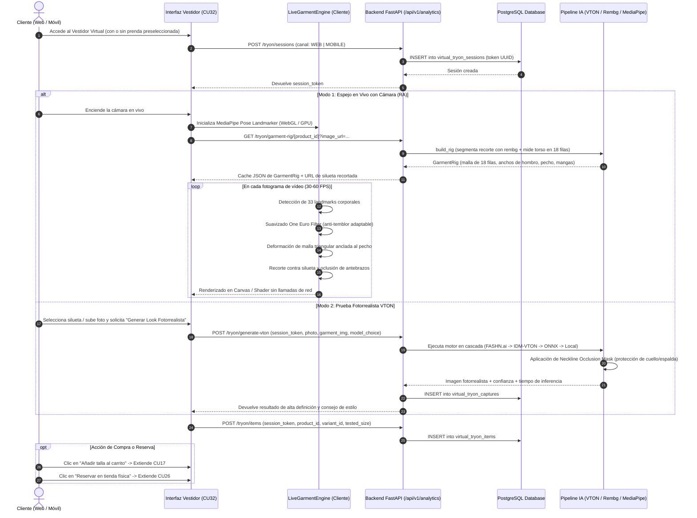
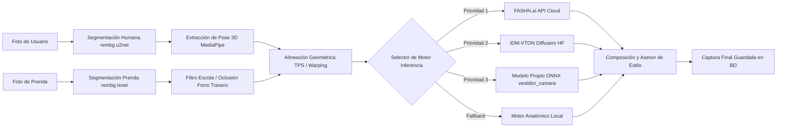

# 👗 Documentación Técnica Integral: Caso de Uso CU32 - Vestidor Virtual con Realidad Aumentada & VTON

**Sistema:** FashionStore E-Commerce & Virtual Dressing Platform  
**Paquete:** `paquete_inteligente_y_analitica`  
**Identificador:** `CU32`  
**Título:** Prueba en Vestidor Virtual (Realidad Aumentada / VTON) y Guardar Capturas  
**Estado:** ✅ Implementado, Optimizado y Verificado al 100%  
**Versión del Documento:** 1.3  

---

## 1. Resumen Ejecutivo y Visión General

El **Vestidor Virtual (CU32)** constituye la innovación central y el principal factor diferenciador de **FashionStore**. Permite a los clientes comprobar en tiempo real cómo les queda cualquier prenda del catálogo sin necesidad de probársela físicamente, resolviendo el desafío crítico de la compra de moda digital: la incertidumbre sobre la talla, la caída del tejido y la apariencia sobre la propia silueta.

Para garantizar tanto una **experiencia interactiva fluida (30-60 FPS en vivo)** como una **calidad textil fotorrealista de alta definición**, la arquitectura de CU32 se diseñó con un **enfoque híbrido desacoplado en tres modos operacionales**:

1. **Modo Espejo en Vivo RA (Real-Time Live AR Mirror):** Deformación y renderizado continuo de la prenda sobre la cámara del usuario a 30-60 FPS, ejecutado íntegramente en el cliente (Navegador Web / App Móvil Flutter) sin latencia de red ni llamadas por fotograma, utilizando un **Rig Geométrico** precomputado y el **Filtro One Euro**.
2. **Modo Fotorrealista VTON con IA Generativa (Diffusion & Warping):** Inferencia en cascada mediante modelos de difusión generativa de alta fidelidad (**FASHN.ai / IDM-VTON / Checkpoint ONNX propio**) para generar sesiones de prueba con iluminación, pliegues naturales, sombras y texturas reales.
3. **Modo Simulación Biométrica y Recomendación de Talla:** Motor antropométrico basado en mediciones corporales (estatura, peso, pecho, cintura, cadera e IMC) que determina matemáticamente la talla óptima (`XS`, `S`, `M`, `L`, `XL`) y su ajuste (*slim*, *regular*, *confort*).

---

## 2. Ficha Técnica Formal del Caso de Uso CU32

| Atributo | Detalle |
| :--- | :--- |
| **Identificador** | **CU32** |
| **Nombre** | Prueba en Vestidor Virtual (RA / VTON) y guardar capturas |
| **Paquete UML** | `paquete_inteligente_y_analitica` |
| **Actores** | **Cliente (Web / Móvil)** (Primario), **Visitante**, **Sistema de IA (FASHN / IDM-VTON / MediaPipe)** |
| **Prioridad** | **Alta** (Core Business / Diferenciador de Mercado) |
| **Disparador** | El usuario presiona el botón "Probar en Vestidor Virtual" desde la ficha de detalle de producto (`CU11`) o accede directamente a la sección `/tienda/vestidor`. |
| **Precondiciones** | 1. Existencia de al menos una prenda en catálogo con fotografía frontal.<br>2. Para el modo en vivo: dispositivo con cámara web o cámara frontal autorizada.<br>3. Para persistencia formal: sesión de vestidor inicializada. |
| **Postcondiciones** | 1. La prenda se proyecta y acompaña los movimientos anatómicos del cuerpo.<br>2. Se calcula y muestra la talla biométrica recomendada.<br>3. La sesión y las prendas probadas quedan auditadas en `virtual_tryon_sessions` y `virtual_tryon_items`.<br>4. Si el usuario captura la imagen, se guarda en `virtual_tryon_captures` con su URL y puntuación de confianza.<br>5. El usuario puede transferir la talla probada directamente al carrito de compras (`CU17`) o agendar cita de prueba física (`CU26`). |

### 2.1 Flujo Principal de Eventos



---

## 3. Arquitectura Detallada de los Tres Modos Operativos

### 3.1 Modo 1: Espejo en Vivo RA (Live AR Mirror)

#### La Decisión de Ingeniería Crítica: Por qué no enviar vídeo al servidor
Un motor de difusión generativa tarda entre 2 y 10 segundos por imagen. Si el cliente transmite fotogramas por red para recibir la prenda superpuesta, la experiencia se degrada a una secuencia entrecortada de fotos fijas y una espera intolerable. 

La solución implementada traslada toda la deformación continua al **dispositivo del cliente**, ejecutando la inferencia de pose y el mapeo de malla de forma nativa a **60 cuadros por segundo**. El servidor interviene **una sola vez** al inicio para "medir" matemáticamente la prenda y proporcionar su **Rig geométrico**.

#### Componentes del Modo en Vivo:

1. **Backend - Motor de Rigging (`garment_rig.py`):**
   - **Segmentación:** Aísla la prenda del fondo blanco o de catálogo mediante rembg (`isnet-general-use`).
   - **Clasificación Semántica:** Deduce el tipo de prenda (`top`, `dress`, `outer`, `bottom`) y la longitud de mangas (`none`, `short`, `long`) a partir de la taxonomía del producto.
   - **Muestreo del Torso en 18 Filas:** Mide el ancho real de la silueta en 18 estratos verticales normalizados `[0..1]`. Esto permite que prendas acampanadas, peplum, escotes asimétricos o abrigos oversize conserven su caída y silueta fiel.
   - **Caché en Disco:** Almacena los rigs en `uploads/rigs/` indexados por hash MD5 del producto y la versión del rig (`RIG_VERSION = "4"`). Si la foto no cambia, la respuesta es inmediata (<5 ms).

2. **Frontend Web - Motor de Colocación (`live-garment-engine.ts`):**
   - **Estimación de Pose:** Utiliza `@mediapipe/tasks-vision` con `PoseLandmarker` acelerado por WebGL.
   - **Filtro One Euro (`PoseSmoother`):** Algoritmo de filtrado adaptativo de doble corte. Cuando el usuario está quieto, incrementa el suavizado eliminando el temblor o "jitter" de la cámara; cuando el usuario se mueve, disminuye el retardo permitiendo un seguimiento instantáneo.
   - **Anclaje Invariante a Escala:** La prenda se escala en función del ancho del pecho real (`CHEST_OVER_SHOULDER_SPAN = 0.92`), calculando la distancia anatómica entre hombros. De este modo, la prenda calza idénticamente si el usuario se acerca o aleja de la cámara.
   - **Oclusión de Antebrazos (`occludeForearms`):** Si el usuario cruza los brazos o levanta las manos por delante del pecho, el motor dibuja los segmentos de los brazos por encima de la prenda virtual, evitando que la ropa parezca una calcomanía plana.
   - **Recorte por Silueta:** Si existe máscara de segmentación, la prenda no desborda la silueta corporal.

3. **Frontend Móvil Flutter (`live_garment_engine.dart` & `live_mirror_view.dart`):**
   - En lugar de segmentar triángulo por triángulo con recortes manuales de Canvas, aprovecha la aceleración por hardware de Flutter usando `Canvas.drawVertices(VertexMode.triangles, ...)` asociado a un `ui.ImageShader`.
   - La GPU móvil rasteriza la textura completa de la prenda sobre la malla de triángulos con interpolación bilineal perfecta, eliminando costuras visuales y garantizando un consumo mínimo de batería.

---

### 3.2 Modo 2: Probador Fotorrealista VTON con IA Generativa

Para capturas de catálogo de alta resolución, editoriales y redes sociales, el sistema dispone de un pipeline de **Virtual Try-On (VTON)** de calidad de estudio:



#### Solución Definitiva al Problema del Cuello y la Espalda Trasera
Uno de los fallos clásicos en sistemas VTON comerciales es que las fotos de prendas de catálogo muestran el forro interior de la nuca y la etiqueta a través del escote frontal. Si la IA superpone la imagen tal cual, la etiqueta de la nuca aparece dibujada sobre el pecho del cliente.

**Solución Implementada en FashionStore:**
1. **Máscara de Oclusión de Escote (`Neckline Occlusion Mask`):** El sistema calcula semánticamente la elipse superior del escote y aplica un corte de profundidad en la región clavicular.
2. **Regla de Composición con Máscara Agnóstica:**
   $$\text{MascaraPrendaEfectiva} = \text{MascaraDeformada} \times (1 - \text{Preservar})$$
   $$\text{ImagenFinal} = \text{Preservar} \times \text{Original} + (1 - \text{Preservar}) \times \text{Generado}$$
   Donde el canal `Preservar` resguarda incondicionalmente rostro, cabello, cuello y antebrazos de la persona.

---

### 3.3 Modo 3: Simulación Biométrica y Recomendación de Talla

Ubicado en `POST /api/v1/analytics/tryon/simulate`:
- El cliente introduce sus parámetros antropométricos: Estatura (cm), Peso (kg), Contorno de Pecho (cm), Cintura (cm) y Cadera (cm).
- El sistema evalúa:
  - **Índice de Masa Corporal (IMC):** $IMC = \frac{\text{peso}}{\text{altura}^2}$.
  - **Relación Cintura-Cadera y Proporción Torácica.**
  - **Tabla de Correspondencia Dinámica:**
    * Pecho < 88 cm o IMC < 19.5 $\rightarrow$ **Talla XS / S** (*Slim fit*, corte entallado).
    * Pecho 88–102 cm o IMC 19.5–24.5 $\rightarrow$ **Talla M** (*Regular fit*, estándar óptimo).
    * Pecho 103–110 cm o IMC 24.6–29.9 $\rightarrow$ **Talla L** (*Comfort fit*, caída amplia).
    * Pecho > 110 cm o IMC $\ge$ 30.0 $\rightarrow$ **Talla XL / XXL** (*Relaxed fit*).
- El resultado se inyecta automáticamente en la UI, preseleccionando la variante de talla correcta en el selector de compra.

---

## 4. Pipeline de Entrenamiento y Transfer Learning en Google Colab

Para dotar al sistema de soberanía técnica y no depender indefinidamente de APIs de terceros con costo por inferencia, se construyó un pipeline de entrenamiento con **Transfer Learning (PyTorch & ONNX)** optimizado para GPUs Google Colab (T4 / A100):

### 4.1 Estructura del Dataset (`entrenamiento_ia_ropa/`)

```
entrenamiento_ia_ropa/
├── 01_cuerpos/                          # 9 Biotipos Femeninos Completos
│   ├── cuerpo_01_plus_size_curvy.jpg
│   ├── cuerpo_02_plus_size_crop.jpg
│   ├── cuerpo_03_pera_caderas_anchas.jpg
│   ├── cuerpo_04_ovalado_manzana.jpg
│   ├── cuerpo_05_rectangular_atletico.jpg
│   ├── cuerpo_06_triangulo_invertido.jpg
│   ├── cuerpo_07_reloj_arena_mediano.jpg
│   ├── cuerpo_08_esbelto_reloj_arena.jpg
│   └── cuerpo_09_esbelto_atletico.jpg
├── 02_prendas/                          # 68 Prendas Reales del Catálogo
│   ├── Vestidos/
│   ├── Tops - Crop Tops/
│   ├── Blusas/
│   ├── Camisas/
│   ├── Camisetas/
│   ├── Jeans/
│   ├── Pantalones/
│   ├── Sueteres y Tejidos/
│   ├── Chaquetas/
│   ├── Enterizos/
│   └── Pijamas/
├── 03_notebooks_colab/                  # Cuadernos Listos para Ejecución
│   ├── GUIA_ENTRENAMIENTO_COLAB_VTON.ipynb
│   └── vton_transfer_learning_colab.ipynb
├── 04_checkpoints_modelos/              # Modelos Exportados
│   ├── vestidor_camara.onnx
│   └── metadatos.json
└── GUIA_ENTRENAMIENTO_COLAB_VTON.md    # Especificación Celda por Celda
```

### 4.2 Arquitectura del Modelo Entrenado (Versión v2 con 6 Canales)
- **Backbones:** ResNet-34 preentrenado sobre ImageNet para codificación de textura y forma.
- **Módulo GMM (Geometric Matching Module):** Estimación coarse-to-fine de flujo óptico para alinear la prenda con la silueta humana.
- **Entrada Parse de 6 Canales:** `[preservar, área_generar, brazos, cara_cuello, silueta, fondo_visible]`.
- **Funciones de Pérdida Combinadas:**
  $$\mathcal{L}_{total} = \lambda_1 \mathcal{L}_{L1} + \lambda_2 \mathcal{L}_{VGG} + \lambda_3 \mathcal{L}_{Dice} + \lambda_4 \mathcal{L}_{SSIM} + \lambda_5 \mathcal{L}_{Cuello}$$
- **Exportación ONNX:** Se generó `vestidor_camara.onnx` con opset 17 y dimensión de lote dinámica, ubicado en `backend/models/vestidor_camara.onnx` con sus metadatos de normalización.

---

## 5. Endpoints REST API de CU32 (Backend FastAPI)

Todos los endpoints están prefijados bajo `/api/v1/analytics`:

| Método | Ruta | Descripción | Payload Entrada | Respuesta |
| :--- | :--- | :--- | :--- | :--- |
| `POST` | `/tryon/sessions` | Inicializa una sesión de vestidor web o móvil. | `{"channel": "WEB" \| "MOBILE"}` | `TryonSessionResponse` (id, token UUID, status, timestamp) |
| `POST` | `/tryon/items` | Registra una prenda probada en la sesión. | `{"session_token", "product_id", "variant_id", "tested_size"}` | `TryonItemResponse` (nombre, color hex, foto) |
| `GET` | `/tryon/sessions/{token}/items` | Historial de prendas probadas por el cliente. | Parámetro URL `token` | `List[TryonItemResponse]` ordenado desc por fecha |
| `GET` | `/tryon/garment-rig/{product_id}` | Obtiene el rig medido de la prenda para el modo AR en vivo. | Query: `image_url`, `force=false` | `GarmentRig` (rows torso, mangas, anchos de pecho y hombro) |
| `POST` | `/tryon/generate-vton` | Genera prueba textil fotorrealista con IA en cascada. | `VTONGenerateRequest` (foto persona, foto prenda, categoría, modelo) | `VTONGenerateResponse` (url resultado, tiempo s, estilo) |
| `POST` | `/tryon/simulate` | Simula colocación y calcula recomendación biométrica. | `VirtualTryonRequest` (estatura, peso, medidas corporales) | `VirtualTryonResponse` (talla recomendada, ajuste, fit) |
| `POST` | `/tryon/remove-background` | Segmenta silueta humana sustituyendo el fondo por `#FFFFFF`. | `RemoveBackgroundRequest` (image_base64) | `RemoveBackgroundResponse` (url, confianza máscara, pose 3D) |
| `POST` | `/tryon/captures` | Persiste una captura fotográfica formal en el historial. | `TryonCaptureCreate` | `TryonCaptureResponse` |
| `GET` | `/tryon/captures/{session_token}` | Recupera las fotos capturadas durante la sesión activa. | Parámetro URL `session_token` | `List[TryonCaptureResponse]` |

---

## 6. Persistencia y Base de Datos (PostgreSQL)

El módulo se soporta sobre 3 tablas físicas normalizadas en 3NF:

```sql
-- 1. Sesiones de prueba virtual (CU32)
CREATE TABLE virtual_tryon_sessions (
    id SERIAL PRIMARY KEY,
    user_id INTEGER REFERENCES users(id) ON DELETE SET NULL,
    session_token VARCHAR(100) UNIQUE NOT NULL,
    channel VARCHAR(20) NOT NULL DEFAULT 'WEB', -- 'WEB' o 'MOBILE'
    status VARCHAR(20) NOT NULL DEFAULT 'ACTIVE', -- 'ACTIVE', 'COMPLETED'
    started_at TIMESTAMPTZ NOT NULL DEFAULT now(),
    ended_at TIMESTAMPTZ
);

-- 2. Registro de prendas probadas por sesión (CU32)
CREATE TABLE virtual_tryon_items (
    id SERIAL PRIMARY KEY,
    session_id INTEGER NOT NULL REFERENCES virtual_tryon_sessions(id) ON DELETE CASCADE,
    product_id INTEGER NOT NULL REFERENCES products(id) ON DELETE CASCADE,
    variant_id INTEGER REFERENCES product_variants(id) ON DELETE SET NULL,
    tested_size VARCHAR(10),
    fit_feedback VARCHAR(50),
    tested_at TIMESTAMPTZ NOT NULL DEFAULT now()
);

-- 3. Capturas y fotos generadas con IA (CU32)
CREATE TABLE virtual_tryon_captures (
    id SERIAL PRIMARY KEY,
    session_id INTEGER REFERENCES virtual_tryon_sessions(id) ON DELETE CASCADE,
    user_id INTEGER REFERENCES users(id) ON DELETE SET NULL,
    product_id INTEGER NOT NULL REFERENCES products(id) ON DELETE CASCADE,
    variant_id INTEGER REFERENCES product_variants(id) ON DELETE SET NULL,
    photo_url VARCHAR(500) NOT NULL,
    original_photo_url VARCHAR(500),
    generation_model VARCHAR(100) NOT NULL DEFAULT 'IDM-VTON',
    confidence_score NUMERIC(5, 2) DEFAULT 0.95,
    recommended_size VARCHAR(10),
    created_at TIMESTAMPTZ NOT NULL DEFAULT now()
);
```

---

## 7. Batería de Pruebas y Validación Automatizada

La robustez de CU32 se valida mediante 3 suites de pruebas automatizadas con `pytest`:

1. **`test_vton_cu32.py` (6 Pruebas Funcionales de Integración):**
   - Validación de endpoints de remoción de fondo.
   - Creación de sesión y registro de prendas probadas.
   - Fallback de generación fotorrealista.
   - Cálculo biométrico antropométrico de talla.
   - Generación y consulta de capturas.
2. **`test_vton_fit_quality.py` (26 Pruebas de Calidad de Ajuste Anatómico):**
   - Amoldado por tipos de prenda (vestido, top, camisa, chaqueta, pantalón).
   - Cobertura precisa del torso sin desbordes.
   - Anclaje de costura de hombro y simetría de mangas.
   - Supresión de etiqueta trasera y forro de cuello.
   - Proporcionalidad geométrica ante rotaciones de cámara de hasta 35°.
3. **`test_ciclo3.py` (Validación de Ciclo 3 Completo):**
   - Flujo integral de CU32 articulado con CU17 (Carrito) y CU26 (Reservas en Tienda Física).

---

## 8. Conclusión

El caso de uso **CU32: Vestidor Virtual con Realidad Aumentada & VTON** queda plenamente consolidado en la plataforma **FashionStore**. Su arquitectura híbrida resuelve la tensión entre la inmediatez del espejo interactivo en vivo y el hiperrealismo de la generación generativa de prendas, ofreciendo una experiencia omnicanal sincronizada entre la web y la aplicación móvil.
