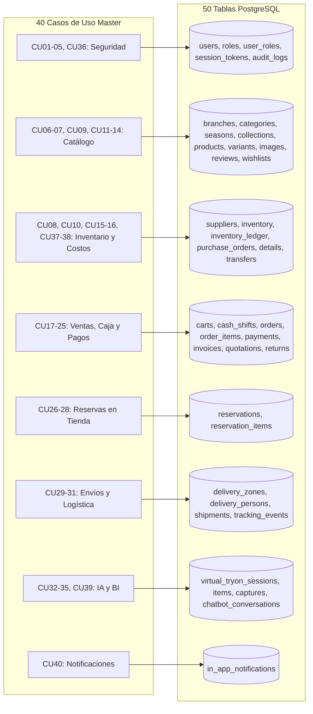

# Mapeo y Evolución de la Base de Datos por Ciclos (UML 2.5+ / PUDS)

**Plataforma de Comercio Electrónico para Tienda de Ropa con Vestidor Virtual (FashionStore)**  
**Grupo #29 — Sistemas de Información II (UAGRM - Semestre 2-2026)**  
**Integrantes:** Condori Diaz Marilyn Esther & Larrazabal Rojas Julio Cesar  
**Docente:** MSc. Ing. Angélica Garzón Cuéllar  

---

## 1. Resumen Ejecutivo de la Evolución de la Base de Datos

En el marco de trabajo del **Proceso Unificado de Desarrollo de Software (PUDS)**, la arquitectura de persistencia evoluciona de manera iterativa e incremental a lo largo de **tres ciclos de desarrollo**. La base de datos relacional en **PostgreSQL** refleja fielmente la maduración del sistema, pasando desde el núcleo fundacional de seguridad, catálogo e inventario valorado, hasta la consolidación transaccional omnicanal, logística e inteligencia artificial.

### Resumen Cuantitativo por Ciclo:
| Métrica Arquitectónica | Ciclo 1 (Fundacional) | Ciclo 2 (Comercial / Transaccional) | Ciclo 3 (Consolidado Final) |
| :--- | :---: | :---: | :---: |
| **Casos de Uso Cubiertos** | 15 CU (CU01-11, 14, 36, 37, 38) | 13 CU (CU12-24 + ampl. CU14) | 13 CU (CU25-35, 39, 40) |
| **Tablas Nuevas del Ciclo** | **22 tablas** | **17 tablas** | **11 tablas** |
| **Tablas Totales Acumuladas** | **22 tablas** | **39 tablas** | **50 tablas** |
| **Paquetes Lógicos Abordados** | 3 paquetes | 4 paquetes | **8 paquetes (100%)** |
| **Mecanismo de Valoración** | Costo Promedio Ponderado (CPP) | CPP en Transferencias y Devoluciones | CPP global en ventas de reservas |

---

## 2. Detalle de Tablas Incorporadas en Cada Ciclo

### 2.1 CICLO 1: Núcleo de Seguridad, Catálogo e Inventario Valorado (22 Tablas)
*Objetivo:* Proporcionar la infraestructura de usuarios, gestión multisucursal, catálogo jerárquico de prendas con variantes y fotografías, registro de compras a proveedores con **Costo Promedio Ponderado (CU37)**, auditoría rigurosa de mutaciones y libro mayor de inventario.

| # | Tabla | Paquete | Clase ORM (Backend) | Propósito y Regla de Negocio |
| :-: | :--- | :--- | :--- | :--- |
| 1 | `roles` | `paquete_seguridad_usuarios` | `Role` | Catálogo de perfiles autorizados (`SUPERADMIN`, `ENCARGADO`, `CAJERO`, `CLIENTE`, etc.). |
| 2 | `users` | `paquete_seguridad_usuarios` | `User` | Credenciales cifradas con BCrypt, datos personales y estado de actividad. |
| 3 | `user_roles` | `paquete_seguridad_usuarios` | `user_roles` (Tabla N:N) | Asociación relacional muchos a muchos entre usuarios y roles. |
| 4 | `session_tokens` | `paquete_seguridad_usuarios` | `SessionToken` | Control de revocación y expiración de tokens JWT activos. |
| 5 | `audit_logs` | `paquete_seguridad_usuarios` | `AuditLog` | Bitácora inmutable con `JSONB` de valores previos y nuevos (`CU36`). |
| 6 | `branches` | `paquete_catalogo_y_tiendas` | `Branch` | Sucursales físicas con geolocalización (latitud, longitud) y estado. |
| 7 | `branch_employees` | `paquete_catalogo_y_tiendas` | `BranchEmployee` | Vinculación estricta de personal (`ENCARGADO`, `CAJERO`) a una sucursal única. |
| 8 | `categories` | `paquete_catalogo_y_tiendas` | `Category` | Categorías de prendas con URL de imagen circular para la tienda. |
| 9 | `seasons` | `paquete_catalogo_y_tiendas` | `Season` | Temporadas comerciales de moda con rango de fechas. |
| 10 | `collections` | `paquete_catalogo_y_tiendas` | `Collection` | Cápsulas de moda temáticas (`RF05 / RF23`). |
| 11 | `colors` | `paquete_catalogo_y_tiendas` | `Color` | Catálogo de colores con código hexadecimal normalizado. |
| 12 | `sizes` | `paquete_catalogo_y_tiendas` | `Size` | Tallas normalizadas (`S`, `M`, `L`, `XL`). |
| 13 | `products` | `paquete_catalogo_y_tiendas` | `Product` | Ficha técnica base, precio regular y precio tachado de oferta (`CU07`). |
| 14 | `product_variants` | `paquete_catalogo_y_tiendas` | `ProductVariant` | Combinación única Producto + Color + Talla con SKU único. |
| 15 | `product_images` | `paquete_catalogo_y_tiendas` | `ProductImage` | Galería fotográfica (2 a 5 fotos) asociada a producto y opcionalmente a color. |
| 16 | `product_reviews` | `paquete_catalogo_y_tiendas` | `ProductReview` | Calificación 1 a 5 estrellas y opinión (`CU14`, versión ligera). |
| 17 | `wishlist_items` | `paquete_catalogo_y_tiendas` | `WishlistItem` | Favoritos directos del cliente (versión ligera de Ciclo 1). |
| 18 | `suppliers` | `paquete_inventario_y_proveedores` | `Supplier` | Directorio de proveedores de indumentaria con NIT y datos de contacto. |
| 19 | `inventory` | `paquete_inventario_y_proveedores` | `Inventory` | Stock físico, stock reservado, en tránsito y **Costo Promedio Ponderado (`avg_cost`)**. |
| 20 | `inventory_ledger` | `paquete_inventario_y_proveedores` | `InventoryLedger` | Libro mayor valorado: registra cada movimiento físico con su costo unitario exacto. |
| 21 | `purchase_orders` | `paquete_inventario_y_proveedores` | `PurchaseOrder` | Cabecera de compra e ingreso de mercadería desde proveedor (`CU10`). |
| 22 | `purchase_details` | `paquete_inventario_y_proveedores` | `PurchaseDetail` | Detalle de variantes recibidas con el costo unitario de compra del lote. |

---

### 2.2 CICLO 2: Módulo Comercial, Ventas POS, Pagos y Facturación (+17 Tablas = 39 Tablas)
*Objetivo:* Habilitar la compra digital y física en caja: carrito de compras persistente, turnos de caja con arqueo ciego, checkout multicanal con herencia de medios de pago (`MedioDePago` ⭅ `Efectivo` / `Tarjeta` / `QR` / `PayPal`), facturación con IVA 13% y código de control, cotizaciones, devoluciones, cupones de descuento y transferencias de mercadería entre sucursales.

| # | Tabla | Paquete | Clase ORM (Backend) | Propósito y Regla de Negocio |
| :-: | :--- | :--- | :--- | :--- |
| 23 | `carts` | `paquete_ventas_y_pagos` | `Cart` | Carrito de compras web y móvil asociado a usuario o sesión anónima (`CU17`). |
| 24 | `cart_items` | `paquete_ventas_y_pagos` | `CartItem` | Ítems y cantidades seleccionadas en el carrito. |
| 25 | `cash_shifts` | `paquete_ventas_y_pagos` | `CashShift` | Sesión y turno de caja del cajero: apertura, monto esperado, arqueo y cierre (`CU23`). |
| 26 | `orders` | `paquete_ventas_y_pagos` | `Order` | Cabecera del pedido (`ONLINE` o `POS`), estado, montos y descuento (`CU18/19`). |
| 27 | `order_items` | `paquete_ventas_y_pagos` | `OrderItem` | Detalle de prendas vendidas con precio histórico congelado. |
| 28 | `payments` | `paquete_ventas_y_pagos` | `Payment` | Herencia de tabla única (STI): pagos en Efectivo, Tarjeta, QR o PayPal (`CU18`). |
| 29 | `invoices` | `paquete_ventas_y_pagos` | `Invoice` | Emisión legal de Factura (IVA 13%, código de control) o Nota de Entrega (`CU20`). |
| 30 | `quotations` | `paquete_ventas_y_pagos` | `Quotation` | Cotización formal con plazo de vigencia temporal (`CU21`). |
| 31 | `quotation_items` | `paquete_ventas_y_pagos` | `QuotationItem` | Detalle de prendas y precios garantizados en la cotización. |
| 32 | `order_returns` | `paquete_ventas_y_pagos` | `OrderReturn` | Devolución de dinero o cambio de prenda dentro del plazo legal de 30 días (`CU22`). |
| 33 | `order_return_items` | `paquete_ventas_y_pagos` | `OrderReturnItem` | Detalle de ítems devueltos y variante de reposición para cambios físicos. |
| 34 | `stock_transfers` | `paquete_inventario_y_proveedores` | `StockTransfer` | Transferencia entre sucursales: `SOLICITADA` $\rightarrow$ `EN_TRANSITO` $\rightarrow$ `COMPLETADA` (`CU15`). |
| 35 | `stock_transfer_details` | `paquete_inventario_y_proveedores` | `StockTransferDetail` | Detalle de variantes y cantidades despachadas entre tiendas. |
| 36 | `coupons` | `paquete_catalogo_y_tiendas` | `Coupon` | Cupones de descuento (porcentaje o monto fijo) con control de usos (`CU13`). |
| 37 | `seasonal_promotions` | `paquete_catalogo_y_tiendas` | `SeasonalPromotion` | Ofertas de temporada programadas por categoría (`CU13`). |
| 38 | `wishlists` | `paquete_catalogo_y_tiendas` | `Wishlist` | Listas de deseos múltiples y personalizadas con token para compartir (`CU14+`). |
| 39 | `wishlist_group_items` | `paquete_catalogo_y_tiendas` | `WishlistGroupItem` | Prendas contenidas en cada lista de deseos compartible. |

---

### 2.3 CICLO 3: Reservas Omnicanal, Envíos, Vestidor IA y Notificaciones (+11 Tablas = 50 Tablas)
*Objetivo:* Culminar el 100% de la visión del sistema: agendamiento de citas y reserva de prendas con seña previa (`CU26-28`), conversión de reserva a venta en POS (`CU25`), gestión de despachos a domicilio con repartidores y evidencia fotográfica (`CU29-31`), motor de inteligencia artificial para el vestidor virtual y chatbot (`CU32-34`), reportes analíticos y buzón de notificaciones push (`CU40`).

| # | Tabla | Paquete | Clase ORM (Backend) | Propósito y Regla de Negocio |
| :-: | :--- | :--- | :--- | :--- |
| 40 | `reservations` | `paquete_reservas_y_citas` | `Reservation` | Cita en probador físico con seña del 50%, código `RES-...` y bloqueo temporal de stock (`CU26`). |
| 41 | `reservation_items` | `paquete_reservas_y_citas` | `ReservationItem` | Prendas apartadas físicamente para la sesión de prueba (hasta 5 prendas). |
| 42 | `delivery_zones` | `paquete_envios_y_logistica` | `DeliveryZone` | Zonificación por kilometraje (anillos) y cálculo tarifario dinámico (`CU31`). |
| 43 | `delivery_persons` | `paquete_envios_y_logistica` | `DeliveryPerson` | Perfil del repartidor: vehículo, placa, zona asignada, calificación y disponibilidad (`CU29`). |
| 44 | `shipments` | `paquete_envios_y_logistica` | `Shipment` | Despacho del pedido, código de rastreo `TRK-...`, intentos y foto de entrega (`CU29/30`). |
| 45 | `shipment_tracking_events`| `paquete_envios_y_logistica` | `ShipmentTrackingEvent` | Hitos cronológicos del envío (`EN_CAMINO`, `LLEGUE`, `ENTREGADO`) con foto de evidencia. |
| 46 | `virtual_tryon_sessions` | `paquete_inteligente_y_analitica` | `VirtualTryonSession` | Registro de sesiones de prueba virtual en web o app móvil (`CU32`). |
| 47 | `virtual_tryon_items` | `paquete_inteligente_y_analitica` | `VirtualTryonItem` | Prendas simuladas en el probador con retroalimentación del calce. |
| 48 | `virtual_tryon_captures`| `paquete_inteligente_y_analitica` | `VirtualTryonCapture` | Foto generada por IA, modelo empleado (`FASHN`/`IDM-VTON`/`LOCAL`) y medidas antropométricas. |
| 49 | `chatbot_conversations` | `paquete_inteligente_y_analitica` | `ChatbotConversation` | Mensajes e intenciones detectadas (NLP) en el asistente de recomendación (`CU33`). |
| 50 | `in_app_notifications` | `paquete_notificaciones` | `InAppNotification` | Notificaciones transaccionales in-app leídas/no leídas para el cliente y personal (`CU40`). |

---

## 3. Matriz de Mapeo: Casos de Uso $\leftrightarrow$ Entidades Relacionales

Esta matriz garantiza la **trazabilidad bidireccional** entre los requerimientos funcionales y las tablas de base de datos:

---

## 4. Catálogo Exhaustivo de Relaciones Conceptuales y Cardinalidades

A continuación se detalla la semántica relacional modelada en los diagramas conceptuales de **Draw.io**, especificando la cardinalidad en origen y destino para cada ciclo:

| Ciclo | Entidad Origen | Cardinalidad Origen | Verbo / Semántica Relacional | Cardinalidad Destino | Entidad Destino |
| :---: | :--- | :---: | :---: | :---: | :--- |
| **C1** | `roles` | **1..1** | *asignado en* | **0..*** | `user_roles` |
| **C1** | `users` | **1..1** | *posee roles* | **1..*** | `user_roles` |
| **C1** | `users` | **1..1** | *inicia sesión* | **0..*** | `session_tokens` |
| **C1** | `users` | **0..1** | *genera log* | **0..*** | `audit_logs` |
| **C1** | `branches` | **1..1** | *asigna personal* | **0..*** | `branch_employees` |
| **C1** | `users` | **1..1** | *trabaja en* | **0..1** | `branch_employees` |
| **C1** | `categories` | **1..1** | *clasifica* | **0..*** | `products` |
| **C1** | `seasons` | **0..1** | *temporada de* | **0..*** | `products` |
| **C1** | `seasons` | **0..1** | *organiza* | **0..*** | `collections` |
| **C1** | `collections` | **0..1** | *incluye* | **0..*** | `products` |
| **C1** | `products` | **1..1** | *tiene variantes* | **1..*** | `product_variants` |
| **C1** | `colors` | **1..1** | *aplica color* | **0..*** | `product_variants` |
| **C1** | `sizes` | **1..1** | *aplica talla* | **0..*** | `product_variants` |
| **C1** | `products` | **1..1** | *muestra fotos* | **1..*** | `product_images` |
| **C1** | `colors` | **0..1** | *asocia tono* | **0..*** | `product_images` |
| **C1** | `products` | **1..1** | *es calificado* | **0..*** | `product_reviews` |
| **C1** | `users` | **1..1** | *escribe reseña* | **0..*** | `product_reviews` |
| **C1** | `users` | **1..1** | *marca favorito* | **0..*** | `wishlist_items` |
| **C1** | `products` | **1..1** | *favorito de* | **0..*** | `wishlist_items` |
| **C1** | `suppliers` | **1..1** | *abastece* | **0..*** | `purchase_orders` |
| **C1** | `branches` | **1..1** | *recibe compra* | **0..*** | `purchase_orders` |
| **C1** | `purchase_orders` | **1..1** | *contiene lote* | **1..*** | `purchase_details` |
| **C1** | `product_variants` | **1..1** | *comprado en* | **0..*** | `purchase_details` |
| **C1** | `branches` | **1..1** | *almacena stock* | **0..*** | `inventory` |
| **C1** | `product_variants` | **1..1** | *stockeado en* | **0..*** | `inventory` |
| **C1** | `branches` | **1..1** | *registra kardex* | **0..*** | `inventory_ledger` |
| **C1** | `product_variants` | **1..1** | *movimiento de* | **0..*** | `inventory_ledger` |
| **C2** | `users` | **0..1** | *crea carrito* | **0..1** | `carts` |
| **C2** | `carts` | **1..1** | *contiene ítems* | **0..*** | `cart_items` |
| **C2** | `product_variants` | **1..1** | *agregado a* | **0..*** | `cart_items` |
| **C2** | `users` | **1..1** | *opera turno* | **0..*** | `cash_shifts` |
| **C2** | `branches` | **1..1** | *sede de caja* | **0..*** | `cash_shifts` |
| **C2** | `users` | **1..1** | *realiza pedido* | **0..*** | `orders` |
| **C2** | `branches` | **1..1** | *atiende pedido* | **0..*** | `orders` |
| **C2** | `cash_shifts` | **0..1** | *cobra en turno* | **0..*** | `orders` |
| **C2** | `orders` | **1..1** | *detalla venta* | **1..*** | `order_items` |
| **C2** | `product_variants` | **1..1** | *vendido en* | **0..*** | `order_items` |
| **C2** | `orders` | **1..1** | *pagado con* | **1..*** | `payments` |
| **C2** | `orders` | **1..1** | *facturado en* | **1..1** | `invoices` |
| **C2** | `users` | **1..1** | *elabora* | **0..*** | `quotations` |
| **C2** | `branches` | **0..1** | *emite* | **0..*** | `quotations` |
| **C2** | `quotations` | **1..1** | *cotiza ítem* | **1..*** | `quotation_items` |
| **C2** | `product_variants` | **1..1** | *incluido en* | **0..*** | `quotation_items` |
| **C2** | `orders` | **1..1** | *objeto de* | **0..*** | `order_returns` |
| **C2** | `users` | **1..1** | *autoriza* | **0..*** | `order_returns` |
| **C2** | `order_returns` | **1..1** | *detalla* | **1..*** | `order_return_items` |
| **C2** | `product_variants` | **1..1** | *devuelto* | **0..*** | `order_return_items` |
| **C2** | `product_variants` | **0..1** | *reemplazo* | **0..*** | `order_return_items` |
| **C2** | `branches` | **1..1** | *origen despacho* | **0..*** | `stock_transfers` |
| **C2** | `branches` | **1..1** | *destino recepción* | **0..*** | `stock_transfers` |
| **C2** | `users` | **1..1** | *solicita* | **0..*** | `stock_transfers` |
| **C2** | `users` | **0..1** | *recibe* | **0..*** | `stock_transfers` |
| **C2** | `stock_transfers` | **1..1** | *incluye* | **1..*** | `stock_transfer_details` |
| **C2** | `product_variants` | **1..1** | *transferido* | **0..*** | `stock_transfer_details` |
| **C2** | `categories` | **0..1** | *descuento a* | **0..*** | `seasonal_promotions` |
| **C2** | `users` | **1..1** | *crea lista* | **0..*** | `wishlists` |
| **C2** | `wishlists` | **1..1** | *agrupa* | **0..*** | `wishlist_group_items` |
| **C2** | `products` | **1..1** | *listado en* | **0..*** | `wishlist_group_items` |
| **C3** | `users` | **1..1** | *agenda cita* | **0..*** | `reservations` |
| **C3** | `branches` | **1..1** | *sede de cita* | **0..*** | `reservations` |
| **C3** | `orders` | **0..1** | *cobrado en venta* | **0..1** | `reservations` |
| **C3** | `reservations` | **1..1** | *aparta prendas* | **1..*** | `reservation_items` |
| **C3** | `product_variants` | **1..1** | *apartado en* | **0..*** | `reservation_items` |
| **C3** | `users` | **1..1** | *repartidor* | **0..1** | `delivery_persons` |
| **C3** | `orders` | **1..1** | *despachado en* | **0..1** | `shipments` |
| **C3** | `delivery_zones` | **0..1** | *zona de envío* | **0..*** | `shipments` |
| **C3** | `delivery_persons` | **0..1** | *transporta* | **0..*** | `shipments` |
| **C3** | `shipments` | **1..1** | *historial ruta* | **1..*** | `shipment_tracking_events` |
| **C3** | `users` | **0..1** | *sesión vestidor* | **0..*** | `virtual_tryon_sessions` |
| **C3** | `virtual_tryon_sessions` | **1..1** | *prueba prendas* | **0..*** | `virtual_tryon_items` |
| **C3** | `products` | **1..1** | *simulado en* | **0..*** | `virtual_tryon_items` |
| **C3** | `product_variants` | **0..1** | *variante probada* | **0..*** | `virtual_tryon_items` |
| **C3** | `virtual_tryon_sessions` | **0..1** | *foto generada* | **0..*** | `virtual_tryon_captures` |
| **C3** | `users` | **0..1** | *retratado* | **0..*** | `virtual_tryon_captures` |
| **C3** | `products` | **1..1** | *prenda IA* | **0..*** | `virtual_tryon_captures` |
| **C3** | `product_variants` | **0..1** | *variante IA* | **0..*** | `virtual_tryon_captures` |
| **C3** | `users` | **0..1** | *consulta bot* | **0..*** | `chatbot_conversations` |
| **C3** | `users` | **1..1** | *notificado* | **0..*** | `in_app_notifications` |

---

## 5. Normalización y Reglas de Negocio Clave

1. **Cumplimiento Estricto de 3FN**:
   - **1FN**: Atomicidad total. No existen arreglos ni cadenas compuestas en las prendas; las variantes residen en `product_variants` normalizadas por `colors` y `sizes`.
   - **2FN**: Toda clave no primaria depende por completo de la clave primaria. El stock no se guarda en el catálogo base sino en la tabla intermedia `inventory(branch_id, variant_id)`.
   - **3FN**: Cero dependencias transitivas. Las calificaciones promedio no se almacenan en `products` para evitar desincronizaciones, calculándose dinámicamente sobre `product_reviews`.
2. **Costo Promedio Ponderado (CPP - CU10, CU15, CU37)**:
   - Al registrar una orden de compra o completar una transferencia entrante, el costo unitario de inventario se recalcula matemáticamente:
     $$\text{CPP}_{nuevo} = \frac{(Stock_{actual} \cdot \text{CPP}_{anterior}) + (Q_{ingreso} \cdot Costo_{compra})}{Stock_{actual} + Q_{ingreso}}$$
   - Las salidas (ventas o reservas) nunca alteran el CPP, sino que se valoran al CPP vigente y lo congelan en el `inventory_ledger`.
3. **Bloqueo Concurrente y Transacciones ACID**:
   - Para prevenir sobreventa (*race conditions*) en checkouts y reservas concurrentes, el backend ejecuta bloqueo pesimista en PostgreSQL mediante `SELECT ... FOR UPDATE` sobre la fila correspondiente de la tabla `inventory`.

---

## 5. Instrucciones para Visualizar los Diagramas en Draw.io

Para abrir y visualizar los diagramas generados:
1. Ingrese a **[app.diagrams.net](https://app.diagrams.net)** (o use la extensión Draw.io en VS Code / Antigravity).
2. Seleccione **Archivo** $\rightarrow$ **Abrir desde** $\rightarrow$ **Dispositivo**.
3. Seleccione cualquiera de los siguientes archivos generados en la raíz del proyecto:
   - `diagrama_bd_fashionstore_ciclos.drawio`: **Recomendado**. Contiene 3 pestañas inferiores que permiten cambiar dinámicamente entre Ciclo 1, Ciclo 2 y Ciclo 3.
   - `diagrama_bd_ciclo1.drawio`: Visualización exclusiva de las 22 tablas del Ciclo 1.
   - `diagrama_bd_ciclo2.drawio`: Visualización de las 39 tablas acumuladas de Ciclos 1 y 2.
   - `diagrama_bd_ciclo3.drawio`: Visualización completa de las 50 tablas finales del Ciclo 3.
