# Documentación Completa de Análisis de Clases (UML 2.5+ / PUDS)
## Realización de los 40 Casos de Uso mediante el Patrón BCE (Boundary - Control - Entity)

**Plataforma de Comercio Electrónico para Tienda de Ropa con Vestidor Virtual (FashionStore)**  
**Grupo #29 — Sistemas de Información II (UAGRM - Semestre 2-2026)**  
**Integrantes:** Condori Diaz Marilyn Esther & Larrazabal Rojas Julio Cesar  
**Docente:** MSc. Ing. Angélica Garzón Cuéllar  

---

## 1. Fundamento Teórico y Notación del Patrón BCE

Siguiendo el flujo de **Análisis de Casos de Uso del PUDS** y las directrices de robustez de Jacobson/ICONIX, cada caso de uso se modela con tres estereotipos fundamentales de clases:

1. **Interfaz / Boundary (`IU_*`):** Modela la superficie de contacto con el actor (pantallas, diálogos, grillas, formularios). Contiene atributos de interfaz (`+lbl_*`, `+txt_*`, `+tbl_*`, `+cmb_*`, `+btn_*`) y métodos accionados por el usuario (`+abrir_*()`, `+confirmar_*()`, etc.).
2. **Control (`CTR_*`):** Modela la lógica de negocio pura, orquestación y reglas operativas. No tiene atributos de persistencia. Sus métodos coinciden 1:1 con los servicios y endpoints de la API backend en FastAPI.
3. **Entidad (`CE_*`):** Modela los datos persistentes del sistema. Sus atributos reflejan fielmente el esquema relacional de las **50 tablas en PostgreSQL** (`+tabla.campo`), manteniendo asociaciones estructurales sólidas entre entidades relacionadas.

---

## 2. Ciclo 1: Infraestructura de Seguridad, Catálogo e Inventario Valorado (15 Casos de Uso)

### CU01: Iniciar sesión en la plataforma
**Actor Primario:** `Usuario (Cliente / Personal)` | **Paquete:** `seguridad_y_usuarios` | **Ciclo:** `Ciclo 1`

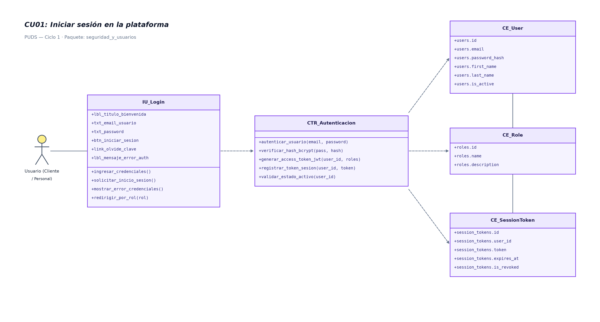

| Estereotipo | Nombre de Clase | Responsabilidad y Atributos Principales |
| :--- | :--- | :--- |
| **Boundary (IU)** | `IU_Login` | Pantalla/formulario de `Usuario (Cliente / Personal)`. Maneja eventos visuales y captura de parámetros. |
| **Control (CTR)** | `CTR_Autenticacion` | Lógica de negocio y orquestador. Coordina validaciones y transacciones de persistencia. |
| **Entity (CE)** | `CE_User` | Persistencia física PostgreSQL. Campos: `id, email, password_hash, first_name, last_name...` |
| **Entity (CE)** | `CE_Role` | Persistencia física PostgreSQL. Campos: `id, name, description...` |
| **Entity (CE)** | `CE_SessionToken` | Persistencia física PostgreSQL. Campos: `id, user_id, token, expires_at, is_revoked...` |

---

### CU02: Cerrar sesión activa
**Actor Primario:** `Usuario Autenticado` | **Paquete:** `seguridad_y_usuarios` | **Ciclo:** `Ciclo 1`

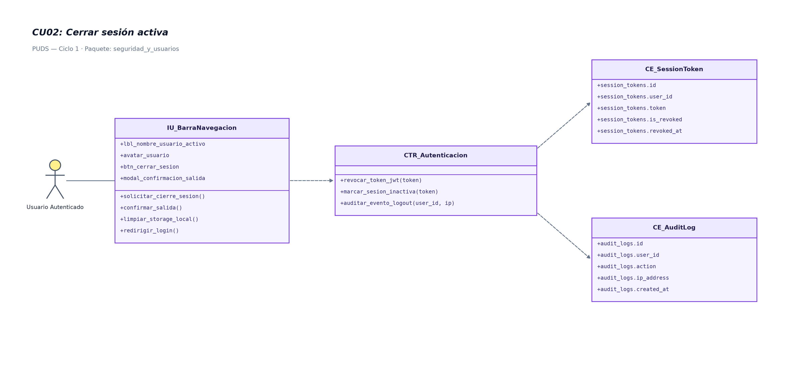

| Estereotipo | Nombre de Clase | Responsabilidad y Atributos Principales |
| :--- | :--- | :--- |
| **Boundary (IU)** | `IU_BarraNavegacion` | Pantalla/formulario de `Usuario Autenticado`. Maneja eventos visuales y captura de parámetros. |
| **Control (CTR)** | `CTR_Autenticacion` | Lógica de negocio y orquestador. Coordina validaciones y transacciones de persistencia. |
| **Entity (CE)** | `CE_SessionToken` | Persistencia física PostgreSQL. Campos: `id, user_id, token, is_revoked, revoked_at...` |
| **Entity (CE)** | `CE_AuditLog` | Persistencia física PostgreSQL. Campos: `id, user_id, action, ip_address, created_at...` |

---

### CU03: Recuperar credenciales de acceso
**Actor Primario:** `Usuario (Cliente / Personal)` | **Paquete:** `seguridad_y_usuarios` | **Ciclo:** `Ciclo 1`

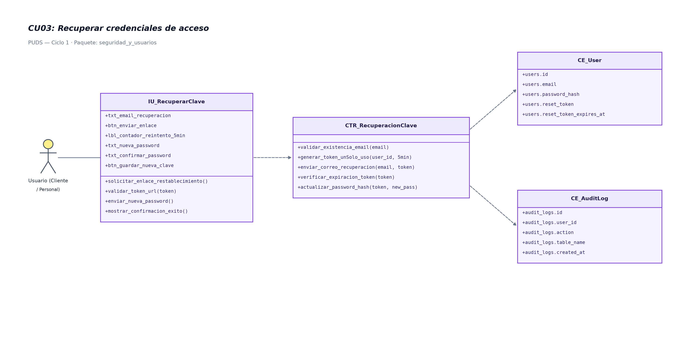

| Estereotipo | Nombre de Clase | Responsabilidad y Atributos Principales |
| :--- | :--- | :--- |
| **Boundary (IU)** | `IU_RecuperarClave` | Pantalla/formulario de `Usuario (Cliente / Personal)`. Maneja eventos visuales y captura de parámetros. |
| **Control (CTR)** | `CTR_RecuperacionClave` | Lógica de negocio y orquestador. Coordina validaciones y transacciones de persistencia. |
| **Entity (CE)** | `CE_User` | Persistencia física PostgreSQL. Campos: `id, email, password_hash, reset_token, reset_token_expires_at...` |
| **Entity (CE)** | `CE_AuditLog` | Persistencia física PostgreSQL. Campos: `id, user_id, action, table_name, created_at...` |

---

### CU04: Auto-registro de cliente en la plataforma
**Actor Primario:** `Cliente Visitante` | **Paquete:** `seguridad_y_usuarios` | **Ciclo:** `Ciclo 1`

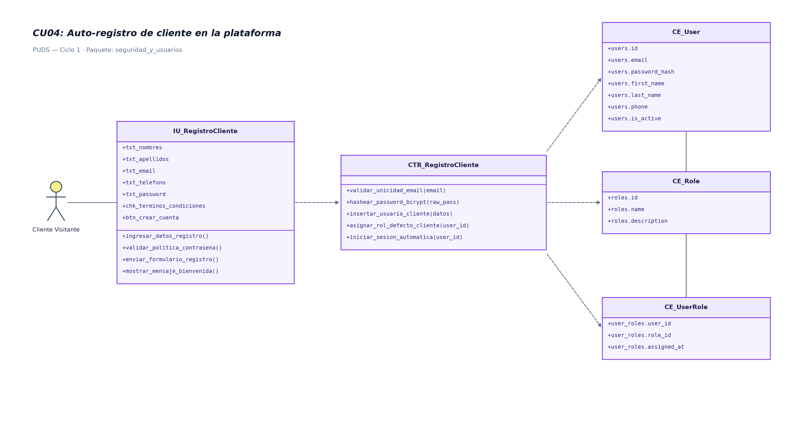

| Estereotipo | Nombre de Clase | Responsabilidad y Atributos Principales |
| :--- | :--- | :--- |
| **Boundary (IU)** | `IU_RegistroCliente` | Pantalla/formulario de `Cliente Visitante`. Maneja eventos visuales y captura de parámetros. |
| **Control (CTR)** | `CTR_RegistroCliente` | Lógica de negocio y orquestador. Coordina validaciones y transacciones de persistencia. |
| **Entity (CE)** | `CE_User` | Persistencia física PostgreSQL. Campos: `id, email, password_hash, first_name, last_name...` |
| **Entity (CE)** | `CE_Role` | Persistencia física PostgreSQL. Campos: `id, name, description...` |
| **Entity (CE)** | `CE_UserRole` | Persistencia física PostgreSQL. Campos: `user_id, role_id, assigned_at...` |

---

### CU05: Gestionar perfiles, roles y clientes
**Actor Primario:** `Superadmin` | **Paquete:** `seguridad_y_usuarios` | **Ciclo:** `Ciclo 1`

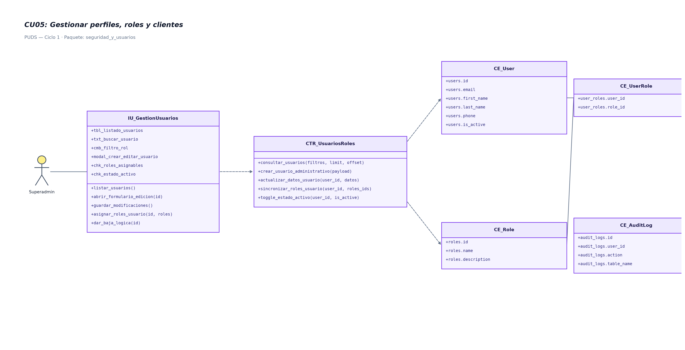

| Estereotipo | Nombre de Clase | Responsabilidad y Atributos Principales |
| :--- | :--- | :--- |
| **Boundary (IU)** | `IU_GestionUsuarios` | Pantalla/formulario de `Superadmin`. Maneja eventos visuales y captura de parámetros. |
| **Control (CTR)** | `CTR_UsuariosRoles` | Lógica de negocio y orquestador. Coordina validaciones y transacciones de persistencia. |
| **Entity (CE)** | `CE_User` | Persistencia física PostgreSQL. Campos: `id, email, first_name, last_name, phone...` |
| **Entity (CE)** | `CE_Role` | Persistencia física PostgreSQL. Campos: `id, name, description...` |
| **Entity (CE)** | `CE_UserRole` | Persistencia física PostgreSQL. Campos: `user_id, role_id...` |
| **Entity (CE)** | `CE_AuditLog` | Persistencia física PostgreSQL. Campos: `id, user_id, action, table_name...` |

---

### CU06: Gestionar sucursales de la cadena
**Actor Primario:** `Superadmin` | **Paquete:** `catalogo_y_tiendas` | **Ciclo:** `Ciclo 1`

| Estereotipo | Nombre de Clase | Responsabilidad y Atributos Principales |
| :--- | :--- | :--- |
| **Boundary (IU)** | `IU_GestionSucursales` | Pantalla/formulario de `Superadmin`. Maneja eventos visuales y captura de parámetros. |
| **Control (CTR)** | `CTR_Sucursales` | Lógica de negocio y orquestador. Coordina validaciones y transacciones de persistencia. |
| **Entity (CE)** | `CE_Branch` | Persistencia física PostgreSQL. Campos: `id, name, code, address, phone...` |
| **Entity (CE)** | `CE_BranchEmployee` | Persistencia física PostgreSQL. Campos: `id, branch_id, user_id, is_active...` |

---

### CU07: Gestionar catálogo de prendas
**Actor Primario:** `Superadmin / Encargado` | **Paquete:** `catalogo_y_tiendas` | **Ciclo:** `Ciclo 1`

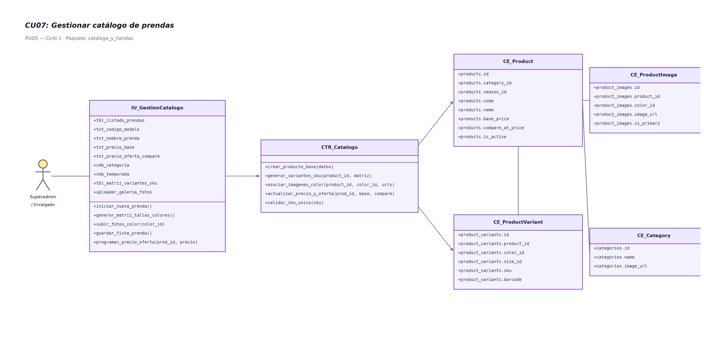

| Estereotipo | Nombre de Clase | Responsabilidad y Atributos Principales |
| :--- | :--- | :--- |
| **Boundary (IU)** | `IU_GestionCatalogo` | Pantalla/formulario de `Superadmin / Encargado`. Maneja eventos visuales y captura de parámetros. |
| **Control (CTR)** | `CTR_Catalogo` | Lógica de negocio y orquestador. Coordina validaciones y transacciones de persistencia. |
| **Entity (CE)** | `CE_Product` | Persistencia física PostgreSQL. Campos: `id, category_id, season_id, code, name...` |
| **Entity (CE)** | `CE_ProductVariant` | Persistencia física PostgreSQL. Campos: `id, product_id, color_id, size_id, sku...` |
| **Entity (CE)** | `CE_ProductImage` | Persistencia física PostgreSQL. Campos: `id, product_id, color_id, image_url, is_primary...` |
| **Entity (CE)** | `CE_Category` | Persistencia física PostgreSQL. Campos: `id, name, image_url...` |

---

### CU08: Gestionar proveedores de mercadería
**Actor Primario:** `Encargado de Almacén` | **Paquete:** `inventario_y_proveedores` | **Ciclo:** `Ciclo 1`

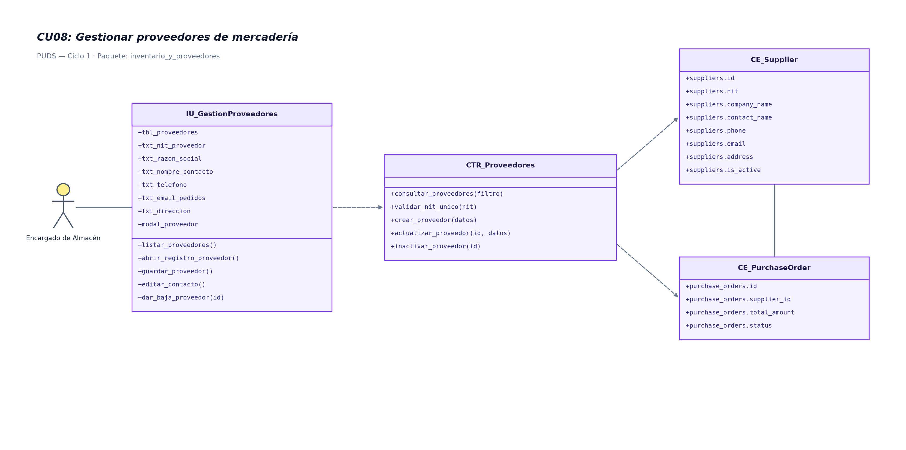

| Estereotipo | Nombre de Clase | Responsabilidad y Atributos Principales |
| :--- | :--- | :--- |
| **Boundary (IU)** | `IU_GestionProveedores` | Pantalla/formulario de `Encargado de Almacén`. Maneja eventos visuales y captura de parámetros. |
| **Control (CTR)** | `CTR_Proveedores` | Lógica de negocio y orquestador. Coordina validaciones y transacciones de persistencia. |
| **Entity (CE)** | `CE_Supplier` | Persistencia física PostgreSQL. Campos: `id, nit, company_name, contact_name, phone...` |
| **Entity (CE)** | `CE_PurchaseOrder` | Persistencia física PostgreSQL. Campos: `id, supplier_id, total_amount, status...` |

---

### CU09: Gestionar empleados de sucursal
**Actor Primario:** `Superadmin` | **Paquete:** `catalogo_y_tiendas` | **Ciclo:** `Ciclo 1`

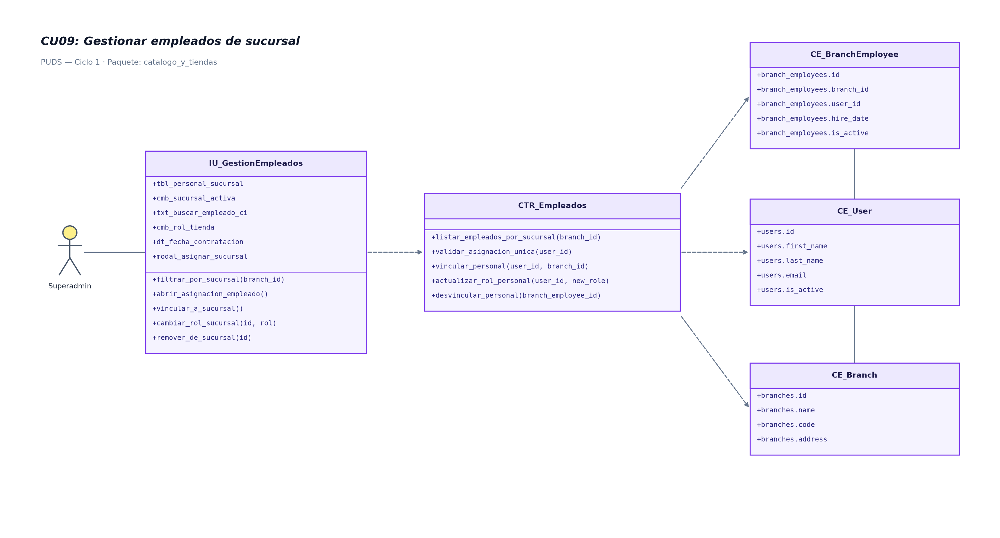

| Estereotipo | Nombre de Clase | Responsabilidad y Atributos Principales |
| :--- | :--- | :--- |
| **Boundary (IU)** | `IU_GestionEmpleados` | Pantalla/formulario de `Superadmin`. Maneja eventos visuales y captura de parámetros. |
| **Control (CTR)** | `CTR_Empleados` | Lógica de negocio y orquestador. Coordina validaciones y transacciones de persistencia. |
| **Entity (CE)** | `CE_BranchEmployee` | Persistencia física PostgreSQL. Campos: `id, branch_id, user_id, hire_date, is_active...` |
| **Entity (CE)** | `CE_User` | Persistencia física PostgreSQL. Campos: `id, first_name, last_name, email, is_active...` |
| **Entity (CE)** | `CE_Branch` | Persistencia física PostgreSQL. Campos: `id, name, code, address...` |

---

### CU10: Registrar compras e ingresos de mercadería
**Actor Primario:** `Encargado de Almacén` | **Paquete:** `inventario_y_proveedores` | **Ciclo:** `Ciclo 1`

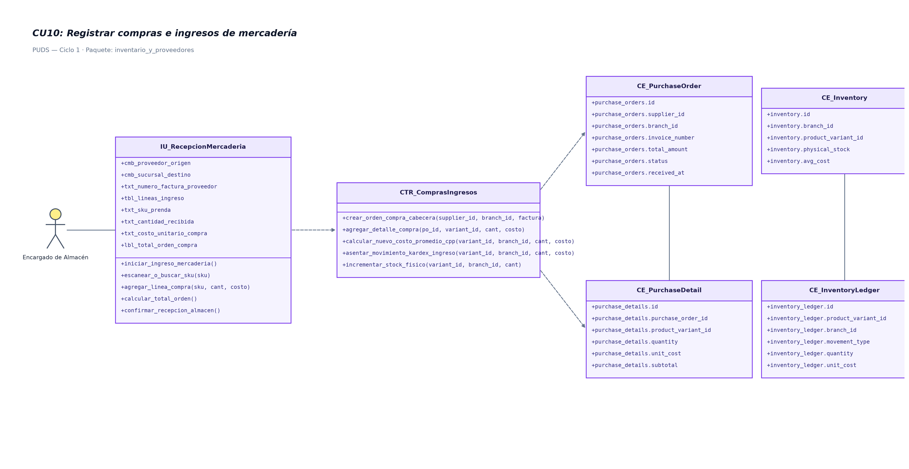

| Estereotipo | Nombre de Clase | Responsabilidad y Atributos Principales |
| :--- | :--- | :--- |
| **Boundary (IU)** | `IU_RecepcionMercaderia` | Pantalla/formulario de `Encargado de Almacén`. Maneja eventos visuales y captura de parámetros. |
| **Control (CTR)** | `CTR_ComprasIngresos` | Lógica de negocio y orquestador. Coordina validaciones y transacciones de persistencia. |
| **Entity (CE)** | `CE_PurchaseOrder` | Persistencia física PostgreSQL. Campos: `id, supplier_id, branch_id, invoice_number, total_amount...` |
| **Entity (CE)** | `CE_PurchaseDetail` | Persistencia física PostgreSQL. Campos: `id, purchase_order_id, product_variant_id, quantity, unit_cost...` |
| **Entity (CE)** | `CE_Inventory` | Persistencia física PostgreSQL. Campos: `id, branch_id, product_variant_id, physical_stock, avg_cost...` |
| **Entity (CE)** | `CE_InventoryLedger` | Persistencia física PostgreSQL. Campos: `id, product_variant_id, branch_id, movement_type, quantity...` |

---

### CU11: Consultar catálogo de prendas (Cliente)
**Actor Primario:** `Cliente / Visitante` | **Paquete:** `catalogo_y_tiendas` | **Ciclo:** `Ciclo 1`

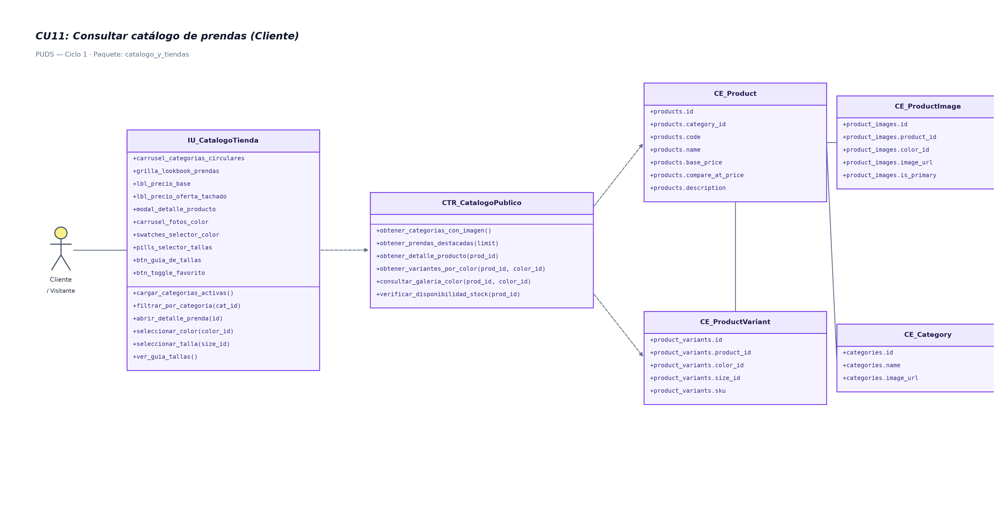

| Estereotipo | Nombre de Clase | Responsabilidad y Atributos Principales |
| :--- | :--- | :--- |
| **Boundary (IU)** | `IU_CatalogoTienda` | Pantalla/formulario de `Cliente / Visitante`. Maneja eventos visuales y captura de parámetros. |
| **Control (CTR)** | `CTR_CatalogoPublico` | Lógica de negocio y orquestador. Coordina validaciones y transacciones de persistencia. |
| **Entity (CE)** | `CE_Product` | Persistencia física PostgreSQL. Campos: `id, category_id, code, name, base_price...` |
| **Entity (CE)** | `CE_ProductVariant` | Persistencia física PostgreSQL. Campos: `id, product_id, color_id, size_id, sku...` |
| **Entity (CE)** | `CE_ProductImage` | Persistencia física PostgreSQL. Campos: `id, product_id, color_id, image_url, is_primary...` |
| **Entity (CE)** | `CE_Category` | Persistencia física PostgreSQL. Campos: `id, name, image_url...` |

---

### CU14: Reseñas y favoritos de prendas (Versión ligera)
**Actor Primario:** `Cliente Autenticado` | **Paquete:** `catalogo_y_tiendas` | **Ciclo:** `Ciclo 1`

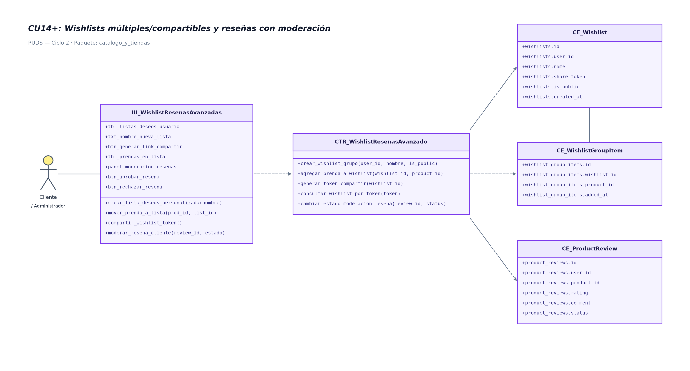

| Estereotipo | Nombre de Clase | Responsabilidad y Atributos Principales |
| :--- | :--- | :--- |
| **Boundary (IU)** | `IU_ResenasFavoritos` | Pantalla/formulario de `Cliente Autenticado`. Maneja eventos visuales y captura de parámetros. |
| **Control (CTR)** | `CTR_ResenasFavoritos` | Lógica de negocio y orquestador. Coordina validaciones y transacciones de persistencia. |
| **Entity (CE)** | `CE_ProductReview` | Persistencia física PostgreSQL. Campos: `id, user_id, product_id, rating, comment...` |
| **Entity (CE)** | `CE_WishlistItem` | Persistencia física PostgreSQL. Campos: `id, user_id, product_id, added_at...` |
| **Entity (CE)** | `CE_Product` | Persistencia física PostgreSQL. Campos: `id, name, base_price...` |

---

### CU36: Consultar bitácora de auditoría del sistema
**Actor Primario:** `Superadmin` | **Paquete:** `seguridad_y_usuarios` | **Ciclo:** `Ciclo 1`

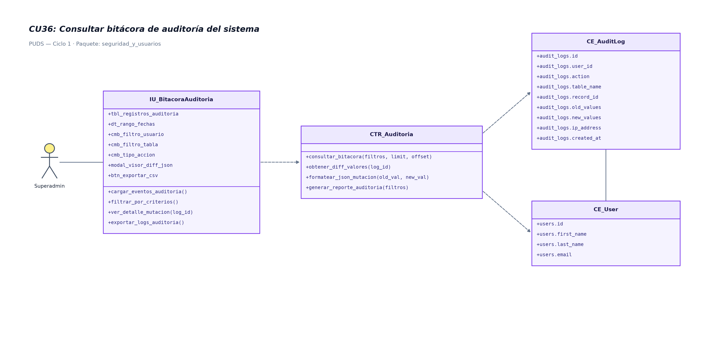

| Estereotipo | Nombre de Clase | Responsabilidad y Atributos Principales |
| :--- | :--- | :--- |
| **Boundary (IU)** | `IU_BitacoraAuditoria` | Pantalla/formulario de `Superadmin`. Maneja eventos visuales y captura de parámetros. |
| **Control (CTR)** | `CTR_Auditoria` | Lógica de negocio y orquestador. Coordina validaciones y transacciones de persistencia. |
| **Entity (CE)** | `CE_AuditLog` | Persistencia física PostgreSQL. Campos: `id, user_id, action, table_name, record_id...` |
| **Entity (CE)** | `CE_User` | Persistencia física PostgreSQL. Campos: `id, first_name, last_name, email...` |

---

### CU37: Consultar valoración de inventario (CPP)
**Actor Primario:** `Superadmin / Encargado` | **Paquete:** `inventario_y_proveedores` | **Ciclo:** `Ciclo 1`

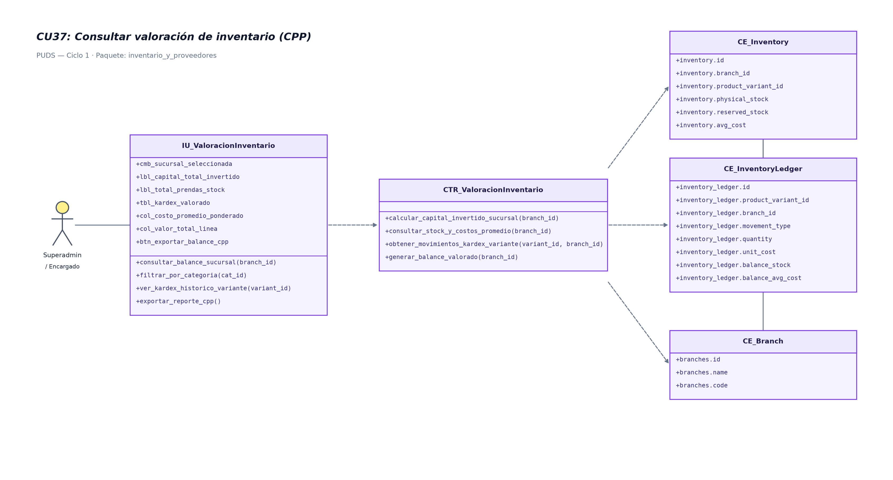

| Estereotipo | Nombre de Clase | Responsabilidad y Atributos Principales |
| :--- | :--- | :--- |
| **Boundary (IU)** | `IU_ValoracionInventario` | Pantalla/formulario de `Superadmin / Encargado`. Maneja eventos visuales y captura de parámetros. |
| **Control (CTR)** | `CTR_ValoracionInventario` | Lógica de negocio y orquestador. Coordina validaciones y transacciones de persistencia. |
| **Entity (CE)** | `CE_Inventory` | Persistencia física PostgreSQL. Campos: `id, branch_id, product_variant_id, physical_stock, reserved_stock...` |
| **Entity (CE)** | `CE_InventoryLedger` | Persistencia física PostgreSQL. Campos: `id, product_variant_id, branch_id, movement_type, quantity...` |
| **Entity (CE)** | `CE_Branch` | Persistencia física PostgreSQL. Campos: `id, name, code...` |

---

### CU38: Gestionar ajustes de inventario (Mermas y pérdidas)
**Actor Primario:** `Encargado de Sucursal` | **Paquete:** `inventario_y_proveedores` | **Ciclo:** `Ciclo 1`

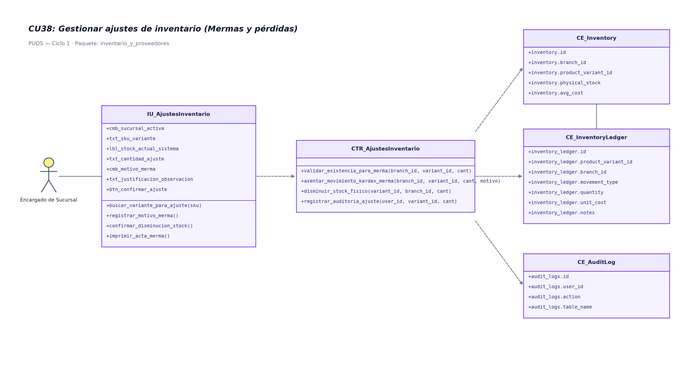

| Estereotipo | Nombre de Clase | Responsabilidad y Atributos Principales |
| :--- | :--- | :--- |
| **Boundary (IU)** | `IU_AjustesInventario` | Pantalla/formulario de `Encargado de Sucursal`. Maneja eventos visuales y captura de parámetros. |
| **Control (CTR)** | `CTR_AjustesInventario` | Lógica de negocio y orquestador. Coordina validaciones y transacciones de persistencia. |
| **Entity (CE)** | `CE_Inventory` | Persistencia física PostgreSQL. Campos: `id, branch_id, product_variant_id, physical_stock, avg_cost...` |
| **Entity (CE)** | `CE_InventoryLedger` | Persistencia física PostgreSQL. Campos: `id, product_variant_id, branch_id, movement_type, quantity...` |
| **Entity (CE)** | `CE_AuditLog` | Persistencia física PostgreSQL. Campos: `id, user_id, action, table_name...` |

---

## 2. Ciclo 2: Módulo Comercial, Ventas POS, Pagos y Facturación (13 Casos de Uso)

### CU12: Buscar y filtrar catálogo + disponibilidad por sucursal
**Actor Primario:** `Cliente / Visitante` | **Paquete:** `catalogo_y_tiendas` | **Ciclo:** `Ciclo 2`

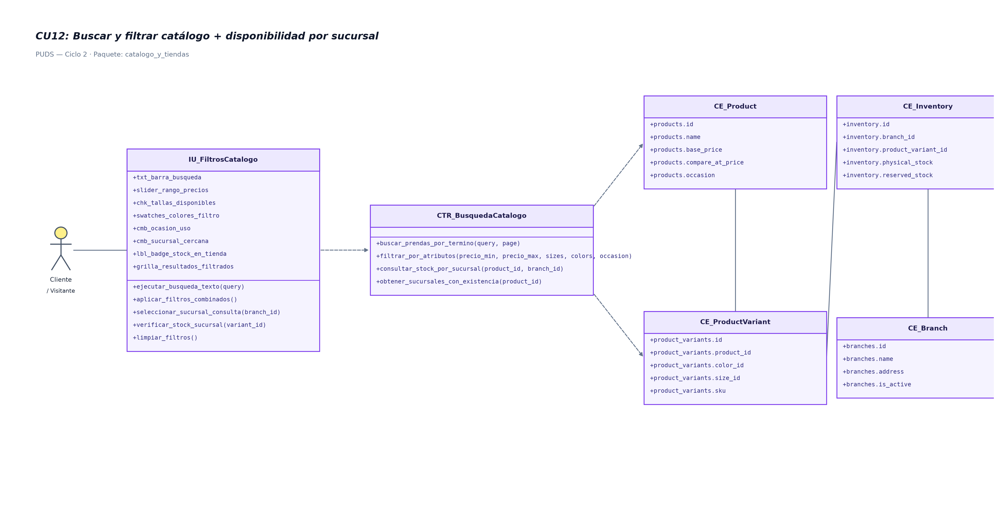

| Estereotipo | Nombre de Clase | Responsabilidad y Atributos Principales |
| :--- | :--- | :--- |
| **Boundary (IU)** | `IU_FiltrosCatalogo` | Pantalla/formulario de `Cliente / Visitante`. Maneja eventos visuales y captura de parámetros. |
| **Control (CTR)** | `CTR_BusquedaCatalogo` | Lógica de negocio y orquestador. Coordina validaciones y transacciones de persistencia. |
| **Entity (CE)** | `CE_Product` | Persistencia física PostgreSQL. Campos: `id, name, base_price, compare_at_price, occasion...` |
| **Entity (CE)** | `CE_ProductVariant` | Persistencia física PostgreSQL. Campos: `id, product_id, color_id, size_id, sku...` |
| **Entity (CE)** | `CE_Inventory` | Persistencia física PostgreSQL. Campos: `id, branch_id, product_variant_id, physical_stock, reserved_stock...` |
| **Entity (CE)** | `CE_Branch` | Persistencia física PostgreSQL. Campos: `id, name, address, is_active...` |

---

### CU13: Gestionar promociones: cupones y ofertas de temporada
**Actor Primario:** `Superadmin` | **Paquete:** `catalogo_y_tiendas` | **Ciclo:** `Ciclo 2`

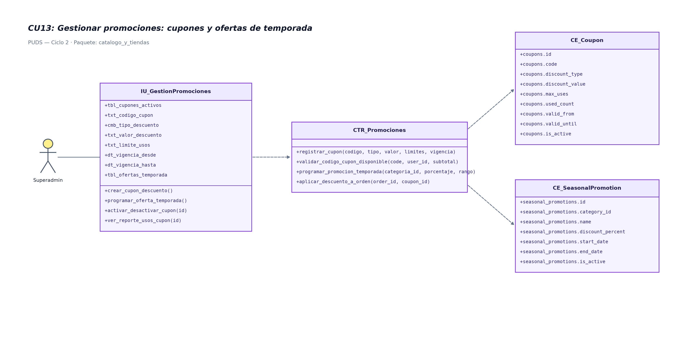

| Estereotipo | Nombre de Clase | Responsabilidad y Atributos Principales |
| :--- | :--- | :--- |
| **Boundary (IU)** | `IU_GestionPromociones` | Pantalla/formulario de `Superadmin`. Maneja eventos visuales y captura de parámetros. |
| **Control (CTR)** | `CTR_Promociones` | Lógica de negocio y orquestador. Coordina validaciones y transacciones de persistencia. |
| **Entity (CE)** | `CE_Coupon` | Persistencia física PostgreSQL. Campos: `id, code, discount_type, discount_value, max_uses...` |
| **Entity (CE)** | `CE_SeasonalPromotion` | Persistencia física PostgreSQL. Campos: `id, category_id, name, discount_percent, start_date...` |

---

### CU14+: Wishlists múltiples/compartibles y reseñas con moderación
**Actor Primario:** `Cliente / Administrador` | **Paquete:** `catalogo_y_tiendas` | **Ciclo:** `Ciclo 2`

| Estereotipo | Nombre de Clase | Responsabilidad y Atributos Principales |
| :--- | :--- | :--- |
| **Boundary (IU)** | `IU_WishlistResenasAvanzadas` | Pantalla/formulario de `Cliente / Administrador`. Maneja eventos visuales y captura de parámetros. |
| **Control (CTR)** | `CTR_WishlistResenasAvanzado` | Lógica de negocio y orquestador. Coordina validaciones y transacciones de persistencia. |
| **Entity (CE)** | `CE_Wishlist` | Persistencia física PostgreSQL. Campos: `id, user_id, name, share_token, is_public...` |
| **Entity (CE)** | `CE_WishlistGroupItem` | Persistencia física PostgreSQL. Campos: `id, wishlist_id, product_id, added_at...` |
| **Entity (CE)** | `CE_ProductReview` | Persistencia física PostgreSQL. Campos: `id, user_id, product_id, rating, comment...` |

---

### CU15: Gestionar transferencias de mercadería entre sucursales
**Actor Primario:** `Encargado de Sucursal` | **Paquete:** `inventario_y_proveedores` | **Ciclo:** `Ciclo 2`

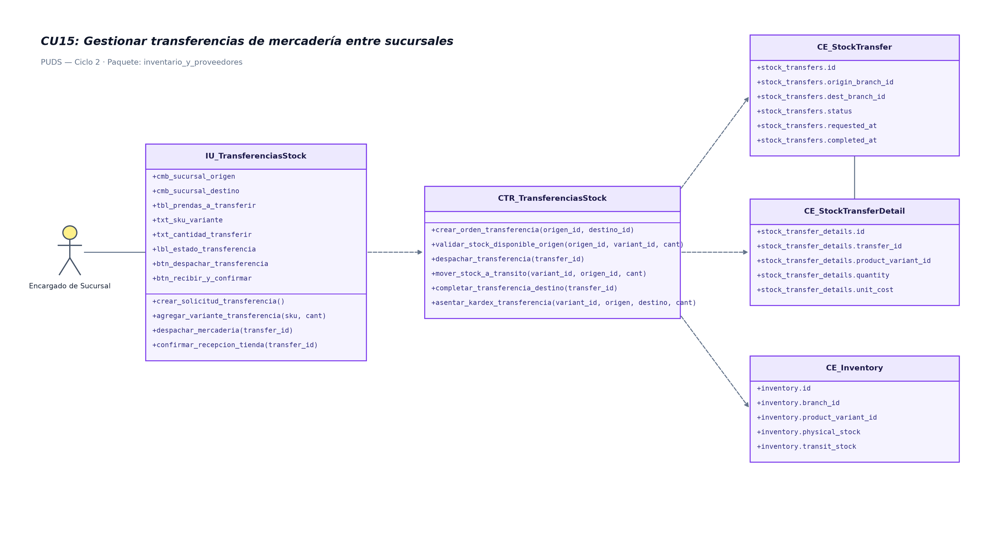

| Estereotipo | Nombre de Clase | Responsabilidad y Atributos Principales |
| :--- | :--- | :--- |
| **Boundary (IU)** | `IU_TransferenciasStock` | Pantalla/formulario de `Encargado de Sucursal`. Maneja eventos visuales y captura de parámetros. |
| **Control (CTR)** | `CTR_TransferenciasStock` | Lógica de negocio y orquestador. Coordina validaciones y transacciones de persistencia. |
| **Entity (CE)** | `CE_StockTransfer` | Persistencia física PostgreSQL. Campos: `id, origin_branch_id, dest_branch_id, status, requested_at...` |
| **Entity (CE)** | `CE_StockTransferDetail` | Persistencia física PostgreSQL. Campos: `id, transfer_id, product_variant_id, quantity, unit_cost...` |
| **Entity (CE)** | `CE_Inventory` | Persistencia física PostgreSQL. Campos: `id, branch_id, product_variant_id, physical_stock, transit_stock...` |

---

### CU16: Configurar y notificar alertas de stock (mínimo/máximo)
**Actor Primario:** `Encargado de Sucursal` | **Paquete:** `inventario_y_proveedores` | **Ciclo:** `Ciclo 2`

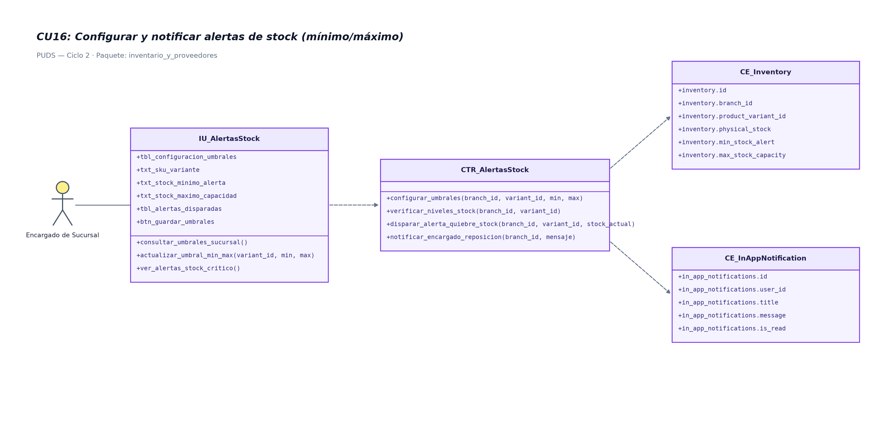

| Estereotipo | Nombre de Clase | Responsabilidad y Atributos Principales |
| :--- | :--- | :--- |
| **Boundary (IU)** | `IU_AlertasStock` | Pantalla/formulario de `Encargado de Sucursal`. Maneja eventos visuales y captura de parámetros. |
| **Control (CTR)** | `CTR_AlertasStock` | Lógica de negocio y orquestador. Coordina validaciones y transacciones de persistencia. |
| **Entity (CE)** | `CE_Inventory` | Persistencia física PostgreSQL. Campos: `id, branch_id, product_variant_id, physical_stock, min_stock_alert...` |
| **Entity (CE)** | `CE_InAppNotification` | Persistencia física PostgreSQL. Campos: `id, user_id, title, message, is_read...` |

---

### CU17: Gestionar carrito de compra digital
**Actor Primario:** `Cliente` | **Paquete:** `ventas_y_pagos` | **Ciclo:** `Ciclo 2`

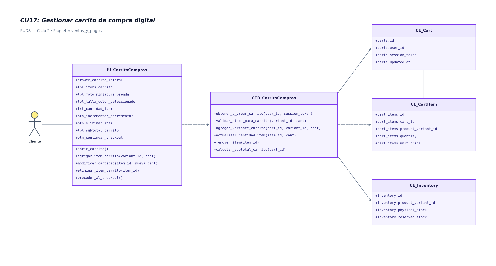

| Estereotipo | Nombre de Clase | Responsabilidad y Atributos Principales |
| :--- | :--- | :--- |
| **Boundary (IU)** | `IU_CarritoCompras` | Pantalla/formulario de `Cliente`. Maneja eventos visuales y captura de parámetros. |
| **Control (CTR)** | `CTR_CarritoCompras` | Lógica de negocio y orquestador. Coordina validaciones y transacciones de persistencia. |
| **Entity (CE)** | `CE_Cart` | Persistencia física PostgreSQL. Campos: `id, user_id, session_token, updated_at...` |
| **Entity (CE)** | `CE_CartItem` | Persistencia física PostgreSQL. Campos: `id, cart_id, product_variant_id, quantity, unit_price...` |
| **Entity (CE)** | `CE_Inventory` | Persistencia física PostgreSQL. Campos: `id, product_variant_id, physical_stock, reserved_stock...` |

---

### CU18: Procesar venta / checkout con herencia de medios de pago
**Actor Primario:** `Cliente` | **Paquete:** `ventas_y_pagos` | **Ciclo:** `Ciclo 2`

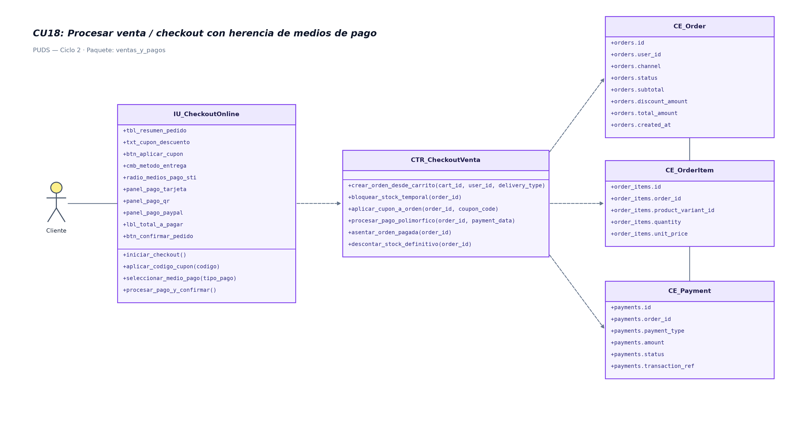

| Estereotipo | Nombre de Clase | Responsabilidad y Atributos Principales |
| :--- | :--- | :--- |
| **Boundary (IU)** | `IU_CheckoutOnline` | Pantalla/formulario de `Cliente`. Maneja eventos visuales y captura de parámetros. |
| **Control (CTR)** | `CTR_CheckoutVenta` | Lógica de negocio y orquestador. Coordina validaciones y transacciones de persistencia. |
| **Entity (CE)** | `CE_Order` | Persistencia física PostgreSQL. Campos: `id, user_id, channel, status, subtotal...` |
| **Entity (CE)** | `CE_OrderItem` | Persistencia física PostgreSQL. Campos: `id, order_id, product_variant_id, quantity, unit_price...` |
| **Entity (CE)** | `CE_Payment` | Persistencia física PostgreSQL. Campos: `id, order_id, payment_type, amount, status...` |

---

### CU19: Procesar venta presencial en caja (POS)
**Actor Primario:** `Cajero` | **Paquete:** `ventas_y_pagos` | **Ciclo:** `Ciclo 2`

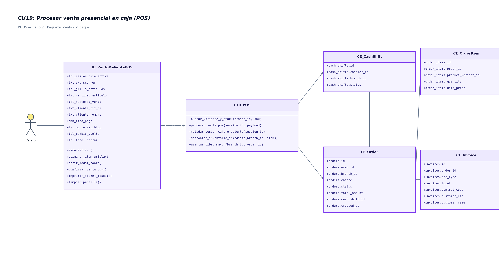

| Estereotipo | Nombre de Clase | Responsabilidad y Atributos Principales |
| :--- | :--- | :--- |
| **Boundary (IU)** | `IU_PuntoDeVentaPOS` | Pantalla/formulario de `Cajero`. Maneja eventos visuales y captura de parámetros. |
| **Control (CTR)** | `CTR_POS` | Lógica de negocio y orquestador. Coordina validaciones y transacciones de persistencia. |
| **Entity (CE)** | `CE_CashShift` | Persistencia física PostgreSQL. Campos: `id, cashier_id, branch_id, status...` |
| **Entity (CE)** | `CE_Order` | Persistencia física PostgreSQL. Campos: `id, user_id, branch_id, channel, status...` |
| **Entity (CE)** | `CE_OrderItem` | Persistencia física PostgreSQL. Campos: `id, order_id, product_variant_id, quantity, unit_price...` |
| **Entity (CE)** | `CE_Invoice` | Persistencia física PostgreSQL. Campos: `id, order_id, doc_type, total, control_code...` |

---

### CU20: Emitir factura y nota de entrega (IVA 13%)
**Actor Primario:** `Sistema / CTR_Ventas` | **Paquete:** `ventas_y_pagos` | **Ciclo:** `Ciclo 2`

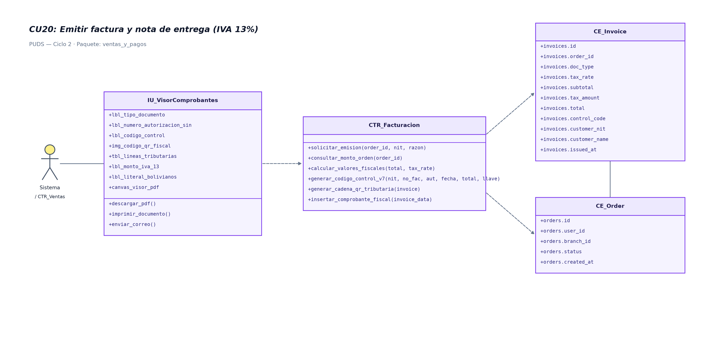

| Estereotipo | Nombre de Clase | Responsabilidad y Atributos Principales |
| :--- | :--- | :--- |
| **Boundary (IU)** | `IU_VisorComprobantes` | Pantalla/formulario de `Sistema / CTR_Ventas`. Maneja eventos visuales y captura de parámetros. |
| **Control (CTR)** | `CTR_Facturacion` | Lógica de negocio y orquestador. Coordina validaciones y transacciones de persistencia. |
| **Entity (CE)** | `CE_Invoice` | Persistencia física PostgreSQL. Campos: `id, order_id, doc_type, tax_rate, subtotal...` |
| **Entity (CE)** | `CE_Order` | Persistencia física PostgreSQL. Campos: `id, user_id, branch_id, status, created_at...` |

---

### CU21: Generar cotización formal
**Actor Primario:** `Cajero / Cliente` | **Paquete:** `ventas_y_pagos` | **Ciclo:** `Ciclo 2`

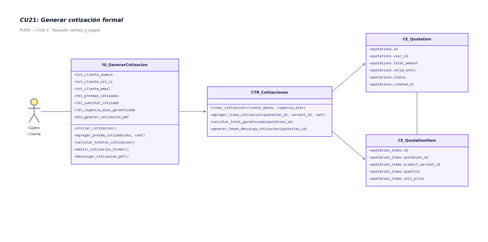

| Estereotipo | Nombre de Clase | Responsabilidad y Atributos Principales |
| :--- | :--- | :--- |
| **Boundary (IU)** | `IU_GenerarCotizacion` | Pantalla/formulario de `Cajero / Cliente`. Maneja eventos visuales y captura de parámetros. |
| **Control (CTR)** | `CTR_Cotizaciones` | Lógica de negocio y orquestador. Coordina validaciones y transacciones de persistencia. |
| **Entity (CE)** | `CE_Quotation` | Persistencia física PostgreSQL. Campos: `id, user_id, total_amount, valid_until, status...` |
| **Entity (CE)** | `CE_QuotationItem` | Persistencia física PostgreSQL. Campos: `id, quotation_id, product_variant_id, quantity, unit_price...` |

---

### CU22: Gestionar devoluciones y cambios de prendas
**Actor Primario:** `Cajero` | **Paquete:** `ventas_y_pagos` | **Ciclo:** `Ciclo 2`

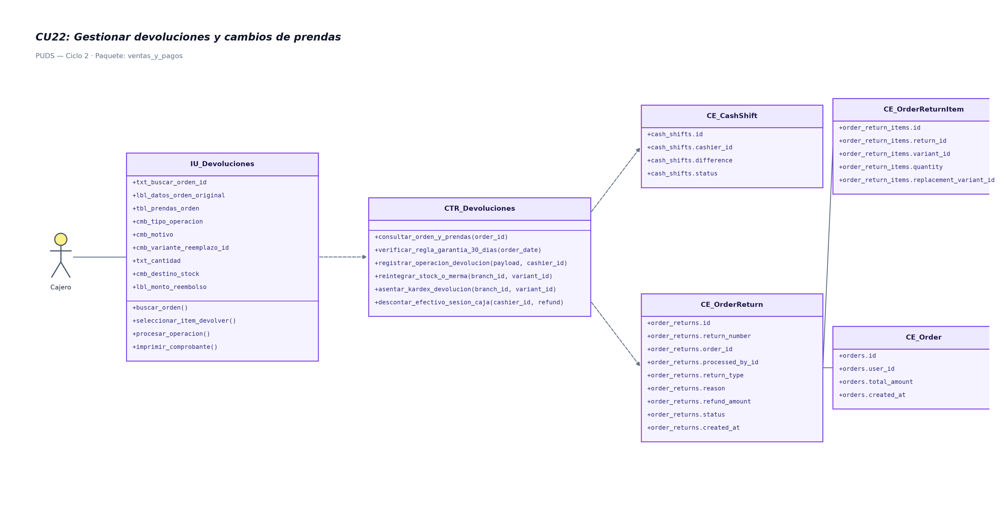

| Estereotipo | Nombre de Clase | Responsabilidad y Atributos Principales |
| :--- | :--- | :--- |
| **Boundary (IU)** | `IU_Devoluciones` | Pantalla/formulario de `Cajero`. Maneja eventos visuales y captura de parámetros. |
| **Control (CTR)** | `CTR_Devoluciones` | Lógica de negocio y orquestador. Coordina validaciones y transacciones de persistencia. |
| **Entity (CE)** | `CE_CashShift` | Persistencia física PostgreSQL. Campos: `id, cashier_id, difference, status...` |
| **Entity (CE)** | `CE_OrderReturn` | Persistencia física PostgreSQL. Campos: `id, return_number, order_id, processed_by_id, return_type...` |
| **Entity (CE)** | `CE_OrderReturnItem` | Persistencia física PostgreSQL. Campos: `id, return_id, variant_id, quantity, replacement_variant_id...` |
| **Entity (CE)** | `CE_Order` | Persistencia física PostgreSQL. Campos: `id, user_id, total_amount, created_at...` |

---

### CU23: Gestionar arqueo de caja (Apertura y cierre)
**Actor Primario:** `Cajero` | **Paquete:** `ventas_y_pagos` | **Ciclo:** `Ciclo 2`

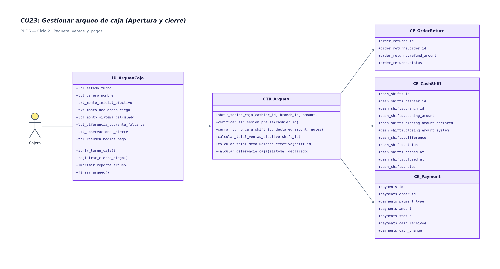

| Estereotipo | Nombre de Clase | Responsabilidad y Atributos Principales |
| :--- | :--- | :--- |
| **Boundary (IU)** | `IU_ArqueoCaja` | Pantalla/formulario de `Cajero`. Maneja eventos visuales y captura de parámetros. |
| **Control (CTR)** | `CTR_Arqueo` | Lógica de negocio y orquestador. Coordina validaciones y transacciones de persistencia. |
| **Entity (CE)** | `CE_OrderReturn` | Persistencia física PostgreSQL. Campos: `id, order_id, refund_amount, status...` |
| **Entity (CE)** | `CE_CashShift` | Persistencia física PostgreSQL. Campos: `id, cashier_id, branch_id, opening_amount, closing_amount_declared...` |
| **Entity (CE)** | `CE_Payment` | Persistencia física PostgreSQL. Campos: `id, order_id, payment_type, amount, status...` |

---

### CU24: Consultar historial de compras (Cliente)
**Actor Primario:** `Cliente` | **Paquete:** `ventas_y_pagos` | **Ciclo:** `Ciclo 2`

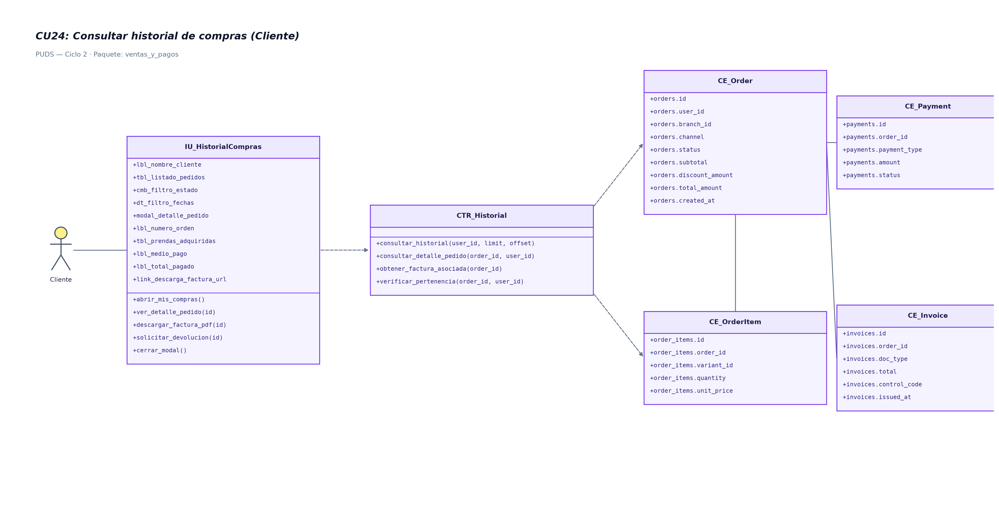

| Estereotipo | Nombre de Clase | Responsabilidad y Atributos Principales |
| :--- | :--- | :--- |
| **Boundary (IU)** | `IU_HistorialCompras` | Pantalla/formulario de `Cliente`. Maneja eventos visuales y captura de parámetros. |
| **Control (CTR)** | `CTR_Historial` | Lógica de negocio y orquestador. Coordina validaciones y transacciones de persistencia. |
| **Entity (CE)** | `CE_Order` | Persistencia física PostgreSQL. Campos: `id, user_id, branch_id, channel, status...` |
| **Entity (CE)** | `CE_OrderItem` | Persistencia física PostgreSQL. Campos: `id, order_id, variant_id, quantity, unit_price...` |
| **Entity (CE)** | `CE_Payment` | Persistencia física PostgreSQL. Campos: `id, order_id, payment_type, amount, status...` |
| **Entity (CE)** | `CE_Invoice` | Persistencia física PostgreSQL. Campos: `id, order_id, doc_type, total, control_code...` |

---

## 2. Ciclo 3: Reservas Omnicanal, Envíos, Vestidor Virtual IA y Notificaciones (13 Casos de Uso)

### CU25: Convertir una reserva en venta confirmada (POS)
**Actor Primario:** `Cajero` | **Paquete:** `ventas_y_pagos` | **Ciclo:** `Ciclo 3`

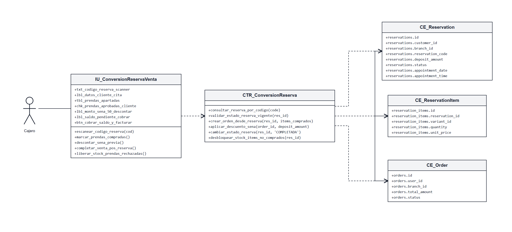

| Estereotipo | Nombre de Clase | Responsabilidad y Atributos Principales |
| :--- | :--- | :--- |
| **Boundary (IU)** | `IU_ConversionReservaVenta` | Pantalla/formulario de `Cajero`. Maneja eventos visuales y captura de parámetros. |
| **Control (CTR)** | `CTR_ConversionReserva` | Lógica de negocio y orquestador. Coordina validaciones y transacciones de persistencia. |
| **Entity (CE)** | `CE_Reservation` | Persistencia física PostgreSQL. Campos: `id, user_id, branch_id, reservation_code, deposit_amount...` |
| **Entity (CE)** | `CE_ReservationItem` | Persistencia física PostgreSQL. Campos: `id, reservation_id, variant_id, quantity, unit_price...` |
| **Entity (CE)** | `CE_Order` | Persistencia física PostgreSQL. Campos: `id, user_id, branch_id, total_amount, status...` |

---

### CU26: Agendar reserva de prendas para prueba física
**Actor Primario:** `Cliente (Móvil)` | **Paquete:** `reservas_y_citas` | **Ciclo:** `Ciclo 3`

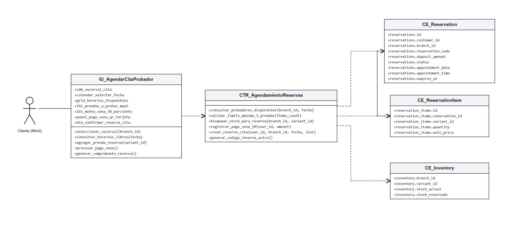

| Estereotipo | Nombre de Clase | Responsabilidad y Atributos Principales |
| :--- | :--- | :--- |
| **Boundary (IU)** | `IU_AgendarCitaProbador` | Pantalla/formulario de `Cliente (Móvil)`. Maneja eventos visuales y captura de parámetros. |
| **Control (CTR)** | `CTR_AgendamientoReservas` | Lógica de negocio y orquestador. Coordina validaciones y transacciones de persistencia. |
| **Entity (CE)** | `CE_Reservation` | Persistencia física PostgreSQL. Campos: `id, user_id, branch_id, reservation_code, deposit_amount...` |
| **Entity (CE)** | `CE_ReservationItem` | Persistencia física PostgreSQL. Campos: `id, reservation_id, variant_id, quantity, unit_price...` |
| **Entity (CE)** | `CE_Inventory` | Persistencia física PostgreSQL. Campos: `branch_id, variant_id, stock_actual, stock_reservado...` |

---

### CU27: Gestionar bandeja de reservas entrantes de sucursal
**Actor Primario:** `Personal de Sucursal` | **Paquete:** `reservas_y_citas` | **Ciclo:** `Ciclo 3`

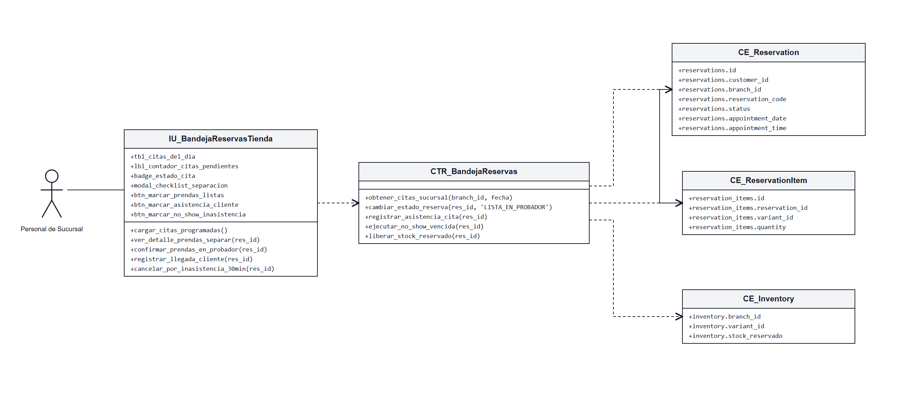

| Estereotipo | Nombre de Clase | Responsabilidad y Atributos Principales |
| :--- | :--- | :--- |
| **Boundary (IU)** | `IU_BandejaReservasTienda` | Pantalla/formulario de `Personal de Sucursal`. Maneja eventos visuales y captura de parámetros. |
| **Control (CTR)** | `CTR_BandejaReservas` | Lógica de negocio y orquestador. Coordina validaciones y transacciones de persistencia. |
| **Entity (CE)** | `CE_Reservation` | Persistencia física PostgreSQL. Campos: `id, user_id, branch_id, reservation_code, status...` |
| **Entity (CE)** | `CE_ReservationItem` | Persistencia física PostgreSQL. Campos: `id, reservation_id, variant_id, quantity...` |
| **Entity (CE)** | `CE_Inventory` | Persistencia física PostgreSQL. Campos: `branch_id, variant_id, stock_reservado...` |

---

### CU28: Cancelar reserva de prendas (Libera stock)
**Actor Primario:** `Cliente / Encargado` | **Paquete:** `reservas_y_citas` | **Ciclo:** `Ciclo 3`

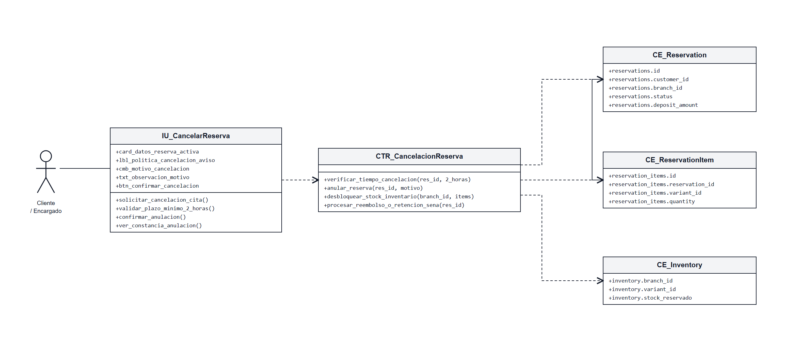

| Estereotipo | Nombre de Clase | Responsabilidad y Atributos Principales |
| :--- | :--- | :--- |
| **Boundary (IU)** | `IU_CancelarReserva` | Pantalla/formulario de `Cliente / Encargado`. Maneja eventos visuales y captura de parámetros. |
| **Control (CTR)** | `CTR_CancelacionReserva` | Lógica de negocio y orquestador. Coordina validaciones y transacciones de persistencia. |
| **Entity (CE)** | `CE_Reservation` | Persistencia física PostgreSQL. Campos: `id, user_id, branch_id, status, deposit_amount...` |
| **Entity (CE)** | `CE_ReservationItem` | Persistencia física PostgreSQL. Campos: `id, reservation_id, variant_id, quantity...` |
| **Entity (CE)** | `CE_Inventory` | Persistencia física PostgreSQL. Campos: `branch_id, variant_id, stock_reservado...` |

---

### CU29: Gestionar envíos y logística de despacho (Delivery)
**Actor Primario:** `Encargado de Despacho / Repartidor` | **Paquete:** `envios_y_logistica` | **Ciclo:** `Ciclo 3`

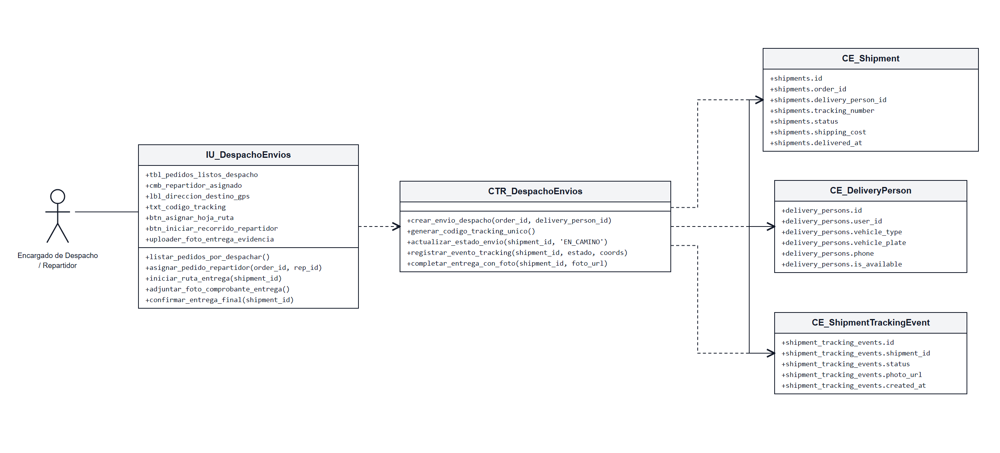

| Estereotipo | Nombre de Clase | Responsabilidad y Atributos Principales |
| :--- | :--- | :--- |
| **Boundary (IU)** | `IU_DespachoEnvios` | Pantalla/formulario de `Encargado de Despacho / Repartidor`. Maneja eventos visuales y captura de parámetros. |
| **Control (CTR)** | `CTR_DespachoEnvios` | Lógica de negocio y orquestador. Coordina validaciones y transacciones de persistencia. |
| **Entity (CE)** | `CE_Shipment` | Persistencia física PostgreSQL. Campos: `id, order_id, delivery_person_id, tracking_number, status...` |
| **Entity (CE)** | `CE_DeliveryPerson` | Persistencia física PostgreSQL. Campos: `id, user_id, vehicle_type, vehicle_plate, phone...` |
| **Entity (CE)** | `CE_ShipmentTrackingEvent` | Persistencia física PostgreSQL. Campos: `id, shipment_id, status, photo_url, created_at...` |

---

### CU30: Consultar y rastrear estado de un pedido o envío
**Actor Primario:** `Cliente` | **Paquete:** `envios_y_logistica` | **Ciclo:** `Ciclo 3`

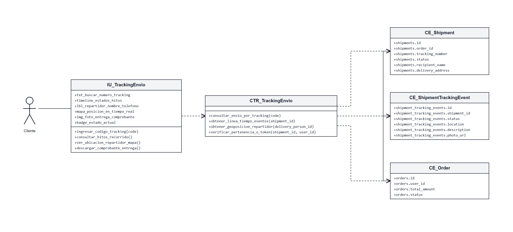

| Estereotipo | Nombre de Clase | Responsabilidad y Atributos Principales |
| :--- | :--- | :--- |
| **Boundary (IU)** | `IU_TrackingEnvio` | Pantalla/formulario de `Cliente`. Maneja eventos visuales y captura de parámetros. |
| **Control (CTR)** | `CTR_TrackingEnvio` | Lógica de negocio y orquestador. Coordina validaciones y transacciones de persistencia. |
| **Entity (CE)** | `CE_Shipment` | Persistencia física PostgreSQL. Campos: `id, order_id, tracking_number, status, recipient_name...` |
| **Entity (CE)** | `CE_ShipmentTrackingEvent` | Persistencia física PostgreSQL. Campos: `id, shipment_id, status, latitude, longitude...` |
| **Entity (CE)** | `CE_Order` | Persistencia física PostgreSQL. Campos: `id, user_id, total_amount, status...` |

---

### CU31: Gestionar zonas de cobertura y tarifas de envío
**Actor Primario:** `Superadmin` | **Paquete:** `envios_y_logistica` | **Ciclo:** `Ciclo 3`

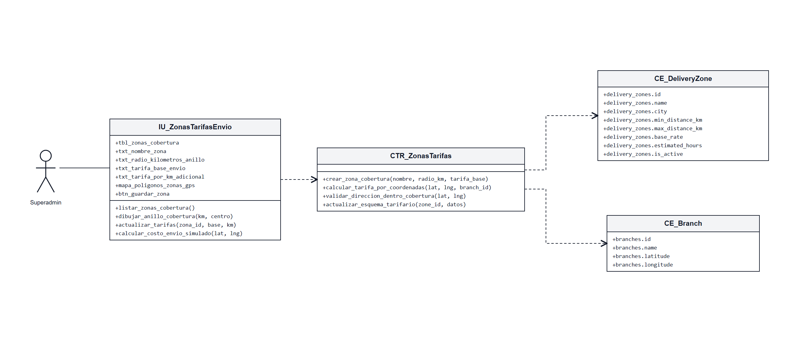

| Estereotipo | Nombre de Clase | Responsabilidad y Atributos Principales |
| :--- | :--- | :--- |
| **Boundary (IU)** | `IU_ZonasTarifasEnvio` | Pantalla/formulario de `Superadmin`. Maneja eventos visuales y captura de parámetros. |
| **Control (CTR)** | `CTR_ZonasTarifas` | Lógica de negocio y orquestador. Coordina validaciones y transacciones de persistencia. |
| **Entity (CE)** | `CE_DeliveryZone` | Persistencia física PostgreSQL. Campos: `id, name, city, min_distance_km, max_distance_km...` |
| **Entity (CE)** | `CE_Branch` | Persistencia física PostgreSQL. Campos: `id, name, latitude, longitude...` |

---

### CU32: Prueba en Vestidor Virtual (RA / VTON) y guardar capturas
**Actor Primario:** `Cliente (Móvil / Web)` | **Paquete:** `inteligente_y_analitica` | **Ciclo:** `Ciclo 3`

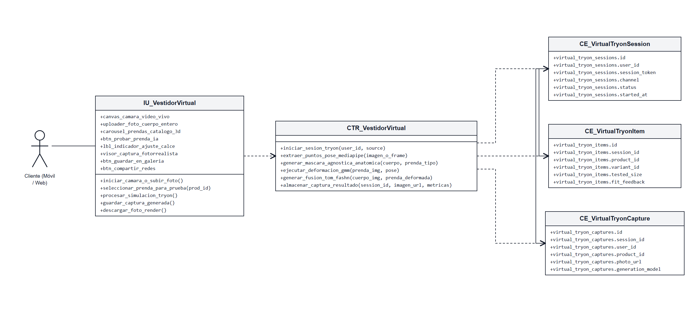

| Estereotipo | Nombre de Clase | Responsabilidad y Atributos Principales |
| :--- | :--- | :--- |
| **Boundary (IU)** | `IU_VestidorVirtual` | Pantalla/formulario de `Cliente (Móvil / Web)`. Maneja eventos visuales y captura de parámetros. |
| **Control (CTR)** | `CTR_VestidorVirtual` | Lógica de negocio y orquestador. Coordina validaciones y transacciones de persistencia. |
| **Entity (CE)** | `CE_VirtualTryonSession` | Persistencia física PostgreSQL. Campos: `id, user_id, session_token, channel, status...` |
| **Entity (CE)** | `CE_VirtualTryonItem` | Persistencia física PostgreSQL. Campos: `id, session_id, product_id, fit_feedback...` |
| **Entity (CE)** | `CE_VirtualTryonCapture` | Persistencia física PostgreSQL. Campos: `id, session_id, user_id, product_id, photo_url...` |

---

### CU33: Asistente inteligente de recomendaciones y Chatbot
**Actor Primario:** `Cliente` | **Paquete:** `inteligente_y_analitica` | **Ciclo:** `Ciclo 3`

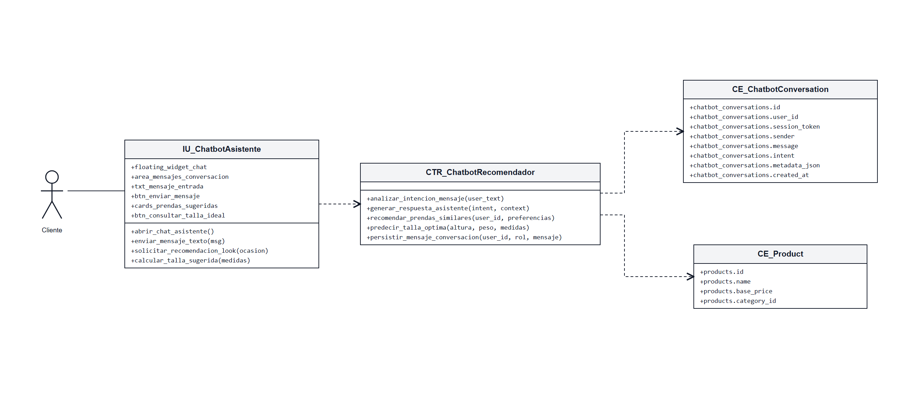

| Estereotipo | Nombre de Clase | Responsabilidad y Atributos Principales |
| :--- | :--- | :--- |
| **Boundary (IU)** | `IU_ChatbotAsistente` | Pantalla/formulario de `Cliente`. Maneja eventos visuales y captura de parámetros. |
| **Control (CTR)** | `CTR_ChatbotRecomendador` | Lógica de negocio y orquestador. Coordina validaciones y transacciones de persistencia. |
| **Entity (CE)** | `CE_ChatbotConversation` | Persistencia física PostgreSQL. Campos: `id, user_id, session_token, sender, message...` |
| **Entity (CE)** | `CE_Product` | Persistencia física PostgreSQL. Campos: `id, name, base_price, category_id...` |

---

### CU34: Búsqueda de prendas mediante comandos de voz (NLP)
**Actor Primario:** `Cliente (Móvil)` | **Paquete:** `inteligente_y_analitica` | **Ciclo:** `Ciclo 3`

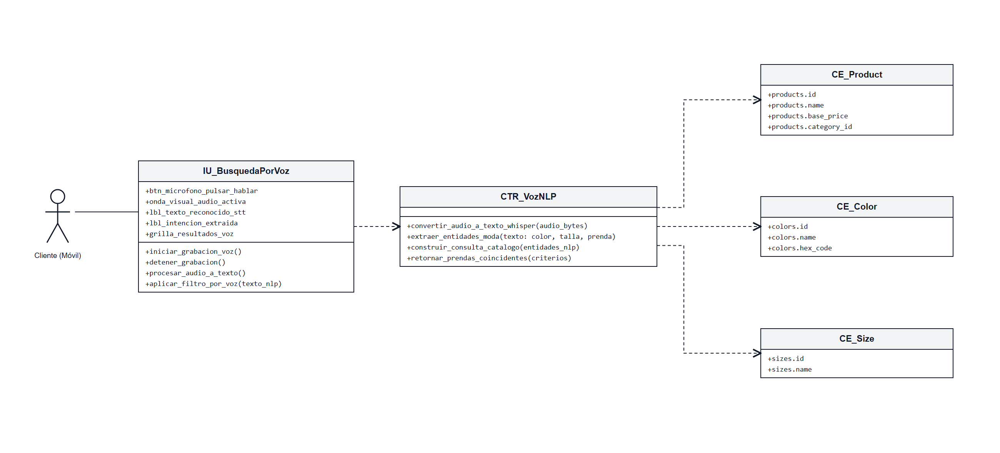

| Estereotipo | Nombre de Clase | Responsabilidad y Atributos Principales |
| :--- | :--- | :--- |
| **Boundary (IU)** | `IU_BusquedaPorVoz` | Pantalla/formulario de `Cliente (Móvil)`. Maneja eventos visuales y captura de parámetros. |
| **Control (CTR)** | `CTR_VozNLP` | Lógica de negocio y orquestador. Coordina validaciones y transacciones de persistencia. |
| **Entity (CE)** | `CE_Product` | Persistencia física PostgreSQL. Campos: `id, name, base_price, category_id...` |
| **Entity (CE)** | `CE_Color` | Persistencia física PostgreSQL. Campos: `id, name, hex_code...` |
| **Entity (CE)** | `CE_Size` | Persistencia física PostgreSQL. Campos: `id, name...` |

---

### CU35: Generar reportes gerenciales (PDF / CSV / Voz)
**Actor Primario:** `Superadmin / Gerente` | **Paquete:** `inteligente_y_analitica` | **Ciclo:** `Ciclo 3`

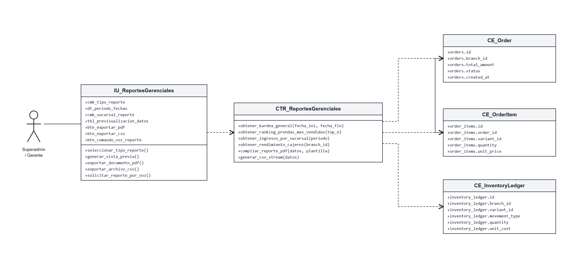

| Estereotipo | Nombre de Clase | Responsabilidad y Atributos Principales |
| :--- | :--- | :--- |
| **Boundary (IU)** | `IU_ReportesGerenciales` | Pantalla/formulario de `Superadmin / Gerente`. Maneja eventos visuales y captura de parámetros. |
| **Control (CTR)** | `CTR_ReportesGerenciales` | Lógica de negocio y orquestador. Coordina validaciones y transacciones de persistencia. |
| **Entity (CE)** | `CE_Order` | Persistencia física PostgreSQL. Campos: `id, branch_id, total_amount, status, created_at...` |
| **Entity (CE)** | `CE_OrderItem` | Persistencia física PostgreSQL. Campos: `id, order_id, variant_id, quantity, unit_price...` |
| **Entity (CE)** | `CE_InventoryLedger` | Persistencia física PostgreSQL. Campos: `id, branch_id, movement_type, quantity, unit_cost...` |

---

### CU39: Consultar Dashboard global de ventas e inventario
**Actor Primario:** `Superadmin / Gerente` | **Paquete:** `inteligente_y_analitica` | **Ciclo:** `Ciclo 3`

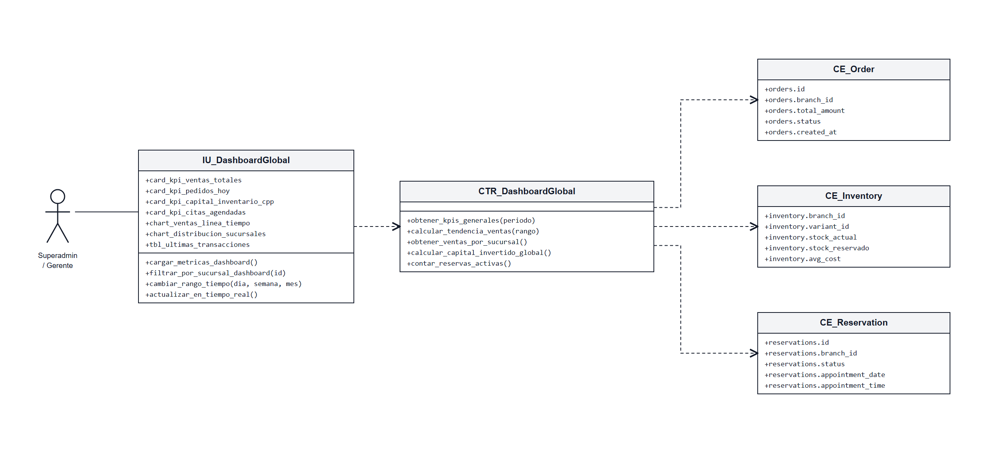

| Estereotipo | Nombre de Clase | Responsabilidad y Atributos Principales |
| :--- | :--- | :--- |
| **Boundary (IU)** | `IU_DashboardGlobal` | Pantalla/formulario de `Superadmin / Gerente`. Maneja eventos visuales y captura de parámetros. |
| **Control (CTR)** | `CTR_DashboardGlobal` | Lógica de negocio y orquestador. Coordina validaciones y transacciones de persistencia. |
| **Entity (CE)** | `CE_Order` | Persistencia física PostgreSQL. Campos: `id, total_amount, status, created_at...` |
| **Entity (CE)** | `CE_Inventory` | Persistencia física PostgreSQL. Campos: `branch_id, variant_id, stock_actual, stock_reservado, avg_cost...` |
| **Entity (CE)** | `CE_Reservation` | Persistencia física PostgreSQL. Campos: `id, branch_id, status, appointment_date, appointment_time...` |

---

### CU40: Notificar en tiempo real (Push) y correos de confirmación
**Actor Primario:** `Sistema / Worker` | **Paquete:** `notificaciones` | **Ciclo:** `Ciclo 3`

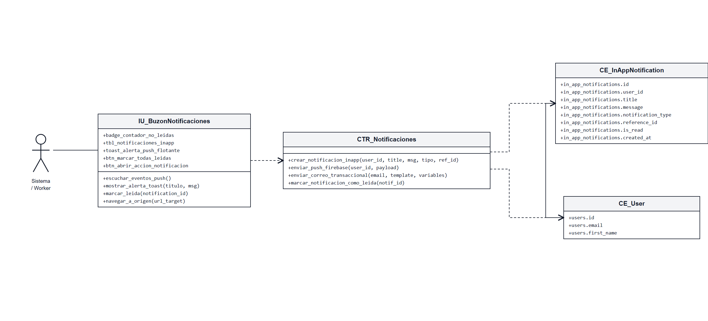

| Estereotipo | Nombre de Clase | Responsabilidad y Atributos Principales |
| :--- | :--- | :--- |
| **Boundary (IU)** | `IU_BuzonNotificaciones` | Pantalla/formulario de `Sistema / Worker`. Maneja eventos visuales y captura de parámetros. |
| **Control (CTR)** | `CTR_Notificaciones` | Lógica de negocio y orquestador. Coordina validaciones y transacciones de persistencia. |
| **Entity (CE)** | `CE_InAppNotification` | Persistencia física PostgreSQL. Campos: `id, user_id, title, message, action_url...` |
| **Entity (CE)** | `CE_User` | Persistencia física PostgreSQL. Campos: `id, email, first_name...` |

---
